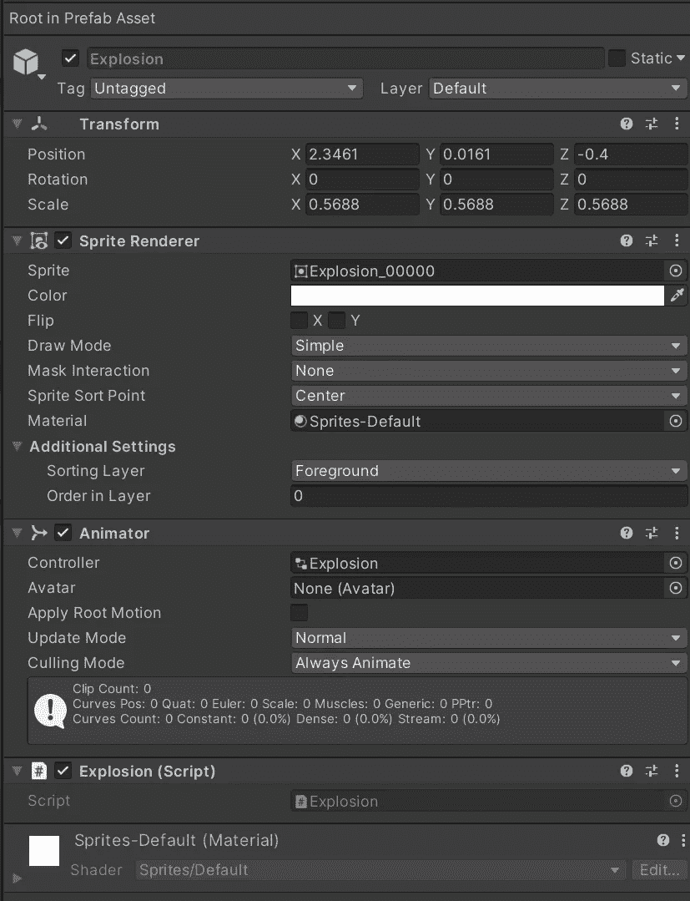
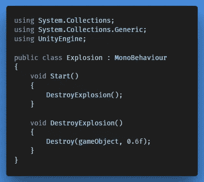
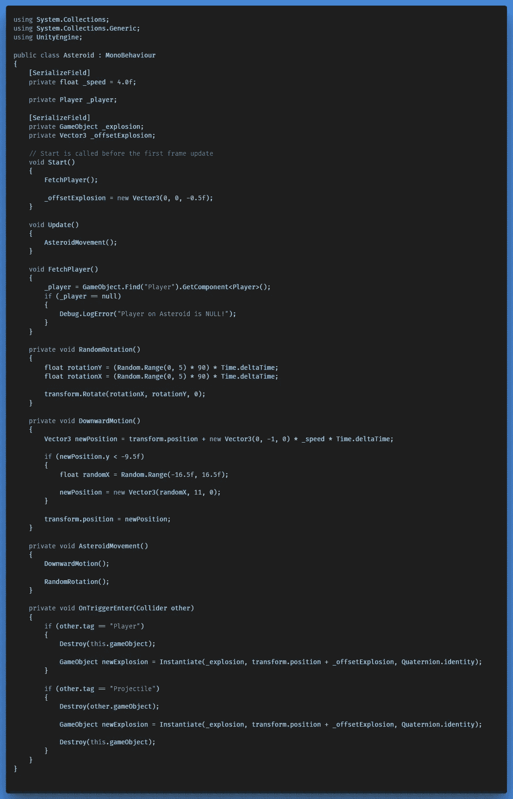
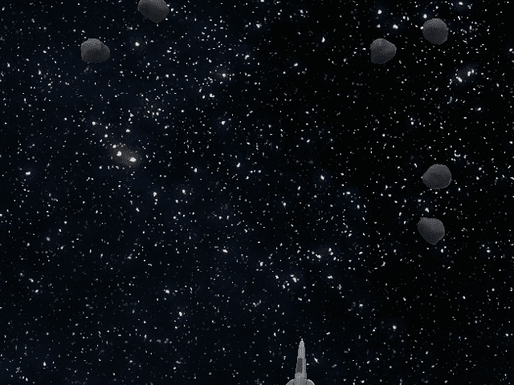

# 在 Unity 中制作精灵动画

> 原文：<https://medium.com/nerd-for-tech/animating-sprites-in-unity-d3156c30ea41?source=collection_archive---------17----------------------->

在这篇文章中，你将学习如何创建一个爆炸效果，以及当一颗小行星被摧毁时我们如何激活它。

**目标:**

在小行星被摧毁后引发爆炸。

**必需品:**

*   **T5【小行星】T6**脚本
*   用于爆炸动画的精灵序列。

**逻辑:**

**准备爆炸的 VFX**

→创建一个空的游戏对象“爆炸”,代表你的爆炸序列。打开动画窗口，确保选择爆炸游戏对象。

→创建一个新的动画文件，按住 Shift 键选择我们要在序列中显示的所有帧，分别从第一帧开始到最后一帧结束。将它们拖到时间线上。

→你会看到爆炸游戏对象现在有一个动画组件，不要忘记禁用爆炸动画的“循环”,所以我们只播放一次。拖动它到一个新的 VFX 文件夹，使其成为一个预置，并将其分配到前景层。

→创建一个附加到爆炸预置的小脚本，它将简单地负责在一个小延迟后摧毁它。

爆炸预制件

**修改小行星脚本**

现在，我们可以在小行星自我毁灭后，立即在小行星的位置实例化这个爆炸预置。我在爆炸效果的 Z 轴上添加了一个偏移量，因为我们将 2D 和 3D 混合在一起。如果你是实例化的新手，欢迎[到这里](https://gert-coppens100.medium.com/instantiating-and-destroying-gameobjects-in-unity-faa544e37e2e)，看看它的基本原理。

**注:**

同样，有几种可能性可以达到预期的效果。例如，你可以在***OnTriggerEnter()***中触发的小行星预设上播放动画，然后在动画播放后摧毁预设，你可以用一个代表“破碎”状态的不同对象替换游戏对象，你可以开始玩碰撞器和渲染器组件。或者，你可以为爆炸创建一个预置，并在触发时实例化它，就像我们在这篇文章中选择的那样。

← [上一张](https://gert-coppens.medium.com/adding-asteroids-7a8dc807c528) | [下一张](/nerd-for-tech/adding-health-to-the-player-24d594b8fb11) →