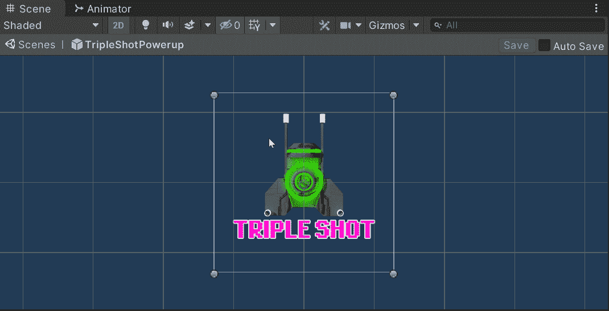
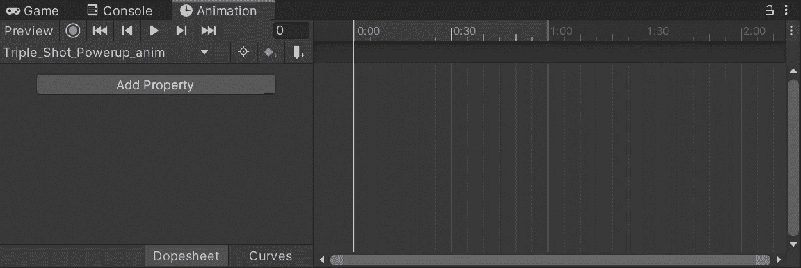
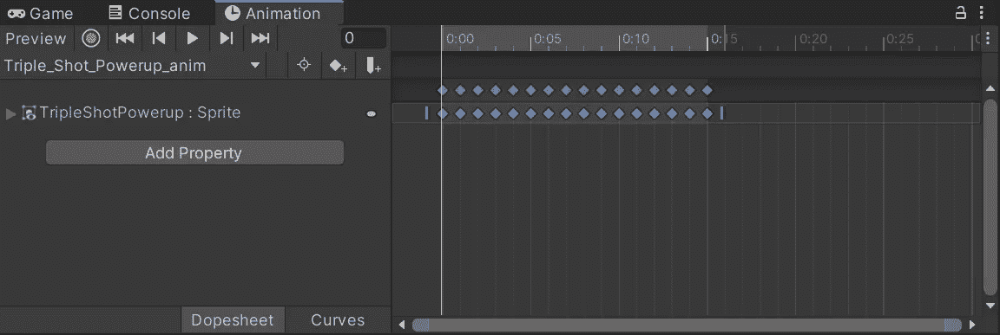
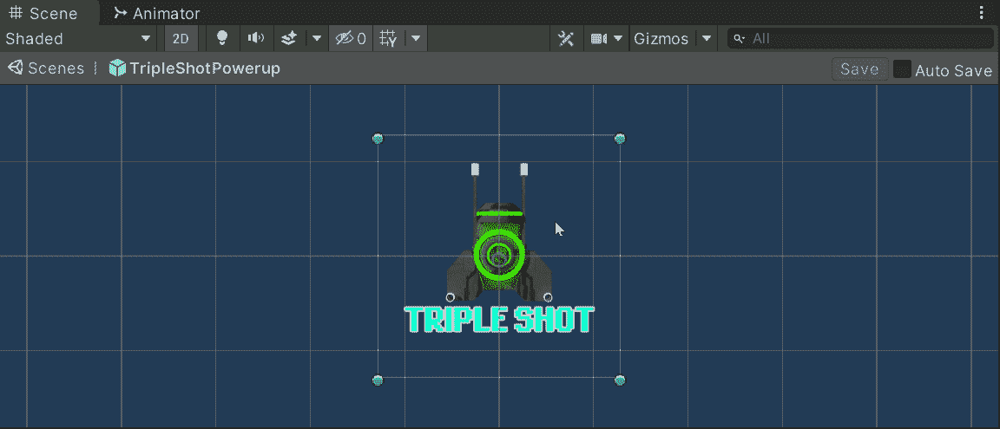
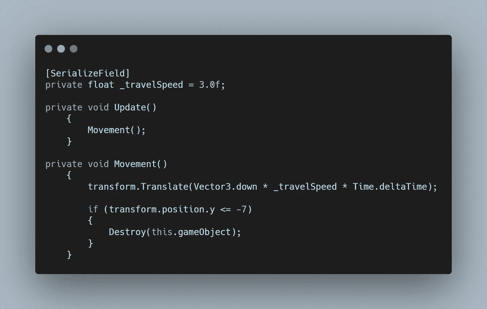
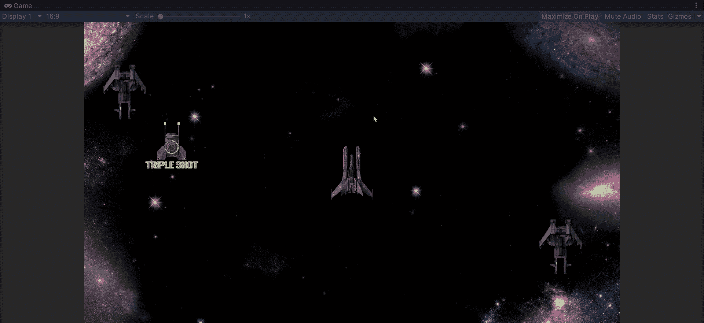

# 在 Unity 中制作精灵动画——加油！

> 原文：<https://medium.com/nerd-for-tech/animating-sprites-in-unity-powerups-995343d93760?source=collection_archive---------30----------------------->

在我们研究我们的**加电功能**之前。让我们看看如何让它们在视觉上吸引人，这样玩家的眼睛就会被它们吸引，从而试图收集它们！

首先，我们将一个静态图像添加到我们的层次结构中，以创建我们将要制作动画的游戏对象。接下来，选择**窗口>动画>动画**或者使用 **Ctrl + 6** 打开**动画窗口。**我发现最好停靠在我的**游戏窗口**中，这样我就可以访问**项目文件夹**，还可以看到我的**动画**在**场景视图中运行。**

随着我们的第一个**加电游戏对象**被选中，我们的**动画窗口**将看起来像这样。

要开始动画 TripleShotPowerup，请创建一个动画师和一个动画剪辑

选择创建将打开我们的**资产文件夹**，要求一个存储我们的**动画的地方。**建议创建一个**动画**文件夹，以便在项目变大时使用。现在简单地给你的**动画命名为**。

现在我们有了一个时间表。选择所有你想成为动画**的一部分的**精灵**并把它们拖进来！**

我们现在在窗口中有一堆关键帧。点击播放允许我们预览我们的**动画**。

对我来说，这是骑自行车太快了。要修复它，我们可以回到我们的**动画** **窗口**，选择所有关键点，简单地拖动右边的手柄到我们想要的时间长度。

让我们给我们的**加电**增加一些功能，并在游戏中测试。创建一个**启动脚本**，类似于我们的**敌人移动**，让我们使用**转换。平移**以指定速度向下移动。与我们的 **powerup** 和**敌人**的区别在于，我们不希望我们的 **powerup** 重生，如果错过了，那就这样吧。一个简单的 **if 语句**可以用来检查**加电**何时低于屏幕，然后**销毁游戏对象。**

我们现在需要我们的**加电**来产卵。让我们使用我们的 **Spawn 管理器。**

就像我们的**敌人协程**一样，我们希望我们的**异能**只在玩家活跃时产生。所以我们再次使用我们的 **while 循环**和我们的**_ stopsound bool**，它在玩家死亡时变为真。在这里，我用 Mathf 在 X 轴上创建了一个随机位置。将四舍五入，将浮点数限制在小数点后 1 位。我发现当屏幕上有很多元素时，这只是帮助游戏看起来稍微干净一点。

接下来，我们使用这个随机位置来存储我们的**向量 3** 。现在我们可以**实例化**我们的**加电** **预置**。

再次为了保持**层次**的整洁，我将每个**加电**的父对象指定为一个空的**游戏对象**，我将它用作一个容器。

现在，我们对于一个**协程**尤其是我们的 **while 循环**最不需要的就是我们的**yield return**type**wait for seconds**每 3 到 7 秒重新运行一次我们的 spawn 方法！

我们还没有在我们的**加电**功能中加入三倍拍摄方面。但是我们现在可以看到我们的**动画电源**正在产生并在屏幕上运行！

