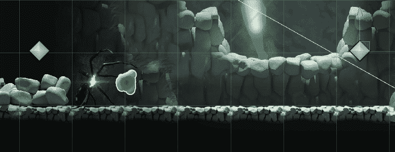
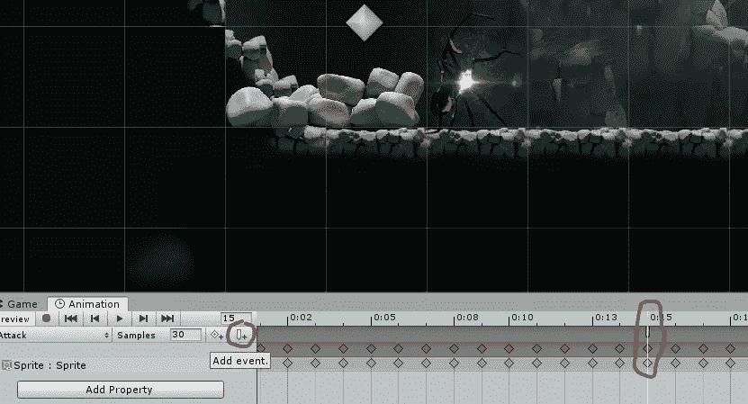
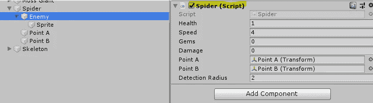
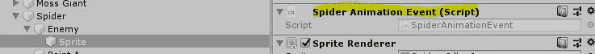

# 动画事件

> 原文：<https://medium.com/nerd-for-tech/animation-events-96acc2b0291d?source=collection_archive---------27----------------------->

**目标:**使用动画事件发射一枚炮弹。

2 SPOOPY！

我们想让我们的幽灵蜘蛛射出一滴毒液。我们将从找到我们希望球体出现的动画帧开始。然后，我们将单击*添加事件*按钮，这将在我们的帧的时间索引处(在本例中为 0:15)做出一个蓝色标记。

接下来我们将在和我们的动画相同的对象上创建一个脚本*。这与持有*蜘蛛*脚本的敌方对象不同。*

敌人物体有蜘蛛脚本…

…而 Sprite 对象具有新的 SpiderAnimationEvent 脚本。

现在，当我们点击动画事件的蓝色小勾时，我们可以从下拉框中选择脚本的 *Fire* 方法。

每当蜘蛛播放这一帧时， *Fire* 方法将实例化酸液滴，酸液滴将在整个屏幕上燃烧！

