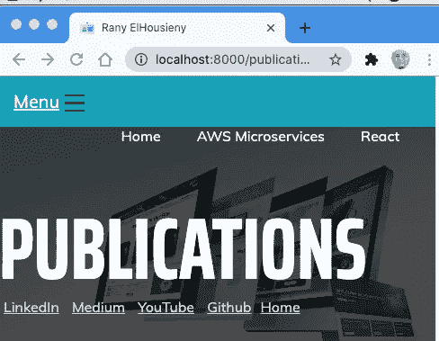
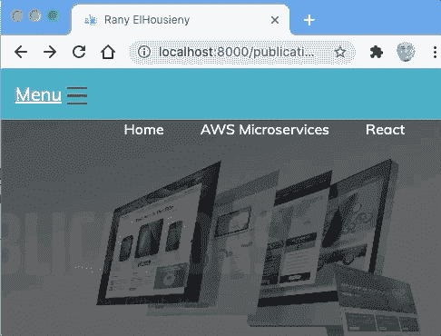
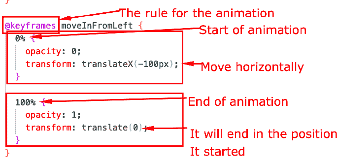
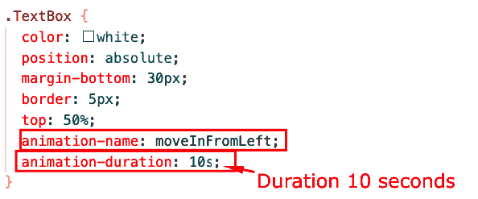
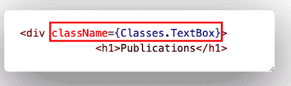
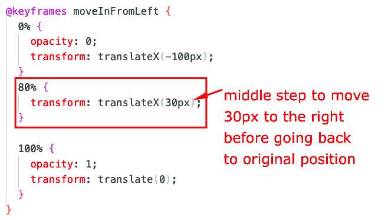
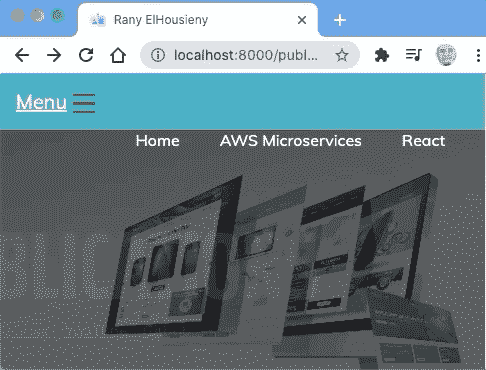
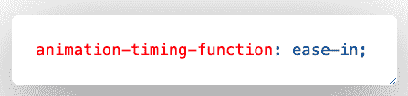
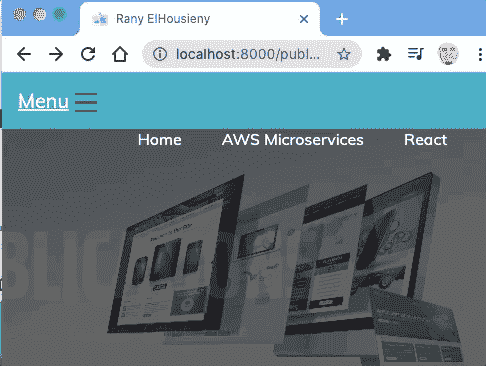

# React CSS 模块中的动画

> 原文：<https://medium.com/nerd-for-tech/animation-in-react-css-modules-4861d4f2ea18?source=collection_archive---------4----------------------->


在这篇文章中，我将解释如何添加动画来反应带有 CSS 模块的页面

本文是上一篇文章的延续:

[](https://www.linkedin.com/pulse/styling-react-withcss-modules-stylesheet-rany-elhousieny-phd%25E1%25B4%25AC%25E1%25B4%25AE%25E1%25B4%25B0/?trackingId=rK8pRgezVjkT3H0wwb9cbg%3D%3D) [## 样式与 CSS 模块样式表反应

### 在本文中，我将解释我是如何设计 https://rany.elhousieny 上的出版物页面的。

www.linkedin.com](https://www.linkedin.com/pulse/styling-react-withcss-modules-stylesheet-rany-elhousieny-phd%25E1%25B4%25AC%25E1%25B4%25AE%25E1%25B4%25B0/?trackingId=rK8pRgezVjkT3H0wwb9cbg%3D%3D) 

最后一页在[https://rany.elhousieny.com/publications/](https://rany.elhousieny.com/publications/)

这是目前为止的页面:



现在，我们将添加动画，让文本从左到右出现在末尾，如下所示



在 publication.module.css 中添加动画，如下所示



```
@keyframes moveInFromLeft {
  0% {
    opacity: 0;
    transform: translateX(-100px);
  }
 100% {
    opacity: 1;
    transform: translate(0);
  }
}
```

现在，让我们将它添加到文本框的 CSS 类中，持续时间为 10 秒，如下所示



您不需要对 publications.js 做任何更改，它应该与我们在上一篇文章中留下的一样，如下所示:



我们已经在调用 CSS 模块类了。文本框

最后，它将如下所示:


=========

# 添加中间状态

我们还可以添加一个中间状态(或者更多)。在这种情况下，我将使文本在返回左侧之前向右移动更多。为此，我将在关键帧中动画的 80%处添加一个步骤



最后，刷新页面，它将如下所示:



```
@keyframes moveInFromLeft {
  0% {
    opacity: 0;
    transform: translateX(-100px);
  }
  80% {
    transform: translateX(30px);
  }
 100% {
    opacity: 1;
    transform: translate(0);
  }
} .TextBox {
  color: white;
  position: absolute;
  margin-bottom: 30px;
  border: 5px;
  top: 50%;
  animation-name: moveInFromLeft;
  animation-duration: 5s;
}
```

======

# 轻松控制速度

您可以控制动画在开始时减速，在接近结束时加速，反之亦然，或者一直减速。还有其他功能。我们将使用动画-计时-功能



这实际上开始会很慢，最后一次反弹会更快，如下所示:

