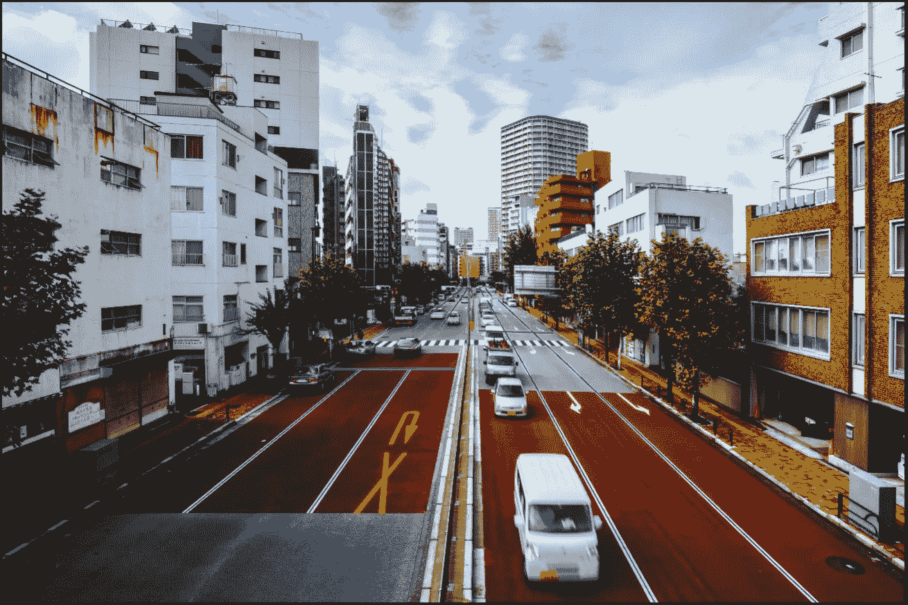
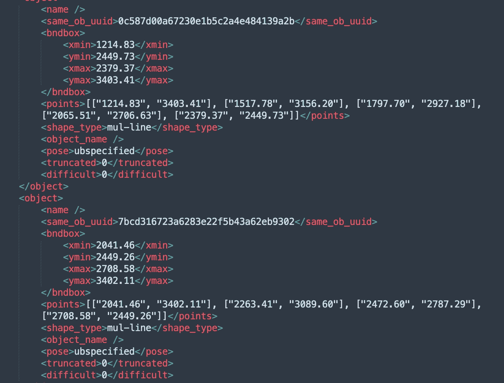

# 注释案例研究-自动驾驶中的车道检测

> 原文：<https://medium.com/nerd-for-tech/annotation-case-study-lane-detection-in-automatic-driving-8041dcc7b?source=collection_archive---------0----------------------->

从 2D 相机到 3D 激光雷达建模，从乘用车到卡车，自动驾驶的人工智能场景正在高速实施。

借助 ML 可识别的高质量标记数据，可以辅助驾驶技术，更好地感知实际道路、车辆位置和障碍物信息，检测疲劳行为，实时报警道路风险，实现自动驾驶和自动泊车等目标。

现在我们来看一个车道检测标注案例。

# **车道的数据标注**

## **1 数据指令**

关于自我车辆拍摄的 2D 图像，

对于单帧图像(非连续帧)，不需要跟踪 ID。

对于连续的帧，通道 ID 应该是唯一的。

## **2 标注内容**

**一般属性:**

(1)光线

白天:场景中街灯和大多数车灯关闭，天空是浅蓝色或灰白色。

夜晚:街灯和大多数车灯都亮着，天空是深蓝色或紫黑色。

未知:无法显示时间的图像。

(2)道路

封闭道路:高速公路、城市高架桥/环路和其他封闭道路，包括坡道；不允许行人和非机动车通行的道路。

城际道路:城际非封闭道路。道路两侧有供非机动车通行的横断面和区域。

城市道路:城市内的道路，通常明确分为机动车道、非机动车道、人行道等。；沿路看到的城市建筑比较多。

无车道线的道路:道路上没有明确的车道线，但有供车辆通行的区域。

隧道:图像在隧道内拍摄。或者车辆即将进入隧道的道路(隧道入口高度占据图像高度的 1/3 以上)。

内部区域:如封闭的公园、车站、加油站和车库。

未知:无法描述场景的图像。

(3)天气

晴天:可以看到蓝天白云；道路上有清晰的车底、树木和建筑物的影子。

阴天:没有雨/雪/雾，没有阳光直射；车辆底部的阴影模糊不清或在道路上几乎看不见。

雨天:正在下雨或雨后路面有明显积水。

下雪天:正在下雪或雪后路面有明显积雪。

雾天:可以看到雾，或者中地面的目标模糊不清。

未知:无法辨别天气的图像。

(4)标注类别:

虚线:包括双虚线，每条虚线都单独标记。

实线:包括双实线，每条实线应单独标注。

虚线:特殊形状的线，如可变导向车道线和减速线。

实线:特殊形状的线，如可变导向车道线和减速线。

路缘:可行驶区域的最外侧边缘。

## 3 标签要求

1.  车道定位

(1)单线:沿车道线中心标注；

(2)双线:标注靠近本车车道的线的中心；

(3)特殊形状的线:沿中线或形状类似于单线的主线标注；

(4)路缘:沿行驶区域边界的标签；

(5)折线:对于直线，只需要 2 个点进行标注；对于曲线，曲率大的点用较密的点，曲率小的点用较疏的点。

2.端点

(1)端点是车道在远处会聚的点。

(2)在图像的终点，会聚车道线的远端应该在直径为 8 个像素的圆内。

(3)如果是曲线，应该是最远端车道的汇聚点，而不是直接沿着附近车道延伸的那一点。

(4)上坡时，车道线只延伸到坡顶，标注只需要延伸到可见部分。

3.车道的规格和车道的完整性

(1)从端点开始，线条需要延伸到图像的下边缘或侧边缘；

(2)当端点被目标物体遮挡时，需要想象不可见点，这样下边缘或侧边缘就不会空出来；

(3)如因交叉导致线路断开，请合理预测，如有可能尽量连成一线；

(4) T 型车道可以由不同车道组成，但不允许交叉(同一车道线不能自身相交形成圆)；

(5)当车道中间被其他目标(主要是车辆)遮挡时，需要对不可见部分进行想象和标注；

(6)破损、模糊的车道应标注合理的预测；

(7)道路断开:如果道路在空间结构上是断开的，就要分成多条线。

## 4 车道的判断

1.  仅标记可行驶区域的车道线；
2.  如果有新旧车道，且能明显区分，只标注新车道；如果没有，请标记所有。
3.  路缘可以被认为是可驾驶区域的边界。也就是说，所有可行驶区域都应该由车道线包围。如果最外侧车道和可行驶区域的边缘之间有足够的空间容纳一辆车，则可行驶区域的边缘应延伸至路缘。
4.  如果最外面的车道靠近可行驶区域的边缘，则仅标注最外面的车道。
5.  混合线:如果有多种类型，类型取决于壁橱线。
6.  斜坡和岔路描述:

对于坡顶，车道线只延伸到可视范围内的最远端，不需要收敛到一点；

对于岔路，标注止于车道线的消失点；

在上坡坡顶，车道线可以延续到坡顶，然后停止。

# 您可以手动配置和 ByteBridge 注释

## 只剩三步了

*   使用您的电子邮件登录
*   上传样本
*   告诉我们要贴什么标签:告诉我们最小标签尺寸和您需要的精度。

您可以将需求发送给我们，我们将处理配置工作。

那就轮到我们了。

演示和报价将在工作日不到 24 小时内准备就绪。

## 输出

字节桥巷注释

**JSON 输出**

ByteBridge Lane 注释 JSON

## 结束

将你的数据标注任务外包给[字节桥](https://tinyurl.com/23a3an3h)，你可以更便宜更快的获得高质量的 ML 训练数据集！

*   无需信用卡的免费试用:您可以快速获得样品结果，检查输出，并直接向我们的项目经理反馈。
*   100%人工验证
*   透明标准定价:[有明确定价](https://www.bytebridge.io/#/?module=price)(含人工成本)

## 为什么不试一试？