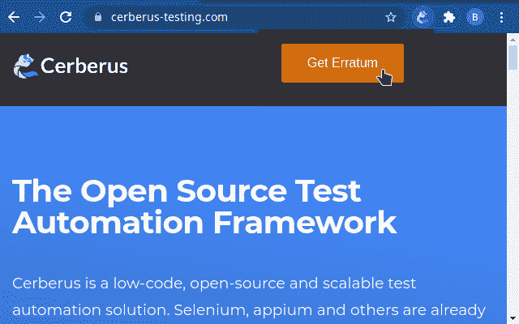
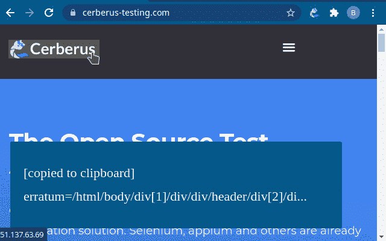
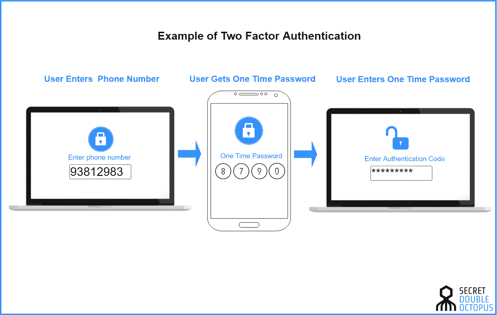
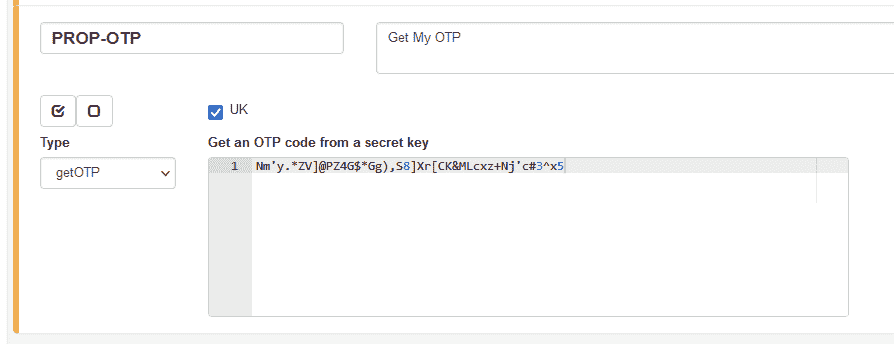
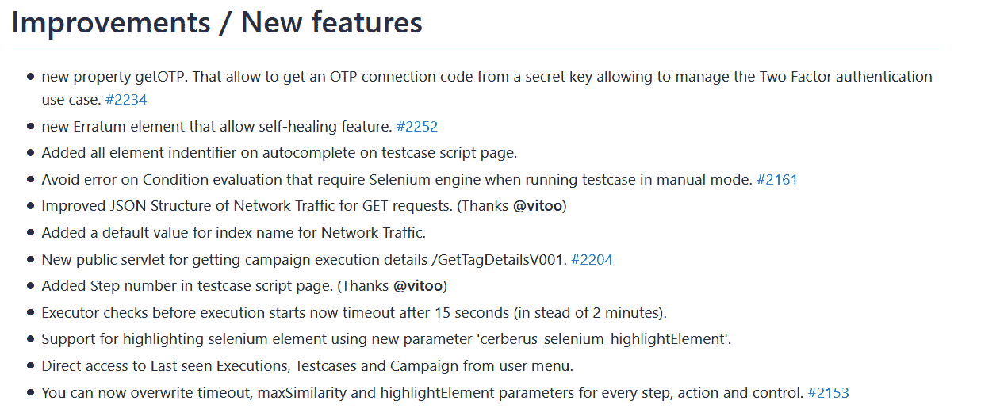

# 宣布地狱犬测试 4.12 宝藏:自我修复测试版及更多

> 原文：<https://medium.com/nerd-for-tech/announcing-cerberus-testing-4-12-treasure-self-healing-beta-more-69faff47fa1f?source=collection_archive---------11----------------------->

我们很高兴地宣布释放地狱犬 4.12 与一系列新功能！一个特别的惊喜是其他的改进和修正，

我们一直把产品开发的重点放在最后的社区分享和定期反馈上。自我修复和 OTP 的完整新功能在测试版中可用，而现有功能得到了改进。

这篇文章强调了 4.12 中包含的基本变化，并展望了未来的发展。

让我们从第一个直接来自大学合作的自我修复开始。

[**跟随 Cerberus 测试**](https://cerberus-testing.com/follow) 进行更多的开源测试自动化。

# 自我修复在 Beta 版中可用，有勘误表

现在可用的自我修复功能被称为“勘误表”，意思是“已纠正错误的列表”。它的目标是使用统计算法自动修复损坏的定位器，以方便应用，而不依赖于 IA。它配有一个简化的记录器，以方便您的测试自动化之旅[，可作为 Chrome 扩展](https://chrome.google.com/webstore/detail/cerberus-extension/cfgifhmddmhbdndfceikcigagacjfepl?hl=en)。

图 1:作为 Chrome 扩展的 Cerberus 勘误表记录器

破损和不稳定的测试价值很低；这是测试自动化中真正的痛点。在本文中，我们分享了如何比脆弱的定位器做得更好，并探索了从结构上改善这个问题的方法。

使用开发者同意的固定定位器是一种不总是可以实现的可能性:Web 语言有动态定位器，软件开发可能会失控。利用数据科学似乎是一个有前途的解决方案，它需要数据工程的成熟度和一个基本要素:基于大型数据集的模型。实际上，这个数据集对于在项目中开始自动化的团队来说是一个很大的时间损失。

有了勘误表，您可以通过简单的点击来记录您的元素位置，从而构建您的测试用例。修复后的定位器的功能对操作和控制都有效。唯一的要求是使用勘误表定位器前缀。

图 2:勘误表定位器的自动生成

然后发生了什么？从你的角度来看，没什么特别的！您只是让您的测试用例像您传统上做的那样执行。当找不到特定的定位器时，Erratum 将根据其算法找到相同的元素。

该功能已经在不同公司的 alpha 和 beta 版本中进行了测试。我们还验证了对测试的性能没有显著的影响。该功能在 4.12 版本中全球可用。请随意查看这里的。

Cerberus 的下一个测试特性是对软件安全性进行必要的增强，支持双因素身份验证(2FA)。

# 支持 2FA 的一次性密码

双因素身份验证包括使用两种不同的机制而不是单一的登录表单来识别身份。特定的工作流要求您在原始请求中使用特定的密码。

图 3:双因素认证过程的示例[https://double octopus . com/security-wiki/authentic ation/what-is-2fa/](https://doubleoctopus.com/security-wiki/authentication/what-is-2fa/)

包含这种机制的应用程序确实会使我们的自动化测试的实现变得复杂。对于特定的动作脚本，解决方法是可行的，但并不令人满意。Cerberus 测试中的新功能允许您直接在酒店内检索 OTP 密码。

图 4:检索 OTP 连接代码的 OTP 属性

这个配置将允许您从一个秘密密钥中获得一个 OTP 连接代码，正确地处理您的测试。对于所有环境中的持续测试方法来说，这是一个有价值的简化，并且[改进了测试维护](https://cerberus-testing.com/blog/this-is-how-to-implement-maintainable-automated-tests/)。

用户界面和引擎上的一系列改进也会对您的测试自动化之旅有所帮助！

# UX 和引擎加速改进

用户体验得到了改善，在日常使用中更加流畅。

现在，您可以从用户菜单中访问最近看到的执行、测试用例以及活动。测试用例页面还提供了一系列的自动完成字段来简化测试用例的创建过程。web 性能方面也有所改进。GET 请求的网络流量有了一个改进的 JSON 结构。

图 Cerberus 测试 4.12 的总体改进概述

测试执行引擎提供了更多的定制！

您现在可以将一系列参数作为测试级别进行覆盖，而以前这些参数仅限于全局级别。定制可以达到特定测试的步骤、动作和控制级别，给您完全的灵活性！

为了简化集成，还提供了一个新的 API 来检索每个标签的活动细节。现在也支持硒元素的高亮显示。

# 尝试并关注下一个版本

这一版本使我们在自我修复能力方面达到了一个重要的里程碑。欢迎您尝试，成为早期采用者的一部分！

我们将继续在开源社区中努力开发最有价值的特性，以帮助您在测试自动化工作中取得成功。下一个主要步骤是扩展自我修复能力，同时提供扩展的 webhook 集成，包括团队和 Google Chat。

您可以免费加入并使用 Cerberus 测试，[现在开始](https://cerberus-testing.com/start/)。

这里是完整的 [4.12 发行说明](https://github.com/cerberustesting/cerberus-source/releases/tag/cerberus-testing-4.12)的直接链接。

[**跟随 Cerberus 测试**](https://cerberus-testing.com/follow) 进行更多的开源测试自动化。

您可以支持开源测试自动化

*   **拍拍**这篇文章**👏**
*   **Star**GitHub[上的项目](https://github.com/cerberustesting/cerberus-source/)
*   **提供**一份[咖啡](https://www.buymeacoffee.com/CerberusTesting) ☕

*作者:* [*安托万·克拉斯克*](https://twitter.com/acraske_)

*原载于 2021 年 7 月 31 日 https://cerberus-testing.com**[*。*](https://cerberus-testing.com/blog/announcing-cerberus-testing-4-12-treasure-self-healing-beta-more/)*