# 异常检测技术

> 原文：<https://medium.com/nerd-for-tech/anomaly-detection-techniques-5fdfbab9180a?source=collection_archive---------3----------------------->

> 独特性在生活中被欣赏，但不在数据中被欣赏

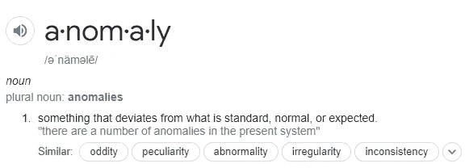

异常识别是一种用于识别不符合预期的不规则趋势的方法。这种异常也被称为[异常值](https://en.wikipedia.org/wiki/Outlier)。这种方法有许多应用。

# 应用程序

1.  **欺诈检测:**检测信用卡和贷款申请的欺诈使用
2.  **故障诊断:**监控工程流程，检测设备或生产线成品中的故障
3.  **时间序列分析**:识别参数趋势随时间的变化。例如股票表现、销售数据
4.  **医学状况:**基于对分子结构、MRI 图像等的研究来识别医学状况。,

*对于所有用例，一个主要问题是:*

# 如何实际检测异常？

虽然我们可以手动检测异常，因为我们的大脑在这方面非常擅长，但这永远不是最好的方法。我们不可能一直关注排行榜。

因此，我们的下一个方法是通过基于[统计规则](https://towardsdatascience.com/statistical-techniques-for-anomaly-detection-6ac89e32d17a)或[静态阈值](https://ufdc.ufl.edu/UFE0022572/00001)的警报系统使用更多自动检测技术，这些阈值必须手动调整。

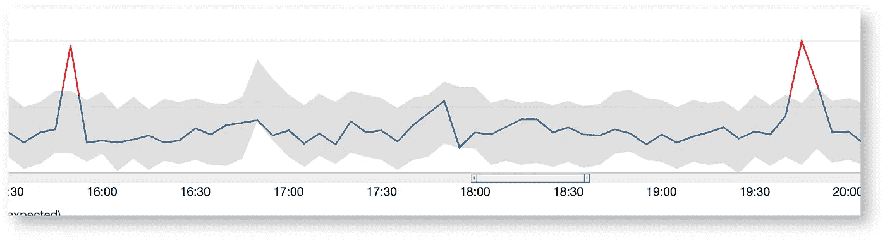

[使用 AWS CloudWatch 进行异常检测](https://www.google.com/url?sa=i&url=https%3A%2F%2Fwww.ac3.com.au%2Fresources%2Fanomaly-detection&psig=AOvVaw39Aq9yZMiMkci3J8-8qS58&ust=1619154712040000&source=images&cd=vfe&ved=0CA0QjhxqFwoTCKjp3sGLkfACFQAAAAAdAAAAABAo)

尽管减少了对人的依赖并通知用户异常情况，但仍有一些缺点，如假阴性、假阳性。

这归结为一种使用机器学习的异常检测的更加健壮的方法。

图片:[来源](https://www.google.com/url?sa=i&url=https%3A%2F%2Fwww.nexuslabs.online%2Fp%2Fnexus-news-27-machine-learning-for&psig=AOvVaw0DQo5eSwDGa98_714FdE7h&ust=1619157351129000&source=images&cd=vfe&ved=0CA0QjhxqFwoTCIjs7baVkfACFQAAAAAdAAAAABAD)

我们的下一部分涉及带有异常检测的机器学习。有三种主要方法来检测异常。

1.  在没有先前数据信息的情况下确定异常值(异常)。这类似于**无监督聚类**。
2.  **有监督的机器学习**对于常规和异常类都有可用标签的问题。由于预计异常非常少，这可以被认为是具有不平衡数据的二元分类。
3.  仅学习普通类的标签使其成为一种**半监督**方法

试图平衡不平衡的数据并不总是能达到异常检测的目的。所以我们需要各种其他方法…..

我从多个类别中选择了 5 种算法(线性的、基于邻近的、概率的、离群的集成)来解释它们如何执行异常检测。

## [**基于角度的离群点检测器(ABOD)**](https://machinelearningstories.blogspot.com/2018/08/anomaly-detection-in-high-dimensional.html)

ABOD 算法基于数据集中数据对象的差异向量之间的角度变化。因此，与纯粹基于距离的方法相比，这就是“维数灾难”的后果

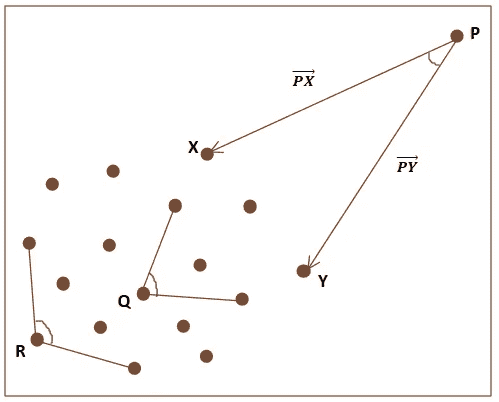

图片:[来源](http://bKjaye7jWsMt2J_IBGQPIj2U72iyJWcXwCLcBGAs)

点 P 的 PX 和 PY 之间的角度略小于上图中轮廓点 P 的其他点 Q 和 R 的角度。最远数据点的角小于最近数据点的角。如果考虑得更多，最远的数据点(与其他数据点的所有可能角度)和较近的数据点之间的差异会更小。因此，数据点被视为角度变化较小的异常值。大维度中的角度比距离更稳定。在实际使用过程中，点之间的角度和距离是分开的，因此距离也是分开的。

## [K-最近邻检测器](https://towardsdatascience.com/k-nearest-neighbors-knn-for-anomaly-detection-fdf8ee160d13)

KNN 是一种受监控的 ML 算法，有时用于数据科学中的分类问题(有时也用于回归问题)。它是最基本和最常用的算法之一，具有很强的用例。

基本原理是，相同的观测值靠得很近，而离群值通常代表单独的观测值，它们离具有相似观测值的聚类更远。

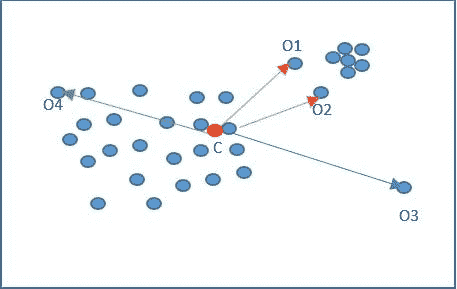

虽然 KNN 是一种监督的 ML 算法，但在异常检测时，它采用完全基于距离阈值的非监督方法。

## [隔离林](https://towardsdatascience.com/outlier-detection-with-isolation-forest-3d190448d45e)

它们就像所有其他基于决策树的树集合形式。通过首先随机选择一个特征，然后在所选函数的最低和最高值之间随机选择一个分割值，在这些树中生成分区。

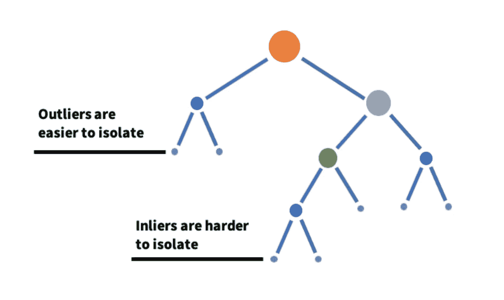

首先选择一个随机函数来构建树的一个分支。接下来，选择一个随机分割值(在最小值和最大值之间)。如果这个函数有一个较低的值，那么所选的函数将遵循左分支，否则将遵循右分支。这个过程一直进行到分离或确定最大深度。就值而言，离群值本质上比正常观察值更不常见和独特(它们在特征空间中离正常观察值更远)。
这就是为什么通过使用这样的随机划分(更短的平均路径)可以在更靠近树根的地方找到它们。

## [基于直方图的离群点检测(HBOS)](https://towardsdatascience.com/anomaly-detection-for-dummies-15f148e559c1)

基于直方图的异常值分数采用函数的自由度，并通过直方图构造来测量偏差程度。可以为每个函数计算直方图，单独测量，并在多变量异常检测结束时进行平均。

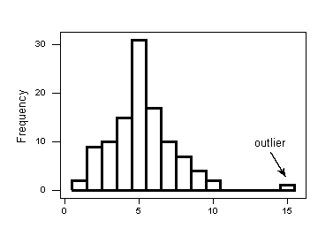

## [一类支持向量机](https://towardsdatascience.com/outlier-detection-theory-visualizations-and-code-a4fd39de540c)

一类向量支持机是一种在“正常”数据上训练的无监督学习算法，在我们的例子中是反例。它了解这些点的边界，因此能够将超出边界的某些点归类为异常值，您可能已经猜到了。无监督学习算法很难训练，单类 SVM 也不例外。nu 参数可以是您想要看到的异常值的比例，gamma 参数平滑等高线。

## 让我们编码:

我正在使用这个神奇的库 PyOD 进行异常检测。这是一个全面的、可扩展的 Python 工具包，用于多元数据中的异常值检测。*全部鸣谢赵，y .***李，z . 2019。PyOD:一个 Python 工具箱* ***用于*** *可扩展的离群点检测。机器学习研究杂志(JMLR)，20(96)，第 1–7 页。**

*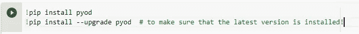*

*安装更新 PyOD 后，就该安装一些包和模块了。*

*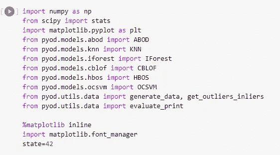*

*我将使用 PyOD 库中的 *generate_data()* 函数随机生成带有离群值的数据。所以，用下面的代码，我可以创建 2000 个随机数据记录，有两个特征。Outlier_fraction 表示生成的数据中离群值的比例。在我们的例子中，由于 outlier_fraction 是 0.1，这意味着 200 条记录是异常值。*

*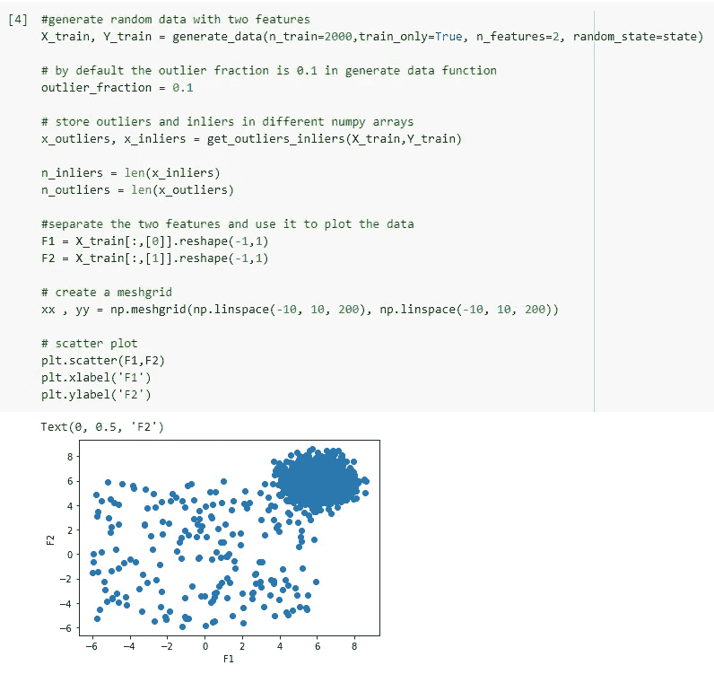*

*接下来，我用一些默认参数选择了 6 种算法。*

*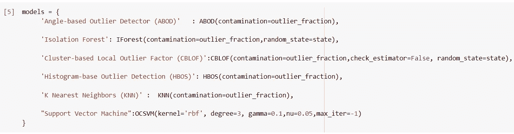*

*现在转到模型实现。*

*首先，我们拟合模型，然后从训练数据中预测标签。然后将这些预测标签与实际标签进行比较，以评估我们的模型。为各个模型计算检测异常值时的错误(假阳性和假阴性)数量。AUROC 和 P@n 等评估指标是使用 Py_OD 中的 *evaluate_print()* 计算的。*

*完整的代码可以在[这里](https://github.com/SHABARIGIRI/Anomaly-Detection)找到。*

*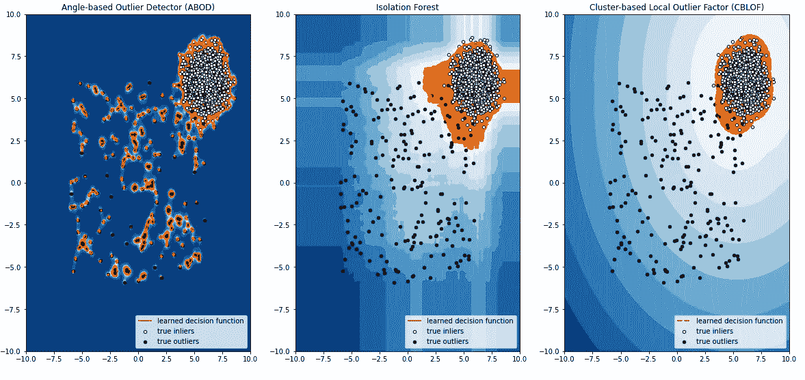**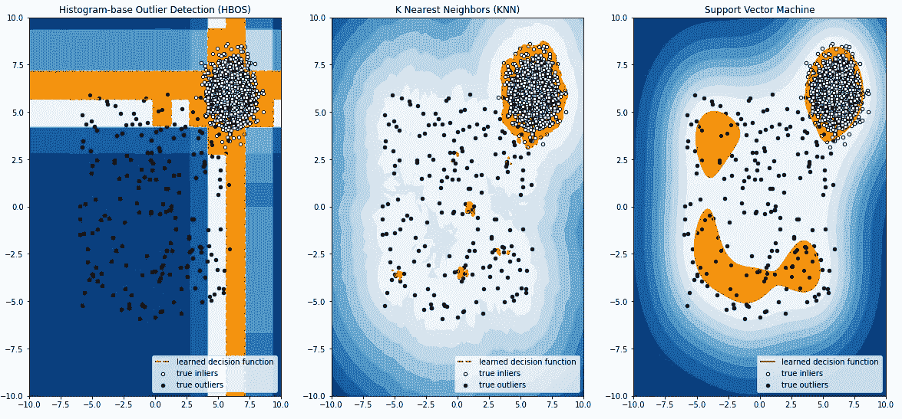*

## *评估指标:*

*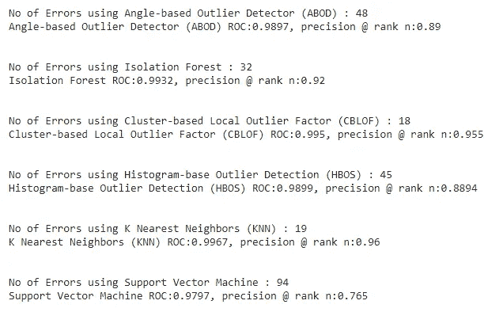*

****Ohhhh！****

**

*我们有更多的 Py_OD 异常检测模型。我想我们可以试试基于神经网络的自动编码器 ______________________*

**

*读者就像👆*

*我会在以后的工作中考虑。谢谢你留下来。*

## *参考资料:*

* [## 异常值检测——理论、可视化和代码

### 五种算法来统治他们，五种算法来发现他们，五种算法来把他们带到黑暗中…

towardsdatascience.com](https://towardsdatascience.com/outlier-detection-theory-visualizations-and-code-a4fd39de540c)  [## 虚拟异常检测

### 单变量和多变量数据的无监督异常检测。

towardsdatascience.com](https://towardsdatascience.com/anomaly-detection-for-dummies-15f148e559c1) 

[https://blogs . Oracle . com/ai-and-data science/post/introduction-to-anomaly-detection](https://blogs.oracle.com/ai-and-datascience/post/introduction-to-anomaly-detection)

 [## 用于异常检测的局部异常因子

### 关于局部异常值因子(LOF)的简短摘要

towardsdatascience.com](https://towardsdatascience.com/local-outlier-factor-for-anomaly-detection-cc0c770d2ebe) 

[https://www . dfki . de/file admin/user _ upload/import/6431 _ HBOS-poster . pdf](https://www.dfki.de/fileadmin/user_upload/import/6431_HBOS-poster.pdf)

[https://towards data science . com/outlier-detection-with-isolation-forest-3d 190448 d45e](https://towardsdatascience.com/outlier-detection-with-isolation-forest-3d190448d45e)

 [## 使用隔离林和可视化进行异常检测

### 指标的突然上升或下降是异常行为，这两种情况都需要注意。异常检测可以…

towardsdatascience.com](https://towardsdatascience.com/anomaly-detection-with-isolation-forest-visualization-23cd75c281e2)  [## 使用扩展隔离森林算法的欺诈分析

### 对于组织中的数据科学家来说，识别数据中的欺诈是一项非常繁琐和复杂的任务。根据行业…

www.linkedin.com](https://www.linkedin.com/pulse/fraud-analytics-using-extended-isolation-forest-algorithm-kumar)  [## 基于扩展隔离森林的离群点检测

### 了解流行的离群点检测算法的最新改进

towardsdatascience.com](https://towardsdatascience.com/outlier-detection-with-extended-isolation-forest-1e248a3fe97b)  [## 用于异常检测的 k-最近邻(kNN)

### 用于异常值和异常检测的小数据科学

towardsdatascience.com](https://towardsdatascience.com/k-nearest-neighbors-knn-for-anomaly-detection-fdf8ee160d13)  [## 高维数据中的异常检测:基于角度的异常检测技术

### 编辑描述

machinelearningstories.blogspot.com](https://machinelearningstories.blogspot.com/2018/08/anomaly-detection-in-high-dimensional.html)*