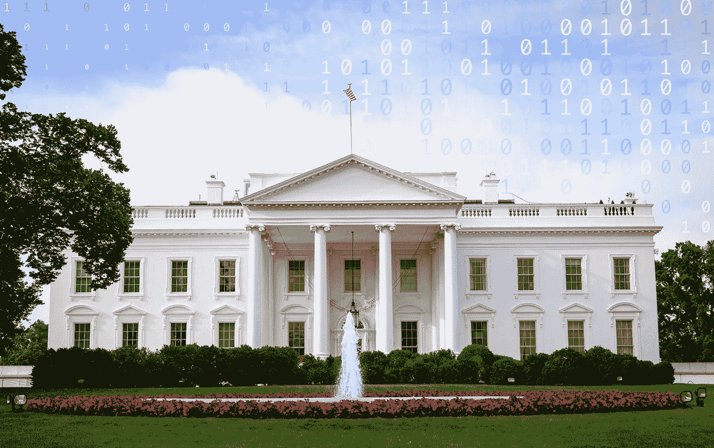

# 又一个网络“警钟”革命还是重演？

> 原文：<https://medium.com/nerd-for-tech/another-cyber-wake-up-call-revolution-or-just-a-re-run-644c1c7b800b?source=collection_archive---------0----------------------->

欢迎来到本月的网络叫醒电话。也许是今年。毕竟，T2 促成了本月早些时候的白宫“峰会”。正如一些专家几周前所说的那样，不要屏住呼吸等待它成为软件安全的决定性转折点。在那之前你很可能会晕倒。

没错，12 月在 [Apache 开源日志库 Log4j](https://logging.apache.org/log4j/2.x/security.html) 中发现的灾难性漏洞被称为“警钟”

但愿如此。但是做出这样的声明意味着这是一件新的和令人震惊的事情。一点也不——一点也不接近。只是最近一个拿到标签的事件。这也暗示着一个沉睡的软件安全巨头已经被唤醒，并将在未来阻止任何类似的事情。如果以历史为鉴的话，这是不会发生的。

看看过去十年左右任何利用软件漏洞的重大网络攻击的评论。它们都被描述为警钟。有 2008 年和 2015 年的[心脏地带支付系统](https://www.idstrong.com/sentinel/heartland-data-breach/)违规事件，2013 年的[雅虎](https://www.npr.org/sections/thetwo-way/2017/10/03/555016024/every-yahoo-account-that-existed-in-mid-2013-was-likely-hacked)，2013 年的[塔吉特](https://krebsonsecurity.com/2015/09/inside-target-corp-days-after-2013-breach/)，2014 年的[万豪国际](https://threatpost.com/2014-marriott-data-breach-exposed-500m-guests-impacted/139507/)，2016 年的[优步](https://www.techtarget.com/searchsecurity/news/252488361/The-Uber-data-breach-cover-up-A-timeline-of-events)，2017 年的 [Equifax](https://www.forbes.com/sites/taylorarmerding/2018/09/11/equifax-breach-catastrophic-but-no-game-changer-yet/#6e788dcd51d7) ，2019 年的 [Capital One](https://krebsonsecurity.com/tag/capital-one-breach/) ，2019 年的[网络安全管理软件产品](https://www.npr.org/2021/04/16/985439655/a-worst-nightmare-cyberattack-the-untold-story-of-the-solarwinds-hack)供应链顺便说一句，这个清单可以一直列下去。

除此之外，2012 年，时任国防部长莱昂·帕内塔说了其他不太知名的专家自 20 世纪 90 年代以来一直在说的话——美国薄弱的网络安全使其容易受到“网络珍珠港”攻击，这种攻击可能导致电网和燃料供应等基本服务中断。九年后，我们有了殖民地管道的例子。幸运的是，这只是地区性的。

类似地，几十年来，专家们一直在警告和劝诫[认真对待开源软件安全](https://www.synopsys.com/software-integrity/resources/analyst-reports/open-source-security-risk-analysis.html?intcmp=sig-blog-ossra1?cmp=pr-sig&utm_medium=referral)。

由志愿者社区创建和维护的开源软件和其他软件一样好，但也一样坏，因为它是由不完美的人创建的。它很受欢迎——几乎是所有现代代码库的绝大多数——很大程度上是因为它通常是免费的。

更危险的是——正如在安全会议上没完没了地说的那样——为漏洞创建的补丁不会“推”给每个使用易受攻击组件的人。这些用户必须“拉出”补丁。如果他们不知道他们使用的组件有漏洞(这是经常发生的情况)，他们就不会知道他们需要补丁。正如软件行业的老话所说，“你无法保护你不知道自己拥有的东西。”

**很晚才开始**

但在这一切之后，我们来到了 2022 年，信息技术行业的顶级声音宣布，名为 Log4Shell 的 Log4j 漏洞是一个警钟。

在 1 月 13 日关于如何提高开源软件安全性的白宫峰会后，[开源代码库 GitHub 的首席安全官 Mike Hanley 告诉《华盛顿邮报》](https://www.washingtonpost.com/politics/2022/01/14/open-source-bugs-present-an-extermination-problem-government/),这是关于这个问题的“对话的开始”。听起来不错，只是起步很晚。这个问题已经存在几十年了。

Synopsys Software Integrity Group 的首席科学家萨米·米格斯(Sammy Migues)表示，多次唤醒电话没有在私营或公共部门引发任何广泛觉醒的一个原因可能是许多首席安全官的保质期很短，他们通常是在安全故障后被解雇的人，无论是谁或什么原因造成了安全故障。

这意味着“每两年一次的灾难确实是一个警钟，因为他们以前从未经历过，”他说。“此外，在这种场合，首席执行官没有什么可说的——其他任何事情都是承认他们知道这可能发生，但什么也没有做，或者他们做了一些事情，但没有奏效。也不是好看。”

“每个事件都必须被描绘成一只黑天鹅——一个实习生干的，我们的取证公司说我们的违规是前所未见的，等等。——或者这是承认‘我们尝试过，但失败了’，”他说。

事实上，新思网络安全研究中心的首席安全策略师 Tim Mackey 说，政府对这种报告有激励措施。“SEC[证券交易委员会][2018–22](https://www.sec.gov/news/press-release/2018-22)指南有效地激励高管们将一切描绘成黑天鹅事件，”他说。

Synopsys 软件完整性小组的高级产品经理 Debrup Ghosh 说，另一个原因可能是每个人——政府、行业和公众——的注意力持续时间短。“每年我们都有一个警钟，在最初的新闻报道消退后，公司回到他们现有的做法，直到下一个警钟，”他说。

**乐观的修辞理由**

那么，有了这些历史，还有什么理由保持乐观——希望这个警钟会比过去的警钟更能唤醒人们吗？

或许，如果我们能相信出席白宫峰会的政府高官和一些最大科技品牌高管的言论。

根据[白宫发布的新闻稿](https://www.whitehouse.gov/briefing-room/statements-releases/2022/01/13/readout-of-white-house-meeting-on-software-security/)，会议的焦点是“讨论提高开源软件安全性的倡议，以及新的合作可以快速推动改进的方式。”

华盛顿邮报[报道](https://www.washingtonpost.com/politics/2022/01/14/open-source-bugs-present-an-extermination-problem-government/)称，会议上讨论的一个主要优先事项是“建立政府/行业伙伴关系，创建一个最重要的开源软件目录，如果这些软件易受攻击，必须检查并重新检查是否有黑客漏洞，就会引发 Log4j 级的担忧。”

其他优先事项包括:

*   增加对开源软件开发者的网络安全培训。
*   正如拜登总统 5 月 12 日发布的“关于改善国家网络安全的行政命令”所概述的那样，在私营部门和公共部门之间建立更紧密的联系，以支持开源软件拜登命令明确呼吁公共和私营组织创建和维护[软件材料清单(SBOM)](https://www.synopsys.com/blogs/software-security/building-sbom-with-black-duck/?cmp=pr-sig&utm_medium=referral)——他们正在使用的每个软件组件的清单，这是安全行业多年来一直建议的事情。对于 Log4Shell，如果使用 Log4j 并需要应用可用的补丁，拥有 SBOM 的组织通过简单的数据库搜索就可以很快知道。
*   增加现有项目的资金和资源，以减少开源软件中可破解错误的流行。

白宫内新成立的国家网络主管办公室主任克里斯·英格利斯[上周告诉政治](https://www.politico.com/news/2022/01/19/biden-cyber-chief-software-projects-527356)，他将重点放在开源软件的安全和提高公众的网络素养上，这表明拜登政府正试图把钱和人员用在刀刃上。他有 2100 万美元的预算，他的员工现在只有 25 人，预计到今年年底将达到 75 人。

如果没有别的，这些都表明人们意识到易受攻击的软件既是商业风险也是国家安全风险，值得投入大量的时间和金钱来解决。没有人会对这些举措的意图或潜力提出异议。

**戏剧多于实质**

只是，正如任何软件专家可以告诉你的那样，他们以前看过这部电影。每一次，最终，都是戏剧多于实质。

事实上，从比尔·克林顿开始的每一任总统都发布过关于网络安全的行政命令，如果这些命令得到遵守，几乎肯定会使软件成为黑客更难攻击的目标。他们可能会使 Log4Shell 的破坏性小得多。但是他们很大程度上没有被遵守，软件安全的世界也只是逐渐改变。

米格斯认为，历史将会再次重演，他说大多数总统 EOs 相当于“无资金支持的命令”。“这次不会有什么不同，”他说。“一些组织会因为个别领导人而改善，一些会因为组织文化而改善，其余的会蒙混过关，直到下一次事件给他们一个机会解雇一些累赘，并引入一些新人来进行一些改善。”

这并不意味着 EO 没有任何价值。米格斯说，他认为拜登的 EO 中可能产生长期有益影响的部分是联邦机构只能购买符合严格安全标准的数字产品的指令。

“这将像一个冰架落入海洋，随着时间的推移，到处都在涨潮，”他说。

麦基说，白宫峰会的主要优先事项——创建一个“最重要的开源软件目录”——是一个已经进行了多年的项目。

“在 OpenSSF(2020 年)创建之前，Synopsys 就一直在协助 OpenSSF(开源安全基金会)确定开源的最重要部分，”他说。

**关注基本面**

但多名专家倾向于同意此前总统行政命令或高调峰会高调推出后所说的话:改善网络安全的最佳方式是更加关注基本问题，而不是变革性问题。

新思软件完整性集团(Synopsys Software Integrity Group)的技术策略师特拉维斯·比恩(Travis Biehn)表示，“组织应该花更多时间减少网络攻击的 MTTR(平均恢复时间)，而不是担心首席执行官或一批大型科技公司是否会阻止开源软件出现可利用的缺陷。”

创建和维护 SBOMs 仍然是一个非常好的想法——一个基本的需求。但是 Biehn 说“正如 Log4j 已经证明的那样，惊奇是组织有困难的地方。”

任何开源组件的目录“很可能永远不会预见到正确的关键库或工艺集，也不会将它们推向市场以受到开发人员的欢迎。“用‘缺陷发现’来包围现有的库是值得称赞的，但是又一次没有考虑到新类型的缺陷所带来的惊喜，”他说。