# 可变-专用|模块|主机模式

> 原文：<https://medium.com/nerd-for-tech/ansible-ad-hoc-modules-host-patterns-52c156405145?source=collection_archive---------9----------------------->

先决条件:

 [## 使用 SSH & ssh-keygen 在 Ansible server 和双节点服务器之间建立连接

### Ansible 是一个开源的自动化引擎，它可以自动化软件供应、配置管理和…

medium.com](/nerd-for-tech/establish-a-connection-between-ansible-server-and-two-node-using-ssh-ssh-keygen-91ffee1ff7c4) 

节点 2[172–21–32–33]节点 1[172–31–42–50]服务器[172.31.38.62]

# 主机模式= >

这里，我们检查以任何模式连接到服务器的节点数量。

命令:

ansi ble all-lists-hosts
ansi ble-lists-hosts
ansi ble[0]—lists-hosts

其中
【0】表示第一个节点
【1】表示第二个节点
[-1]表示最后一个节点
[-2】
表示倒数第二个节点
1:4】表示第二个节点到第五个节点

# 临时|模块| ansi ble 形式的行动手册

专用命令就是简单的 Linux 命令。由于没有幂等性，它一次又一次地执行文件。在这里，幂等性意味着无论是否已经执行，每次都执行，即不覆盖文件。
模块是指由单个命令完成的单个工作，而执行模块的集合被称为剧本。

**Ad-hoc:**
可以单独运行，执行快捷功能。
这些特别命令不用于配置管理和部署，因为命令是一次性使用的。
ansi ble 专用命令使用/usr/bin/ansible 命令行工具来自动执行单个任务。

命令:

ansi ble developers-a " sudo yum install httpd-y "

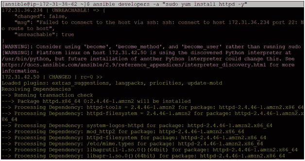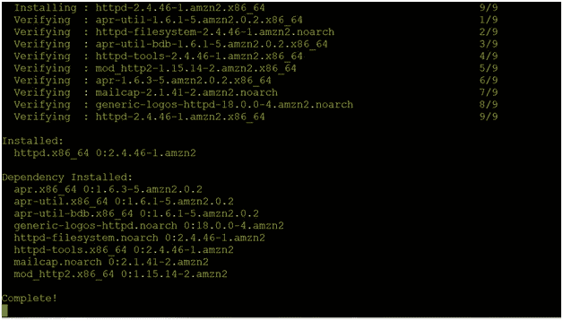

ansi ble developers-a " sudo yum remove httpd-y "
或
ansi ble developers-ba " yum remove httpd-y "

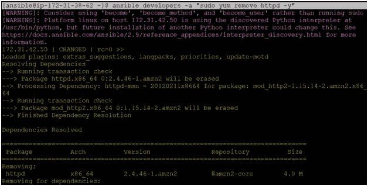

# 可转换模块:

Ansible 附带了几个模块(称为“模块库”)，可以直接在远程主机上执行，也可以通过“剧本”执行。此外，模块库可以驻留在任何机器上，不需要服务器、守护程序或数据库。
Ansible 模块存储在一个库存文件中，默认位置是/etc/ansible/hosts
幂等性可以由模块实现。

**可转换模块的命令:**

ansi ble-b-m yum-a " pkg = httpd state = present "
//卸载状态=缺席，更新状态=最新，启动服务状态=已启动

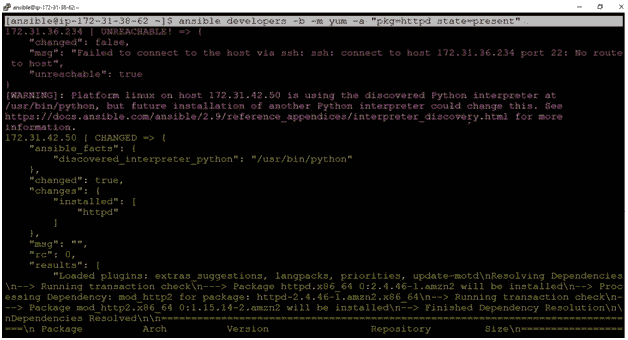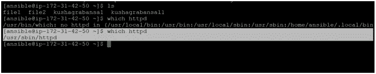

如果再次运行该命令:

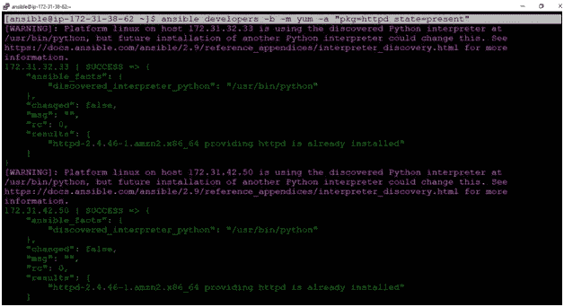

ansi ble developers-b-m user-a " name = kush "
//创建一个名为 Kush 的用户

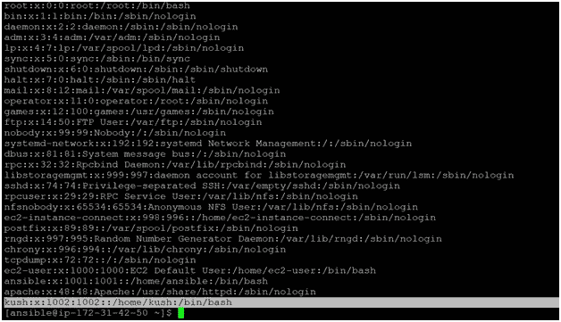

ansi ble-b-m user-a " name = Kush state = absent "
//删除用户

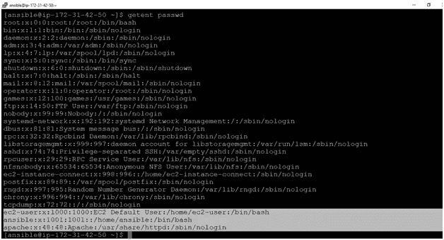

ansi ble-b-m copy-a " src = file . txt dest =/tmp "
//将文件从服务器复制到组中的节点

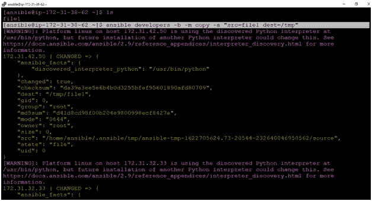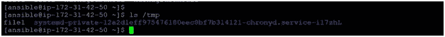

可以通过模块即设置模块来实现

ansi ble developers-m setup
//检查节点的所有当前配置

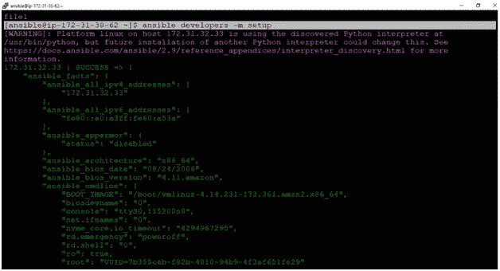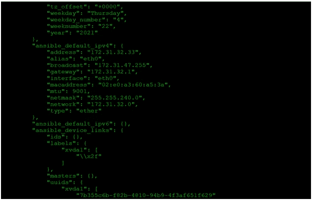

ansi ble developers-m setup-a " filter =*ipv4*"//检查与 IP v4 相关的配置

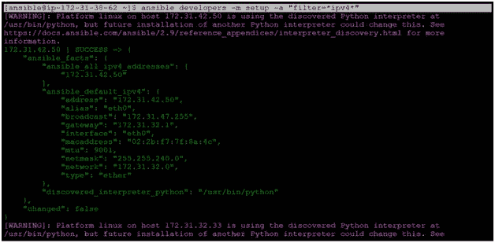