# Ansible 动态加载操作系统特定的变量文件

> 原文：<https://medium.com/nerd-for-tech/ansible-dynamically-load-operating-system-specific-variable-file-95683b5c6efc?source=collection_archive---------11----------------------->

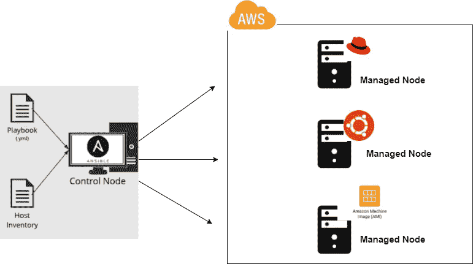

在这篇博客中，我将演示我如何创建一个可行的剧本*，它将* ***动态加载与被管理节点的操作系统同名的变量文件，并且仅仅通过使用变量名我们就可以配置我们的被管理节点。***

# 可行的目录结构。

下面是我的 ansible 工作空间的目录结构:

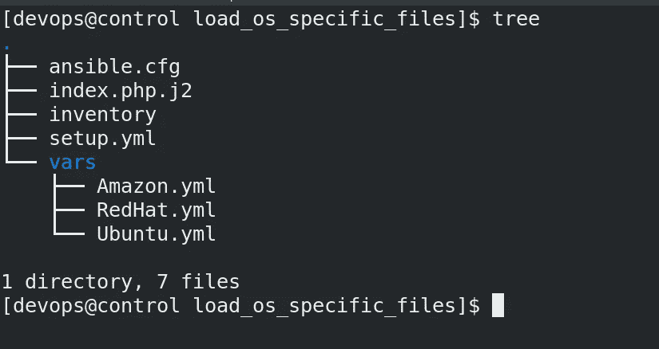

可行的配置文件:

**$ vim ansible.cfg**

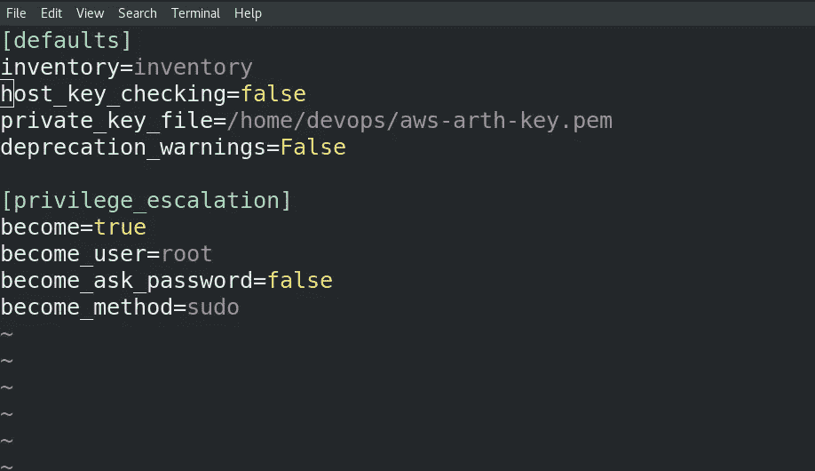

在这个演示中，我使用 AWS cloud 启动了 3 个托管节点，它们具有 3 个不同的操作系统向导:

1.  Redhat Linux 8
2.  Ubuntu 20.04
3.  亚马逊 Linux 2

可行的库存文件:

**$ vim 库存**

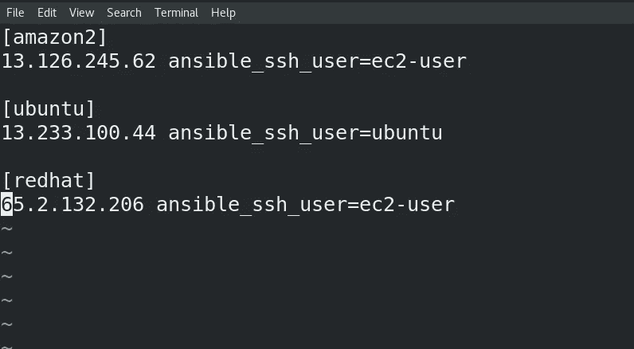

让我们检查每个受管节点上的可回答事实:

**$ ansible -m 安装 amazon2 | grep 发行版**

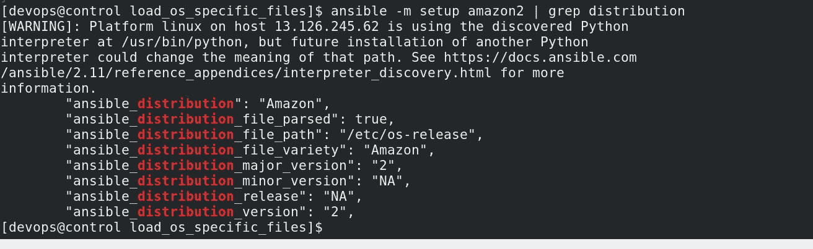

**$ ansible -m 安装 ubuntu| grep 发行版**

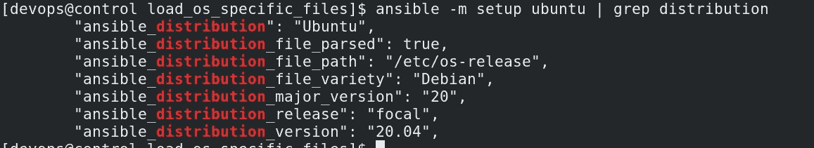

**$ ansible -m 安装 redhat| grep 分发**

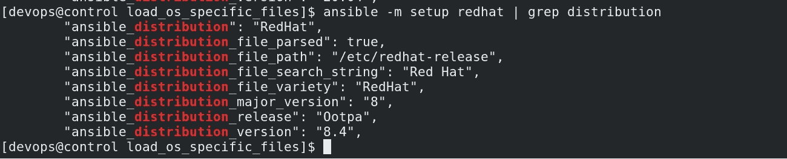

下一步是创建**变量文件**，其名称与我们将在剧本中使用的变量分布相同。

**$ vim vars/Redhat.yml**

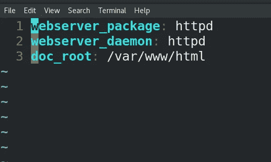

**$ vim vars/Ubuntu.yml**

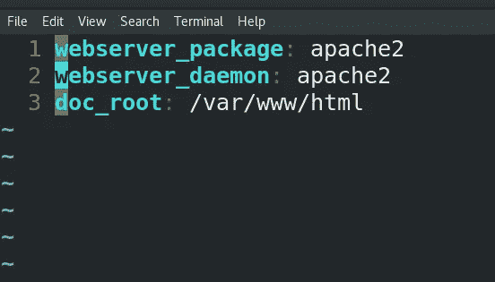

**$ vim vars/Amazon.yml**

最后一步是创建一个**剧本**并运行剧本。在行动手册中，我们可以使用 vars_file 关键字和 ansible 事实来导入特定于操作系统的文件。

**$ vim setup.yml**

**$ ansi ble-playbook setup . yml**

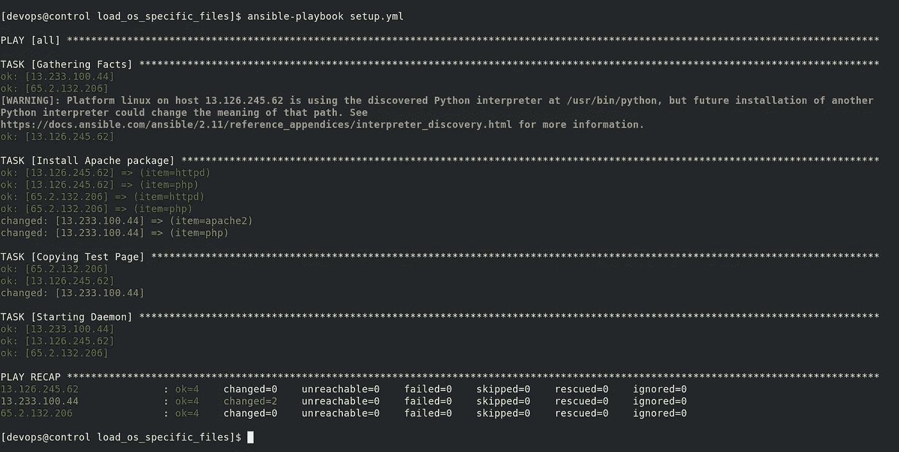

让我们在浏览器上查看网页。

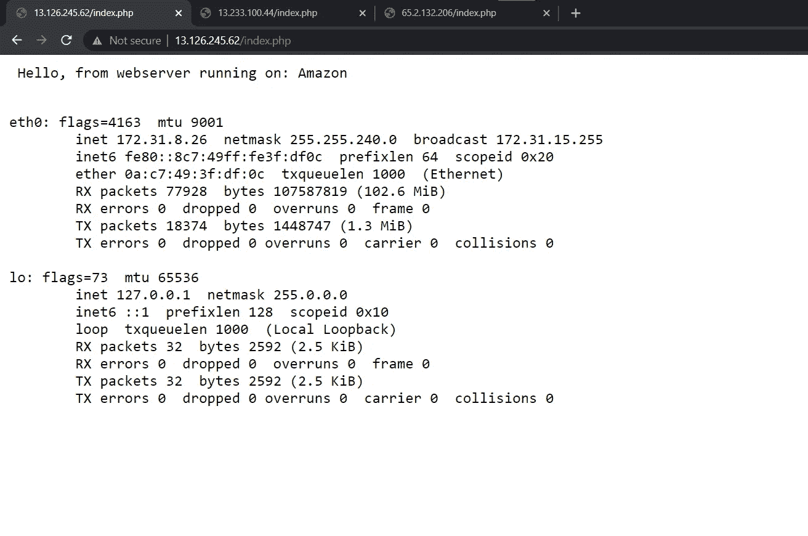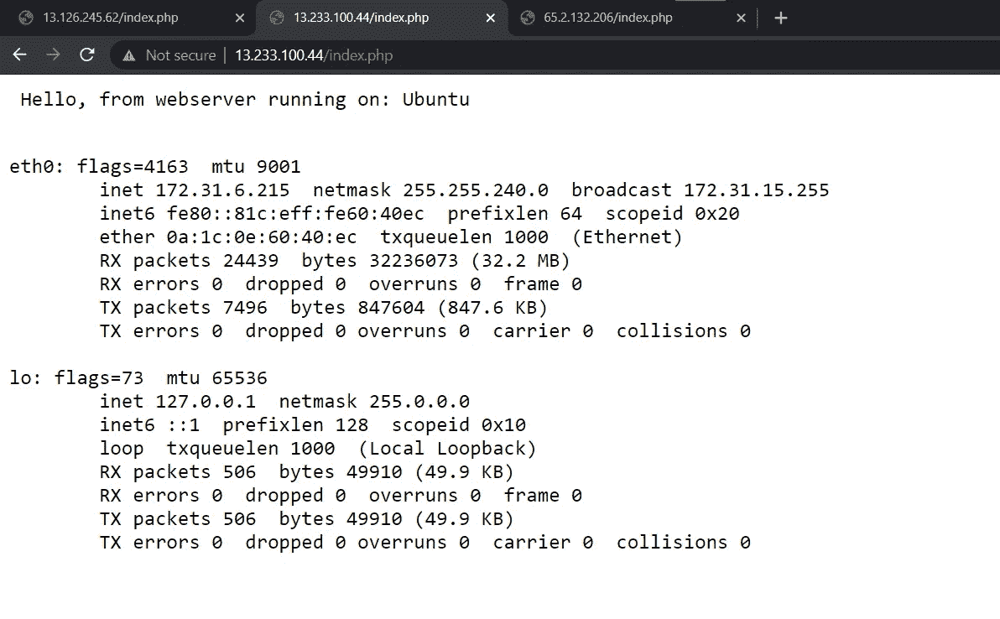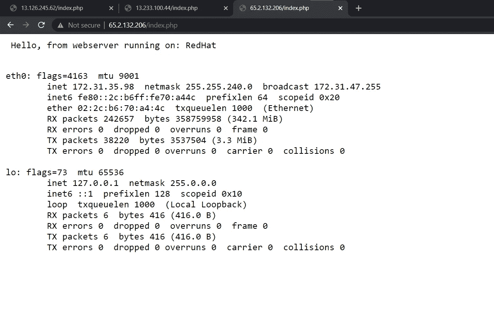

***瞧，我们已经成功地创建了一个剧本，它动态地加载了与被管理节点的操作系统同名的变量文件，只需使用变量名，我们就可以配置我们的被管理节点。***

**GitHub:**[https://GitHub . com/mtabishk/ansi ble-playbooks/tree/main/load _ OS _ specific _ files](https://github.com/mtabishk/ansible-playbooks/tree/main/load_os_specific_files)

**这篇文章就到这里，希望你能从这里学到一些东西。**

## 谢谢大家的阅读。我很快会带一些新文章回来，谢谢！

穆罕默德·塔比什·坎戴

领英:[https://www.linkedin.com/in/mtabishk/](https://www.linkedin.com/in/mtabishk/)