# 可翻译的剧本|循环|处理程序

> 原文：<https://medium.com/nerd-for-tech/ansible-playbooks-loops-handlers-6abeca0bcac9?source=collection_archive---------18----------------------->


**先决条件:**

[](/nerd-for-tech/ansible-ad-hoc-modules-host-patterns-52c156405145) [## 可变-专用|模块|主机模式

### 先决条件:

medium.com](/nerd-for-tech/ansible-ad-hoc-modules-host-patterns-52c156405145) 

Ansible 的剧本是用 YAML 格式写的。它是一种人类可读的数据序列化语言，用于配置文件。
在剧本中，我们可以编写由 Var、任务、处理程序、文件、模板和角色组成的代码。
每个行动手册由列表中的一个或多个模块组成。

剧本被分成多个部分，例如:
**目标部分:**定义主机代理。
**变量部分:**定义变量
**任务部分:**我们要按顺序运行的模块列表

让我们创建一个行动手册:

A.转到 Ansible 服务器并执行下面的命令。

> *vi target.yml*

**代码:**

```
---# Target Playbook
- hosts: developers
- user: ansible
- become: yes
- connection: ssh
- gather_facts: yes
```

要执行本行动手册，请使用以下命令:

> *ansi ble-playbook<name-of-script . yml>*
> 
> *ansi ble-playbook kushtarget . yml*

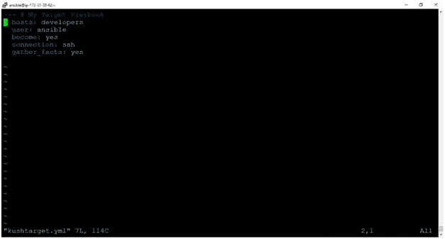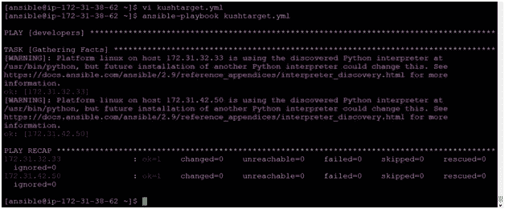

B.

> *vi kushTask.yml*
> 
> *ansi ble-playbook kushtask . yml*

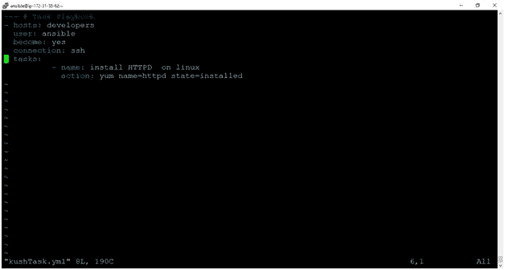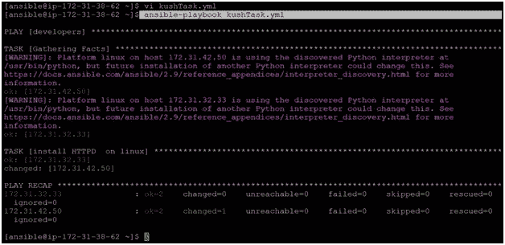

**节点输出:**

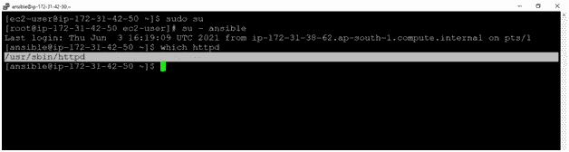

# 变量:

它用于遍历一组给定值。变量是在任务之前定义的，以便我们以后使用。

> *ansi ble-playbook vars . yml*

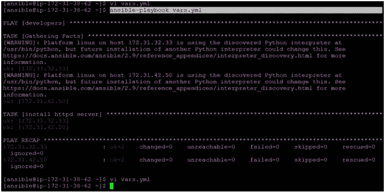

# 处理程序部分:

处理程序与任务相同，但是它们在被另一个任务调用时执行。该任务包含一个名为 notify 的命令，该命令指示在当前任务执行之后，另一个任务准备好被执行。

首先，从节点中删除 httpd 服务器

> *sudo yum 删除 httpd*

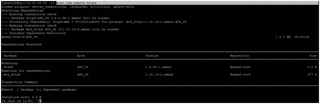

第二，用于处理程序的脚本:

> *vi handlers.yml*

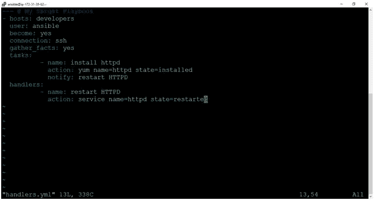

试运行:这意味着我们可以在不执行脚本的情况下检查我们的脚本。

> *ansi ble-playbook handlers . yml-check*

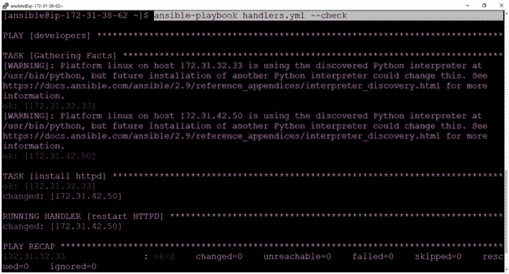

现在运行剧本，但不进行预演:

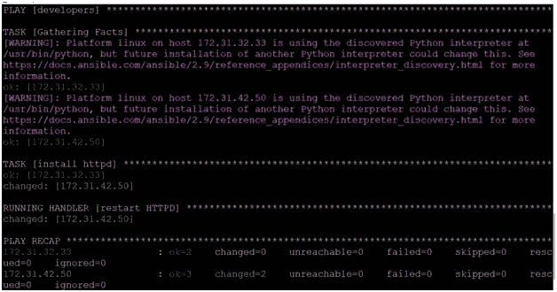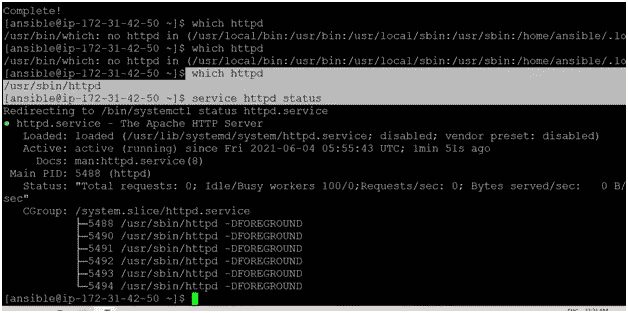

# 循环部分:

众所周知，循环意味着多次重复一项任务。Ansible 循环包括使用文件模块更改几个文件或目录的所有权，使用用户模块创建多个用户，以及重复轮询步骤，直到达到某个结果。

命令:

> *ansi ble-playbook loop . yml*

**脚本:**

```
--- # My loop Playbook
- hosts: developers
  user: ansible
  become: yes
  connection: ssh
  gather_facts: yes
  tasks:
          - name: add a list of user
            user: name='{{item}}' state=present
            with_items:
                    - kushagra
                    - shivani
                    - devashish
                    - abhishek
```

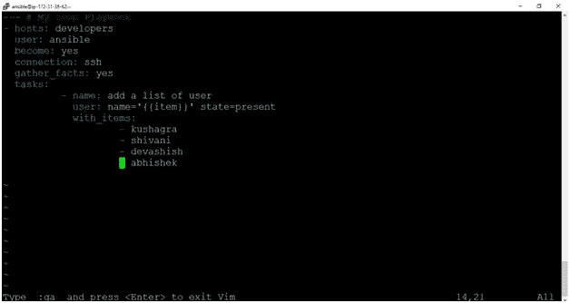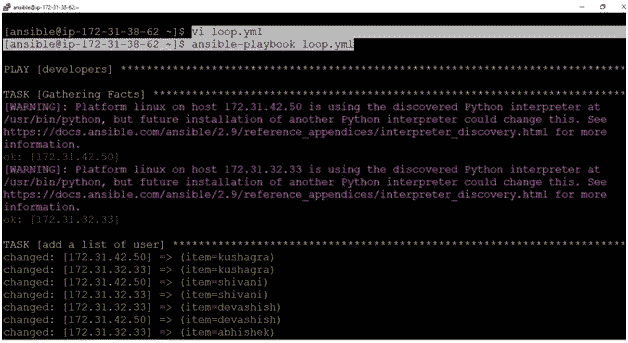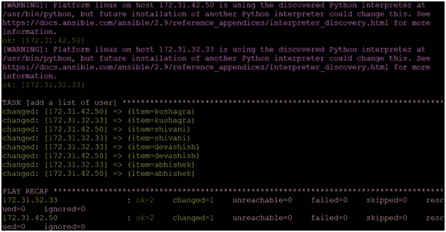

**节点输出:**

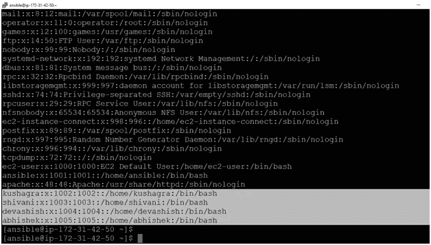

[https://bansalkushagra.medium.com/](https://bansalkushagra.medium.com/)