# web 服务器和负载平衡器的角色

> 原文：<https://medium.com/nerd-for-tech/ansible-roles-for-webserver-and-loadbalancer-f85215073ffa?source=collection_archive---------17----------------------->

在 **这篇博客中，我将创建两个角色:一个是 web 服务器，另一个是负载均衡器。我将为网络服务器使用“HTTPD ”,为负载平衡器使用“HAproxy”。**

在继续之前，让我们了解一些常用术语。

# 什么是 Ansible？

*Ansible 是一个自动化工具，也是一个开源产品，归 REDHAT 所有。我们将 Ansible 用于 IT 任务，如应用程序部署、配置管理、供应、基础架构协调等。*

无论你走到哪里，自动化都是其他行业最重要的元素之一。我们想尽可能地减少手工过程，这样会节省很多时间。

# 什么是可回答的角色？

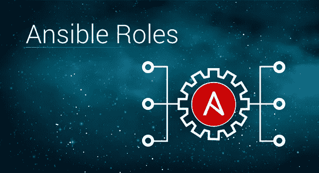

**Ansible role 是一个独立的组件，允许重用常用的配置步骤。**剧本中必须使用一个可行的角色。可承担的角色是一组任务，用于配置主机以满足特定目的，如配置服务。使用具有预定义目录结构的 YAML 文件来定义角色。

*现在问题来了，如何创建一个可行的角色？当一个 Ansible 角色被创建时，它包含上面的目录:
默认值，变量，任务，文件，模板，元，处理程序。*

只需一个命令就可以创建整个层次结构:

> **ansible-galaxy 角色初始化[角色名称]**

因此，让我们首先创建所需的角色:

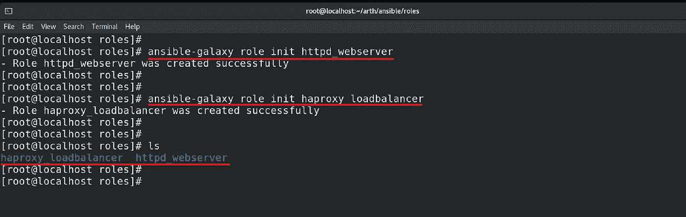

在每个角色中，我们都有一个“任务”目录，其中有一个“main.yml”文件。配置任务只能写在这个文件中。

让我们为 web 服务器配置创建任务:

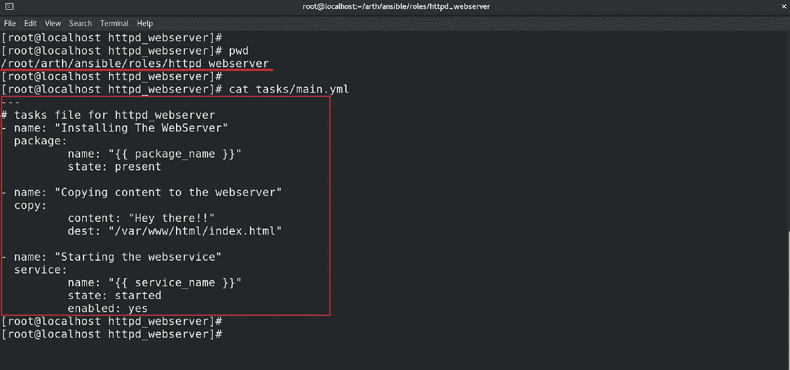

这里，我在 main.yml 文件中使用了两个变量。您可能会奇怪，我没有在任务本身中定义这些变量，那么这些变量来自哪里呢？

***所以,‘vars’目录下有一个特殊的 main.yml 文件，我们可以在其中定义变量，并在任务中的任何地方使用它们，它们将被自动导入。这是可转换角色的最佳特性之一。***

这是我定义变量的文件:

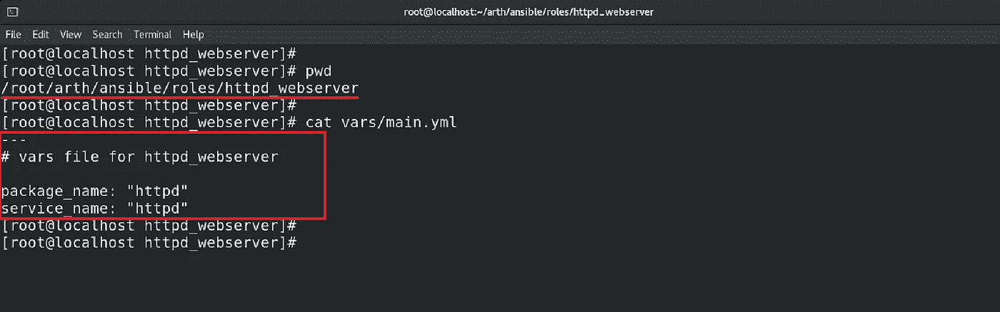

现在，让我们为负载平衡器创建一个角色。

过程是相同的，所有的任务都要在任务目录下的 main.yml 文件中定义。

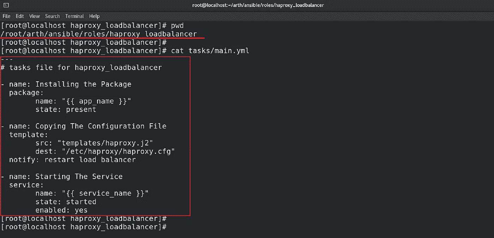

**在这里，我使用了一个‘notify’关键字，每当配置文件有变化时，我们需要重启负载均衡器的服务，这个关键字也会做同样的事情。**
为此，我们必须在 handlers 目录下的 main.yml 文件中配置一个处理程序:

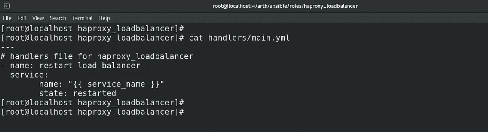

定义变量的文件:

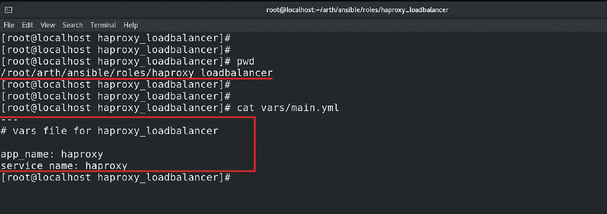

***在任务中，我已经为 HAproxy 的配置文件使用了一个模板文件。在 Ansible Role 中，模板是在 templated 目录下定义的。***

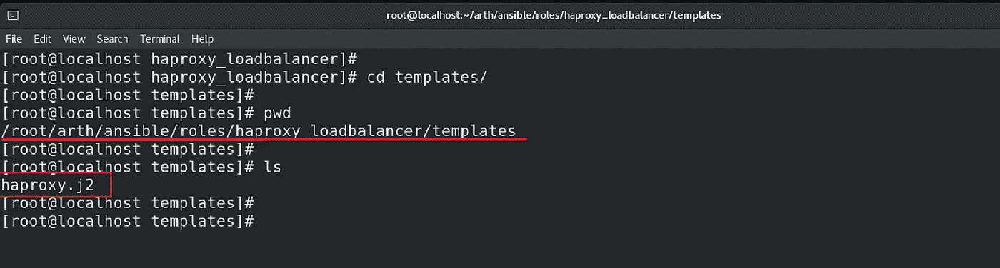

## 整个代码，包括角色、剧本等，都可以在上面的 GitHub 链接中找到:

 [## shhubhamm/ansi ble-web server-and-load balancer-roles

### 通过在 GitHub 上创建一个帐户，为 shhubhamm/ansi ble-web server-and-load balancer-roles 开发做出贡献。

github.com](https://github.com/shhubhamm/ansible-webserver-and-loadbalancer-roles.git) 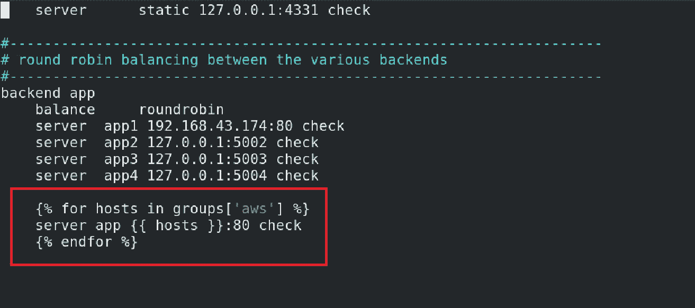

**在配置文件的末尾，我添加了这 3 行 Jinja 代码，这些代码将进入清单，从一个名为“aws”(我将在下一步中创建)的组中检索所有节点，然后它将这些节点作为后端服务器添加到负载平衡器中。**

现在，这两个角色都已成功创建和配置。现在，是使用它们的时候了。

为了简单起见，我将在 AWS cloud 上创建实例，并使用它们来配置服务器。

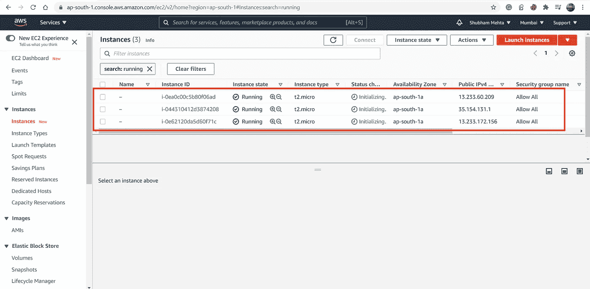

***我已经在 AWS cloud 上启动了上述 3 个实例，我将其中一个配置为负载平衡器，其余的配置为 web 服务器(后端服务器)。
首先，我将只在 Ansible 的清单中添加一个 webserver 实例，然后我将添加第二个。你可能会想，我为什么要这么做？原因是，通过这样做，您将会看到，下一次当我添加另一个实例时，负载平衡器将自动找到该实例，并将 web 服务器注册为其后端。我们不必进入负载平衡器的配置文件来手动添加后端节点。这就是自动化的力量，每次运行行动手册时，如果它发现任何新实例，就会自动配置整个设置。***

所以现在让我们实现上面的设置。在清单中，我在“aws”命名组下添加了 web 服务器，在“load”命名组下添加了负载平衡器。以下是 Ansible 的清单和配置文件:

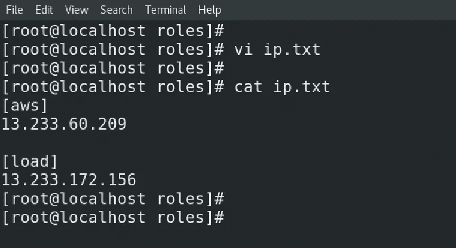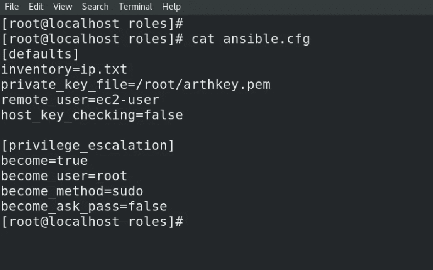

这是我通过整合我刚刚创建的两个角色而创建的剧本:

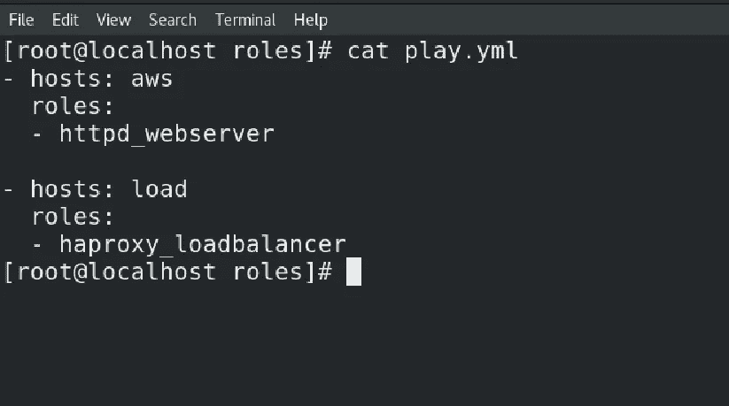

现在，是时候执行剧本了:

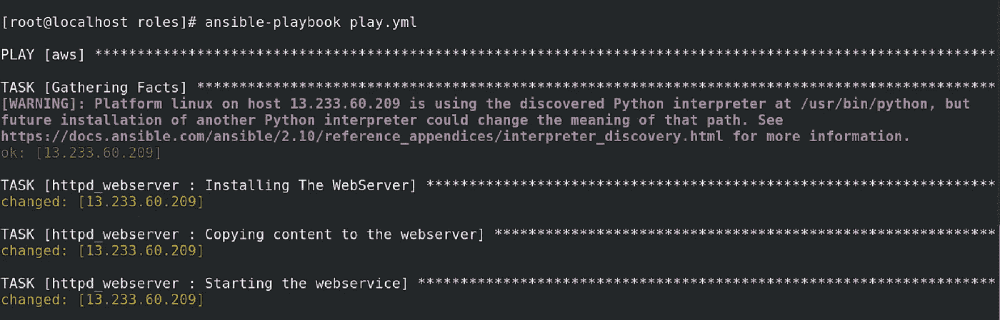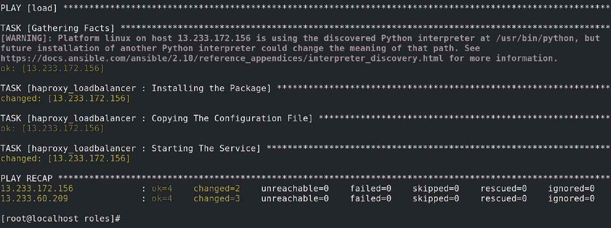

## **剧本处决了 successfully✨**

这是输出。我们连接了负载平衡器 IP，并获得了后端服务器的内容:

现在，让我们做一些额外的事情。让我们再添加一个后端，看看 Ansible 是否能够配置和注册它。

更新的库存:

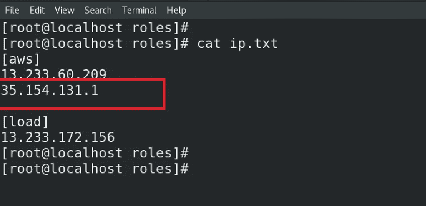

这一次行动手册也是成功的，这意味着新的 web 服务器也注册为动态后端服务器。

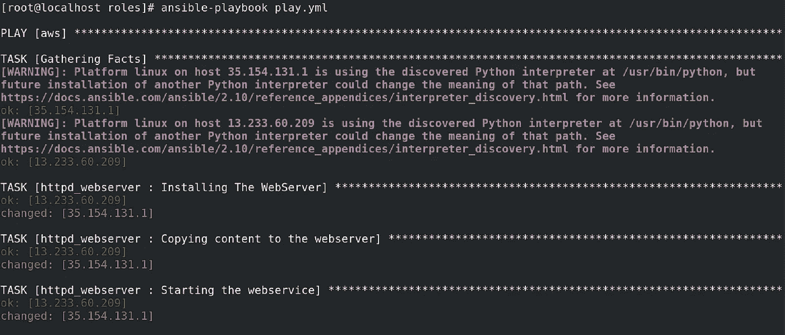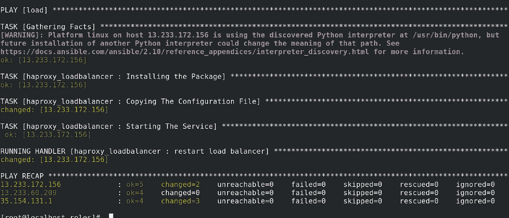

## 你也可以在 Ansible Galaxy 上找到这两个角色:

## [https://galaxy.ansible.com/shhubhamm/httpd_webserver](https://galaxy.ansible.com/shhubhamm/httpd_webserver)

## [https://galaxy.ansible.com/shhubhamm/haproxy_loadbalancer](https://galaxy.ansible.com/shhubhamm/haproxy_loadbalancer)

**所以，这就是我的博客。下一集，我们将看到更多精彩内容。**

## 谢谢你的阅读😊

 [## Shubham Mehta - S.K.M.U Dumka -印度| LinkedIn

### ✨:我是一个积极的学习者，喜欢以一种敢做的心态挑战每一个问题，以便将任何想法变成现实

www.linkedin.com](https://www.linkedin.com/in/shubham-mehta-b09335188/)