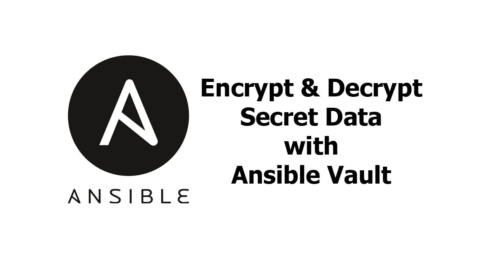
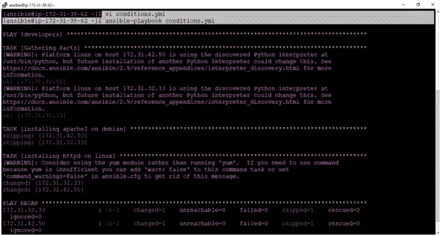
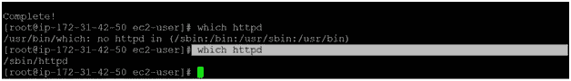
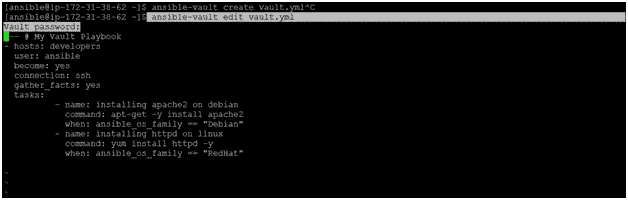
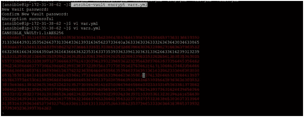
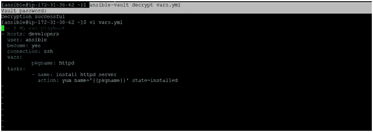
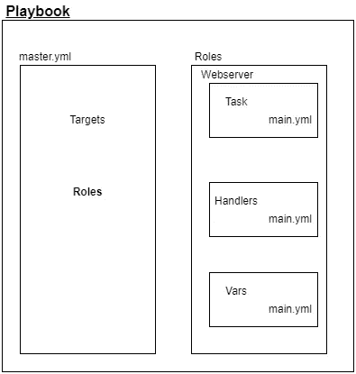
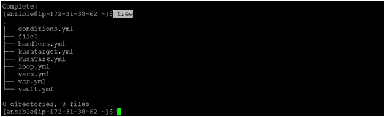
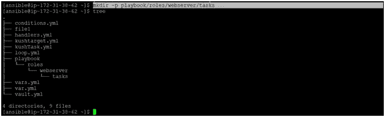
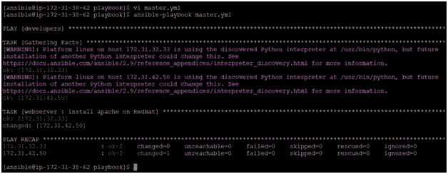

# 可变保险库|角色|条件

> 原文：<https://medium.com/nerd-for-tech/ansible-vault-role-conditions-c8bf0806b772?source=collection_archive---------33----------------------->



先决条件:

[](/nerd-for-tech/ansible-playbooks-loops-handlers-6abeca0bcac9) [## 可翻译的剧本|循环|处理程序

### 先决条件:

medium.com](/nerd-for-tech/ansible-playbooks-loops-handlers-6abeca0bcac9) 

# 条件:

条件意味着处理不同的场景，执行这些条件需要不同的条件。

在 YAML 脚本中，我们使用“when”命令来给出条件。

让我们举一个脚本的例子:

脚本:

```
--- # My Condition Playbook
- hosts: developers
  user: ansible
  become: yes
  connection: ssh
  gather_facts: yes
  tasks:
          - name: installing apache2 on debian
            command: apt-get -y install apache2
            when: ansible_os_family == "Debian"
          - name: installing httpd on linux
            command: yum install httpd -y
            when: ansible_os_family == "RedHat"
```

**命令:**

> *vi conditions.yml //写上面的 YAML 剧本*
> 
> *ansi ble-playbook conditions . yml*



**节点 1 输出:**


# 可旋转保险库= >

它以加密的方式保存剧本等敏感数据。

> *ansi ble-vault create vault . yml//以加密模式创建脚本*
> 
> *ansible-vault 编辑 vault.yml //在现有加密脚本中编辑*



使用 VI 编辑器编辑加密文件

> *vault.yml //脚本输出将处于加密模式*

将现有脚本添加到 ansi ble-vault[即在加密模式下]

> *ansible-vault 加密<文件名. yml>*
> 
> *ansible-vault 加密 target.yml*



解密 YAML 脚本 ansible-vault 解密 target.yml



# 可变角色= >

我们可以使用两种技术来重用一组任务:包含和角色。
角色更适合组织任务和封装完成这些任务所需的数据。

**角色类型:**

*   默认
*   文件
*   经理人
*   元
*   模板
*   任务
*   变量

在角色中，行动手册可以组织在一个目录结构中。
角色很重要，因为给任何文件/脚本添加越来越多的功能会使其处理起来更加复杂。

**角色类型:**
**默认:**存储角色/应用默认变量的数据。示例:端口号。
**文件:**包含需要转移到远程虚拟机
**处理程序的文件:**由另一个任务触发。它们也是一项任务。
**Meta:** 该目录包含建立角色依赖关系的文件。例如:作者姓名、支持的平台等等。
**任务:**包含行动手册中出现的所有任务。
**Vars:** 存储在该目录中的变量，可进一步用于配置



让我们了解一下角色的结构。
这里剧本是目录，master.yml 和 roles 是剧本目录里面的文件和目录。
目标[主机名、连接类型、用户名]和角色在 master.yml 中定义，角色信息存储在角色目录中。master.yml 和 roles 处于同一级别，或者说存在于同一目录中。
在角色中，不同的流程，如任务、处理程序、变量等等，被逐一执行。

在 Linux 机器上呈现树结构:



让我们根据 YAML 剧本创建一个角色并运行它。
创建父目录是指目录内部的目录。-p '标志用于执行此类任务。

> *mkdir -p 剧本/角色/网络服务器/任务*



在 tasks 目录中创建一个 main.yml 文件，并在 roles 目录的同一级别创建 master.yml 文件。

**命令:**

> *cd 剧本*
> 
> *轻触 roles/web server/tasks/main . yml*
> 
> *触摸 master.yml*


在剧本目录中创建 master.yml 与角色目录处于同一级别。

**master . yml 的脚本:**

```
--- # The master script
- hosts: developers
  user: ansible
  become: yes
  connection: ssh
  roles:
          - webserver
```

现在我们已经定义了一个角色名 webserver。让我们在这个角色中创建一个流程/任务。

> *VI roles/web server/tasks/main . yml*

**main . yml 的脚本:**

```
- name: install apache on RedHat
  yum: pkg=httpd state=latest
```

> *ansi ble-playbook master . yml*



[https://bansalkushagra.medium.com/](https://bansalkushagra.medium.com/)