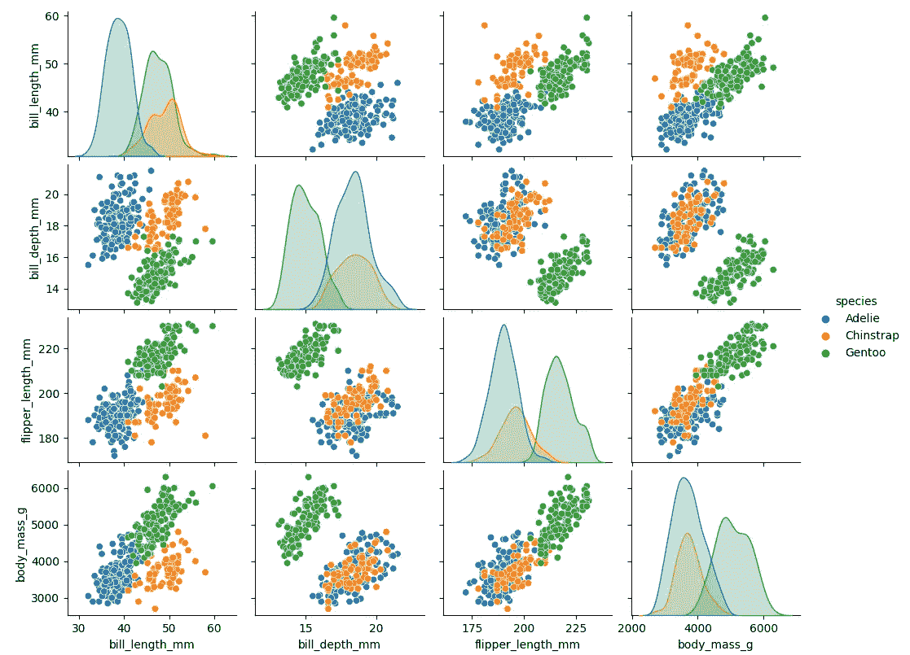
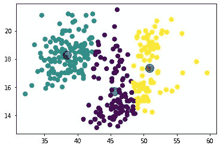
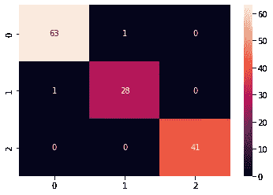
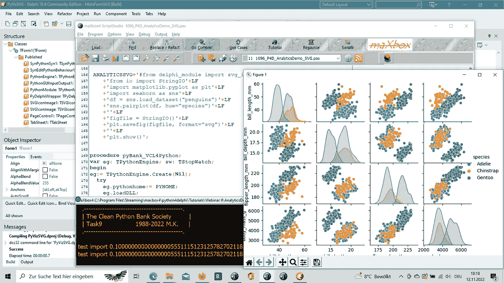

# 南极洲学习

> 原文：<https://medium.com/nerd-for-tech/antarctica-learning-d978f4c374a1?source=collection_archive---------1----------------------->

**一堂机器学习课**

帕尔默群岛(南极洲)企鹅数据集似乎是 Iris 数据集的替代品。这是一个很好的数据探索和可视化介绍数据集。但是企鹅数据集对每个物种都有不同数量的样本。可以观察到，与 Iris 数据集不同，该数据包含每个物种的不同数量的条目。

什么是库尔曼？喙或喙的上缘被称为喙部，测量是使用卡尺进行的，一个下颚位于上颚的顶端，另一个位于头骨的基部或第一片羽毛，这取决于所选择的标准。

# 数据探索

```
import numpy as np
import pandas as pd
from io import StringIO
import matplotlib.pyplot as plt
import seaborn as sns
df = sns.load_dataset("penguins")
sns.pairplot(df, hue="species")
figfile = StringIO()
plt.savefig(figfile, format="svg")
plt.show()
print(df.info())
```



1096 _ 图 _ 1 _ 物种 2.png

散点图(也称为散点图)使用点来表示两个不同数值变量的值。横轴和纵轴上每个点的位置表示单个
数据点的值。散点图用于观察变量之间的关系。
基本散点图的常见修改是增加第三个变量。第三个变量的值可以通过修改点的绘制方式进行编码。对于表示
分类值的第三个变量(如地理区域或性别)，最常见的编码是通过点颜色。
Seaborn 允许您使用 relplot()函数创建关系图。从技术上来说，该功能不仅可以创建散点图。

```
RangeIndex: 344 entries, 0 to 343
Data columns (total 7 columns):
 #   Column             Non-Null Count  Dtype  
---  ------             --------------  -----  
 0   species            344 non-null    object 
 1   island             344 non-null    object 
 2   bill_length_mm     342 non-null    float64
 3   bill_depth_mm      342 non-null    float64
 4   flipper_length_mm  342 non-null    float64
 5   body_mass_g        342 non-null    float64
 6   sex                333 non-null    object 
dtypes: float64(4), object(3)
memory usage: 18.9+ KB
None
```

```
pip install seaborn
```

或者替代数据探索

```
#Or alternate
#df = pd.read_csv('../input/palmer-archipelago-antarctica-penguin-
#data/penguins_size.csv')
p2data = "https://raw.githubusercontent.com/allisonhorst/palmerpenguins/master/data-raw/penguins_raw.csv
p2data =  https://raw.githubusercontent.com/rianrajagede/penguin-python/master/Datasets/penguins.csv
df.head()
```

> 种岛喙 _ 长度 _ 毫米喙 _ 深度 _ 毫米鳍状肢 _ 长度 _ 毫米身体 _ 质量 _g 性别 0 阿德利·托格森 39.1 18.7 181.0 3750.0 雄性 1 阿德利·托格森 39.5 17.4 186.0 3800.0 雌性 2 阿德利·托格森 40.3 18.0 195.0 3250.0 雌性 3 阿德利·托格森楠楠楠楠楠楠 4 阿德利·托格森 36.7 19

因此，数据集由 7 列组成:

物种:企鹅物种(下颚带企鹅、阿德利企鹅或巴布亚企鹅)

库尔曼长度毫米

船体深度(毫米)

脚蹼长度毫米:脚蹼长度(毫米)

身体质量 g:身体质量(g)

岛屿:帕尔默群岛(南极洲)中的岛屿名称(Dream、Torgersen 或 Biscoe)

性爱:企鹅性爱

# 预处理

我们必须对数据进行预处理，否则会得到一个异常:ValueError:输入包含 NaN、infinity 或对 dtype('float64 ')来说太大的值。因此，我们清除这些 NaN，并且我们还可以删除一个目标列:

```
print(df.isnull().sum())
df = df.dropna()
# df = df.drop(df[df['species'] == 'Gentoo'].index)
```

```
species               0
island                0
bill_length_mm        2
bill_depth_mm         2
flipper_length_mm     2
body_mass_g           2
sex                  11
dtype: int64
```

Pandas as **df** 是一个流行的 Python 库，用于操作表格数据。它提供了一个通用的 **dataframe** 对象，可以从许多流行的格式中读取数据，比如 Excel、SQL、CSV 等等。
熊猫风格

**进口熊猫作为 pd**

data = {
"卡路里":[420，380，390]，
"持续时间":[50，40，45]
}
#将数据加载到 DataFrame 对象:
df = pd。数据帧(数据)
打印(df)

# 串

为了更好地理解，我们希望对数据进行聚类。“协方差”表示变量之间线性关系的方向。另一方面，“相关性”衡量两个变量之间线性关系的强度和方向。

```
from sklearn.cluster import KMeans
print("CLUSTERING ON CULMEN LENGTH AND CULMEN DEPTH")
X = df[["bill_length_mm","bill_depth_mm"]]
kmeans = KMeans(n_clusters=3)
kmeans.fit(X)
y_kmeans = kmeans.predict(X)
plt.scatter(X.loc[:,"bill_length_mm"],X.loc[:,"bill_depth_mm"],c=y_kmeans,s=50,cmap="viridis")
centers = kmeans.cluster_centers_
plt.scatter(centers[:, 0], centers[:, 1], c="black", s=200, alpha=0.5)
plt.show()
```



1096 _ Figure _ 1 _ species 2 cluster . png

聚类图是从**导入 matplotlib.pyplot 作为 plt** 。pip 的基本调用将安装 seaborn，如果需要的话，还会安装它的强制依赖项。可以包含一些可选的依赖项来访问一些高级特性:
pip install seaborn[stats]。Numpy 数组是 python 列表的良好替代品。它们比 python 列表更好。它们提供更快的速度，占用更少的内存空间。对于不了解 numpy 数组的人，让我们从它的定义开始。它们是多维矩阵或具有相似元素的固定大小的列表。

# 分类

seaborn 开始处的散点图(配对图)向我们展示了与其他特征的相关性。这种方法有助于找出在我们的模型中对分类影响最大的重要特征。现在，我将“物种”设置为目标变量 **y** ，并将 3 个特征设置为 **X** 来对物种进行分类:

```
X = df[["bill_length_mm", "bill_depth_mm","flipper_length_mm"]]
y = df["species"]
print(X.shape)
print(y.shape)
```

```
(333, 3)
(333,)
```

当你听到“贝叶斯”这个词时，你可能会想到朴素贝叶斯。然而，贝叶斯原理也可以用于执行回归。在本文中，我们将讨论和实现贝叶斯岭回归，它不同于常规岭回归。要了解更多关于常规岭回归，你可以点击这个链接。

该算法使用超参数来控制正则化强度，并在后验分布中对超参数进行完全积分，应用所选择的超先验，以便近似无信息。
Scikit-learn 的算法利用共轭先验，因此仅限于使用伽马先验，伽马先验要求四个超参数被任意选择为小值。此外，它需要参数αα和λλ的初始值，然后根据数据更新这些初始值。

因为丢失的值已经用 **dropna** 删除了，所以我们现在不需要担心这个问题，并准备好用一些预处理进行分类:

```
from sklearn import preprocessing
X = preprocessing.scale(X)

#splitting the data
from sklearn.model_selection import train_test_split
X_train,X_test,y_train,y_test = train_test_split(X,y,test_size=0.4,random_state=13)

# model fitting and prediction
from sklearn.linear_model import LogisticRegression
model = LogisticRegression().fit(X_train, y_train)
pred = model.predict(X_test)
print(pred[1:50])
```

使用数据集进行分析时，必须检查数据以确保它只包含有限的数字，不包含 NaN 值(不是数字)。如果试图将包含 nan 或 infinity 值的数据集传递给函数进行分析，将会引发错误:ValueError:输入包含 NaN、infinity 或对 dtype('float64 ')来说太大的值。

```
['Chinstrap' 'Adelie' 'Adelie' 'Gentoo' 'Gentoo' 'Adelie' 'Adelie'
 'Adelie' 'Adelie' 'Gentoo' 'Adelie' 'Adelie' 'Adelie' 'Chinstrap'
 'Gentoo' 'Chinstrap' 'Gentoo' 'Gentoo' 'Gentoo' 'Adelie' 'Adelie'
 'Adelie' 'Chinstrap' 'Gentoo' 'Chinstrap' 'Adelie' 'Adelie' 'Gentoo'
 'Chinstrap' 'Gentoo' 'Chinstrap' 'Adelie' 'Gentoo' 'Gentoo' 'Adelie'
 'Gentoo' 'Chinstrap' 'Adelie' 'Chinstrap' 'Adelie' 'Adelie' 'Gentoo'
 'Adelie' 'Adelie' 'Adelie' 'Gentoo' 'Adelie' 'Gentoo' 'Adelie']
```

# 标杆管理

我们有 333 (266)个样本，具有 3 个特征，可以用逻辑回归进行分类，但是性能有多好:

```
# checking performance of model

from sklearn.metrics import classification_report, confusion_matrix, roc_curve, roc_auc_score

print('CONFUSION MATRIX')
print(confusion_matrix(y_test, pred))
print('CLASSIFICATION REPORT\n')
print(classification_report(y_test, pred))

sns.heatmap(confusion_matrix(y_test, pred), annot=True)
plt.show()
```

```
CONFUSION MATRIX
[[63  1  0]
 [ 1 28  0]
 [ 0  0 41]]
CLASSIFICATION REPORT

              precision    recall  f1-score   support

      Adelie       0.98      0.98      0.98        64
   Chinstrap       0.97      0.97      0.97        29
      Gentoo       1.00      1.00      1.00        41

    accuracy                           0.99       134
   macro avg       0.98      0.98      0.98       134
weighted avg       0.99      0.99      0.99       134
```



1096 _ 图 _1_species2cmr.png

# 评价

评估分类器意味着测量预测类或标签与评估集中真实标签的匹配程度。在二元分类法中，我们通常把两类中较小的和较有趣的称为正类，把较大的/另一类称为负类。在医学诊断问题中，患有疾病的患者通常是阳性的，而其他人是阴性的。

巴布亚企鹅是矮脚企鹅属中的一个企鹅物种，与阿德利企鹅和帽带企鹅关系密切。正如我们所见，每只企鹅都来自以下三个物种之一:阿德利、
巴布亚企鹅和下颚带企鹅。参见上图(和下图),首先在配对图相关矩阵中描绘了三种不同的企鹅物种。但是 Gentoo 作为一个几乎清晰的区别是很容易恢复的。



1096 _ 2022–11–12 _ SVG _ Delphi _ maxbox _ seaborn 4 . png

在 Jupyter 笔记本上试试:

[](https://github.com/maxkleiner/Bayes_theorem/blob/master/clusterclass4penguins.ipynb) [## Bayes _ theory/cluster class 4 penguins . ipynb at master maxkleiner/Bayes _ theory

### 在 GitHub 上创建一个帐户，为 maxkleiner/Bayes_theorem 的开发做出贡献。

github.com](https://github.com/maxkleiner/Bayes_theorem/blob/master/clusterclass4penguins.ipynb)