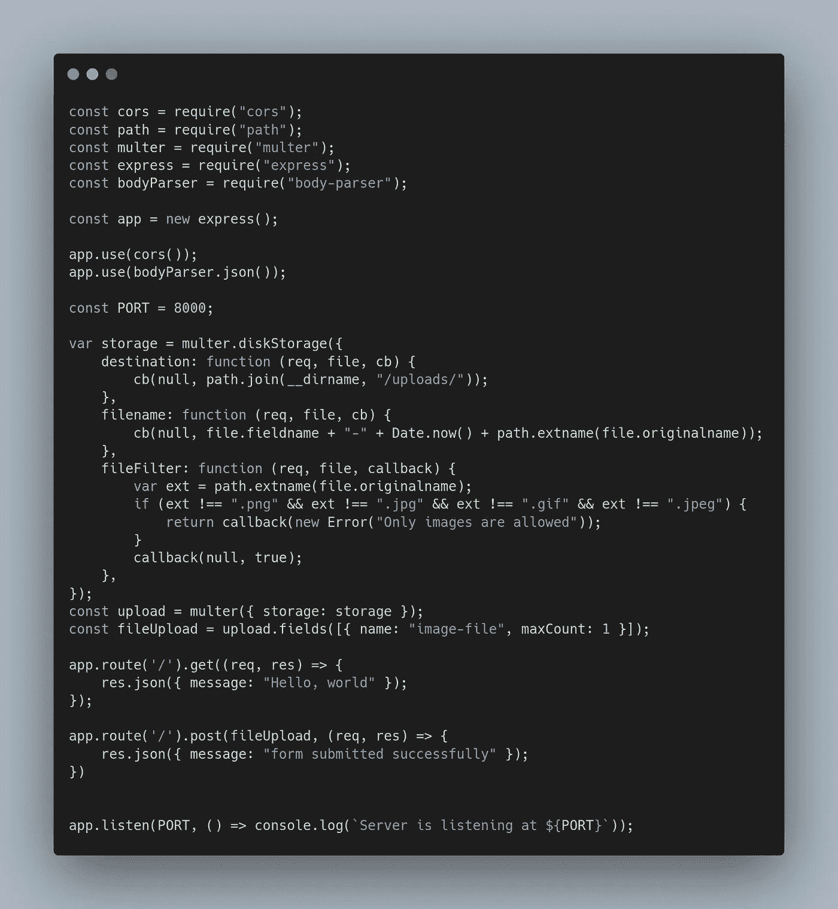
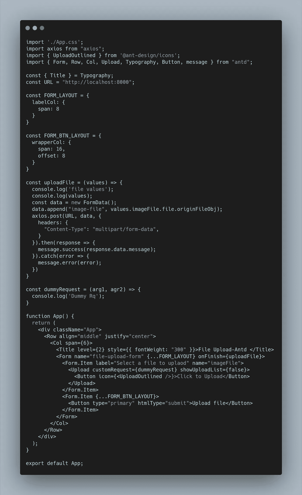
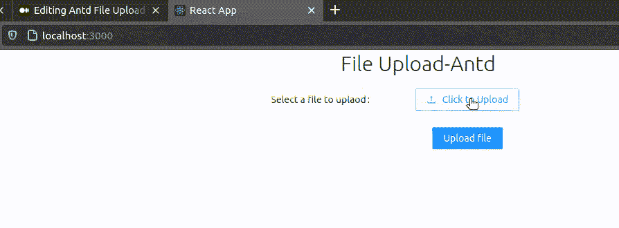

# 使用 Nodejs 和 Multer 上传文件

> 原文：<https://medium.com/nerd-for-tech/antd-file-upload-with-nodejs-multer-1621a0d4b607?source=collection_archive---------1----------------------->

最近，我开始做一些项目。为了构建这个项目，我在前端使用 React，在后端使用 NodeJs。为了创建 UI 组件，我使用了[和](https://ant.design/)。每个组件都是开箱即用的，然后我遇到了某个组件的问题。在这篇文章中，我将分享我是如何解决文件上传问题的。

在本文中，我假设您熟悉 Nodejs 和 Reactjs。我不会告诉它的基本知识。所以，如果你是新来的，我强烈建议你复习一下基础知识，然后再回到这里。

# 问题陈述/要求

先说要求。项目需要频繁上传多个文件(比如 15 个文件)。期望是向后端发出一个请求，同时传输所有文件。但是 antd 上传组件不是这样工作的。你一选择文件，它就开始上传图片。现在，这对于任何公司都可能是一个问题，如果我们假设一家公司正在处理 100 万的用户群，如果不到一半的人上传错误的文件，这将增加公司的额外成本。

# 让我们先构建服务器

正如我之前提到的，对于后端，我们使用 Nodejs。在上传文件的后端，我们使用了一个叫做 [Multer](https://www.npmjs.com/package/multer) 的模块。这是一个易于使用和高度可配置的模块。这是我们后端代码的样子:

后端代码

我会很快给你一个代码的概述，它到底做什么。

在前几行，我们正在导入模块。之后，我们正在初始化`app`。然后我们定义一些配置，例如`storage`、`file type checks`等等。你可以在更多的官方文档中找到所有这些配置。

配置后，我们正在定义一些路线。我们创建了两条路线。一个是返回 Hello，World 的`GET`调用，另一个是简单返回 success 的`POST`调用。在上传目录中保存文件将由 multer 模块自己处理，我们不需要做任何事情。

这都是关于我们的服务器。

# 让我们转到客户端——React 应用程序

如果你不熟悉 antd。建议你和 antd 玩一段时间。我相信你会喜欢它的，因为它会加快你的开发速度。

这是我们的前端 react 代码的样子，让我们试着部分地理解这段代码。

React Js 代码

# 上传文件功能

先说一下`uploadFile`函数。这个函数负责用文件对象向服务器发送 post 请求。如果服务器返回成功，它将显示一条消息，否则它将在控制台中打印一条错误消息。这里需要注意的一个重要部分是我们如何在`[**FormData**](https://developer.mozilla.org/en-US/docs/Web/API/FormData)`接口的帮助下创建我们的数据有效载荷，它的内容类型是`multipart/form-data`

文件多了怎么办？

然后，我们只需在发出请求之前将这些文件添加到`formdata`变量中。

# 让我们讨论一下应用程序组件

您可能知道，JSX 是 JavaScript 的语法扩展。JSX 产生了起反应的“元素”。在`App`函数中，我们正在创建一个有上传输入和提交按钮的表单。在这里，我们可以添加多个表单项来上传更多的文档。为了简化，我已经从上传元素中移除了所有其他属性，比如`props, beforeChange, onChange`等。

当用户提交表单时。它将调用上传文件函数并返回响应。

让我们在这里看看我们的现场演示！

React 应用

Nodejs 后端

这就是如何在 Antd 上处理上传，并与作为后端的节点进行交互。您还可以使用 React 对远程服务器和数据存储解决方案的 API 进行同样的操作。

# 仅此而已。