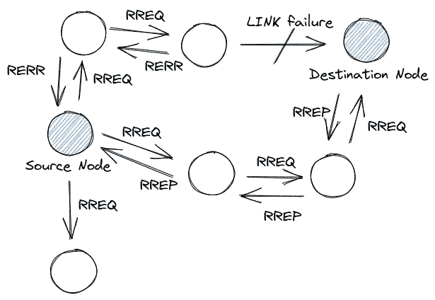
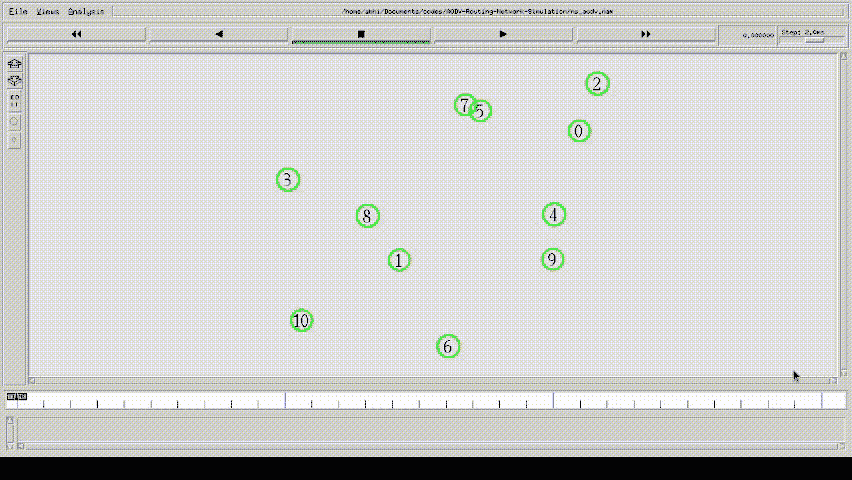

# AODV 路由协议网络仿真

> 原文：<https://medium.com/nerd-for-tech/aodv-routing-protocol-network-simulation-53f3a23918aa?source=collection_archive---------5----------------------->

**Ad-hoc 按需距离矢量路由协议**用于移动或无线 Ad-hoc 网络( **MANETs** 或 **WANETs** )。ad-hoc 网络是由两个或更多节点构建的临时分布式网络，用于传输数据包，而不需要典型的基础设施，如路由器和接入点。自组织网络中的节点遵循**对等网络(P2P)** 。 **AODV** 协议是由**诺基亚研究中心**、**加州大学**和**辛辛那提大学**联合开发的。

我做的^u^

可以用来模拟网络协议的模拟器有 **NS2** ， **NS3** ， **OMNeT++** ， **NetSim** 等多种。这里我用的是 **NS2** ，一个开源的事件驱动模拟器。 **NS2 是用 C++和 Otcl** 写的，**模拟还得用 tcl 脚本**写。NS2 是一个非常老的模拟器，开始于 1995 年，是 NS-1 的修订版。虽然我用的是 2011 年发布的 Ubuntu 20.04.1 的 2.35 版本，而且运行得很好，所以不用担心:)

**NS2** 执行 **TCL** 脚本，生成**跟踪文件**和**网络动画文件**。跟踪文件用于分析模拟，如吞吐量、能耗。**网络动画文件**由 **Nam(版本 1.15)** 执行，它将模拟制作成动画。

节点**使用 AODV** 定义的**消息发现路由**，分别是**路由请求- RREQ** 、**路由回复- RREP** 、**路由错误- RERR** 。发起节点向其所有邻居广播 **RREQ** 消息，拥有到目的节点的路由的节点沿反向路由向发起节点广播 **RREP** 消息。如果到发起节点的相邻节点没有到目的地的路由，则它依次广播 **RREQ** 消息，保持到发起节点的反向路由。如果一个节点失去了与它的下一跳节点目的地的连接，它向所有接收到 **RREP** 消息的节点广播 **RERR** 消息。

## 由 AODV 维护的路由表条目

*   目标 IP 地址
*   目标序列号
*   有效的目的地序号标志
*   其他状态和路由标志
*   网络接口
*   跳跃总数
*   下一跳
*   前体列表
*   一生

## 实现模拟

首先设置一些变量，这些变量稍后将用于节点配置。这里是一个非数字索引的数组。 **val(停止)**是模拟的结束时间。 **val(x)** ， **val(y)** 将用于定义地形。 **val(nn)** 表示使用的节点数。 **val(rp)** 包含路由协议的类型，在本例中是 **AODV** 。

**val(ifq)** 是优先考虑路由协议数据包的接口队列，而 **val(ifqlen)** 是队列的最大长度。 **val(ant)** 将天线类型定义为全向，这意味着它可以在所有方向上接收和发射。 **var(prop)** 被设置为 TwoRayGround，这是无线电传播期间的衰减模型(1/r⁴). **val(netif)** 包含网络接口的值。网络接口层充当硬件接口，由移动节点用来访问信道，并且它被设置为 **Phy/WirelessPhy** 。

第 1 行生成 **NS** 模拟器对象实例，并将其分配给变量 **ns** 。第 2 行创建一个空的跟踪文件 **ns_aodv.tr** ，并将其赋给变量 **tf** 。 **trace-all** 命令以特定格式跟踪所有事件。第 6 行创建 **NAM** 可视化文件 **ns_aodv.nam** 并将其分配给 **nf** 。第 7 行告诉模拟器以 **NAM** 格式记录轨迹。第 10 行将地形设置为平面网格。 **god 对象**存储从一个节点到另一个节点所需的最短跳数表。

上面用我们在开始时定义的变量配置了节点。其他一些参数如 **agentTrace** 在我们的例子中跟踪 UDP， **routerTrace** 跟踪路由中涉及的数据包， **macTrace** 跟踪 MAC 协议数据包， **movementTrace** 跟踪节点的运动。

这里，第一个循环分配节点的初始位置，第二个循环提供拓扑内节点的**随机移动**。

在上面的代码中，我们正在创建一个 **UDP** 的对象，并将其附加到我们的**节点 5 号**，这将是**发起节点**。此外，创建一个**接收器**并将其附加到**目的节点**、**2 号节点**。 **CBR(恒定比特率)**是我们的流量源，它将生成通过 **UDP** 发送的数据包。

第一个“for 循环”使用 nam 的初始位置**初始化所有节点，第二个“for 循环”在模拟结束时重置所有节点。**

使用关键字 **global** 是因为我们使用了在 **proc finish** (过程)范围之外声明的变量。 **flush-trace** 命令将所有轨迹保存到各自的文件中。模拟开始于 **$ns 运行**。

# 模拟

## 在 GitHub 上获得完整的代码、跟踪文件分析、模拟视频

 [## GitHub-abhinav-bhardwaj/AODV-路由-网络-模拟:自组织按需距离矢量路由…

### Ad-hoc 按需距离矢量路由协议 NS2 2.35(网络模拟器 2 版本 2.35) Nam 1.15(网络…

github.com](https://github.com/abhinav-bhardwaj/AODV-Routing-Network-Simulation) 

## [在 LinkedIn 上与我联系— Abhinav Dubey](https://www.linkedin.com/in/abhinav-dubey-007001/)