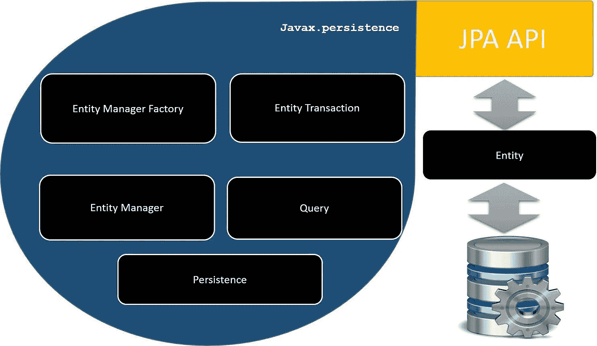

# Apache Camel:带有 JPA 的 CRUD

> 原文：<https://medium.com/nerd-for-tech/apache-camel-crud-with-jpa-fa9603430ff5?source=collection_archive---------0----------------------->

我们已经看到了关于阿帕奇骆驼的其他帖子，你可以在我的个人资料中看到。今天我们将看到如何用 JPA 进行数据库操作。

一如既往，我们将从配置开始。谈到依赖性，我们需要补充以下几点:

*   Apache Camel*Camel-jpa-starter*组件将允许我们使用 JPA 组件。
*   *hibernate-entitymanager* 库将允许我们使用 hibernate 注释。

我们必须记住一些关于 JPA 的基本知识。一个是将关系数据作为 Java 对象处理的质量。允许我们在 Java 类中管理数据库中的信息。这些类将被称为*实体*。另一个是 JPQL 的存在，一种允许我们对这些实体进行查询的语言。

多亏了 Spring boot 和 camel starter 库，我们不必做太多的配置工作，但是在 Java 类的层次上，我们必须添加一些注释:

[*@Entity*](http://twitter.com/Entity) 将允许我们指明它是一个要通过 JPA 管理的类。用 [*@Id*](http://twitter.com/Id) 我们将指出哪个是它的主键，用[*@ generated value*](http://twitter.com/GeneratedValue)我们将管理它的生成。在 *MySQL 的情况下，*它将是自动的。

在第一个例子中，我们将看到 *JPA* 组件与 *SQL* 组件非常相似。只是我们将使用 *JPQL* 并且我们必须指出哪个是我们将要执行查询的实体。

我们要做的第一件事是指出哪一个是我们要生成的实体。然后，如果我们要进行 JPQL 查询，我们必须添加' *query* '参数。

此外，在这个特定的例子中，我们希望通过表达式语言，基于作为请求参数的标识符获得一本书。为了实现这一点，我们将使用*到*的方法，而不是*到*。它将允许我们动态地路由流并解释表达式语言。

*JPA* 的另一个特性是 *namedQuery* ，它允许我们在类级别定义 *JPQL* 查询。在下面的例子中，我们将看到如何通过 *JPA* 组件使用 *namedQueries* 。要使用的查询是 *findAll* (我们以前见过这个声明)。

在第二个例子中，我们可以看到使用 *outType* 方法在输出端指示对象类型的区别。或者，如果我们愿意，我们可以通过 *JPA* 组件本身的查询参数 *resultClass* 来表示相同的内容。

我们还可以做一些操作，允许我们在数据库中持久保存这样的对象。正如我们在前面的例子中看到的，在保存值的情况下，操作非常简单。我们只需指示要持久保存的对象，并使用查询参数 *usePersist* 来指示它应该持久保存该对象。当然，流必须包括要存储的对象的数据。

对于数据的更新和删除，我们需要使用查询参数 *useExecuteUpdate* 。在这个例子中，我们将使用 process 方法来创建要从消息头和消息体数据中更新的对象。

最后，我们将看到与数据删除相关的示例。顺便说一下，我们将看到如何进行本地查询。那就是使用通用的 *SQL* 语言，而不是 *JPQL* 。

如您所见，有些查询可能比使用简单的 SQL 稍微困难一点，但其他查询也非常简单。我们总是和物体打交道。这在用面向对象语言编程时是非常令人感激的。