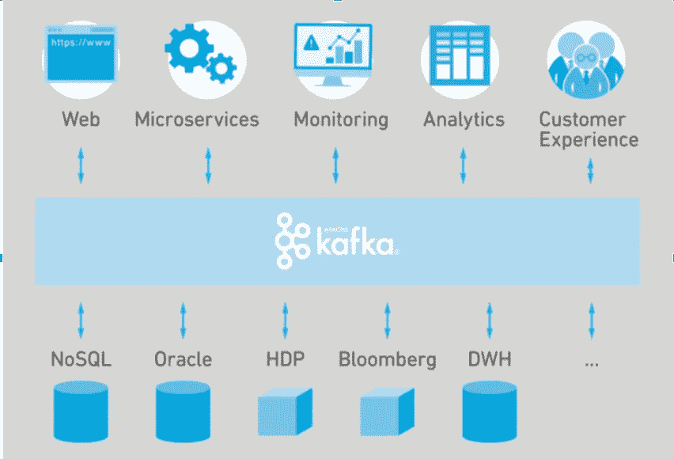
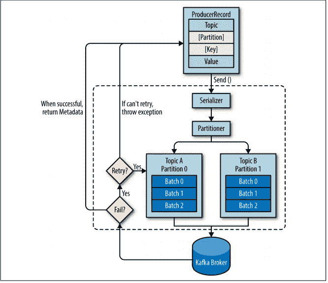

# 阿帕奇卡夫卡内部

> 原文：<https://medium.com/nerd-for-tech/apache-kafka-internals-d488a26c9cfb?source=collection_archive---------7----------------------->

卡夫卡无处不在。每个组织都以某种形式使用 Kafka，事件源、跨系统移动数据、不可变数据存储、解耦服务。Kafka 已经成为每个数据驱动组织的神经系统，这是正确的，因为它确实为您提供了一系列配置，您可以调整这些配置，使其适合不同的用例。通过正确的配置，它可以充当可靠的不可变数据存储，或者极快的消息传递系统。

所有分布式系统都涉及到可伸缩性、性能、可用性和可靠性之间的权衡。而这正是 Kafka 的闪光点，Kafka 将这些决策以配置的形式委托给开发者。开发人员可以根据需要从高可靠到高可用进行配置。

阿帕奇·卡夫卡作为公司内部的中枢神经系统

Apache Kafka 最初是一个发布/订阅消息系统，通常被描述为“分布式提交日志”，但现在它的功能更强大了。如今，它可以用作流处理引擎、不可变数据存储或消息传递系统。

我们要看一看卡夫卡的一些基本概念，这些概念让它变得如此强大。我还试图在 Kafka 源代码中提供一些指针，以便更好地理解。

# 分割

在 Kafka 中，分区是主要的并发机制。通过分区，Kafka 可以在 Kafka 集群中扩展主题的负载。对主题进行分区也会带来性能和吞吐量，假设一个 Kafka 主题有 4 个分区。现在，我们可以从同一个主题同时读/写 4 个分区。

卡夫卡主题的平行消费

## 消息到分区的映射

默认情况下，如果没有指定自定义分区器，Kafka 会使用 [DefaultPartitioner](https://github.com/apache/kafka/blob/3.0/clients/src/main/java/org/apache/kafka/clients/producer/internals/DefaultPartitioner.java#L34) 。映射策略如下:

*   如果分区号已经在 ProducerRecord 中指定，那么只需[使用它](https://github.com/apache/kafka/blob/3.0/clients/src/main/java/org/apache/kafka/clients/producer/KafkaProducer.java#L1281)。
*   否则，如果密钥出现在消息中，则使用[确定性散列算法](https://github.com/apache/kafka/blob/3.0/clients/src/main/java/org/apache/kafka/clients/producer/internals/DefaultPartitioner.java#L71)将密钥映射到分区号。
*   如果 key 不存在，那么它会在分区之间公平地分发消息，以平衡 Kafka 集群的负载

> 确定性散列确保具有相同密钥的每条消息最终出现在相同的分区中，在本文撰写之时，Kafka 使用 [murmur2 散列](https://github.com/apache/kafka/blob/3.0/clients/src/main/java/org/apache/kafka/common/utils/Utils.java#L439)算法。

# 分身术

在任何分布式系统中，节点失效都是不可避免的，因此在这样的系统中，容错策略必须考虑周全。对于容错，像许多数据库一样，Kafka 依赖于分区的复制。复制确保在发生任何故障时，集群中至少有一个分区副本可用。

数据库中 3 种流行的复制策略(单领导、多领导和无领导复制)。卡夫卡使用单头复制。我们在设置主题时指定了复制因子。

有两种类型的副本:

**领导者副本:**每个分区有一个副本被指定为领导者。为了保证一致性，所有的生产和消费请求都要经过领导者。

**跟随者副本:**一个分区中所有不是领导者的副本都被称为跟随者。追随者不会为客户的要求服务；他们唯一的工作就是复制来自领导者的信息，并与领导者拥有的最新信息保持同步。

如果一个分区的主副本崩溃，一个从副本将被提升为该分区的新主副本。该故障转移由 [KafkaController](https://github.com/apache/kafka/blob/trunk/core/src/main/scala/kafka/controller/KafkaController.scala#L71) 协调

# 卡夫卡制片人概述

Kafka Producer 的高级概述

向卡夫卡发送信息的步骤包括:

1.  我们通过创建一个 ProducerRecord 开始向 Kafka 发送消息，它必须包括我们要将记录发送到的主题和一个值。或者，我们也可以指定一个键和/或一个分区。
2.  首先我们序列化[键](https://github.com/apache/kafka/blob/trunk/clients/src/main/java/org/apache/kafka/clients/producer/KafkaProducer.java#L921)和[值](https://github.com/apache/kafka/blob/trunk/clients/src/main/java/org/apache/kafka/clients/producer/KafkaProducer.java#L929)
3.  接下来，数据被发送到[分区器](https://github.com/apache/kafka/blob/trunk/clients/src/main/java/org/apache/kafka/clients/producer/KafkaProducer.java#L935)以找出分区号
4.  然后，记录被添加到[队列](https://github.com/apache/kafka/blob/trunk/clients/src/main/java/org/apache/kafka/clients/producer/KafkaProducer.java#L954)中，以便发送给 Kafka 代理。
5.  最后，一个后台[线程](https://github.com/apache/kafka/blob/trunk/clients/src/main/java/org/apache/kafka/clients/producer/internals/Sender.java#L72)从队列中挑选记录，并将其发送到 Kafka 集群。

这绝对不是一个全面的卡夫卡指南，将尝试创建它的另一部分，更侧重于卡夫卡消费端。

感谢您的阅读