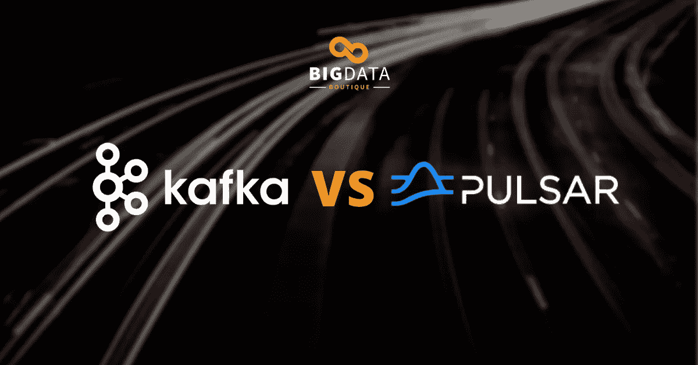

# 阿帕奇卡夫卡 vs 阿帕奇脉冲星(视频)

> 原文：<https://medium.com/nerd-for-tech/apache-kafka-vs-apache-pulsar-video-4e1c695b45c?source=collection_archive---------23----------------------->

*本文是* [*每月虚拟办公室*](https://bigdataboutique.com/ask-me-anything) *小时关于大数据技术和架构的一部分。如果你有兴趣，请在这里订阅 AMA 更新***。**

*Apache Kafka 已经成为流行的发布-订阅(pub-sub)消息系统有一段时间了。它为广泛的企业用例提供了功能，并提供了一个大型的工具生态系统和一个专门的社区。但是最近，新贵 Apache Pulsar 开始崛起。*

*Pulsar 吸取了 Kafka 最好的部分，并在此基础上进行扩展，以解决超出 Kafka 最初设计范围的问题。但是最近，这些功能出现在卡夫卡中。在本节中，我们将介绍两者的区别，并讨论如何基于用例以及两者的技术水平进行选择。*

# *概观*

*卡夫卡比脉冲星更受欢迎。卡夫卡已经处于技术采用生命周期的后期多数甚至落后阶段。许多公司使用 Kafka，它被认为是每个大数据架构的重要组件。*

*另一方面，Pulsar 要新得多，因此不像 Kafka 那样被广泛采用。尽管许多公司确实在使用 Pulsar，而且它正在被越来越多的人采用。雅虎开源 Pulsar 专门解决 Kafka 的一些问题。*

## *—内容*

1.  *卡夫卡建筑 vs 脉冲星建筑*
2.  *架构组件和消费模式*
3.  *分层存储和地理复制*
4.  *消息大小*
5.  *卡夫卡 vs 脉冲星性能*
6.  *社区和开源*

# *1.卡夫卡建筑 vs 脉冲星建筑*

## *卡夫卡的建筑*

*在 Kafka，我们有一个经纪人和一个制作人，给 Kafka 经纪人写和制作消息。代理将消息存储在本地存储或网络存储中，具体取决于配置。在大多数情况下，它是本地存储。*

***优点:***

*   *卡夫卡的优势之一是可用性高；它可以将消息复制到其他代理，从而允许跨代理复制信息，确保即使其中一个代理出现故障，数据也不会丢失。网络连接可以扩展以增加消费者。*

***CONS:***

*   *如果没有预先设置足够的分区，新的实例就不能从 Kafka 进行消费。需要添加更多的分区和扩展消费者，这并不简单。有变通办法，但这些只是技巧，而不是现成的解决方案。*
*   *如果我们添加一个新的代理，我们需要手动将副本移动到新的代理，中断消费者开始从新的代理读取数据—这并不容易做到。*

****重要提示:*** 为了协调不同经纪人之间的关系，卡夫卡使用了 ZooKeeper。今年，ZooKeeper 将被 Broker 取代，但在那之前，两者都需要部署。因为这是两种不同的技术，所以知道如何操作这两种技术是至关重要的。*

## *脉冲星中的建筑*

*Pulsar 的架构与卡夫卡的类似。Pulsar 有一个生产者，向 Pulsar 经纪人编写和生产消息。*

***优点:***

*   *Pulsar 中的代理是无状态的——这意味着它不存储信息。相反，它连接了一个不同的叫做 Bookkeeper 的部分来存储信息。Pulsar Broker 的优点是可以连接不同的簿记员并向他们发送信息。*
*   *记账员相对容易规模化。利用专用储物空间，还可以轻松添加更多簿记员。此外，因为代理在 Pulsar 中是无状态的，所以可以根据负载需求添加新的代理，并对其进行伸缩——这一重要功能将 Pulsar 与 Kafka 区分开来。*
*   *我们可以很容易地增加新的消费者或者缩小规模，而不用面对卡夫卡式的问题。*

***CONS:***

*   *Pulsar 架构的缺点是，它需要维护两个不同的网络中心；一份是生产商给经纪人的，一份是经纪人给簿记员的。与卡夫卡一样，Pulsar 也有一个 ZooKeeper 组件，但它在 Pulsar 中使用得更多，所以它将留在这里。*

# *2.架构组件和消费模式*

*卡夫卡有经纪人，动物园管理员很快就不存在了。更少的组件意味着更少的网络跳跃，因此 Kafka 的延迟更好，因为不需要两次依赖网络。此外，Kafka 占用的空间更小，因为每个组件都需要高度可用。管理代理不同于管理簿记员，因为它们是独立的项目，尽管有一些相似之处——它们都在 JVM 上工作。*

*另一方面，Pulsar 中的消费者模式更加灵活。向上和向下扩展不会影响消费者，从而更容易扩展代理和添加更多存储。在 Kubernetes 中使用 Pulsar 时，这些灵活性非常有利。*

*有可能在《库伯涅茨》中使用卡夫卡；有一些非常成熟的运营商。但是，在 Kubernetes 中部署 Kafka 并没有太多优势。扩展和缩小集群是不可能的，也不可能在出现问题时重启代理，删除它，然后重新创建它，这些在 Kafka 中都是很大的问题。*

# *3.分层存储和地理复制*

*Pulsar 有分层存储，比 Kafka 更成熟。它还支持 S3 和其他几个对象存储。此外，分层存储是 Pulsar 产品的一部分。*

*分层存储在 Kafka 中相对较新，最近才推出。分层存储只是 Kafka 商业产品的一部分，因此还不是开源的。*

*脉冲星的地理复制更好。Pulsar 中的地理复制支持多种拓扑，如活动-备用、全网状和边缘聚合。然而在卡夫卡那里，地理复制要复杂得多。它很难维护，并且在操作和维护方面相当昂贵。一些复制器在市场上有售，类似于 Mirror Maker 2，但是它们在维护和成本上也有限制。*

*脉冲星是多租户的。Pulsar 包含*名称空间*——类似于 Kubernetes 名称空间，从逻辑角度、生产者和消费者角度分离主题，并独立管理那些*名称空间*。而卡夫卡是单租户的，只包含主题。*

# *4.消息大小*

*消息大小是 Pulsar 优于 Kafka 的主要优点之一。默认情况下，Pulsar 中的消息大小可以达到 5mb。如果消息大小增加超过 5 兆字节，Pulsar 有一个功能，使生产者能够自动将消息分成更小的大小。消费者自动将这些消息放回一起，以接收初始消息。*

*相比之下，卡夫卡的理想场景是当消息很小时，大约一千字节。当信息小于一千字节时，卡夫卡可以高效地工作。但是，如果消息大小超过一兆字节，生成器将不会启动该操作。在 Kafka 中有允许更大尺寸消息的配置，但是不理想。*

# *5.卡夫卡 vs 脉冲星性能*

*Kafka 社区和 Pulsar 社区的基准测试表明，在性能方面，两者都优于对方。与一个数据库相比，卡夫卡和脉冲星都同样令人印象深刻。此外，如果在延迟方面没有具体要求，性能就不是关键。*

*为了真正确定特定用例的最佳技术，最好基于该用例进行基准测试。另一方面，对于大多数用例，最好不要基于性能基准进行选择，而是基于上面讨论的所有其他因素。*

# *6.社区和开源*

*卡夫卡的社群比脉冲星社群更大更成熟。然而，由于 Pulsar 社区相对较新，该社区令人兴奋，最重要的是，Pulsar 核心维护者本身的支持水平很高。总的来说，两个社区的支持都非常好。*

*Pulsar 是 Apache 许可下的 Apache 项目的一部分。由于 Pulsar 是新的，采用率很低，就我们所知，绝对一切都是开源的。*

*Kafka 本身、代理以及它的许多组件都是 Apache 软件基金会的一部分。然而，Kafka 的一些基本组件，包括模式注册表，并不是 Apache 软件基础的一部分。*

# *结论*

*卡夫卡和脉冲星都一样好。他们只是在社区和收养方面处于不同的地方。随着 Pulsar 的普及，我们可以期待在 Pulsar 中看到类似于卡夫卡的变化。*

*加入我们未来的“问我任何问题”会议！更多详情请访问我们的网站。*

**原载于 2021 年 3 月 1 日*[*【https://blog.bigdataboutique.com】*](https://blog.bigdataboutique.com/2021/03/apache-kafka-vs-apache-pulsar-video-fd3fi2)*。**