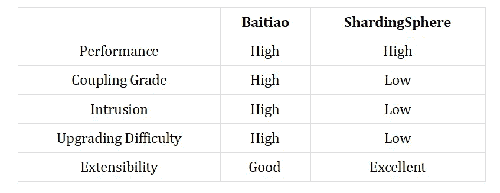
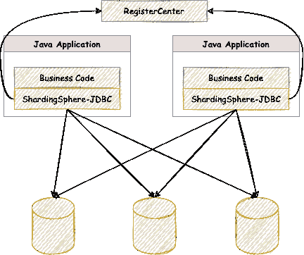
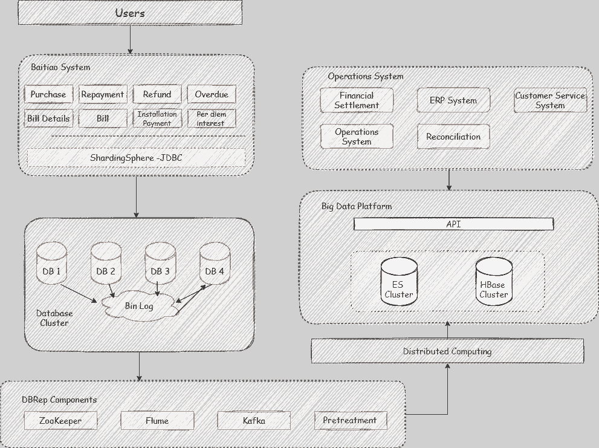

# Apache ShardingSphere x JD Baitiao:实现之旅的故事

> 原文：<https://medium.com/nerd-for-tech/apache-shardingsphere-x-jd-baitiao-story-of-an-implementation-journey-3006f2c0c90d?source=collection_archive---------5----------------------->

> *Apache ShardingSphere 已经成为京东白条超大规模存储场景和纵向扩展的最佳解决方案。JD 的购物节对我们的大数据存储产生了很大影响。我的意思是，像数以亿计的数据集。*
> 
> *2014 年推出的互联网信贷产品提供商京东白条一直面临数据爆炸的挑战。每一次购物节对我们来说都像是一次技术测试，但每次技术人员都会在数据架构开发方面采取积极的战略举措，以确保一切顺利进行。*
> 
> *—张东方，JD 八条 R & D 导演*

# 白条数据架构的演变

自 2014 年 2 月推出以来，由于数据量的快速增长和业务的快速增长，京东白条的数据架构已经进行了多次演进。

## 从 2014 年到 2015 年

白条最早采用 Solr + HBase 方案，将核心业务系统和其他系统与关键数据库连接起来。Solr 索引能够实现快速搜索响应，HBase 用于存储大量数据。

*   Solr 集群可以帮助核心数据库减少读写压力。
*   然而，Solr 并不完美:它具有令人不满意的可扩展性和入侵性。

## 从 2015 年到 2016 年

公司选择 NoSQL 在 Mongo DB 集群中存储月度数据表，暂时满足支付结算场景下的海量数据导入/导出需求。

*   这一变化使得查询热门数据变得非常高效。此外，由于这种非结构化数据存储，员工可以轻松修改表结构。
*   尽管如此，该计划仍然存在问题:糟糕的可扩展性、入侵和内存占用。

## 从 2016 年到 2017 年

不断增长的业务和数据。数百亿的数据量给 MongoDB 带来了更大的性能和数据量压力。JD Baitiao 的大数据平台使用 DBRep 和 MySQL Slave 来捕获数据变化，并将信息数据存储在其消息中心，以便稍后写入 es 和 HBase。

*   这个计划实际上要好得多。它专注于实时数据和改进的可扩展性。
*   然而，由于其架构中的数据分片问题，白条面临着维护其代码的高成本。

京东白条的架构演变只是快速增长的互联网消费金融的一个例证。白条过去采取的所有方法都不全面，预示着每一种解决方案都将很快过时。

# 是时候采用分离式架构了

为了在数据量快速增长的情况下确保良好的系统性能，技术团队首先选择了分片架构模式，这种模式不仅能保证出色的性能，还能控制代码。

## 数据分条计划实际上基于应用程序架构:

产品不断发展，但早期的解决方案现在已经成为最大的问题之一。旧的数据分片计划使得代码更加复杂，增加了维护费用。每次应用程序升级时，开发人员都必须花费大量时间来调整分片，因此他们无法专注于自己的开发。事实上，紧耦合是问题的根源。

因此，该团队决定使用成熟的分片组件来简化系统升级和架构更改。为了比较白条的 shard 和 ShardingSphere shard，它们的区别如下表所示。

对于白条来说，脱钩是下一个任务。

显然，京东白条的数据架构将经历全新的解耦之旅。以下三个方向无疑推动了它的转变:

**专注:**它没有在其架构中内置数据库分片，而是应用了一个分片组件，将更多精力放在自己的产品开发上。

**更简单的升级:**它使用了一个去耦合的架构来简化系统升级的研发过程。

**面向未来的计划:**旨在提高系统可扩展性，使白条更有能力放心举办 618 购物节、双 11 购物节(也称 11 月 11 日光棍节)等大型网购节。

京东白条是一个庞大的业务，所以它的业务场景是真正与金融、高并发、海量数据量相关的。白条的分片组件必须具有以下特性:

1.  成为成熟的产品
2.  表现优异
3.  能够处理大数据
4.  具有可扩展的架构

# Apache ShardingSphere 解决方案

轻量级 Java 框架 ShardingSphere-JDBC 是 Apache ShardingSpheres 的第一个提供诸如 Java 数据库连接(JDBC) API 等服务的产品。JDBC 使用 jar 归档文件安装包，并允许客户端直接连接到数据库。因此，它不需要额外的部署依赖。它就像一个增强的 JDBC 驱动程序，完全兼容 JDBC 和 ORM 框架。

ShardingSphere — JDBC 提供了以下特性，使其成为白条场景中的最佳解决方案。

**成熟产品:**sharding sphere——JDBC 是一款经过多年开发的成熟产品，其开源社区非常活跃。

**性能优异:**其微内核和轻量化设计几乎不妨碍性能。

**最小改动:**支持原生 MySQL 协议，最小化 R & D 工作量。

**扩展性:**用户可以结合迁移同步组件轻松扩展数据。

经过多次系统测试，Apache ShardingSphere 成为 JD 白条首选的数据分片中间件。合作始于 2018 年底。

# 产品适应性

为了给白条提供更好的服务和支持业务，Apache ShardingSphere 在实现过程中对其产品功能和性能进行了许多改进。同时，用户案例反过来有助于优化产品。

**升级 SQL 引擎**

白条的商业逻辑极其复杂；其多样化的场景需求需要最佳的 SQL 兼容性级别。因此，Apache ShardingSphere 重构了 SQL 解析器模块，以支持更多的 SQL。

*   单数据节点路由:100% SQL 兼容性
*   多数据节点路由:全面支持 DML，DDL，DCL，TCL 和部分 DAL。支持分页、重复数据删除、排名、分组、聚合和相关查询等功能。

**分发密钥**

Apache ShardingSphere 提供了内置的分布式密钥生成器，如 UUID 和雪花。它还提供了分布式密钥生成 API，以便用户可以开发定制的密钥生成算法来满足他们的特殊需求。

**分片键值注入**

如果一个 SQL 没有分片条件，Apache ShardingSphere 使用 ThreadLoad 来管理分片键值，用户可以编程并向 HintManager 添加一个分片条件，使该条件只在当前线程中有效。那就是所谓的 SQL 零入侵。

此外，Apache ShardingSphere 继续优化其其他特性，以满足白条对高性能的需求，例如:

*   SQL 解析结果缓存
*   JDBC 元数据缓存
*   绑定表和广播表
*   自动化执行引擎和流合并

JD 白条和 ShardingSphere 团队共同努力，产品的所有指标都达到了他们的预期。由此产生的最终性能几乎是相同的一个本土 JDBC。

# 树木砍光了的

Apache ShardingSphere 使用其定制的哈希策略对数据进行分片，有效地避免了热数据问题。数据节点总数几乎达到一万个。割接过程持续约 4 周。

1.  在 DBRep 读取数据之后，Apache ShardingSphere 将数据同步到目标数据库集群。
2.  两个集群一起运行。数据迁移后，白条使用自己的工具来验证业务和数据。

DBRep 是 ShardingSphere-Scaling 产品设计的基础。扩展的自动化特性无疑有助于迁移和纵向扩展。

# Apache ShardingSphere 带来了许多好处

**简化升级路径**

分离的架构有效地简化了系统升级所需的技术堆栈，因此开发团队不再需要担心表分片。相反，他们可以专注于业务本身。简而言之，ShardingSphere 极大地帮助了白条优化升级路径。

**节省 R & D 成本**

白条直接使用成熟的产品 Apache ShardingSphere，所以他们不需要重新发明轮子，节省了大量的时间和精力。

**提高架构扩展性**

白条还使用同步迁移组件扩展，使系统扩展更加灵活。这是该公司网上购物节成功的秘诀。

# 摘要

京东白条业务的增长极大地刺激了其数据架构的升级。这一次，它选择了 Apache ShardingSphere 来分离其架构，并使未来的升级变得不那么复杂。由于这一点，从现在开始，开发人员只需专注于他们自己产品优化，因为它的数据架构具有足够的可扩展性。这个案例是消费金融场景中 ShardingSphere 应用的一个很好的例子。

现在，互联网信用支付模式越来越多。未来，Apache ShardingSphere 将与京东科技合作，探索更多的业务场景，并贡献金融相关的技术创新，进一步完善互联网金融。

## 关于 Apache ShardingSphere

ShardingSphere 是 Apache Software Foundation 顶级开源项目之一，被全球超过 170 家企业使用，涵盖金融、电子商务、云服务、旅游、物流、教育和娱乐等各个垂直领域。其 GitHub 社区迄今已累积超过 14，000 颗星星。

我们欢迎更多的技术专业人士写文章，分享他们的经验和想法。如果您有兴趣，请随时联系我们:

sharding sphere Github:[https://github.com/apache/shardingsphere](https://github.com/apache/shardingsphere]())
sharding sphere Twitter:[https://twitter.com/ShardingSphere](https://twitter.com/ShardingSphere]())

sharding sphere Slack Channel:[apacheshardingsphere.slack.com](http://apacheshardingsphere.slack.com/)