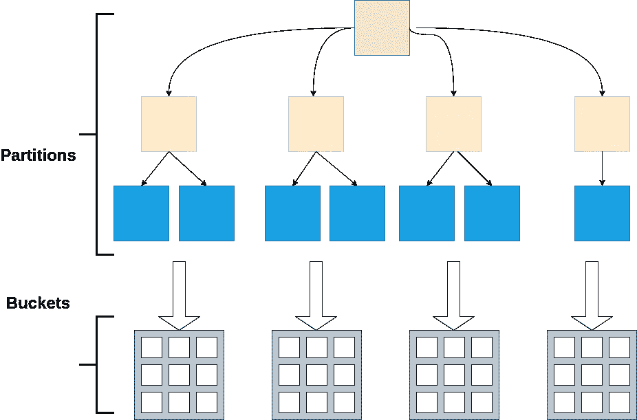
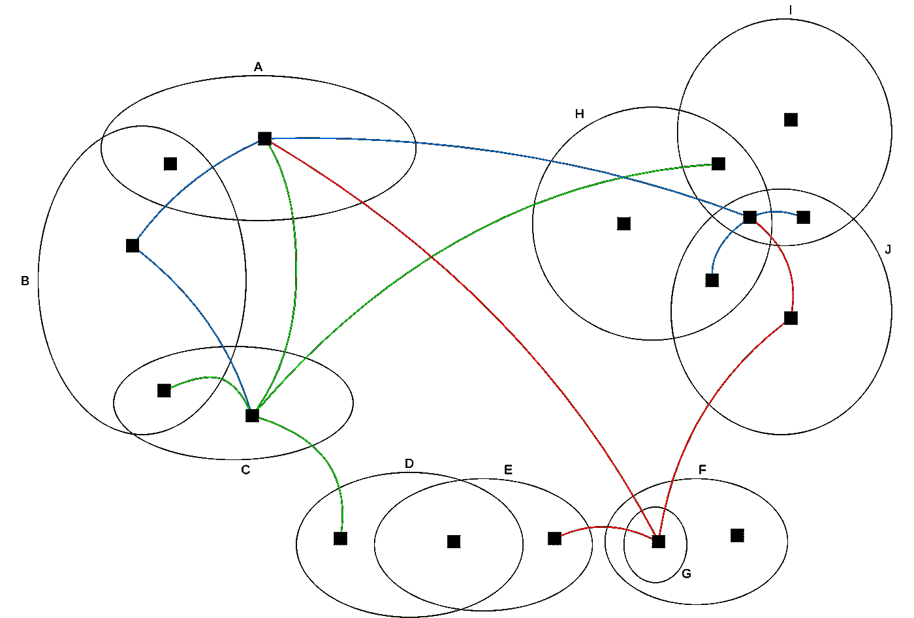
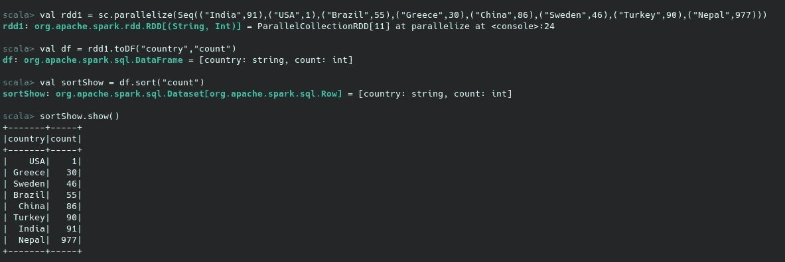

# Apache Spark:分桶和分区。

> 原文：<https://medium.com/nerd-for-tech/apache-spark-bucketing-and-partitioning-8feab85d5136?source=collection_archive---------0----------------------->

概述分区和分桶策略，以最大限度地提高收益，同时最大限度地减少负面影响。如果您可以减少洗牌的开销、对序列化的需求和网络流量，为什么不呢？最终，性能、更好的集群利用率和成本效益战胜了一切。



如果您要在大规模解决方案中充分利用数据集，您需要更好地了解数据集。
通过更好地理解数据集，优化可以产生更好的结果。

> **基数**:指一列中包含的**数据**的唯一性。



决定选择哪种策略完全取决于基数。如果数据集的基数比率是常数或有限的，那么最佳策略是-

# 分区:

在分布式系统中，分区指的是分成几个部分(仅当数据集被多次重用时有用)*。*

*分区数据很容易查询，因为它们有助于跳过大量数据以更快地获得结果，如果处理不当，可能会导致小文件问题。*

*在大型数据集中，您通常希望按日期、类型等过滤器进行查询。如果我们按照日期和类型对数据进行分区，我们的查询将跳过不必要的分区，只读取那些保证包含所需字段的部分。*多个*分区允许在更多的工作人员之间分配工作，但是*更少的分区*允许在更大的块中完成工作(并且通常更快)。*

> *注意:分区通常不应该包含超过 128MB，单个混洗块限制是 2GB，并且 RDD 的所有键/值对都支持分区。*

## *我们可以通过两种方式创建具有特定分区的 RDDs*

1.  ***partitionBy()** -通过提供显式分割器。这种转换允许在 RDD 上应用自定义分区逻辑。*

```
*val users = spark.read.load("/path/to/users")users.write
  .partitionBy("favorite_color")*
```

*2.我们还可以使用特定的划分器应用返回 rdd 的转换。*

*   ***加入***

## *示例:*

```
*val users = spark.read.load("/path/to/users").repartition('userId)val joined1 = users.join(addresses, "userId")
joined1.show()*
```

*   ***左外连接***

## *示例:*

```
*val rdd1 = sc.parallelize(Seq(("m",55),("m",56),("e",57),("e",58),("s",59),("s",54)))
val rdd2 = sc.parallelize(Seq(("m",60),("m",65),("s",61),("s",62),("h",63),("h",64)))
val leftjoinrdd = rdd1.leftOuterJoin(rdd2)
leftjoinrdd.collect*
```

## *输出:*

```
*Array[(String, (Int, Option[Int]))] = Array((s,(59,Some(61))), (s,(59,Some(62))), (s,(54,Some(61))), (s,(54,Some(62))), (e,(57,None)), (e,(58,None)), (m,(55,Some(60))), (m,(55,Some(65))), (m,(56,Some(60))), (m,(56,Some(65))))*
```

*   ***RightOuterJoin***

## *示例:*

```
*val rdd1 = sc.parallelize(Seq(("m",55),("m",56),("e",57),("e",58),("s",59),("s",54)))
val rdd2 = sc.parallelize(Seq(("m",60),("m",65),("s",61),("s",62),("h",63),("h",64)))
val rightjoinrdd = rdd1.rightOuterJoin(rdd2)
rightjoinrdd.collect*
```

## *输出:*

```
*Array[(String, (Option[Int], Int))] = Array((s,(Some(59),61)), (s,(Some(59),62)), (s,(Some(54),61)), (s,(Some(54),62)), (h,(None,63)), (h,(None,64)), (m,(Some(55),60)), (m,(Some(55),65)), (m,(Some(56),60)), (m,(Some(56),65)))*
```

*   ***GroupByKey***

## *示例:*

```
*val rdd1 = sc.parallelize(Seq(5,10),(5,15),(4,8),(4,12),(5,20),(10,50)))
val rdd2 = rdd1.groupByKey()
rdd2.collect()*
```

## *输出:*

```
*Array[(Int, Iterable[Int])] = Array((4,CompactBuffer(8,12)), (10,CompactBuffer(50)), (5,CompactBuffer(10,15,20)))*
```

*   ***减速键***

## *示例:*

```
*val rdd1 = sc.parallelize(Seq(5,10),(5,15),(4,8),(4,12),(5,20),(10,50)))
val rdd2 = rdd1.reduceByKey((x,y)=>x+y)*
```

## *输出:*

```
*Array[(Int, Int)] = Array((4,20),(10,50),(5,45))*
```

*   *分类*

**

*   *FoldByKey*

```
***val** **pairRdd** **=** rdd.map { x **=>
var** **str** **=** x.split(",")
**new** **Tuple2**(str(0), **new** **Average**(1, str(1).toDouble, str(1).toDouble))
} **val** **foldRdd=**pairRdd.foldByKey(**new** **Average**(0, 0.0, 0.0))((x, y)*
```

*Spark 分区在键/值对的所有 rdd 上都可用，并使系统根据每个键的功能对元素进行分组。*

*如果基数很高并且分布均匀，那么最佳策略是-*

# *分桶:*

*如果您有一个用例定期加入某些输入/输出*，那么使用 bucketBy 是一个好方法。在这里，我们强制将数据划分到所需数量的存储桶中。**

**我们选择这种策略是因为分布是统一的，基于一个或多个存储桶列的值，数据被分配到预定义数量的存储桶。属性的过滤将会更快，因为我们可以选择正确的存储桶(当正确应用时，存储桶可以通过避免洗牌而导致连接优化)。**

# **按存储桶列出的转换列表:**

*   **连接**
*   **明显的**
*   **分组依据**
*   **reduceBy**

```
**people.write
  .bucketBy(42, "name")
  .sortBy("age")
  .saveAsTable("people_bucketed")**
```

**当我们需要执行多连接和/或涉及数据改组的转换，并且连接和/或转换中的列与桶中的列相同时，分桶会很有用。如果联接/转换中没有相同的列，则不需要分桶。**

***原载于 2021 年 10 月 7 日*[*【https://yolkorbit.com】*](https://yolkorbit.com/apache-spark-bucketing-and-partitioning/)*。***