# Apache Spark —安装和如何使用它

> 原文：<https://medium.com/nerd-for-tech/apache-spark-installation-how-to-use-it-31ab4768634a?source=collection_archive---------4----------------------->

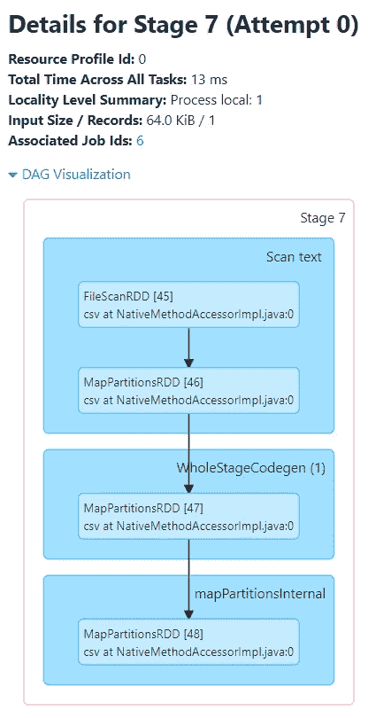

DAG 可视化

如今，许多社交应用正在被开发，每次都会导致大规模的数据改进，当我们谈论每次连接的数百万用户时，每当用户与社交媒体或其他网站交互时，信息就会被共享，所以问题就出现了，如何处理这些海量数据，以及通过什么媒体或工具来处理和存储数据。这就是大数据展现的地方。

所以第一个问题是什么是大数据？

*大数据是一个描述大量数据的术语，这些数据包括结构化数据和非结构化数据，每天充斥着企业。但重要的不是数据量。重要的是组织如何处理数据。可以分析大数据以获得洞察力，从而做出更好的决策和战略性业务举措。*

大数据的概念已经存在多年，现在他们明白，如果他们捕获所有数据，他们就可以实施分析并从中受益匪浅。

随着对大数据技术的极大兴趣和投资，数据分析和数据工程等领域具有最宝贵的价值。一些大数据工具基于 Python 和 Java，使得已经在使用这些语言的程序员更容易了解大数据分析和分析工具。借助 Power Bi、Qlikview、Tableau 等可视化工具。，用户可以轻松地分析数据并提出新的策略。

但在此之前，当然要针对大数据，大量的做好正确的数据处理。因为阿帕奇火花出现了。

**阿帕奇火花**

Apache Spark 是用于大规模数据处理的统一分析引擎。

Apache Spark 是一个用于大规模数据处理的开源统一分析引擎。Spark 提供了一个接口，通过隐式数据并行和容错对整个集群进行编程。Spark 代码库最初是由加州大学伯克利分校的 AMPLab 开发的，后来被捐赠给了 Apache Software Foundation，该基金会一直维护着它。

**速度**

**工作负载运行速度提高 100 倍。**

Apache Spark 使用最先进的 DAG 调度程序、查询优化器和物理执行引擎，为批处理和流数据实现了高性能。

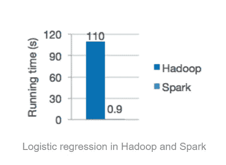

速度

**2。易用性**

用 Java、Scala、Python、R、SQL 快速编写应用。

Spark 提供了 80 多个高级操作符，可以轻松构建并行应用。您可以在 Scala、Python、R 和 SQL shells 中交互使用它。

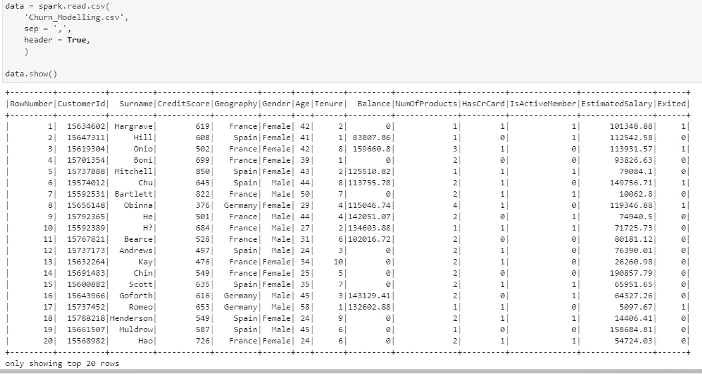

加载数据

**3。通用性**

结合 SQL、流和复杂分析。

Spark 支持一系列库，包括 SQL 和 DataFrames、用于机器学习的 MLlib、GraphX 和 Spark Streaming。您可以在同一个应用程序中无缝地组合这些库。

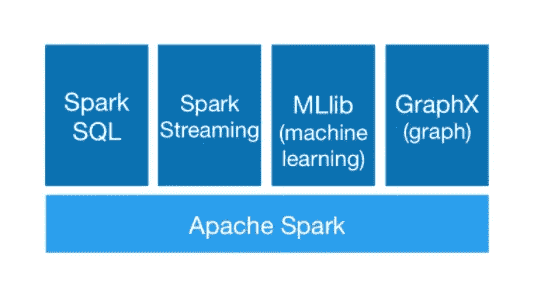

大部分

**4。到处跑**

Spark 可以运行在 Hadoop、Apache Mesos、Kubernetes 上，可以独立运行，也可以运行在云中。它可以访问不同的数据源。

您可以在 EC2、Hadoop YARN、Mesos 或 Kubernetes 上使用其独立集群模式运行 Spark。访问 HDFS、Alluxio、Apache Cassandra、Apache HBase、Apache Hive 和数百个其他数据源中的数据。

到处跑

**安装**

a)选择火花释放

b)选择包装类型

c)选择下载类型:(直接下载)

d)下载 Spark。请记住，如果您下载一个较新的版本，您将需要为您下载的文件修改其余的命令。

确保您的计算机上安装了 Java 7+。

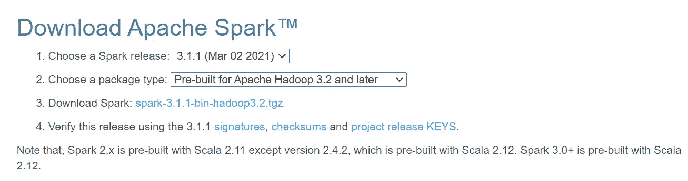

[计] 下载

**设定环境**

setx SPARK _ HOME ~你的文件夹\spark-3.1.1-bin-hadoop2.7

setx HADOOP _ HOME ~你的文件夹\spark-3.1.1-bin-hadoop2.7

setx py spark _ DRIVER _ PYTHON ipython

setx PYSPARK_DRIVER_PYTHON_OPTS 笔记本

在你的路径中添加~你的文件夹\spark-3.1.1-bin-hadoop2.7\bin。

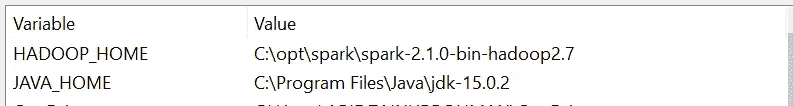

环境

环境

**运行**

奔跑

— master 参数用于设置主节点地址。这里，我们在两个内核上本地启动 Spark 进行本地测试。

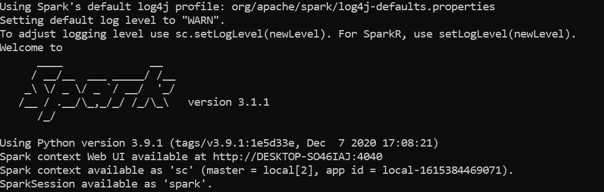

火花 3.1.1

**简单练习**

打开新的 Jupyter 笔记本。如果你是 Spark 的新手，需要在 window 的机器上使用 Jupyter notebook 设置 Spark，那么先完成设置。通过 spark 会话创建一个访问 spark 的入口点。

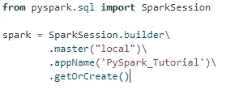

创建访问权限

然后，我们可以通过读取 CSV 文件来创建输入数据框。按照下面的代码片段创建 spark 数据框。

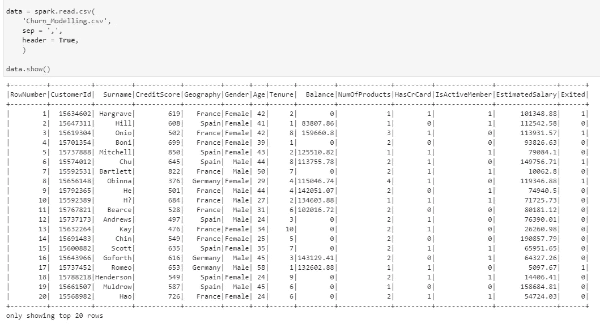

数据帧

**SPARK UI**

Apache Spark 提供了一套 Web UI/用户界面(作业、阶段、任务、存储、环境、执行器和 SQL)来监控 Spark/PySpark 应用程序的状态、Spark 集群的资源消耗和 Spark 配置。

我们可以点击 Spark UI

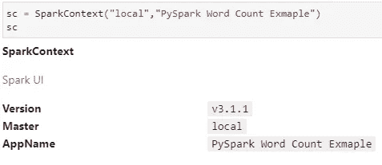

Spark UI

**火花作业标签**

我希望您了解 jobs 部分下的详细信息，包括调度模式、spark 作业的数量、它拥有的阶段数量以及 Spark 作业中的描述。

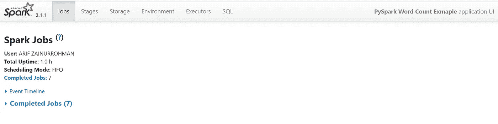

作业选项卡

**阶段选项卡**

我们可以通过两种方式导航到阶段选项卡。

1.选择相应 Spark 作业的描述(仅显示所选 Spark 作业的阶段)

2.在 Spark 作业选项卡的顶部，选择阶段选项(显示应用程序中的所有阶段)

在我们的应用程序中，我们总共有 7 个阶段。

Stage 选项卡显示一个摘要页面，该页面显示 spark 应用程序中所有 Spark 作业的所有阶段的当前状态

您可以在每个阶段看到的任务数量是 spark 将要处理的分区数量，并且一个阶段中的每个任务都是 spark 将要完成的相同工作，但是是在不同的数据分区上

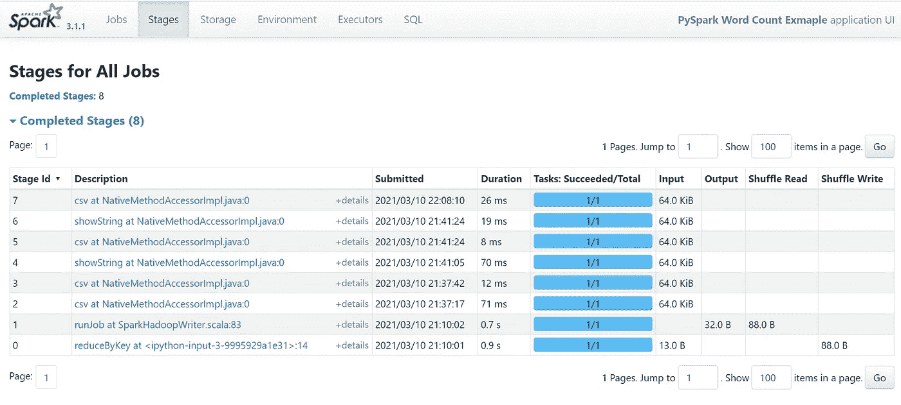

阶段

**舞台细节**

阶段的详细信息展示了该阶段的有向无环图(DAG ),其中顶点表示 rdd 或数据帧，边表示要应用的操作。

DAG 可视化

结论

大数据分析的重要性导致竞争激烈，对大数据专业人员的需求增加。因此，对于专业人员来说，始终跟上技术的发展并不断增加专业知识变得非常重要。Apache Spark 旨在帮助应对这个大数据时代的挑战。

参考

[大数据:它是什么，为什么重要| SAS](https://www.sas.com/en_au/insights/big-data/what-is-big-data.html)

[Apache Spark—大数据统一分析引擎](http://spark.apache.org/)

[阿帕奇火花—维基百科](https://en.wikipedia.org/wiki/Apache_Spark)

[Spark Web UI —了解 Spark 执行—Spark by 示例](https://sparkbyexamples.com/spark/spark-web-ui-understanding/)

[在 Windows 上安装 Spark(PySpark)|作者:Michael Galarnyk | Medium](/@GalarnykMichael/install-spark-on-windows-pyspark-4498a5d8d66c)

[如何在 Apache Spark(learntospark.com)中查看数据帧的全部内容](https://www.learntospark.com/2020/01/show-full-content-in-spark-dataframe.html)

[PySpark —字数示例— Python 示例](https://pythonexamples.org/pyspark-word-count-example/)