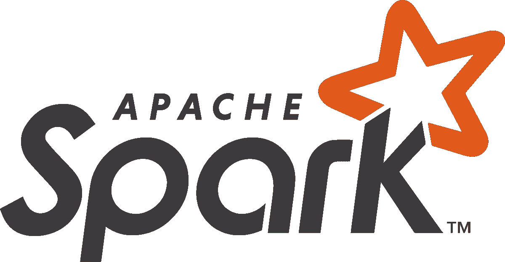

# Apache Spark —多部分系列:简介

> 原文：<https://medium.com/nerd-for-tech/apache-spark-multi-part-series-introduction-37735823c3cc?source=collection_archive---------8----------------------->

这是一个新的系列博客，面向工程和分析领域的开发人员，他们希望在 Spark API(应用程序编程接口)的内部工作中构建和扩展他们的知识。本系列的一个个人目标是丰富我当前对 Apache Spark 的理解，以一种易于理解的方式与读者分享我的知识和资源。因此，无论您目前对分布式计算的理解处于什么水平，都会有内容和材料供您在 Apache Spark 的旅程中使用。本系列面向数据科学家、数据工程师或任何 Spark 新手。即使你有一些知识，希望我能帮助填补一些盲点！



在这段艰难的日子里(新冠肺炎)，我打算每隔几天就发布一个新的版块。这是为了让我能继续发展和扩大我的技能，希望你也是。我在工作环境和个人项目中断断续续使用 Apache Spark 已经有三年半的时间了。

# 系列报道:

本系列将使用 Apache Spark 创建者编写的个人知识和著名资源，涵盖 Apache Spark 的几乎所有方面。将以合理深度覆盖的区域包括但不限于:

关于 spark 的一切:

*   什么是阿帕奇火花？
*   火花建筑
*   Spark 生态系统和语言
*   火花 API 的

深度功能:

*   阿帕奇火花和考拉
*   Spark 数据类型和生态系统变量
*   火花蒸汽加工

分析和机器学习:

*   使用 Spark 的分析和机器学习概述
*   Spark 中的预处理和特征工程
*   Spark 中的 ML 建模
*   Spark 中的图形分析
*   Spark 中的深度学习
*   阿帕奇火花和 mflow

我在 Apache Spark 方面的大量知识和经验来自 Apache Spark 创建者提供的书籍和电子学习。更不用说来自 Databricks 的高级讲师亲自培训了。在我的学习过程中，我发现有两本书非常有价值:

*   [Spark，权威指南—让大数据处理变得简单](https://www.amazon.co.uk/Spark-Definitive-Guide-Bill-Chambers/dp/1491912219)
*   [学习火花——点燃快速数据分析](https://www.amazon.co.uk/Learning-Spak-Jules-Damji/dp/1492050040)

使用 Spark 磨练技能的另一个关键地方是在本地机器上或通过使用基于云的解决方案，如 Azure 或 AWS。或者，在 Databricks 社区版上有一个**免费的**地方可以做到这一点，可以在下面找到:

[https://community.cloud.databricks.com/](https://community.cloud.databricks.com)

这个环境允许你创建自己的 Spark 集群，创建笔记本，上传数据和尝试任何 Spark 相关的东西！有一些限制，但对于一个免费的服务来说，这太棒了！社区版甚至可以让你试用 Databricks 在 2019 年发布的开源项目之一 **mlflow** 。

我的每个学习部分都可能嵌入了代码片段，您可以使用自己的数据集在 Spark 环境中运行。如果你没有自己的数据集，Kaggle 网站上有大量的数据集，你需要做的就是免费注册，终身访问它们。

 [## 查找开放数据集和机器学习项目| Kaggle

### 下载数千个项目的开放数据集+在一个平台上共享项目。探索热门话题，如政府…

www.kaggle.com](https://www.kaggle.com/datasets) 

或者，Databricks 免费社区版在集群创建时将许多数据集装载到环境中。您可以在 Databricks 笔记本中运行下面的代码来检索数据集列表。

```
%py
display(dbutils.fs.ls("/databricks-datasets"))
```

您还可以为列出的每个数据集打印出`README.md`文件。

```
%py
with open("/dbfs/databricks-datasets/README.md") as f:
    x = ''.join(f.readlines())

print(x)
```

如果运行任何代码示例需要任何额外的功能或库，我将尝试包含任何代码先决条件。

# 最后:

快速连续地发布所有这些部分将是一个挑战，但我会尽我所能做到这一点。如果您有任何问题或建议，请通过 LinkedIn 发送给我:

 [## 卢克·索普-资深数据科学家- BBC | LinkedIn

### 参加聚会，学习新的技能、工具和方法是我最擅长的！我是一名经验丰富的分析师，而且…

www.linkedin.com](https://www.linkedin.com/in/luke-thorp/) 

谢谢你陪我一路走来，注意安全！

# 系列部分:

[简介](https://lukethorp.medium.com/apache-spark-multi-part-series-introduction-37735823c3cc)

1.  [什么是阿帕奇 Spark](https://lukethorp.medium.com/apache-spark-multi-part-series-what-is-apache-spark-63c3f6caa3c)
2.  [火花架构](https://lukethorp.medium.com/apache-spark-multi-part-series-spark-architecture-461d81e24010)