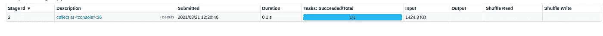
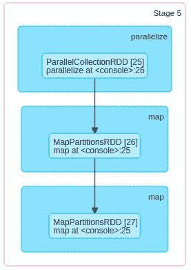
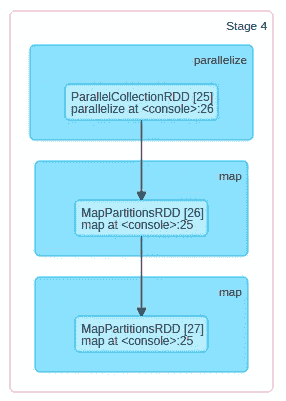

# Apache spark:优化技术

> 原文：<https://medium.com/nerd-for-tech/apache-spark-optimization-techniques-b982e71153ff?source=collection_archive---------1----------------------->

Apache spark 是广泛用于大数据处理的引擎之一。使用大数据时遇到的最大障碍不是完成任务，而是用最少的资源完成任务。这就是优化发挥作用的地方，优化旨在用最少的资源解决大数据问题。


这里我们将讨论以下优化技术。

*   **拿**不如**收**
*   **尽可能坚持**
*   避免 **groupByKey** 而使用 **reduceBykey**
*   **Coalace** 优于数据的重新分区
*   明智地使用**广播**

现在让我们用一个例子来看看这些方法。

**拿比收好**

以下示例 **df.collect()** 对数据集应用的操作，以及对同一作业的执行细节。

```
**var** df **=** spark.read.option("header",**true**).csv("/user/test/olympic-summary/Summer-Olympic-medals-1976-to-2008.csv")df.collect()
```



收集的执行详细信息

执行持续时间为 0.1 秒。如果我们用 take 替换 collect 动作，而不是将整个数据集转换成一个数组，那么它将只从第一个**分区**中获取数据，这就简单而容易了。

```
df.take(15433)
```


拍摄的执行细节

坚持是关键

所有火花变换，如分组、过滤，本质上都是懒惰的。这意味着 spark 不会立即应用这些转换，而是继续等待计数、保存等操作。这种懒惰的执行策略有时也是一个问题，让我们看看下面的例子。

```
**var** l1**=Seq**(**1**,**2**,**3**,**4**)
**val** rdd1 **=** sc.parallelize(l1)
**val** rdd2 **=** rdd1.map(x**=>** x*x)
**val** rdd3 **=** rdd2.map(x**=>** x+**2**)
rdd3.collect()
rdd3.count()
```



收集的执行历史记录



计数的执行历史记录

> 应用于收集动作的所有转换再次应用于计数动作，这在大型操作中可能是一个大问题。

```
**import** **org.apache.spark.storage.StorageLevel._**
**val** dfPersist **=** rdd2.persist(**MEMORY_ONLY**)
**val** rdd4 **=** rdd3.persist(**MEMORY_ONLY**)
rdd4.count()
rdd4.collect()
```

解决方案是将转换存储在内存或磁盘中，存储可以是 memory、disk_only 和 memory_and_disk。

**reduceByKey 比 groupBykey 好**

下面给出的例子按空格分割句子，并计算单词出现的次数。

```
**val** text_list **=** **Seq**("this is a sample sentence", "this is another sample sentence", "sample for a sample test")
**val** rdd **=** sc.parallelize(text_list)
**val** rdd_word **=** rdd.flatMap(x**=>** x.split(" "))
**val** rdd_pair **=** rdd_word.map(x**=>** (x, **1**)
**val** wordCount **=** rdd_pair.groupBy(w **=>** w).mapValues(**_**.size)
wordCount.collect()
```

这种方法的问题是分组洗牌的次数会更高。因此，如果我们使用 reduce by key，而不是 group by，它最初会在分区内减少，因此实际上洗牌的次数会更少。

```
**val** reducedata **=** rdd_pair.reduceByKey(**_**+**_**)
```

**Coalace 优于 re-partition**

**重新分区**用于增加分区数量，但是**重新分区**会导致大量数据跨集群移动。Coalace 是一个更好的方法。Coalace 算法在内部以一种减少数据传输次数的方式工作。

**广播变量**

查看我关于 spark 连接策略的文章，了解如何有效地使用广播连接。

类似地，我们也可以将变量广播到不同的节点中，因此这些变量将被**缓存在每个节点的**中。可以类似地广播频繁使用的查找表以提高效率。

```
**val** country **=** **Seq**(("Ind"->"India"),("US"->"USA"),("UK"->"United Kingdom"))
**val** broadcaster **=** sc.broadcast(country)
```

在上面的例子中，将国家代码转换成国家名称的国家查找表被广播到每个节点。