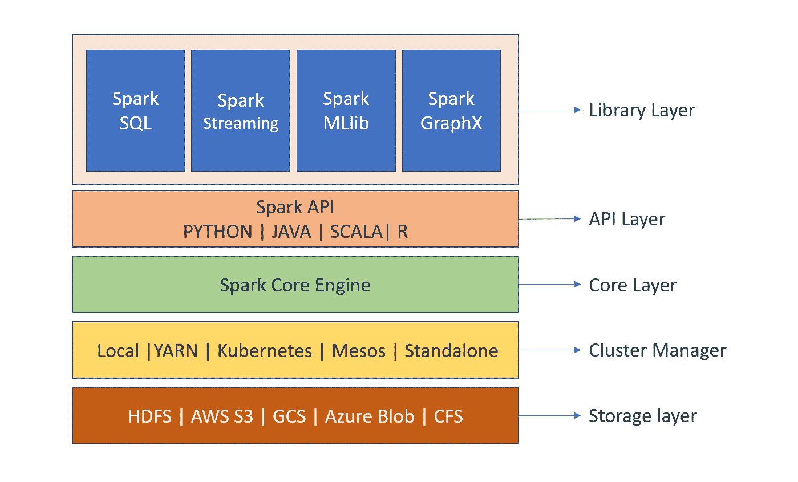
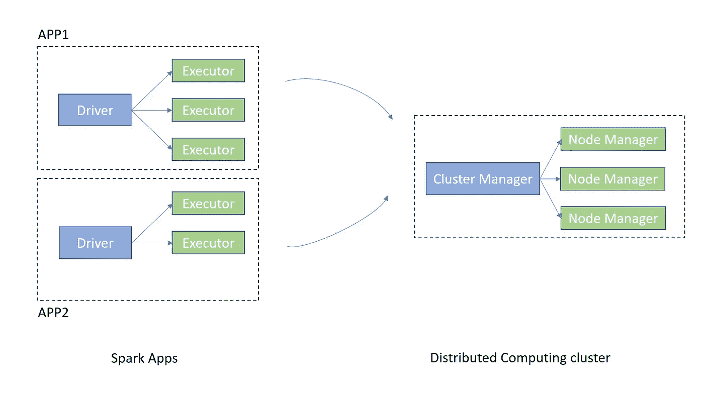
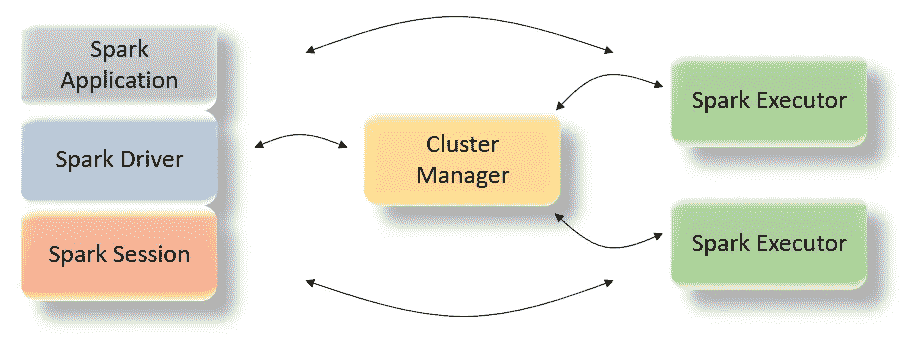
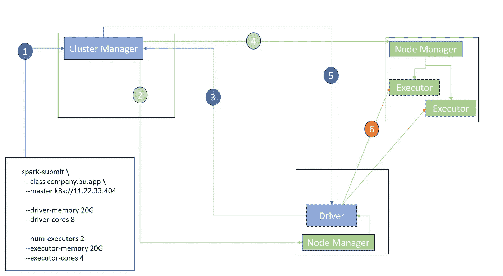
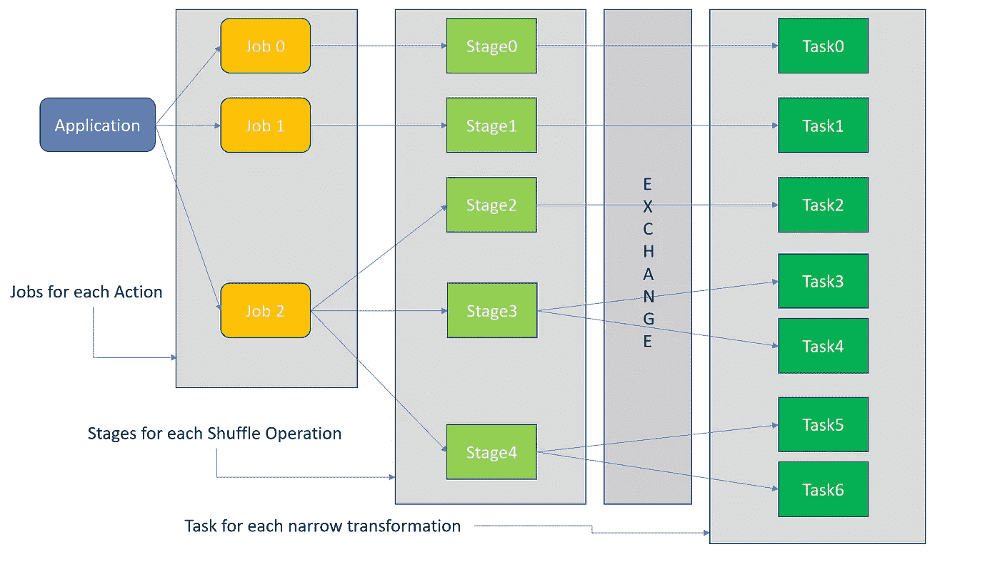
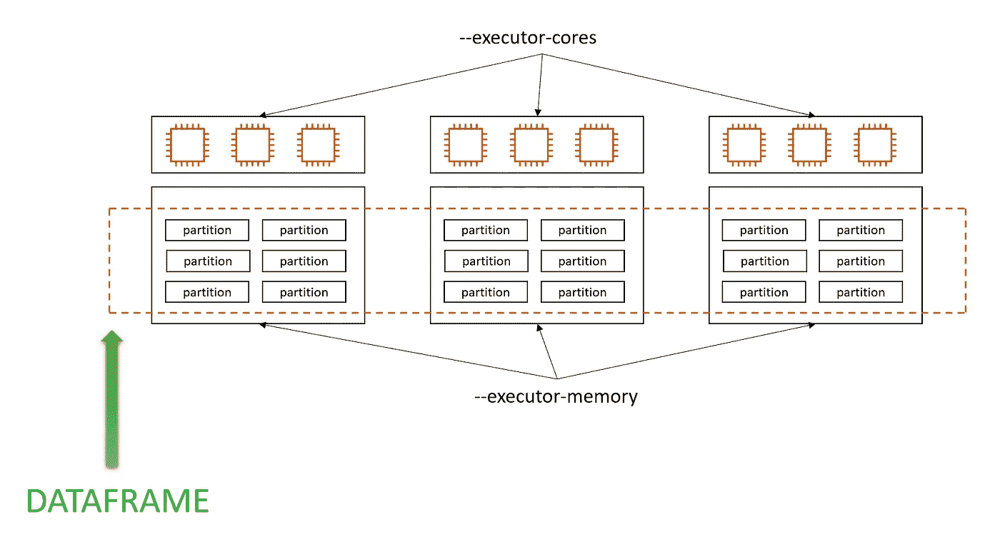

# Apache Spark —视觉介绍！！

> 原文：<https://medium.com/nerd-for-tech/apache-spark-visual-intro-9eb3fd2709f9?source=collection_archive---------0----------------------->


照片由 [Ayooj Rangaraj](https://unsplash.com/@ayooj?utm_source=unsplash&utm_medium=referral&utm_content=creditCopyText) 在 [Unsplash](https://unsplash.com/s/photos/spark?utm_source=unsplash&utm_medium=referral&utm_content=creditCopyText) 上拍摄

> **Apache Spark** 是用于大规模数据处理的统一计算引擎/框架。

## 介绍



## 火花执行模型

> Spark 应用程序有两个组件——驱动程序和执行程序



在我们继续查看 spark 应用程序和集群之间的交互是如何发生的之前，让我们理解驱动程序和执行程序的主要职责。

**驱动程序:**

1.  从集群管理器计算应用程序的资源需求
2.  管理作业的生命周期和动态资源需求
3.  在执行者之间分配工作
4.  对节点或执行器故障做出反应
5.  监控和跟踪执行者的进度
6.  将响应发送给用户
7.  这是创建 SparkContext 的地方。
8.  它为 WebUI 提供作业的元数据。



**执行者:**

1.  执行司机分配的任务
2.  向驾驶员报告状态和进度

我们现在对驱动者和执行者做什么有了一个概念，让我们看看他们如何通过与集群交互来实现他们的目标。

> spark 应用程序的部署模式指定了驱动程序进程相对于集群的运行位置。



1.  向集群提交 Spark 应用程序以及所有配置
2.  集群管理器要求节点管理器根据可用资源和提供的配置启动驱动程序进程
3.  驱动程序进程请求附加资源(基于提供的配置的执行者)
4.  集群管理器要求节点管理器分配执行器进程
5.  集群管理器通知驱动程序执行器的位置
6.  驱动程序向执行者发送任务

## 火花编程模型



如上图所示，Spark 应用程序分为三个部分:

1.  **作业**—Spark 应用中的一个动作
2.  **阶段** —应用程序中的洗牌依赖
3.  **任务** —节点上的本地计算

## 结构化 API


**DataFrame** 是分布在集群中运行的一组执行器上的数据的逻辑表示。数据帧的物理数据保存在每个执行器内存的分区中。这允许并行处理数据。



## 懒惰评估

惰性求值是一种将计算推迟到实际需要结果时进行的技术。由于我们不断推迟计算，我们只能读取一次数据，并在内存中执行所有计算。通过避免不必要的计算，这种方法还能够有效地使用内存。懒求值有以下优点。

**查询优化—** 惰性评估允许 Spark 通过改变计算顺序来优化执行计划。Spark 能够将操作组合在一起，减少数据传递的次数。

```
df = spark.read.parquet("employee")

#Transformations

df_ordered = df.orderBy("Salary")                      #1
df_sal = df_ordered.filter("Salary > 60000")           #2
df_exp = df_sal.filter("Experience_Years > 5")         #3
df_age = df_exp.filter("Age > 30")                     #4
df_pune_grp = df_age.groupBy("Gender").sum("Salary")   #5 
```

在上面的代码片段中，由于惰性评估，所有三个过滤器都在一次通过中应用，order by 在过滤器之后完成，因此速度更快(因为要排序的数据更少)。

**缓存—** 惰性评估允许 Spark 将数据缓存在内存中并在其上执行计算，而不是从磁盘中读取。此外，它允许 Spark 跳过不必要的中间数据。

**容错—** 由于惰性评估需要跟踪转换，使用沿袭 Spark 的副作用是可以重新计算失败的任务，而不是重新计算整个流水线。

## 摄取数据

在 spark 中，我们有 DataFrame Reader API，它允许我们将各种来源的数据读入 spark 生态系统。该 API 具有以下公共签名。

```
spark.read.format("csv") \ 
          .options("mode", "FAILFAST") \
          .schema(fileschema) \ 
          .load()
```

> **格式** — csv、json、avro、parquet、社区格式
> **选项** —模式(FAILFAST、drop formattered、PERMISSIVE)、路径
> **模式** — Explcit、Implicit、InferSchema

## 写入数据

与数据帧读取器 API 类似，Spark 也有数据帧写入器 API。该 API 具有以下公共签名。

```
DataFrame.write.format("csv") \ 
          .options("path", "/data/output/") \
          .mode("overwrite") \ 
          .save()
```

> **格式** — csv、json、avro、parquet、community 格式
> **选项** — path、maxRecordPerFile
> **模式** —追加、覆盖、errorIfExists、忽略
> **分区依据—** 决定物理数据布局 **桶依据—** 给定列将数据存储在固定数量的桶中 **保存表**

在这篇博客中，我已经介绍了基本的构建模块。在下一篇博客中，我将会写一些 PySpark 的代码示例。

快乐火花！！