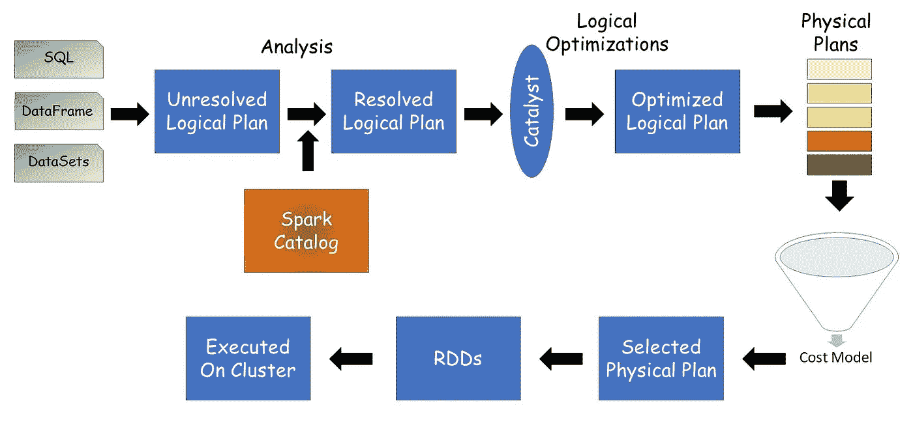
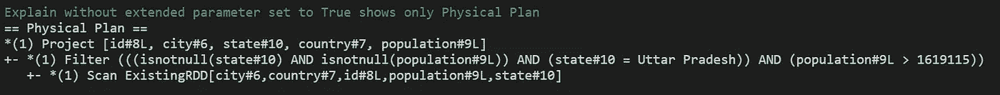
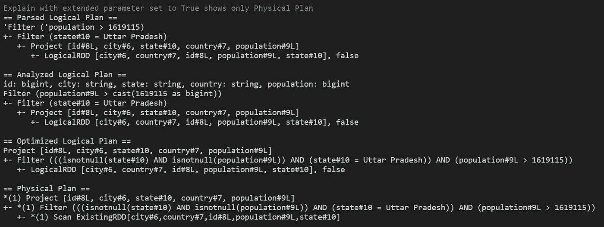
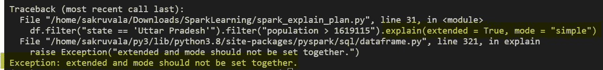

# 使用 Explain()方法的 Apache Spark 的逻辑和物理计划

> 原文：<https://medium.com/nerd-for-tech/apache-sparks-logical-and-physical-plans-using-explain-method-2487b9be537?source=collection_archive---------8----------------------->

park 建议使用结构化 API(data frame、DataSet、SQL ),而不是低级 rdd，以利用 Catalyst 和钨引擎的强大功能来优化整体工作负载。

在处理 rdd 时，我们通知 Spark 关于**【如何】**我们希望数据被处理。但是在使用结构化 API 时，我们会通知 Spark 我们想要处理的**【什么】**，并让 Spark 找出如何处理的最佳方法。Spark 创建逻辑和物理计划，并确定要实施的最佳计划。

使用结构化 API 编写的代码如果有效，则被转换成逻辑计划，即一组抽象转换，而没有对代码将运行的驱动程序或执行器的任何引用。因为这仅包括语法上正确的代码，并且对各种列/表的引用还没有被验证，所以它被称为未解析的逻辑计划。
这个未解析的逻辑计划通过一个分析器，该分析器再次验证代码 Spark 目录(数据帧信息的存储库)中使用的列和表，最终“解析”它。如果目录中不存在被引用的列/表，那么分析器可以拒绝未解析的逻辑计划。如果一切顺利，那么分析器的输出就是一个已解决的逻辑计划。
这个解析的逻辑计划现在被提供给 Catalyst Optimizer，它根据一组内部规则产生一个优化的逻辑计划。

从逻辑到物理计划创建的各个阶段

使用优化的逻辑规划，产生物理规划的许多不同版本，并通过基于成本的选择模型。然后选择最佳的物理计划并在集群上执行。

explain() 方法帮助我们查看这些计划。它在 Spark 版本 1.3+中可用，并接受一个名为“**扩展**”的**可选布尔参数**。默认情况下，该参数设置为 False，因此只显示物理平面图。要查看各种逻辑计划以及物理计划，您需要将扩展参数作为 True *传递，例如 df.explain(extended = True)或 df.explain(True)*

让我们用一个例子来回顾一下。下面的代码片段从示例数据创建一个 dataframe，然后调用 explain()方法，不使用扩展参数，将扩展参数设置为 True。

展示解释计划的 PySpark 代码

正如我们在下面看到的，只有在调用 explain()方法时没有将扩展参数设置为 True，我们才能获得物理平面图信息。

解释未将扩展参数设置为 True 的方法调用

当我们将扩展参数设置为 True 时，我们得到所有的计划(3 个逻辑和 1 个物理)

解释扩展参数设置为 True 的方法调用

> 如果我们仔细观察计划，我们可以看到 Catalyst Optimizer 在这里工作。我在代码中应用了两个独立的过滤器，它们在已解析或未解析的逻辑计划和已分析或已解析的逻辑计划中显示为独立的步骤。一旦计划被提供给 Catalyst 优化器，过滤器就被组合并优化成一个调用，如优化的逻辑计划所示。

在 Spark 3.0 中，一个新的**可选字符串参数****模式**被添加到 explain()方法中，该方法可用于指定显示计划的格式。*注意:“扩展”和“模式”不能同时使用。* 模式参数可以取值，
1。**简单** - >仅打印物理平面图
2。**扩展** - >打印逻辑和物理平面图
3。 **codegen** - >打印一份物理平面图和生成的代码(如有)
4。**成本** - >打印逻辑计划和统计数据(如果有的话)
5。**格式化** - >打印物理平面图和节点细节

将扩展和模式一起传递会导致错误

*您可以使用不同的模式值运行代码，并查看计划的预期输出，以便进行更深入的分析。*

# **参考文献**

*   [Apache Spark 文档](https://spark.apache.org/docs/latest/api/python/reference/api/pyspark.sql.DataFrame.explain.html)
*   比尔·钱伯斯和马泰·扎哈里亚的《火花:权威指南》
*   [三个 Apache Spark APIs 的故事:rdd、数据帧和数据集——Jules Damji](https://www.youtube.com/watch?v=Ofk7G3GD9jk)