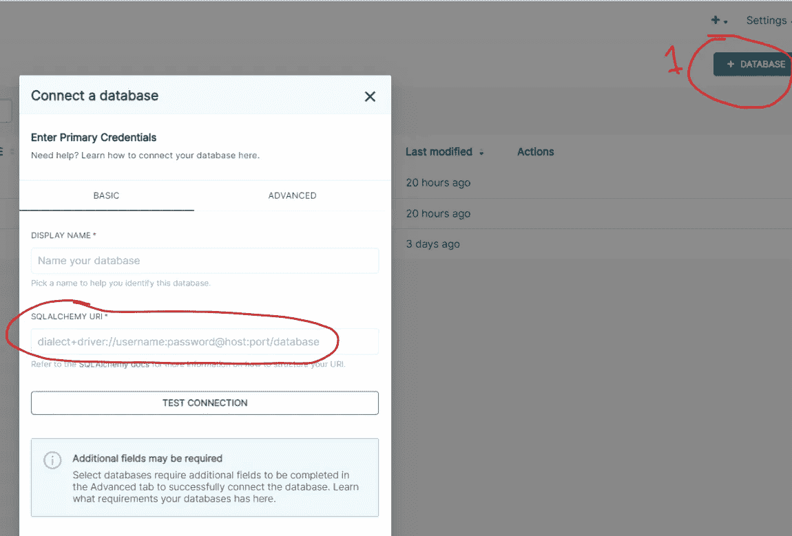
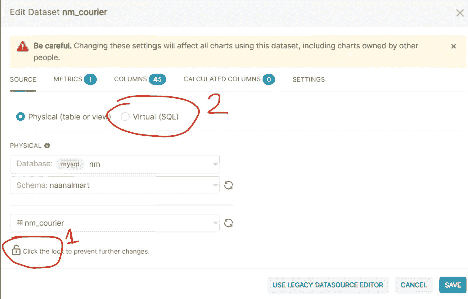
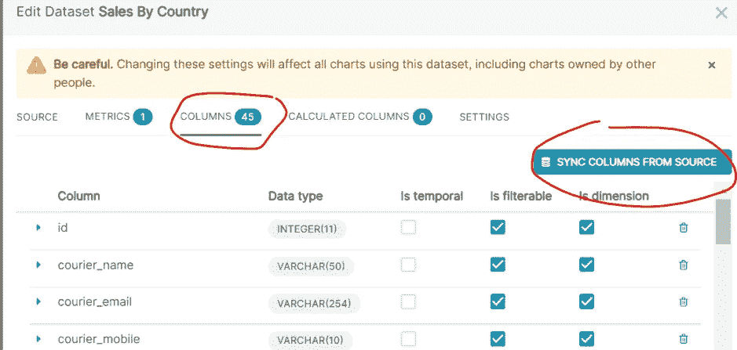
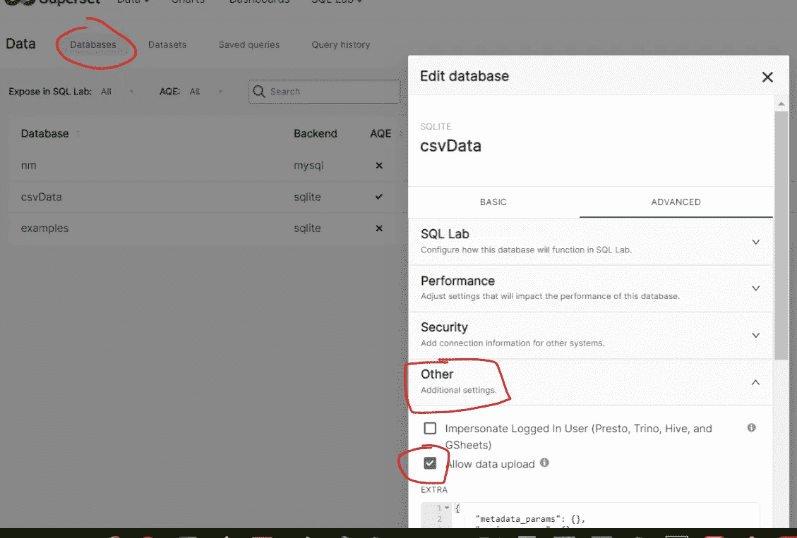
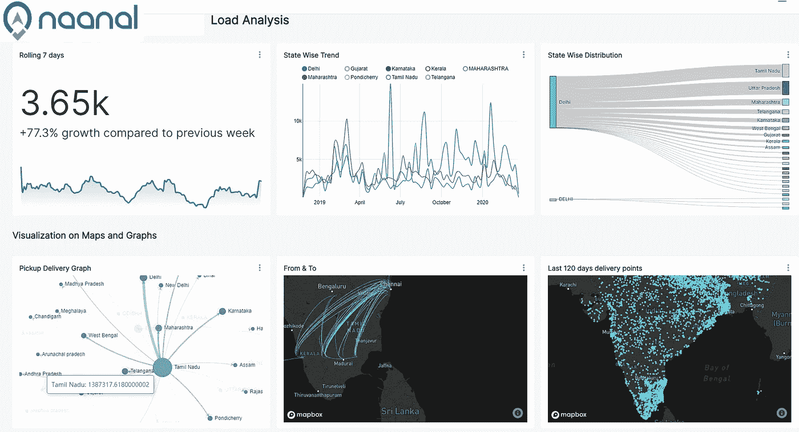

# Apache 超集:开源数据可视化网络平台

> 原文：<https://medium.com/nerd-for-tech/apache-superset-opensource-data-visualization-web-platform-4fa52ee56f1?source=collection_archive---------9----------------------->

Apache Superset 是一个用于创建可视化和仪表板的 web 平台。创建讲述故事的数据面板不需要编程语言。您可以轻松创建图表并与其他用户共享，使用内置角色和权限管理来保护图表。如果源数据启用了行级安全性，则可以在超集中可用的行级安全性接口中配置这些详细信息。超集是 Airbnb 自助式商业智能(BI)解决方案的核心。

在本文中，将介绍从 docker 容器运行超集、安装 python 数据库连接器、更新超集配置文件、添加数据库、数据集以及启用 CSV 上传的数据源

安装:

采用 dockerhub 存储库中可用的 Docker 容器 Apache/超集。安装很简单，可在[这里](https://hub.docker.com/r/apache/superset)找到。如果您想忽略示例数据集和图表，可以跳过“加载示例”。

我使用 mysql 数据库作为后端，连接器已经在 docker 中可用。如果您的连接器丢失，您可以通过 pip 进行安装。请在这篇文章的末尾找到连接器列表

```
docker exec -it superset pip install %PYTHON_DB_CONNECTOR%Note: Here superset is container name. You can replace it with your container. Replace %PYTHON_DB_CONNECTOR% with your required connector e.g., **pybigquery for BigQuery**
```

超集配置存储在 docker 中 app/超集路径下的 config.py 文件中。由于 docker 容器中不提供文本编辑器，您可以将文件复制到您的虚拟机中，进行更改，然后将其复制回 docker 容器。例如，您可以在配置文件中替换您的 MapBox 访问令牌，这样，您就可以使用 mapbox 的内置图表。config.py 中的一些重要设置你可能需要编辑:你想在图表中查看的最大行数，SQL Lab 和数据导出，配置 slack 或 email，你的应用程序标志

```
docker cp superset:/app/superset/config.py . 
###After making changes to config file, copy it back to docker
docker cp config.py superset:/app/superset/config.py
docker restart superset #restart docker to apply changes
```

搞定了。您现在可以使用以下 URL 格式访问您的超集:

如果您按照上面的[链接中共享的安装说明执行了命令，admin / admin 将是登录凭证](https://hub.docker.com/r/apache/superset)

```
[http://yourIP:8080/superset/welcome/](http://167.71.225.227:8080/superset/welcome/) 
```

让我们添加一个连接到您的数据源，创建数据集，以便我们可以创建可视化

1.  首先，您需要添加数据库连接。要创建数据库连接，请参考 URI SQLALCHEMY。我已经在附录中列出了 **SQLAlchemy URI 前缀**



2.从上一步中创建的数据库连接创建数据集。注意:您只能选择一个表或一个视图。如果要创建组合多个表的数据集，请选择其中一个表并保存它。之后，通过点击右端的编辑图标打开数据集。将会打开如下界面。单击锁图标解锁并选择虚拟 SQL。这将显示查询面板来编写您的自定义 SQL。添加查询后，保存数据集。



等等！在寻找创建可视化之前，您需要同步您的列。在编辑模式下打开数据集，然后单击列。从源中选择同步列。对于数据集中的日期和时间字段，选择是时态复选框。



3.您可以通过单击数据集来创建图表

4.如果您想要上传 CSV 或 Excel 文件并使用这些文件作为数据源来创建图表，请确保启用了允许 CSV。请参考下图启用它



瞧啊。您可以使用 superset 中的许多内置图表类型来创建令人惊叹的视觉效果，并讲述您的数据故事。



附录 Python 数据库连接器列表:

```
DATABASE   Python connector  SQL ALCHEMY Prefix
MySQL  mysqlclient    mysql://
PostgreSQL psycopg2   postgresql+psycopg2://
Presto  presto-python-client    presto://
Hive pyhive
Oracle cx_oracle    oracle://
Snowflake snowflake-sqlalchemy   snowflake://
Redshift sqlalchemy-redshift    redshift+psycopg2://
MS SQL pymssql     mssql://
Athena PyAthenaJDBC>1.0.9    awsathena+jdbc://
Vertica sqlalchemy-vertica-python    vertica+vertica_python://
Kylin kylinpy     kylin://
BigQuery pybigquery   bigquery://
```