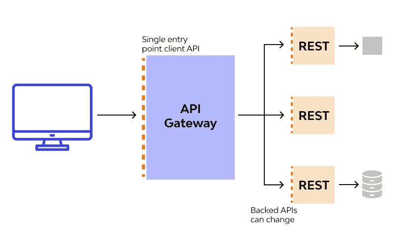

# API 网关

> 原文：<https://medium.com/nerd-for-tech/api-gateway-4e67d31714fd?source=collection_archive---------1----------------------->

API 网关是一个 API 管理工具，位于客户端和一组后端服务之间。它充当反向代理，接受所有应用程序编程接口(API)调用，聚合完成这些调用所需的各种服务，并返回适当的结果。

大多数企业 API 都是通过 API 网关部署的。API 网关处理跨 API 服务系统使用的常见任务是很常见的，例如…