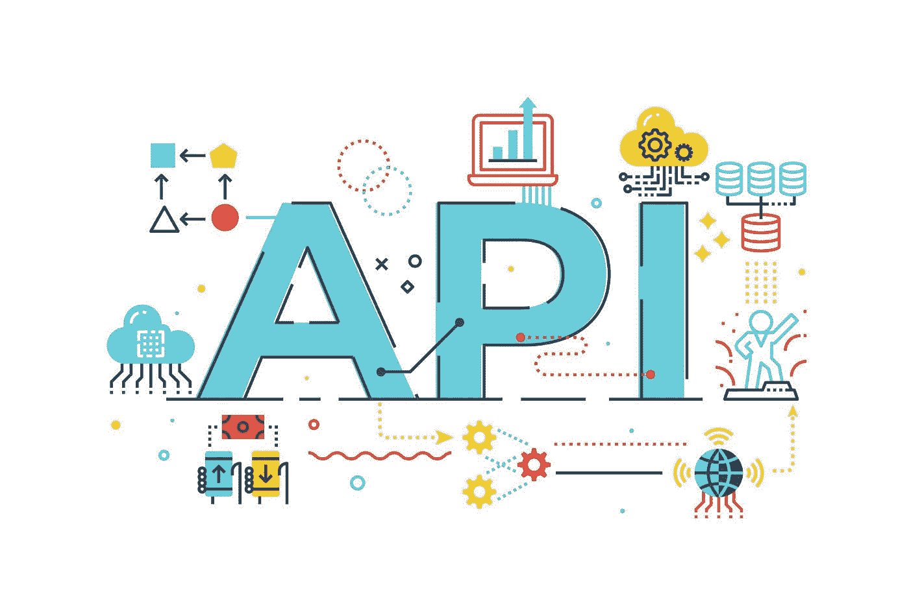
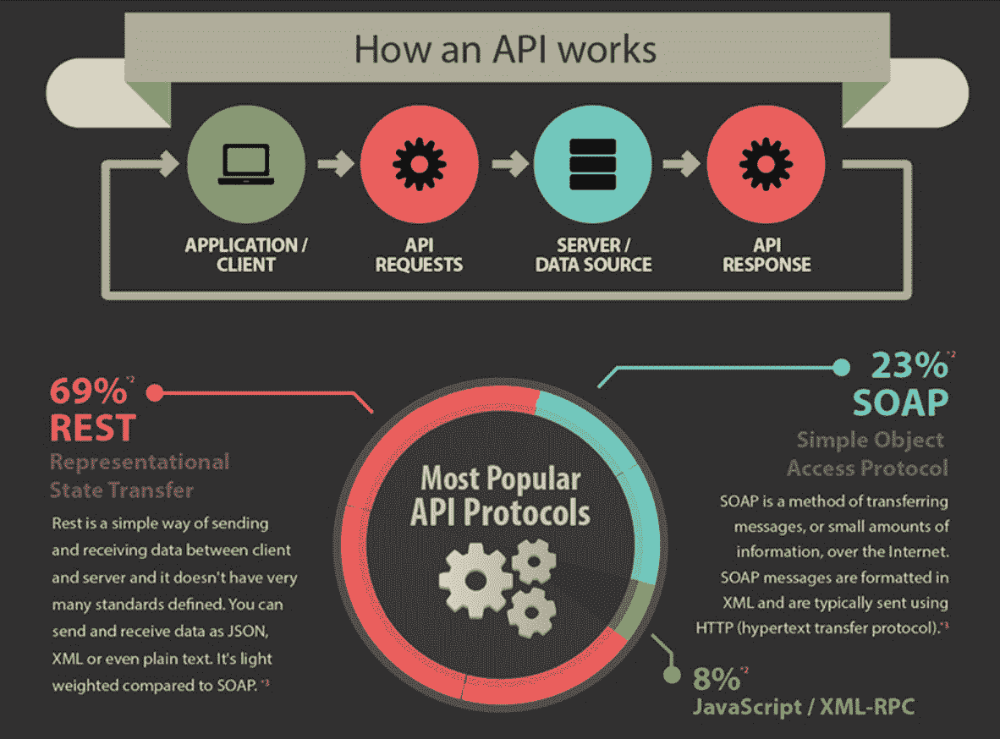
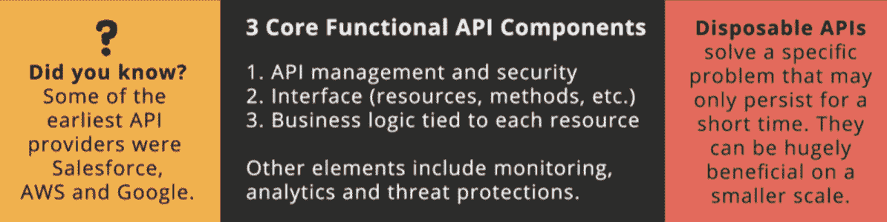

# API 集成:API 对您业务的最大好处

> 原文：<https://medium.com/nerd-for-tech/api-integration-the-top-api-benefits-for-your-business-1aa31225efbf?source=collection_archive---------0----------------------->

API，或者说应用程序编程接口，已经存在了一段时间，并且作为一项关键技术在各个领域首次亮相。从 IT 界到政府用户，API 允许各种技术更快更容易地相互通信。

[来源](https://www.smartfile.com/blog/wp-content/uploads/2013/06/api_infographic_smartfile.jpg)

随着新技术的发展，大数据带来了丰富的信息，API 现在比以往任何时候都更加重要。事实上，API 提供的好处意味着现在是将您的业务与 API 集成的好时机。

来源: [**码商老爹**](https://www.codersdaddy.com/)

你知道吗？API **集成可以减少高达 90%的成本和上市时间。你可以享受这种整合带来的各种潜在优势。这里我们总结了将 API 集成到您的业务中应该考虑的主要好处。**

# API 为您的企业带来的最大好处

[来源](https://cdn.safe.com/wp-content/uploads/2016/05/19115821/All-About-APIs-Infographic.jpg)

> 1.易于集成到您的代码中

由于有一套标准，开发人员可以更容易地将 API 集成到他们的代码中，使他们使用起来更快更有效。虽然你必须花更多的时间阅读文档和寻找特定的功能，但总的来说，这是一个更容易集成到你的业务和任何技术中的系统。

例如，任何技术工程师都知道使用 CMS 包有多困难，但是 API 提供了一个简单得多的解决方案。

> **2。支持更多移动和应用内集成**

随着智能手机和平板电脑的兴起，API 带来了巨大的优势，允许公司将其服务和内容集成到应用和其他设备中。这意味着您的客户将能够通过手机或平板电脑上的应用程序或网站即时访问您的所有信息，而无需下载单独的应用程序和程序。当你 [**雇佣 API 开发者**](https://www.pixelcrayons.com/hire-api-developer) 时，这一切都是可能的。

这意味着为您的客户提供最佳的可访问性，让他们可以随时获得所需的所有信息。根据 Programmable Web 最近的研究，**现在有**443 万个可用的 API，比五年前增加了 85%。

> 3.API 节省您的资金、时间并减少挫败感

虽然使用 API 确实比使用现有技术需要更多的时间，但从长远来看，它们确实会节省您的金钱和时间，因为您会发现对昂贵的技术支持成本的需求减少了。

许多软件包现在都集成了 API 来增强它们的服务，你一定不能落后。从长远来看，这不仅会花掉你的钱，而且如果你的产品在其他地方可以买到，客户也不太可能使用。

例如，一家营销机构可能有一个独立的 CMS 包，他们用它来为客户创建网站，但如果其中一个与 API 集成，那么客户可以使用已经集成的 CMS。

> 4.API 自动化了您的业务流程

API 还可以帮助自动化任务，这意味着你花更少的时间处理技术。如果您有大量销售或客户服务需要手动处理，这是非常有益的。

例如，想象一下你的公司每年要处理成千上万的在线申请。如果所有这些都使用 API 来处理，整个过程将会自动化，效率也会更高。

> 5.API 改善客户服务

API 也为您的客户提供了改进的服务，一些平台现在仅通过一个 API 就可以提供 100 多种不同的服务。这意味着您可以为客户提供更多价值，同时节省技术支持成本的时间和金钱。这也意味着 API 在电子商务领域越来越重要——通过提供更好的服务，你可以更有竞争力地与老牌公司竞争。

例如，如果你的企业已经提供了优秀的交付服务，使用 API 升级将增加客户对你公司的价值。

> 6.API 带来创新

最后，如果你正在寻找新的技术创新方法，API 是一个很好的方法。API 允许开发人员在查看新服务的同时利用不同的技术。你可以帮助推动技术进步，而不必单干。

例如，公司正在通过 API 进行创新，允许语音助手和聊天机器人通过 API 进行通信，从而创造更具吸引力的客户体验。这意味着客户可以两全其美——一个电话和一个帮助他们查询的聊天机器人。

虽然您必须跟上技术的最新趋势以保持竞争力，但 API 对任何企业都越来越重要。

> 7.API 改进营销流程

API 可以在很多方面帮助你的营销活动，从更好的服务到更有创意的活动。

例如——如果你正在进行一项客户调查，通过 API 完成这项工作将会节省时间和金钱。您的客户可以使用任何设备完成调查，而不是依赖电子邮件更新和网站内容。

这也意味着，任何想在调查结束时留下反馈的客户都可以在他们喜欢的设备上留下反馈。

> 8.API 提供更好的客户支持

类似地，您可以将 API 用于客户支持——自动化电子邮件和其他流程，同时改善整体体验。

例如，想象你在网上出售音乐会门票，这些都依赖于你的技术平台。通过将 API 集成到您的技术中，如果客户赢得了您的竞争，您可以自动更新客户的详细信息。

> 9.API 降低商业成本

您还可以通过使用 API 来降低业务成本，从而节省资金。通过建立一个与 CRM 软件集成的技术平台，你可以减少需要手动输入数据的内部技术团队，提高你的底线。

重要的是要注意，平台越大，与哪个系统集成就越不重要——一个设置良好的 API 可以带来很大的不同。

> 10.API 使您的业务服务个性化

API 的另一个优点是，它们允许你更好地为客户提供个性化服务。将 API 链接到网络研讨会和其他在线服务可以更容易地获得客户数据，同时仍然让现有客户满意。

例如，假设你正在经营一家网上商店，并希望根据客户数据个性化你的服务。您可以创建一个购物车，使用 API 直接链接到现有帐户，这样客户就不必重新输入信息。

# 结论

如果你正在使用现有的技术来改进你的业务，那么你应该考虑 API 如何为你做同样的事情。API 正迅速成为任何现代企业的重要组成部分，因此如果您想保持竞争力，您应该考虑 API 集成。

虽然 API 集成确实比使用现有技术需要更多的时间和精力，但这是简化业务和获得竞争优势的有效方法。通过为您的公司投资 API 集成，您将看到巨大的投资回报，同时减少花费在昂贵的技术支持上的资金。

但是 API 集成的最大好处是它允许您的企业进行创新，帮助您跟上技术的变化，并提供相对于现有企业的竞争优势。今天，通过与 API 集成，对您公司的技术进行前瞻性思考。一家顶级的 [**IT 顾问公司**](https://www.pixelcrayons.com/technology-consulting-services) 可以在这里指导你。

# **常见问题**

使用 API 的主要好处是什么？

**A-** 使用 API 的三大好处是:

1.易于集成

2.更好的集成

3.自动化任务

**问 API 如何帮助客户服务？**

**A-** 通过自动化电子邮件和其他流程，您可以改善客户的整体体验。

**问-有哪些类型的原料药？**

**答-** 有三种类型的原料药:

1.单向 API——客户不能更新他们的信息作为回报。这意味着客户对体验有更大的控制权，您可以访问所有数据，而不需要他们的输入。

2.双向 API —作为回报，客户可以更新他们的信息。它是最受欢迎的 API 类型，因为它对客户和企业都有好处。

3.门户 API——被脸书、谷歌和 Twitter 等大公司用来让开发者在他们的平台上创建应用程序。这些平台比其他平台限制更多，但允许您访问广泛的数据和功能。

问:API 和平台之间有什么区别？

**答-** 一个 API 是特定于一个公司或品牌的，而一个平台允许你创建自己的应用。想想 WordPress 和 Squarespace 的区别:WordPress 让你从头开始建立你的网站，而 Squarespace 提供一个已经建立的网站。每种平台都有优点和缺点——平台提供了现成的解决方案，但您无法对其进行定制，而 API 让您可以完全控制集成过程，但需要更多的时间和精力。

**问:什么是 API 密匙？**

**A-**API 密钥是唯一的代码，用于识别您的应用，并允许您与 API 集成。当注册一个 API 时，你通常需要生成你的密匙，并且保持密匙的私密性是很重要的。

**结帐我们的服务:**

## [Web 应用程序开发服务](https://www.codersdaddy.com/website-app-development-company-agency)、[移动应用程序开发服务](https://www.codersdaddy.com/mobile-app-development)、[印度 UI UX 设计服务](https://www.codersdaddy.com/ui-ux-design-service-company)、[印度 IT 员工扩充服务](https://www.codersdaddy.com/it-staff-resource-augmentation)、[网站维护&支持服务](https://www.codersdaddy.com/website-app-maintenance-support)、[雇佣专门的软件程序员](https://www.codersdaddy.com/hire-developer-engineer-programmer/)、[雇佣印度 Android 应用程序开发人员](https://www.codersdaddy.com/hire-developer-engineer-programmer/android-app)、[雇佣印度 iPhone 应用程序开发人员](https://www.codersdaddy.com/hire-developer-engineer-programmer/ios-iphone-app)、[雇佣印度 PHP 开发人员](https://www.codersdaddy.com/hire-developer-engineer-programmer/php-web)、  [雇佣印度. Net 开发者](https://www.codersdaddy.com/hire-developer-engineer-programmer/dot-net)，[雇佣印度 Laravel 开发者](https://www.codersdaddy.com/hire-developer-engineer-programmer/laravel)，[数字营销服务](https://www.codersdaddy.com/digital-marketing-agency-company-firm)，[印度 SEO 服务](https://www.codersdaddy.com/seo-service-company-agency-firm)，[印度 ORM 服务](https://www.codersdaddy.com/online-reputation-management-service-company)，[印度 SEO 内容写作服务](https://www.codersdaddy.com/content-writing)，[雇佣印度 WordPress 开发者](https://www.codersdaddy.com/hire-developer-engineer-programmer/wordpress-web)，[雇佣印度 Drupal 开发者](https://www.codersdaddy.com/hire-developer-engineer-programmer/drupal)，[雇佣印度 Angular 开发者](https://www.codersdaddy.com/hire-developer-engineer-programmer/angular-js)，