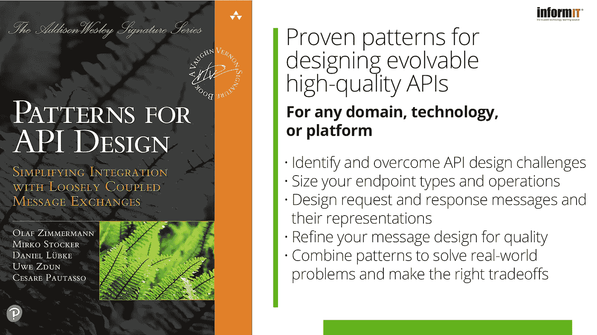
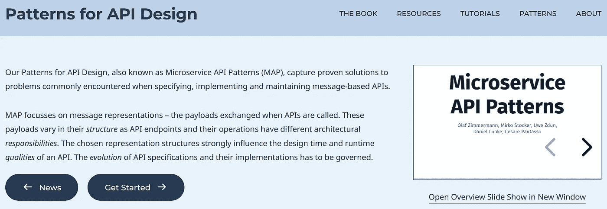
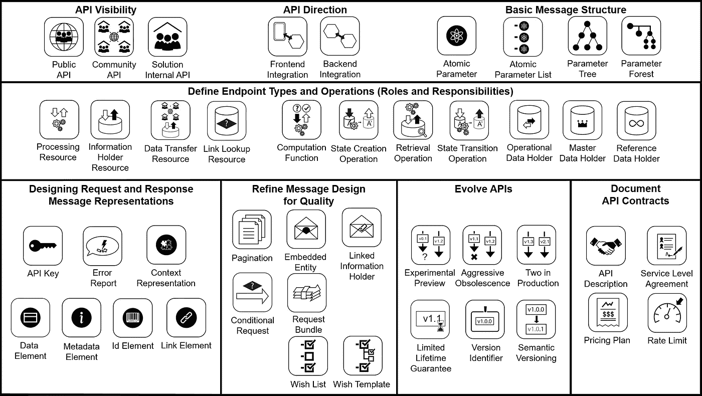
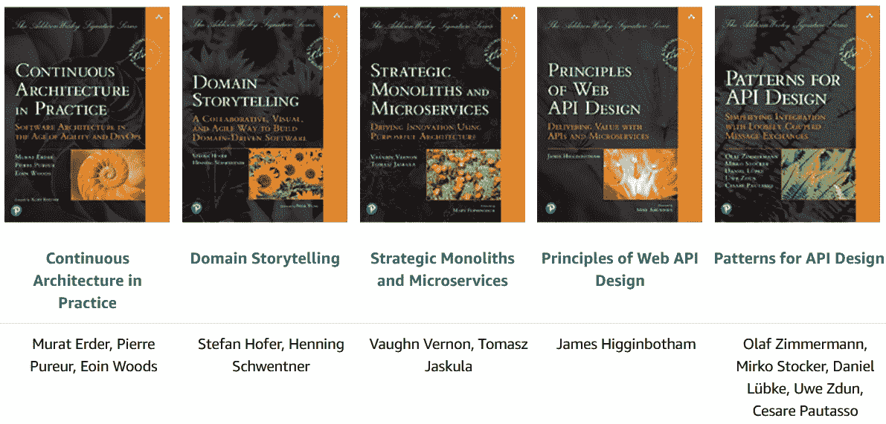

# API 模式网站重新设计，样本书章节可用

> 原文：<https://medium.com/nerd-for-tech/api-patterns-website-redesigned-and-sample-book-chapter-available-df9daf4b5e15?source=collection_archive---------2----------------------->

“API 设计模式”，由 Addison Wesley Professional 出版，现已发行(印刷版和电子书)。样本内容在线提供，我们更新了 API 模式网站。

*新闻(2023 . 3 . 8):*本周接下来的两个 API 设计模式(**# API potw**)分别是 [API Key](https://www.linkedin.com/pulse/api-design-pattern-week-key-olaf-zimmermann/) (来自第六章)和[处理资源](https://www.linkedin.com/pulse/api-design-pattern-week-processing-resource-olaf-zimmermann/)(来自第五章)。敬请期待！

*新闻(2023 年 2 月 17 日):*我在 LinkedIn 上开始了一个名为“本周 API 设计模式”的小文章系列。它以本周的[错误报告](https://www.linkedin.com/posts/ozimmer_api-apidesign-designpattern-activity-7032228740986204160-N3_F)为特色。第一周有[愿望清单](https://www.linkedin.com/pulse/api-design-pattern-week-wish-list-olaf-zimmermann/)，第二周在[分页](https://www.linkedin.com/pulse/api-design-pattern-week-pagination-olaf-zimmermann/)。欢迎评论！

# api-patterns.org

五周前，我们的书终于出版了。从那以后，我和我的合著者米尔科·斯托克重新启动了支持网站，用了一个与书名对应的新域名[api-patterns.org](https://api-patterns.org)。我们重新设计了网站以改进导航:

api-patterns.org 主页

右上角的菜单将带您进入一个[书籍](https://api-patterns.org/book)登录页面，一个[资源](https://api-patterns.org/quickstart-resources)收集补充材料(如演示文稿和文章)的页面，在线[教程](https://api-patterns.org/patterns/tutorials)，到[模式](https://api-patterns.org/patterns/byscope)入口点(如按范围过滤和按期望质量过滤)以及关于作者信息的[。](https://api-patterns.org/about)[幻灯片放映](https://api-patterns.org/slides)可用于演示和研讨会。

我们根据图书结构及其术语更新了[主页](https://api-patterns.org)上的总览图和其他内容组织方式。上下文、已知用途和更多信息部分来自于前书时代，图形解决方案草图也是已经在线可用的中间版本。不过，问题陈述、力量和解决方案总结确实与书中的相符。

# 书籍内容概述和示例

本书的第 1 部分介绍了 API 基础知识、API 的领域模型和确定模式选择问题、选项和标准的决策模型(有 6 个叙述指导 API 设计的概念层次，有 29 个重复的决策)。第 2 部分深入介绍了这些模式，将它们分成五个主题类别。书中的 44 种模式中有 30 种已经过同行评审，并在论文中发表过(但针对本书进行了更新和增强):

按章节进行 API 设计的模式

我们关注 API 端点所承担的架构角色和操作职责，关注请求和响应消息的内容和结构，以及 API 的发展和(一点)契约治理。两篇前言和丰富的样本内容(前言，第 7 章，索引)现在可以在 [InformIT](https://www.informit.com/content/images/9780137670109/samplepages/9780137670109_Sample.pdf) 找到。

InformIT 还有一个 Web extra，文章[“API 中正确的服务粒度是什么？”](https://www.informit.com/articles/article.aspx?p=3153211)。本文以第七章中的两个模式为特色，[嵌入式实体](https://api-patterns.org/patterns/quality/referenceManagement/EmbeddedEntity.html)和[链接信息持有者](https://api-patterns.org/patterns/quality/referenceManagement/LinkedInformationHolder.html)。

# 沃恩·弗农签名系列

我们是 Addison-Wesley Professional[Vaughn Vernon 签名系列](https://www.informit.com/imprint/series_detail.aspx?ser=7937178)的骄傲成员。在撰写本文时，有五本书可供参考:

阅读系列编辑器前言，可在[样本内容](https://www.informit.com/content/images/9780137670109/samplepages/9780137670109_Sample.pdf)中找到，以了解关于该系列的更多信息。弗兰克·莱曼撰写了外部前言，也可以在网上看到。谄媚！

# 订购信息和好评

一些提供“API 设计模式”的在线商店有:

*   [Amazon.com](https://www.amazon.com/Patterns-API-Design-Simplifying-Addison-Wesley/dp/0137670109)
*   [亚马逊英国](https://www.amazon.co.uk/Patterns-API-Design-Simplifying-Addison-Wesley-ebook/dp/B09RV4PMYF)
*   [亚马逊网站](https://www.amazon.de/-/en/Olaf-Zimmermann/dp/0137670109)
*   瑞士奥雷尔·菲舍尔
*   [InformIT(培生)](https://www.informit.com/api-patterns)

这本书在亚马逊 Kindle 商店发布后的大约一周时间里(时断时续),成功登上了网络编程新人排行榜的榜首。它还一度成为计算机系统分析设计新人的第一名。在“超级类别”[计算机科学](https://www.amazon.com/gp/new-releases/digital-text/16977169011)中，我们观察到它在新发布中的最佳位置是第四😇。

这本书的九个背书出现在书的第一、第二和第三页，就在封面后面(例如，参见[样本内容](https://www.informit.com/content/images/9780137670109/samplepages/9780137670109_Sample.pdf))。Gregor Hohpe、Fabrizio Montesi 和 Tiago Boldt Sousa 在 [LinkedIn](https://www.linkedin.com/) 上给出了额外的积极反馈。非常感谢大家！

# 包裹

对于模式爱好者和架构知识管理者来说，这无疑是激动人心的时刻。😃

让我引用序言来结束我的发言:

> “我们希望您会发现我们的成果是有用的，这样我们的模式就有机会进入集成架构师和 API 开发人员的全球社区的知识体系。我们将很高兴听到您的反馈和建设性的批评。”

- Olaf(作为“API 设计模式”的合著者)

*原载于 2022 年 12 月 15 日*[*https://ozimmer . ch*](https://ozimmer.ch/patterns/2022/12/16/APIPatternsBookWebsite.html)*。*