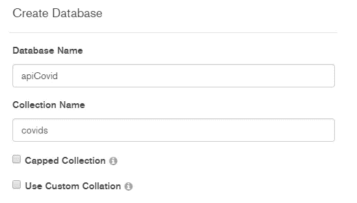
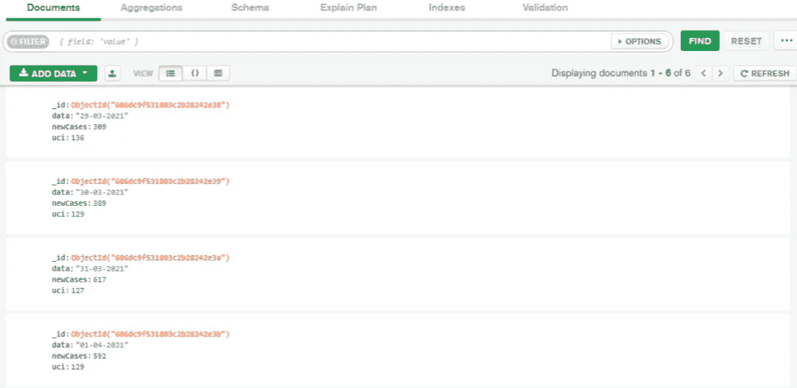
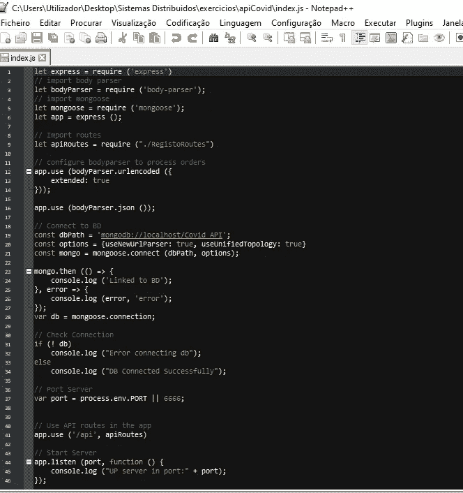
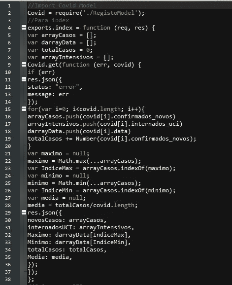
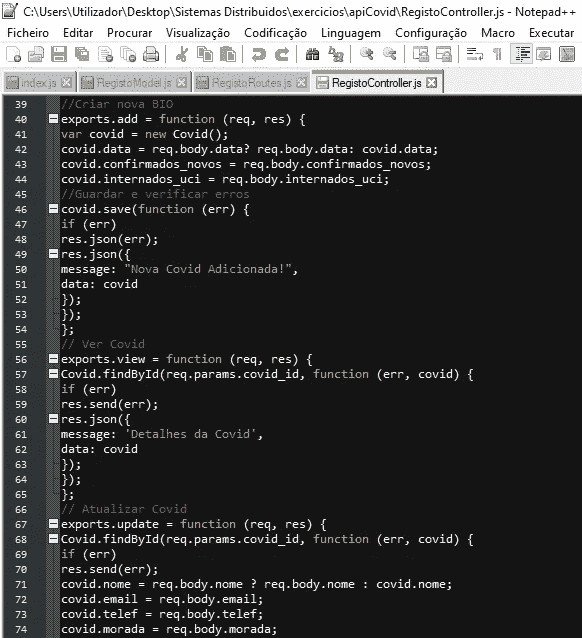
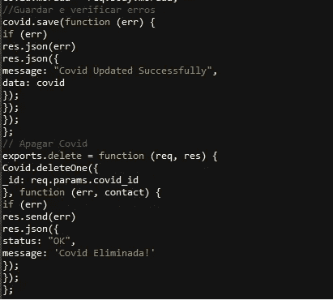
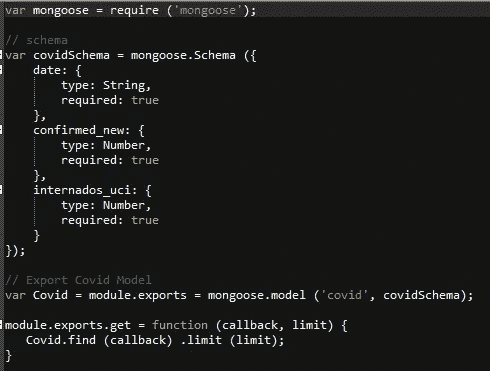
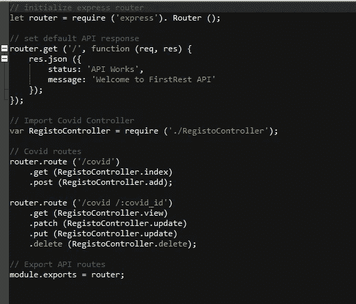
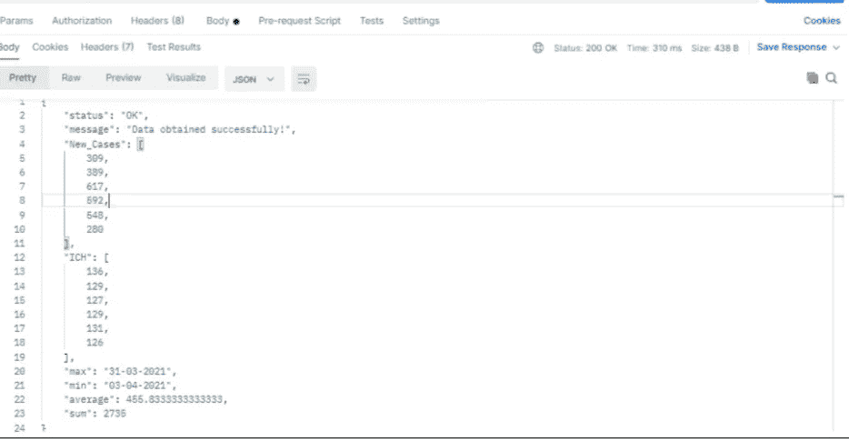

# API:显示真实数据 Covid19

> 原文：<https://medium.com/nerd-for-tech/api-show-real-data-covid19-2a0c26eda2e8?source=collection_archive---------21----------------------->

因此，在本教程中，我们将演示如何显示 2003 年 3 月 29 日至 2004 年 3 月之间的新冠肺炎数据:

>列出新增病例数(针对一周内所有天数)
>列出重症监护接诊数(针对一周内所有天数)
>新增病例多的一天
>新增病例少的一天
>平均 7 天
>一周新增病例总数

因此，第一步是为这个项目创建一个名为 **CovidApi，**的文件夹，然后我们将在 Node.js 命令提示符中键入以下命令:

> npm 初始化
> 
> npm 安装—保存快速主体解析器 mongoose

下一步是创建 JavaScript 文件:

**index . js
covid controller . js
covid model . js
covid routes . js**

然后转到以下网站:

> [https://covid19-api.vost.pt/](https://covid19-api.vost.pt/)

选择:“*/Requests/get _ entry/{ date _ 1 } _ until _ { date _ 2 }*”。

点击 ***【试用】*** 然后在 date_1 和 set date***29–03–2021***和 date _ 2 set date***4–4–2021****a*最后点击执行。

然后下载 JASON 文件。

下一步是打开 MongoDB Compass，并使用以下名称创建一个新数据库:

下一步是进入**创建的数据库**，点击**添加数据**然后导入文件，选择输入文件类型 **JSON** ，浏览之前下载的文件。

导入后，输出应该如下所示:

下一步是编写我们之前创建的 JavaScript 文件。

我们的 Index.js 文件键入以下代码:

对于控制器文件，键入以下代码:

向模型文件中键入以下代码:

对于我们的路由文件，键入以下代码:

最后一步是在 Postman 上测试我们的 API。

地址为[http://localhost:6666/API/covid/](http://localhost:6666/api/covid/)

而方法就是 **GET。**

输出应该如下所示:

