# 用 Cypress 进行 API 测试

> 原文：<https://medium.com/nerd-for-tech/api-testing-with-cypress-136ffdc2520f?source=collection_archive---------5----------------------->


作为测试自动化工程师，我们通常开发两组测试。UI 和 API 的测试。命令行通常用于进行 API 测试，UI 由浏览器执行。每次我们执行用户界面和 API 测试的项目时，我们总是利用我个人经验中不同的工具。这可能很好，因为我们必须不断确保我们的测试工具箱不断增长，以便我们知道哪一个最适合我们的需求，但是市场上有如此多的工具可以帮助我们进行 API 测试。我认为 Postman 可能是最受欢迎的，因为我们可以根据请求播放图形。例如，如果您必须在 CI 管道上进行邮差测试，您必须利用 Newman，它是它的可比测试运行器。SuperTest 和 Chai-HTTP 是其他著名的 JavaScript 测试框架。放心吧，空手道只是在 Java 星球上的几个例子。

如果我说我们可以使用相同的 UI 工具来测试我们的 API 呢？我们可以在命令行上为我们的 API 测试添加一个可视化测试运行程序吗？

它开发了对服务器请求的支持，这在 Cypress 中很棒。因为我们可以访问测试运行器，所以调试我们的 API 测试很简单。我们总是可以再次检查我们的 API 的状态，并且可以访问 DevTools，它可以提供额外的信息来帮助我们的测试。

**cy.request()**

默认情况下，cy.request()表示一个 GET 应用程序。然而，这是非常通用的，支持所有的 HTTP 操作，比如 POST、DELETE 和 PUT。

让我们看一些例子:

```
describe('http://jsonplaceholder.typicode.com/',()=>{
    it('GET', ()=>{
        cy.request('http://jsonplaceholder.typicode.com/todos')
            .its('headers')
            .its('content-type')
            .should('include','application/json');
    })
})
```

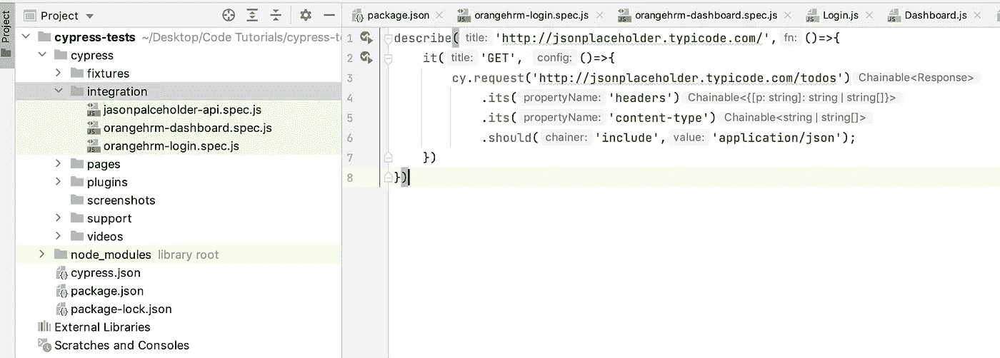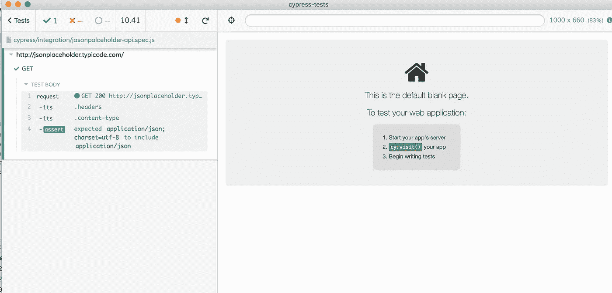

让我们看看如何利用 Cypress 中的别名来引用请求。

```
describe('http://jsonplaceholder.typicode.com/',()=>{
    beforeEach('UserAPI',()=>cy.request('http://jsonplaceholder.typicode.com/users').as('users'))
    it('GET', ()=>{
        cy.get('@users').its('status').should('be.equal',200);
        cy.get('@users').its('body').should('have.length',10);
    })
})
```

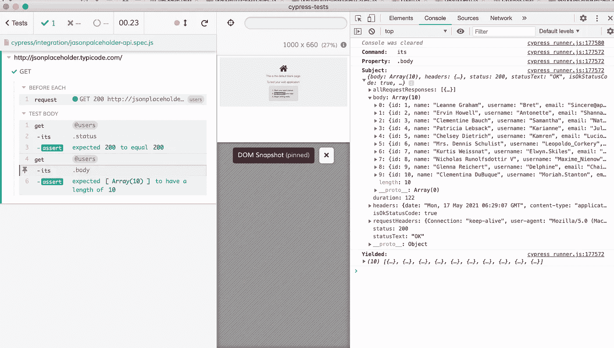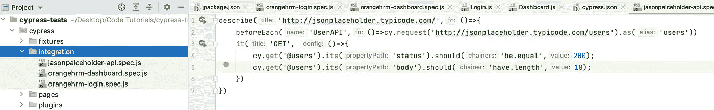

让我们给测试添加更多的验证

```
describe('http://jsonplaceholder.typicode.com/',()=>{
    beforeEach('UserAPI',()=>cy.request('http://jsonplaceholder.typicode.com/users').as('users'))
    it('GET', ()=>{
        cy.get('@users').its('status').should('be.equal',200);
        cy.get('@users').its('body').should('have.length',10);
        cy.get('@users').its('body').its('0').should('include', { email: "Sincere@april.biz" });
        cy.get('@users').its('body').its('7').its('phone').should('be.equal','586.493.6943 x140');
    })
})
```

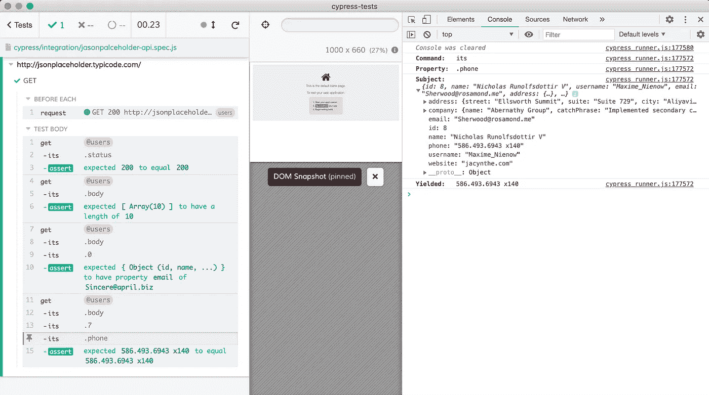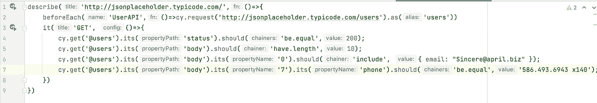

**使用 cy-api 插件**

如果您不想自动加载 DevTools 控制台，另一种方法是利用 cy-api 插件。这个插件将返回对测试运行程序的请求和响应，它通常提供应用程序预览。这个插件的使用非常简单，只需要一些修改。

您需要通过运行以下命令来安装插件:

```
npm install --save [@bahmutov/cy-api](http://twitter.com/bahmutov/cy-api)
```

然后在 support/index.js 文件中，添加以下行:

```
import '@bahmutov/cy-api/support';
```

然后将这一行添加到 cypress.json 中

```
"baseUrl": "http://jsonplaceholder.typicode.com"
```

然后将文件修改如下:

```
describe('Post API', () => {  it('loads all the posts successfully', () => {    cy.api({ url: '/posts' }).then((res) => {      expect(res.status).to.equal(200);      expect(res.body.length).to.equal(100);    });  });   it('loads the correct amount of posts per user', () => {    cy.api({ url: '/posts?userId=1' }).its('body').should('have.length', 10);  });   it('should add a new post successfully', () => {    cy.api({      method: 'POST',      url: '/posts?userId=1',      body: {        userId: 1,        title: 'foo',        body: 'var',      },    }).then((response) => {      expect(response.status).to.equal(201);      expect(response.body.id).to.equal(101);    });  });   it('should delete a post successfully', () => {    cy.api({ method: 'DELETE', url: '/posts/1' })      .its('status')      .should('be.equal', 200);  });});
```

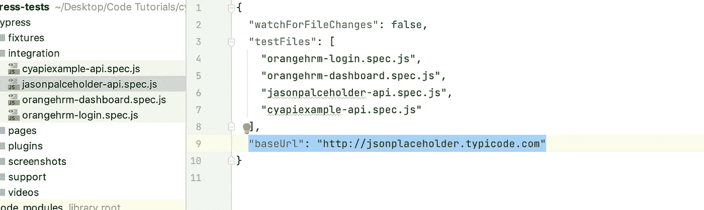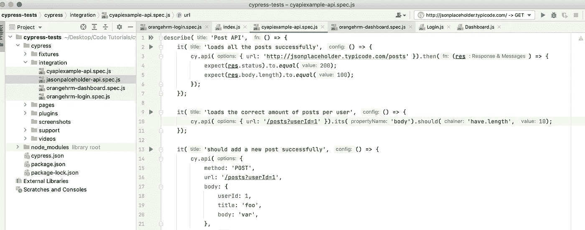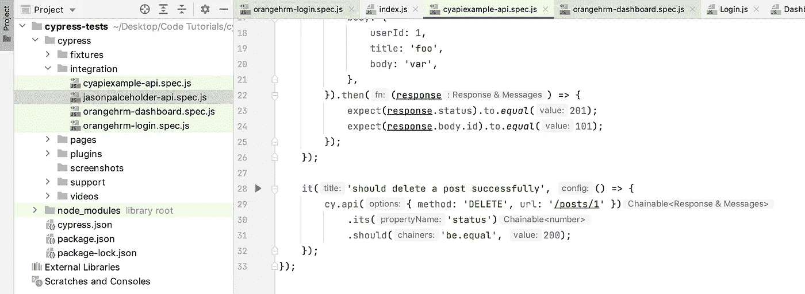

然后，您可以在 UI 测试运行器中看到没有开发工具的结果

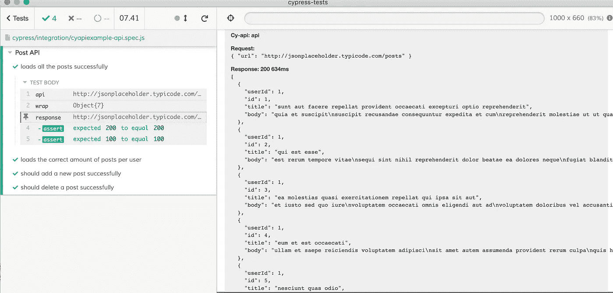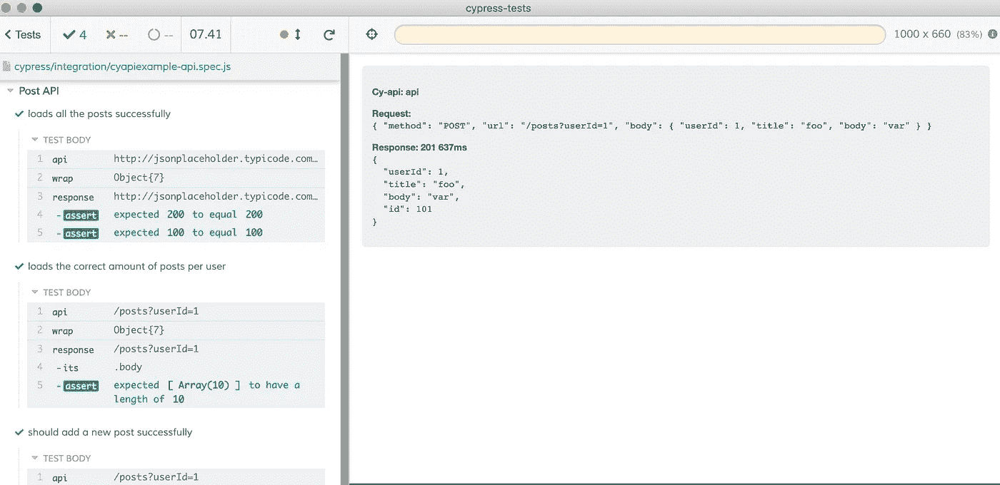

最后，让我们使用终端运行代码

```
npx cypress run --spec cypress/integration/cyapiexample-api.spec.js
```

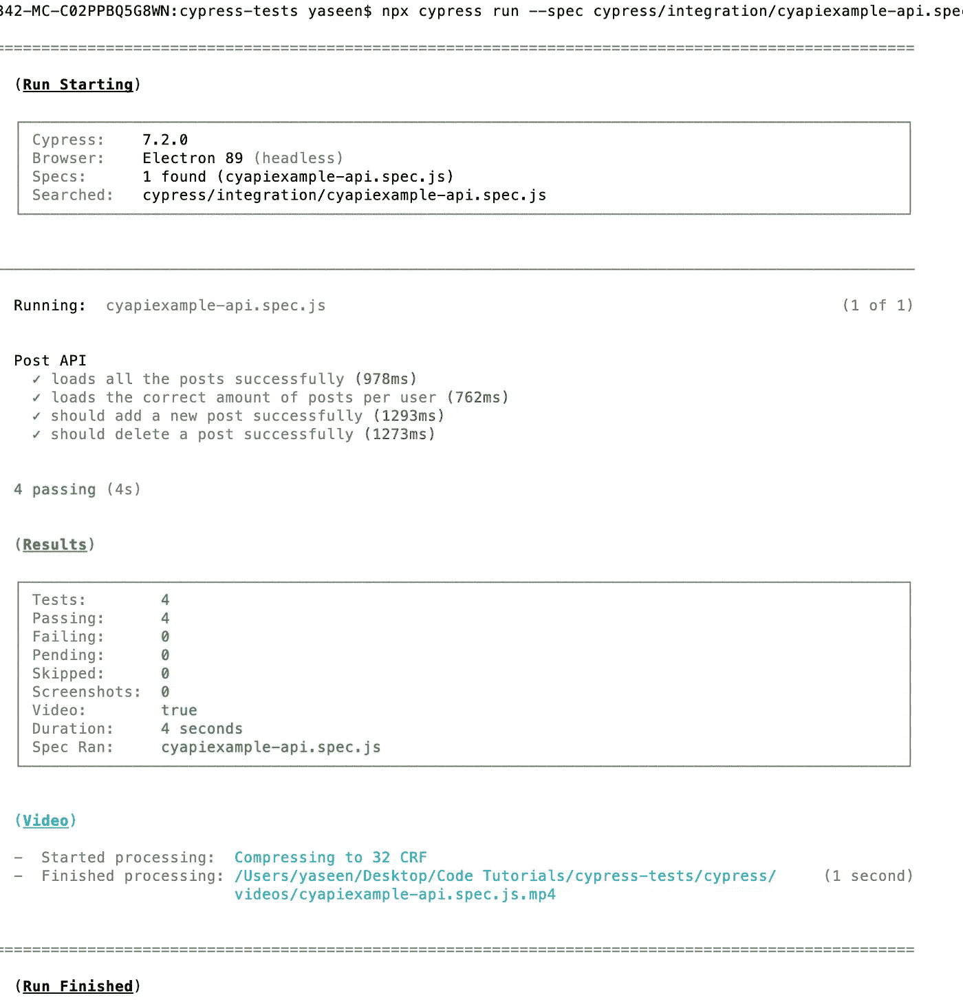