# 使用外部路由和控制器的 API(express js 和 MongoDB)

> 原文：<https://medium.com/nerd-for-tech/api-using-external-routes-and-controllers-expressjs-and-mongodb-1b7005bf31c3?source=collection_archive---------7----------------------->

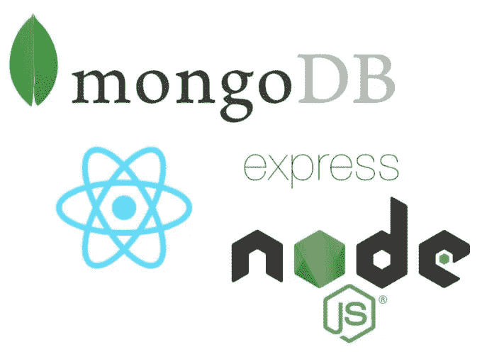

如果你是使用 NodeJs 的新手，我建议你检查一下我以前的教程:

[**如何在 Node.js 中制作自己的第一个程序**](https://antunes-24-pedro.medium.com/how-to-make-your-first-program-in-node-js-8978fd1163ed?source=your_stories_page-------------------------------------) 和 [**如何在 node.js 中创建服务器**](https://antunes-24-pedro.medium.com/how-to-create-a-server-in-node-js-9ff397a81e05?source=your_stories_page-------------------------------------) **。**

第一步是创建一个名为 **BioUtilizadores** 的文件夹，然后在 nodeJs 命令提示符下键入:

> npm 初始化

下一步是通过键入以下命令来安装所需的扩展:

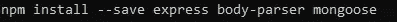

然后，我们将创建一个名为 index.js 的 JavaScript 文件，并编写以下代码:

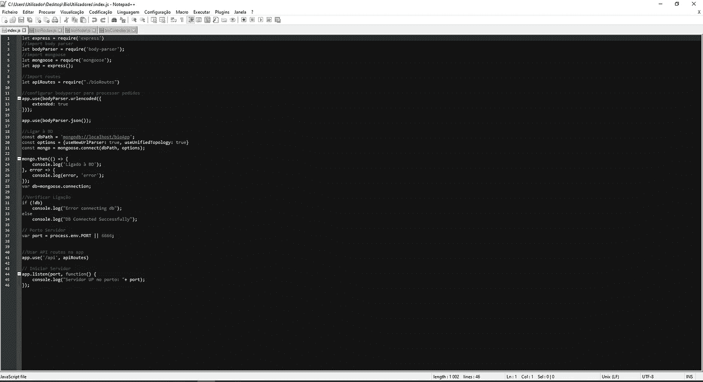

索引代码

之后，创建一个名为**生物模型**的 JavaScript 文件，并编写以下代码:

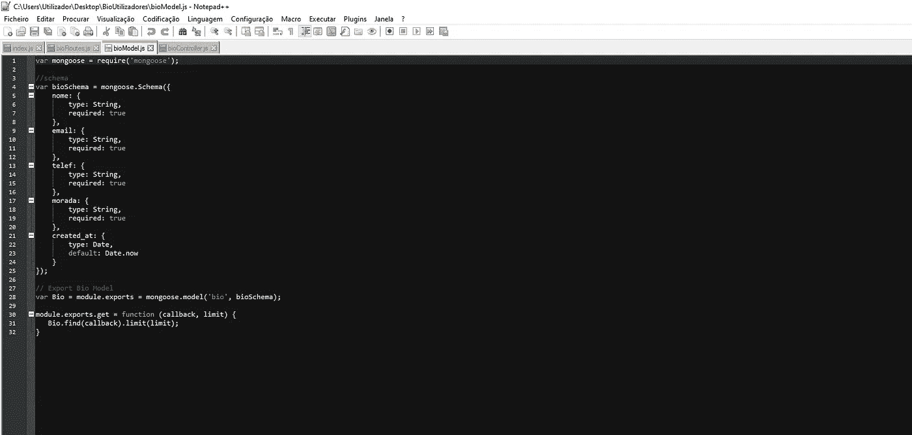

生物模型文件

之后，创建一个名为 **bioController** 的 JavaScript 文件，并编写以下代码:

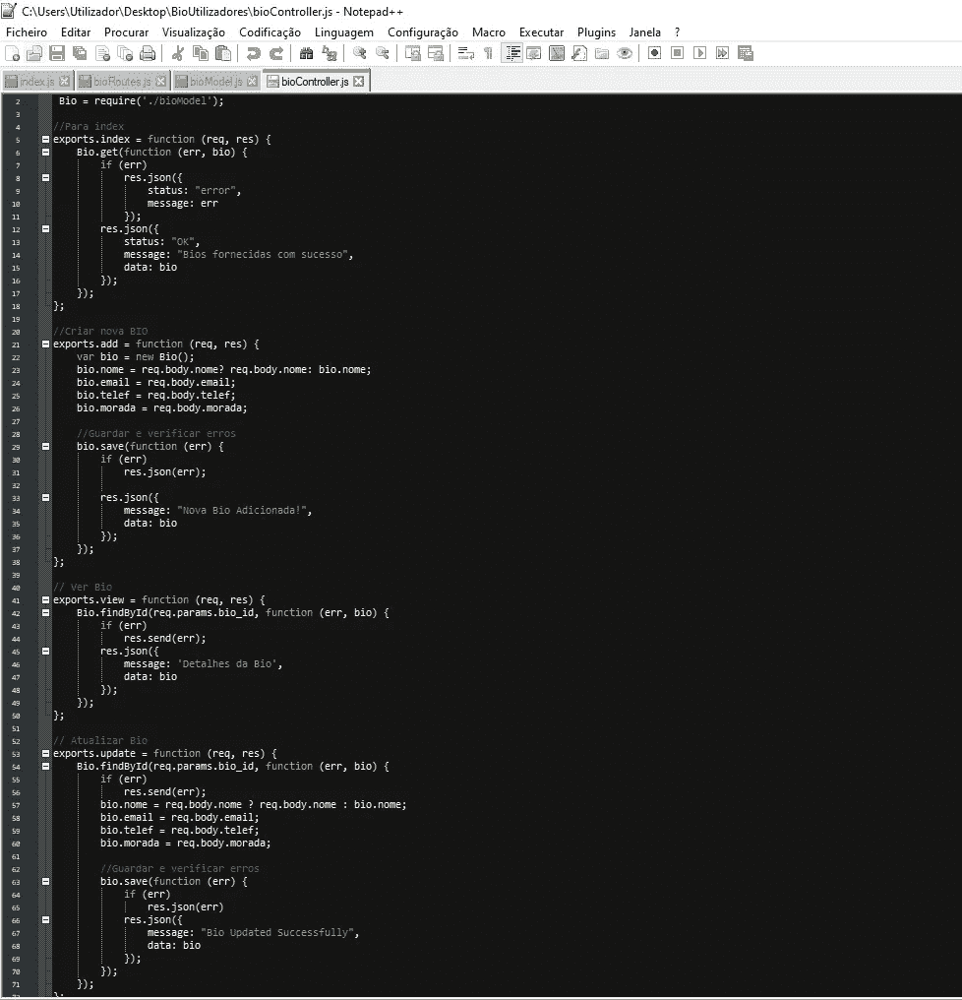

生物控制文件

之后，创建一个名为 **bioRoutes** 的 JavaScript 文件，并编写以下代码:

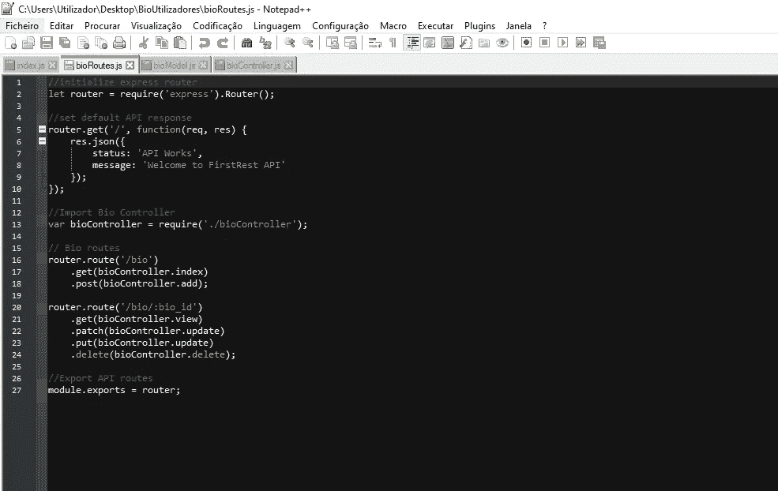

生物路由文件

现在是时候通过键入以下命令来启动我们的服务器了:

> 节点索引. js

输出应该如下所示:

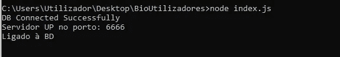

产出 1

为了测试我们的 API，我们将使用 Postman 点击[这里](https://www.postman.com/downloads/)下载它。

选择**获取方法**并在下图中输入 url，输出如下:

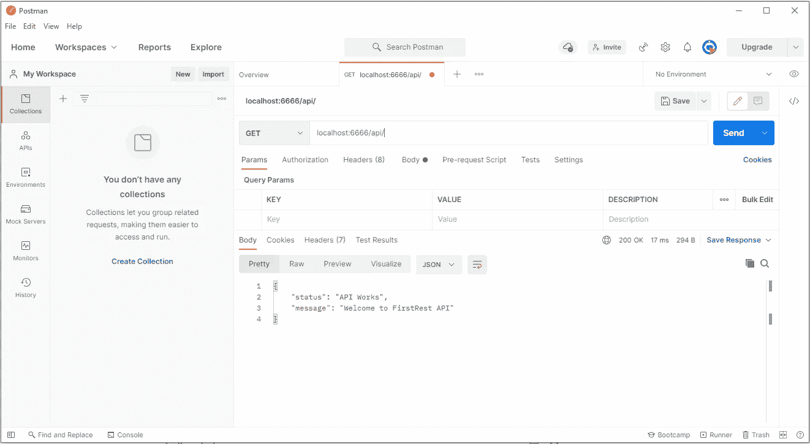

产出 2

选择 **Post 方法**并在下图中输入 url，输出如下:

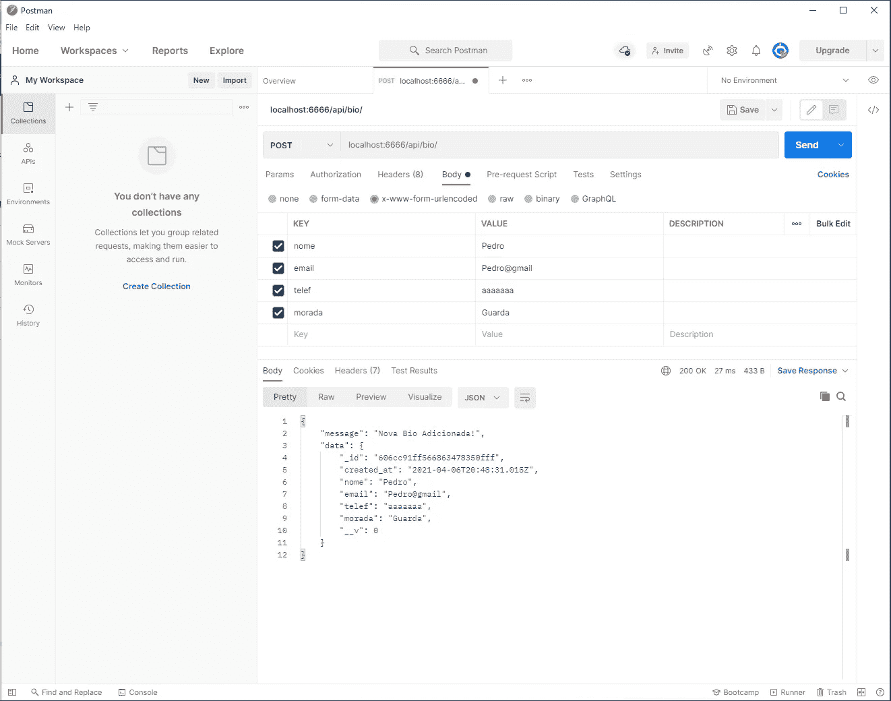

产出 3

选择**获取方法**并在下图中键入 url，输出应该如下所示:

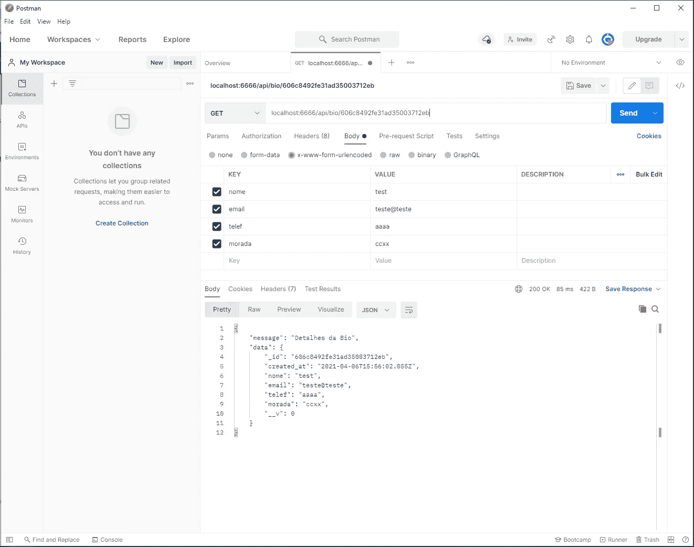

产出 4

选择**删除方法**并在下图中键入 url，输出应该如下所示:

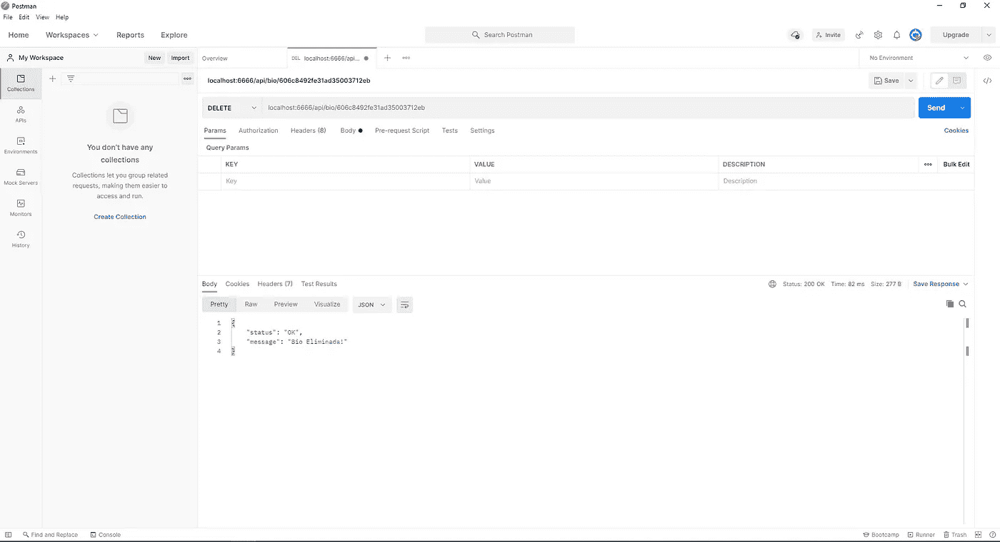

产出 5