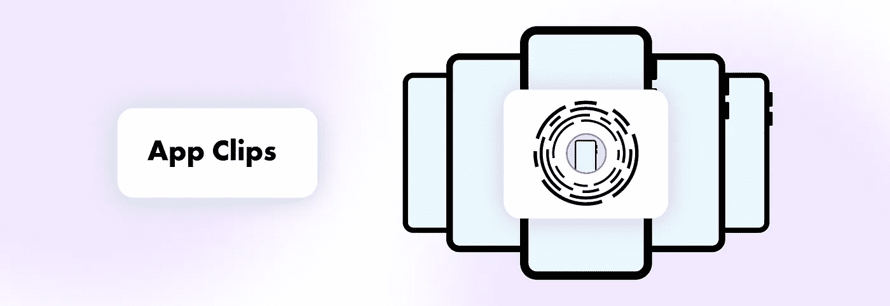
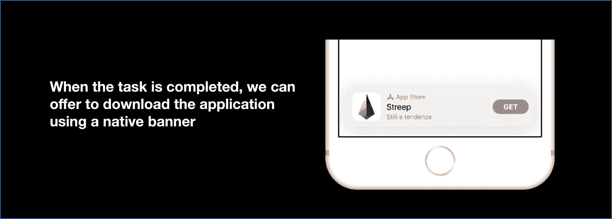
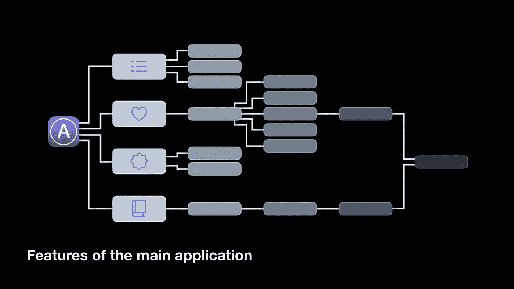
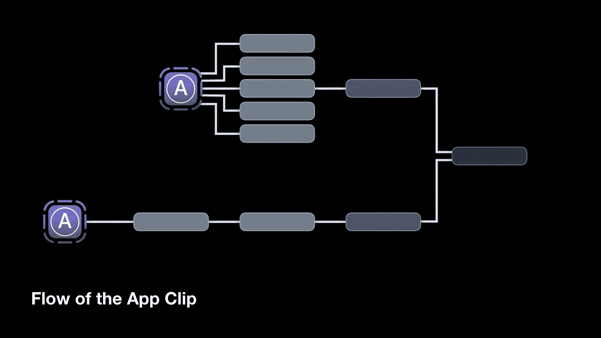
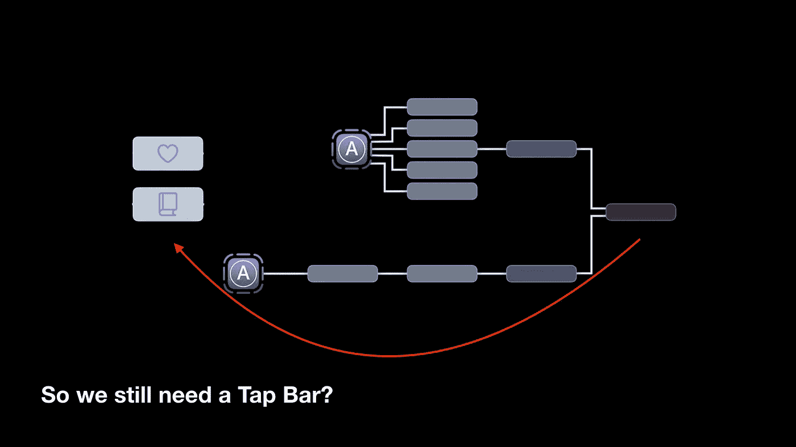

# 应用程序剪辑:快速执行特定任务的小版本应用程序

> 原文：<https://medium.com/nerd-for-tech/app-clip-a-small-version-of-an-application-for-performing-specific-tasks-quickly-fdd8a20ca6a?source=collection_archive---------8----------------------->

App Clip 是一个轻量级的应用程序，它可以快速执行特定的任务，而无需下载或安装应用程序本身。

用户如何启动应用程序剪辑:

*   通过扫描二维码；
*   通过读取 NFC 标签；
*   通过将它与网站关联，以便在查看网站时可以在浏览器中看到它，或者在收到链接后可以在信息中看到它。

除了通常的启动方法，应用程序剪辑还可以与 Apple Maps 中的地理位置和位置卡相关联。这意味着当用户在特定位置时，他可以从苹果地图上启动应用程序剪辑或获得 Siri 建议。

这些是 iOS 版本的二维码，可以包含图形代码或 NFC 标签。在这种情况下，会有相应的图标(NFC 标签或摄像头)。这些代码可以定制成不同的颜色。既然是苹果，那么对它的尺寸和各种打印建议有几个要求。

**来自苹果的明显指导方针**

应用程序剪辑必须专注于通过提供任何所需应用程序的临时访问权限，为您的任务提供最快的解决方案。

当然，苹果为应用程序剪辑提供了具体的指导方针:

*   不要仅出于营销目的使用应用程序剪辑。应用程序剪辑应该有真正的价值，并帮助用户解决他们的任务。不能用来做广告；
*   确保人们可以立即使用应用程序剪辑。应避免闪屏；
*   在用户可以尝试 App Clip 之前，避免用户注册；
*   不要催促用户安装应用程序的完整版本。

**只有当任务完成后，你才可以使用本地横幅下载你的应用程序。**

尽管如此，在用户完成他的任务之后(例如，在咖啡店的应用程序剪辑中购买一些咖啡)，可以显示用于下载应用程序的系统横幅。

**苹果公司的指导方针:**

*   使应用程序剪辑可共享。用户在 iMessage 上分享 App Clip 的链接后，接收者就可以启动它了。提供分享应用程序剪辑中特定功能的链接的功能，并鼓励用户与朋友分享应用程序剪辑；
*   与主应用程序的一致性。在安装了主应用程序的情况下启动 App Clip 会导致主应用程序的启动。因此，重要的是他们两人的行为方式相同。如果标签指定了购买一杯咖啡的流程，应用程序也必须启动购买咖啡的流程。
*   通常，主应用程序要求用户在做任何事情之前登录，但在应用程序剪辑中，注册应该被排除或至少推迟到流程的最后阶段；
*   与应用程序剪辑的交互应该快速而集中。需要限制功能集，将复杂的留在主应用中；
*   启动应用程序剪辑时，应仅显示其功能的相关部分。

典型的应用程序通常是这样的。

对于 App Clip，我们必须缩小功能集，以帮助您快速解决特定任务。

避免复杂的导航组件，如标签栏或侧菜单。直接基于上下文运行流程。

所以，毕竟，你仍然需要一个标签栏。

与此同时，苹果公司要求我们解释使用 App Clip 执行多项任务的原因。用户必须有可能使用不同的应用程序剪辑的服务/功能/地理位置，并在它们之间切换。

**限制**

*   应用程序剪辑的重量不应超过 10MB。这并不多，如果我们正在谈论将 App Clip 添加到现有项目中的可能性，这可能是相当困难的，因为编写的应用程序可能已经有一些重型库。比如 iOS 的第三方数据库库已经差不多 10MB 了。Luna SDK 框架总重量超过 100MB。事实上，我们可能不会将它们与 App Clip 联系起来。但是，如果客户最初希望看到使用这些库的特定特性，该怎么办呢？然后就让 app 剪辑对这个 App 没用了。
*   每个应用程序只能有一个应用程序剪辑。如果客户出售咖啡和面包，那么一个应用程序剪辑应该用于快速购买。您不能为咖啡创建单独的应用程序剪辑，而为面包创建另一个不同的应用程序剪辑。
*   敏感数据在应用程序剪辑中不可用:Apple Music 和 Media、日历、联系人、文件、健康、提醒、照片、健身等数据。
*   不可能确定地理位置(只有一些例外)。

**缺失的框架:**

*   后台任务；
*   CallKit
*   护理包；
*   CloudKit
*   联系人；
*   核心运动；
*   EventKit
*   文件提供者；
*   HealthKit
*   HomeKit
*   媒体播放器；
*   消息；
*   PhotoKit
*   研究工具包；
*   SensorKit
*   演讲。

并不是所有的都失去了。至少我们可以确认地理位置。

App Clips 不能像完整版的 App 那样直接使用地理定位。

但如果 App Clip 的启动的处理依赖于地理位置，例如:在你所在街道的特定咖啡店购买咖啡，而不是确定实际位置，App Clip 可以使用一个 API 来确保用户在特定的区域。在这种情况下，App Clip 卡片会提到这个 App Clip 可以检查你的地理位置。

这就是为什么没有通常的“允许位置访问”弹出窗口，但用户可以在启动 App Clip 之前拒绝这张卡上的位置检查权。

**App 夹卡**

App Clip 卡是通过 App Store Connect 设置的。

您可以像更改卡片上的文本一样更改蓝色按钮上的文本(在 App Store Connect 门户上有说明)。这不能用任何其他方法来做。

应用程序剪辑仅随应用程序一起上传到 App Store。您不能单独更新应用程序或应用程序剪辑。

**有哪些可能性？**

-重用主应用程序的源代码。这并不总是可能的，因为遗留项目可能不会在应用程序的架构中使用模块化方法，这使得在劣质应用程序中重用代码是不可能的。

在这种情况下，您必须重构应用程序或从头开始创建应用程序剪辑。

-如果我们看看引擎盖下面，App Clip 是使用常规 URL 启动的。这种 URL 的参数可以包含所有必要的信息，例如上下文(购买咖啡或面包)、坐标/标识符/地点名称。

-推送通知可显示 8 小时。

- Apple Pay 和用苹果签到也可以。

您可以将一些数据写入磁盘，并在安装主应用程序的过程中传输这些数据。但是如果这个 App 剪辑长期不用，系统可以删除这个数据，它就永远丢失了。

应用剪辑是提高应用转化率的好方法。用户可以在邮局快速领取包裹，在商店的订单领取点排队，或在商场支付停车费用，而无需下载或安装主应用程序。

*—
弗拉迪斯拉夫·索西克
iOS 开发者在* [*阿尔蒂*](http://alty.co)