# 使用 Firebase 在 Expo 应用中进行苹果/谷歌认证

> 原文：<https://medium.com/nerd-for-tech/apple-google-authentication-in-expo-apps-using-firebase-997125440032?source=collection_archive---------0----------------------->

您正在使用 Firebase 通过电子邮件和密码验证您的 Expo 应用程序用户。它工作得很好，但营销漏斗似乎表明用户在注册屏幕上退出了应用程序。看起来提供社交登录选项将有助于缓解这个问题，市场部说，现在你想在你的应用程序中添加苹果登录和谷歌登录。2021 年 2 月就是这么干的！

要跟进这个故事，你需要满足这两个要求。您可以在 React Native apps 中的 [*电子邮件身份验证中使用 Firebase*](https://capelski.medium.com/email-authentication-in-react-native-apps-using-firebase-a474bb2d24f) *:* 查看如何操作

*   *拥有一个已启用身份验证的 Firebase 项目*
*   *通过 Firebase* `*onAuthStateChanged*` *监听器*处理成功的用户认证

## React Native 中的 Firebase 限制

Firebase Javascript SDK 有一个名为`signInWithPopup`的特定方法来使用 OAuth 处理身份验证提供者的登录流。根据 Firebase [苹果认证文档页面](https://firebase.google.com/docs/auth/web/apple)将指导我们以如下方式处理登录流程:

然而，在 React 本机应用程序中使用这种方法会引发异常。这是因为 Firebase Javascript SDK 是为 web 应用程序设计的，而`signInWithPopup`方法希望应用程序在浏览器中运行。青蛙！我们需要找到另一种方法来做这件事。

> 错误:运行此应用程序的环境不支持此操作。“location.protocol”必须是 http、https 或 chrome-extension，并且必须启用 web 存储。

幸运的是，我们正在利用世博会🎉世博会为此专门设计了两个模块:`[expo-google-app-auth](https://docs.expo.io/versions/latest/sdk/google/)`和`[expo-apple-authentication](https://docs.expo.io/versions/latest/sdk/apple-authentication/)`。这两个模块都根据相应的提供者对用户进行身份验证，并通过`signInWithCredential`方法返回一个可用于在 Firebase 中对用户进行身份验证的凭证。

*事实上 Expo 提供了两个模块来针对 Google 认证用户:* `[*expo-google-app-auth*](https://docs.expo.io/versions/latest/sdk/google/)` *和* `[*expo-google-sign-in*](https://docs.expo.io/versions/latest/sdk/google-sign-in/)` *。它们都实现了相同的目标，但后者使用原生 Google 身份验证，而前者使用安全系统 web 浏览器。在实践中，这意味着* `*expo-google-sign-in*` *需要更多的配置，并且它在 Expo Go 客户端中不工作。请随意使用您更喜欢的那个。*

制定好策略后，只需完成两个模块中每个模块的必要步骤。我们一个一个来。

## 使用 Google 登录

继续安装`[*expo-google-app-auth*](https://docs.expo.io/versions/latest/sdk/google/)`。然后，我们将使用简单的`logInAsync`方法来获取用户凭证。该方法至少需要三个参数:`androidStandaloneAppClientId`、`iosStandaloneAppClientId`和`scopes`。

前两个是 OAuth 2.0 客户端 id，当您激活相应的身份验证提供者时，Firebase 会自动生成这些 id，而第三个是 OAuth 2.0 范围的列表。在进入代码之前，让我们启用 Google 身份验证提供者并获取我们的客户端 id。

导航到**认证** > **登录方式**并启用 Google。保存更改后, *Web 客户端 ID* 和 *Web 客户端密码*字段将被填充，但这不是我们正在寻找的客户端 ID。

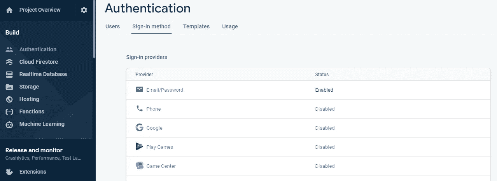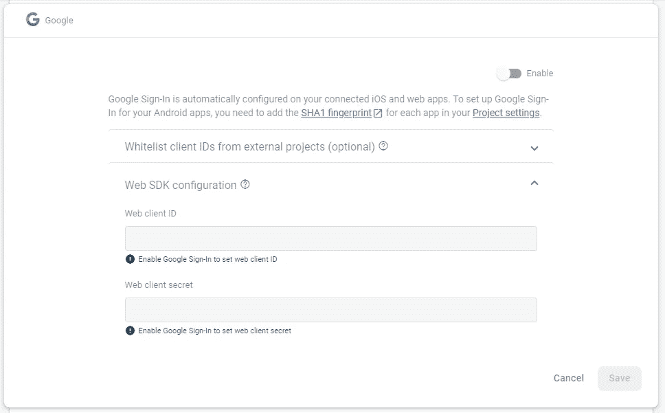

我们需要的客户端 ID 是启用 Google sign-in 方法后生成的，可以在相应的 Google 云平台项目中找到。转到[https://console.cloud.google.com/](https://console.cloud.google.com/)，选择 Firebase 项目(每个 Firebase 项目创建一个关联的 GCP 项目)并导航到**API&服务** > **凭证**。在那里，您将看到 OAuth 2.0 客户端 id 列表:

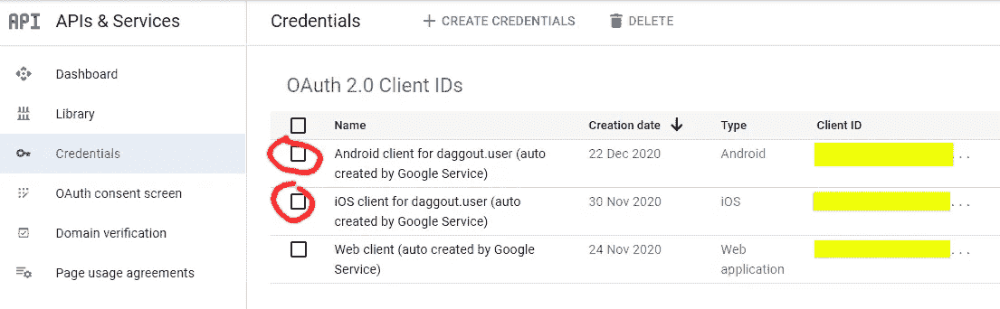

太好了！现在让我们将这些客户端 id 放入一些代码中💪您可能希望为客户机 id 创建环境变量，而不是将它们包含在源代码中，但是为了简单起见，我在这里没有这样做。

`logInAsync`调用返回一个带有操作结果的承诺。如果结果类型等于`success`，那么我们将在结果中找到`idToken`和`accessToken`，我们将通过创建一个 GoogleAuthProvider 凭证来使用它们在 Firebase 中验证用户。如果结果等于`cancel`表示用户没有完成签到流程。简单得像 123！

请记住，上面的代码不能在 Expo Go 客户端上运行。您可以**在 Google Play 控制台上创建一个新的内部测试版本**并将应用程序安装在 Android 设备上，或者**生成新的 OAuth 2.0 客户端 id**用于测试目的，并使用`androidClientId`和`iosClientId`参数将它们传递给`[logInAsync](https://docs.expo.io/versions/latest/sdk/google/#loginasync)`(在这种情况下，您将需要 4 个客户端 id)。

## 登录 Apple

在开始配置苹果登录服务之前，我建议你阅读[丹·辛格](/@dansinger_68758/adding-sign-in-with-apple-to-a-managed-expo-app-using-firebase-authentication-ca331b4de05)的这个有用的故事。在那里，你会发现在将苹果登录添加到 Expo 应用程序之前必须考虑的一些因素，以及如何操作的解释。在这个故事中，我会用更多的细节来扩展他的教程。

毫不奇怪，苹果的登录比谷歌的更复杂，人们很容易跳过它。不过苹果不会这么容易。如本节应用商店审核指南 *中的* [*所述，“使用社交登录服务(如 Google sign-in)的应用也必须提供与 Apple Sign-in 同等的选项”。因此，让我们尽最大努力让它发挥作用！*](https://developer.apple.com/app-store/review/guidelines/#sign-in-with-apple)

首先我们需要安装必要的模块:`[expo-apple-authentication](https://docs.expo.io/versions/latest/sdk/apple-authentication/)`和`[expo-crypto](https://docs.expo.io/versions/latest/sdk/crypto/)`。我们将使用来自`expo-apple-authentication`模块的`signInAsync`方法，就像我们之前做的那样，获取用户的凭证，然后使用这些凭证在 Firebase 中验证用户。

这次的不同之处在于`signInAsync`没有返回 OAuth 访问令牌。正如 [Dan Singer](https://medium.com/u/330d41d6c635?source=post_page-----997125440032--------------------------------) 在他的故事中所指出的，我们可以通过向`signInAsync`函数提供一个 SHA256 哈希随机数，然后将原始随机数传递给 Firebase 的`signInWithCredential`来解决这个问题。这就是为什么我们还需要`expo-crypto`模块。让我们把这些放在一起:

`requestedScopes`参数是 OAuth 2.0 范围的列表。毕竟没那么复杂！接下来我们需要关心的是 UI。虽然谷歌让你以你想要的方式显示他们的登录按钮，但苹果会要求你使用指南批准的按钮。事实上，因为登录按钮不符合要求而被拒绝是正常的。

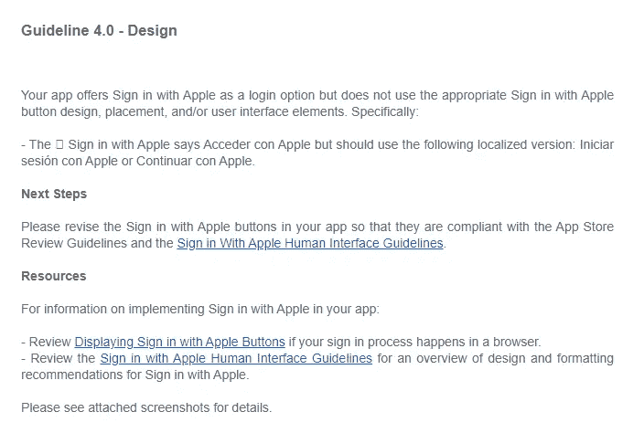

由于登录按钮不合规，App Store 拒绝电子邮件

防止拒绝的最简单方法是使用世博会为我们提供的“合作”按钮。请记住，苹果登录只能在 iOS 设备上运行，所以我们需要在呈现按钮之前检查它是否可用。世博会让我们了解了`isAvailableAsync`方法:

嗯！代码准备就绪后，我们现在可以继续配置服务了。让我们从苹果开始，然后我们将处理 Firebase。Expo 团队在记录`[expo-apple-authentication](https://docs.expo.io/versions/latest/sdk/apple-authentication/)`页面中的必要步骤方面做得很好，所以请务必看一看。

首先将`usesAppleSignIn`属性添加到您的`app.json`配置文件中。然后前往[苹果开发者门户](https://developer.apple.com/)做以下两件事:

*   为您的应用 ID 启用使用 Apple 登录功能。导航至**证书、ID&档案** > **标识符**并选择您的应用 ID。在功能列表中选择*登录苹果*，点击*配置*。保持 *Enable as a primary App ID* 选项处于选中状态，并提供 Firebase 应用的返回 URL([Firebase Apple 认证文档页面](https://firebase.google.com/docs/auth/web/apple#configure-sign-in-with-apple)中的步骤 1)

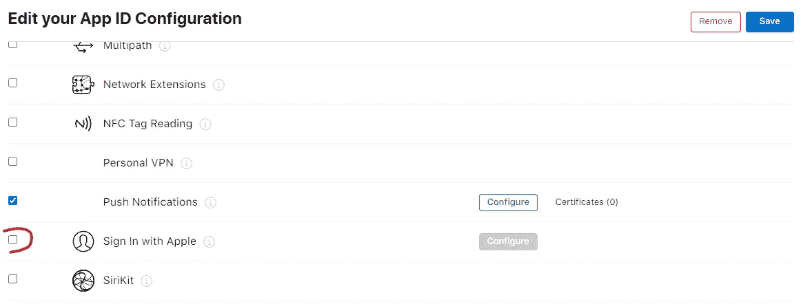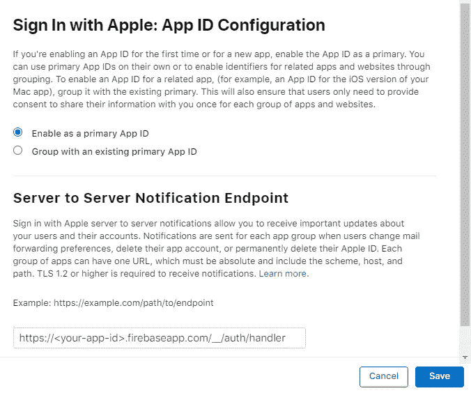

*   在你的应用私钥中启用使用 Apple 服务登录。如果你的应用尚未使用私钥，你需要创建一个新的。导航到**证书、id&配置文件** > **密钥**并选择您的密钥。点击*编辑，*选择*登录苹果*服务，点击*配置*。在主要应用 ID 列表中，选择您的应用 ID。

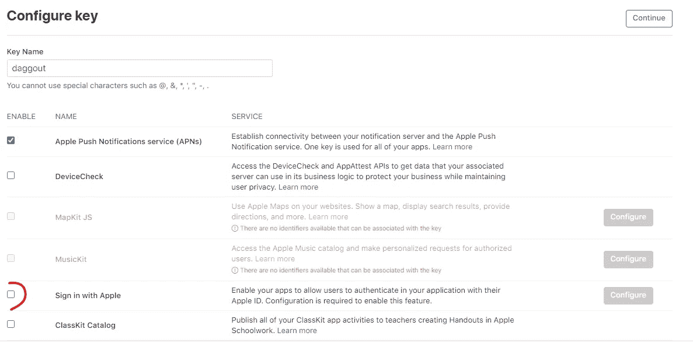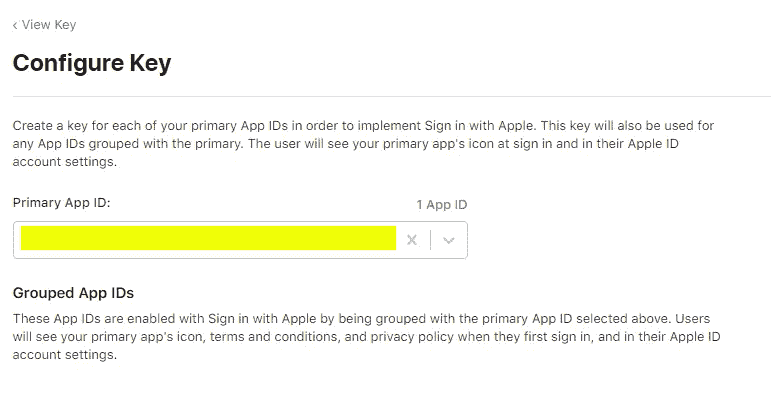

我们已经和苹果玩完了💃请注意，我们修改了应用 ID 配置，这将使应用预置描述文件失效。幸运的是，由于 Expo，我们可以在下次构建应用程序时使用几个命令行参数轻松地生成新的配置文件以及撤销旧的配置文件:

```
expo build:ios --clear-provisioning-profile --revoke-credentials
```

我们快到了！我们只需要在 Firebase 中启用苹果认证提供者，就已经到达了我们的目的地:成功。前往 [Firebase 控制台](https://console.firebase.google.com/)，导航至**认证** > **登录方式**，启用苹果。

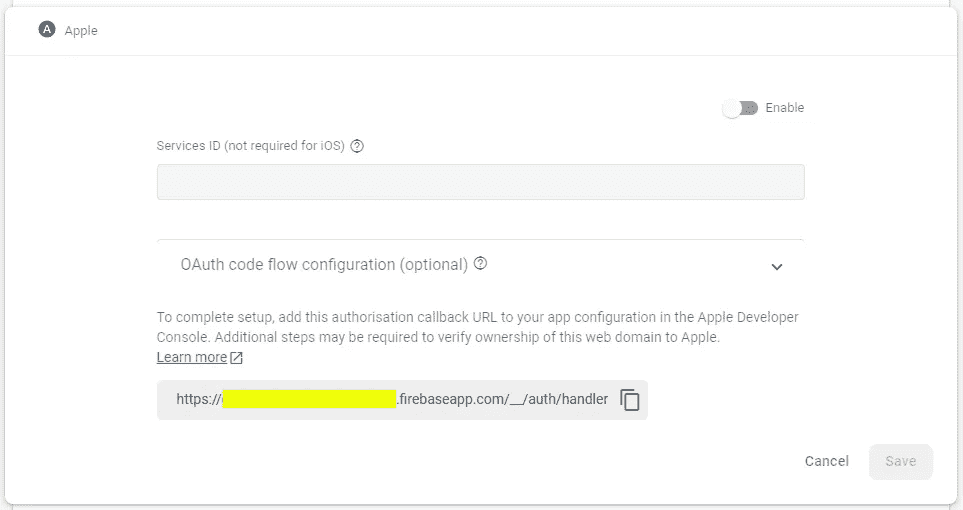

在*服务 ID* 字段中，您需要提供您在 app 私钥中启用的*登录 Apple* 服务的 ID。您可以在苹果开发者门户中找到服务 ID，导航到**证书、ID&配置文件** > **密钥**并选择您的密钥。在*旁边，使用苹果*启用的服务登录，你会发现看起来像 *{TeamID}的 ID。{捆绑 ID}* 。

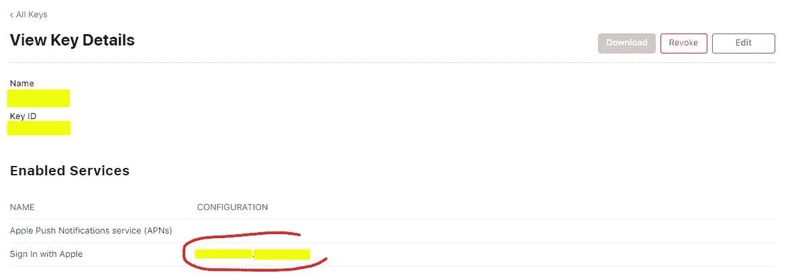

*OAuth 代码流配置*部分是可选的，我不确定是否填写细节有什么不同。鉴于你只需要你的苹果团队 ID 和你的应用程序的私钥，我更愿意提供它们，但同样，我不确定这有什么不同。请随意跳过这一部分，试试你的运气🤞

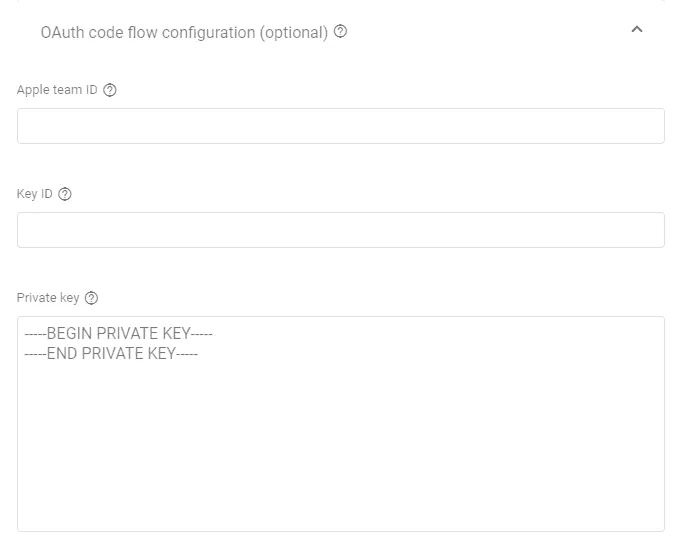

*您可以从 Apple Developer Portal 下载您的私钥(一个. p8 格式的文件),但您只能下载一次。如果你让 Expo 来处理这个过程，那么你可能无法下载这个密钥。您可以从 Apple Developer Portal 手动生成一个新密钥，然后使用* `*expo credentials:manager*` *替换您的应用程序使用的私钥。*

保存更改，转到命令行生成一个新的。ipa 如果你还没有做到这一点以上，这就是所有🎉等待新的应用程序版本在试飞中可用，并为 21 世纪最先进的身份验证的奇迹而高兴。编码快乐！