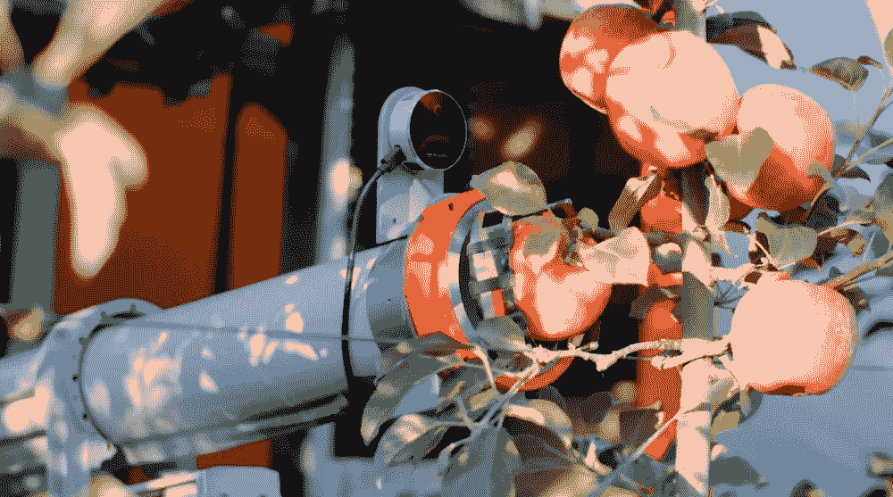

# 苹果采摘机器人

> 原文：<https://medium.com/nerd-for-tech/apple-harvesting-robot-d418c9e89d7d?source=collection_archive---------2----------------------->

2021 年 11 月 1 日，中国某苹果生产基地，一台苹果采摘机器人正在进行采摘测试作业。

“考虑到今年劳动力短缺，采摘苹果的劳动力成本相对较高，该公司与阿里巴巴合作，使用机器人采摘苹果，”基地负责人田说。工业园区有 1000 亩的标准种植生产面，每年雇佣工人要花费近 150 万人民币。

当报道某高科技公司正在研发苹果采摘机器人时，负责人立即联系了该公司。经过几轮谈判和讨论，最终达成了试用合作。据该负责人介绍，从今年开始，该基地利用大量机器人喷洒化学药物和施肥，减少了工人数量，降低了生产成本。

“使用机器人采摘提高了速度，降低了成本。苹果在收获过程中可以很好地挑选出来。”田先生说，

“我认为这个机器人很优秀。如果我明年能用上，会大大减轻我的负担。”听说了摘果机器人的果农曲先生来参观。他告诉记者，他家有 10 亩地，他和妻子是唯一的工人。随着年龄的增长，他们的工作能力不如以前了。在机器人的帮助下，很多像他一样的果农看到了希望。

这种机器人可以实现 24 小时实时操作，预计每天可以采摘 15000 公斤。目前处于测试和完善阶段，预计 3 年内实现量产销售。

## 为什么高质量的训练数据对人工智能机器学习如此重要？

从人工智能技术的研究方向来看，无论是在传统的机器学习领域还是深度学习领域，基于训练数据的监督学习仍然是一种主要的模型训练方法。尤其是在深度学习领域，需要更多的标记数据来提高模型的有效性。

在深入的产业落地过程中，人工智能技术与企业需求仍有差距。企业用户的核心目标是利用人工智能技术实现业务增长。其实，**人工智能技术本身并不能直接解决所有的业务需求**。它需要基于特定的业务场景和目标创建可以大规模实施**的产品和服务。**

如果说之前的算法模型使用的一般数据集是粗粮，那么算法模型目前需要的是定制的营养餐。如果公司想要进一步提高某些模型的商业化，他们必须逐步从通用数据集向前发展，创建自己独特的数据集。

## 常见标签类型:

*   **物体识别**

1.  作物监测和杂草控制
2.  病虫害诊断

*   **水果生长检测&牲畜监控**
*   **物体分类**
*   **农场自动化**

1.  农业机器人作物收获
2.  自动农药喷洒机
3.  土壤管理
4.  水果采摘

# 结束

将你的数据标注任务外包给 [ByteBridge](https://tinyurl.com/yc6b74ds) ，你可以更便宜更快的获得高质量的 ML 训练数据集！

*   无需信用卡的免费试用:您可以快速获得样品结果，检查输出，并直接向我们的项目经理反馈。
*   100%人工验证
*   透明和标准定价:[有明确的定价](https://www.bytebridge.io/#/?module=price)(含人工成本)

为什么不试一试呢？

资料来源:https://www.robot-china.com/news/202111/10/68217.html