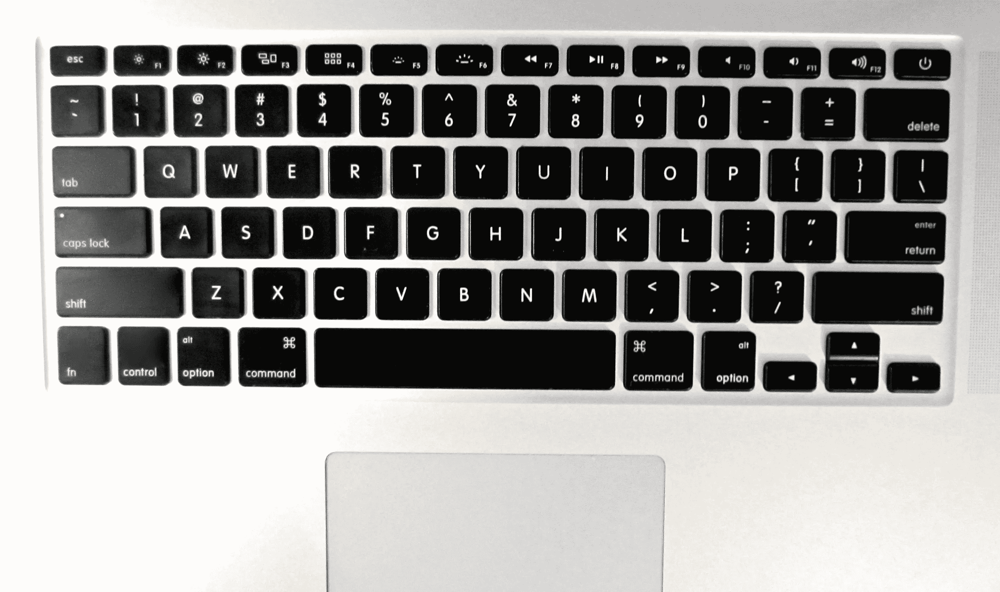
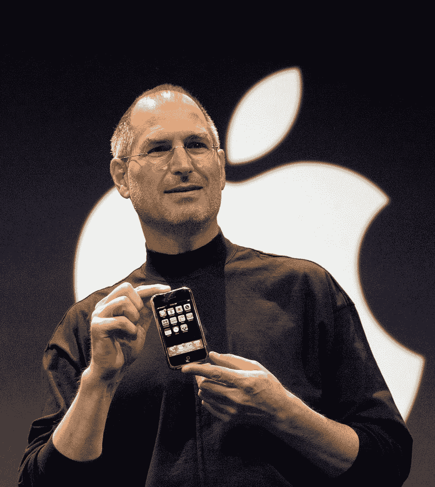
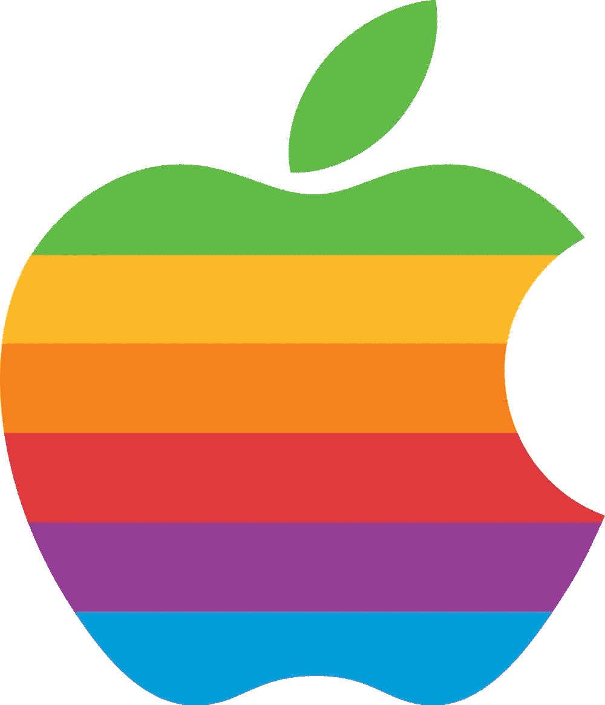
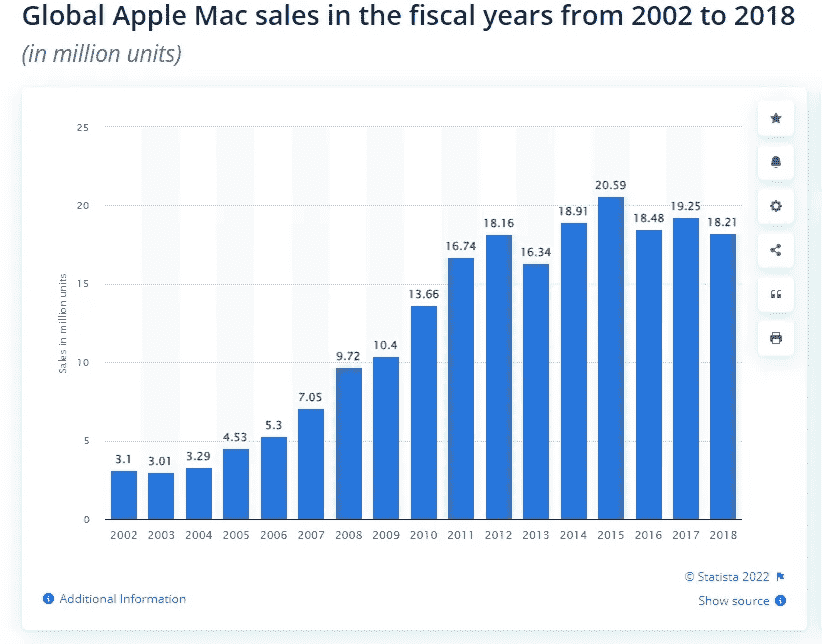

# 苹果正在进入 SaaS 市场

> 原文：<https://medium.com/nerd-for-tech/apple-is-entering-the-saas-market-da712eb4bc62?source=collection_archive---------1----------------------->

苹果是一家神话般的硅谷初创公司，它在 80 年代以其一系列专有电脑引领了个人电脑革命，现在又以一款定义类别的(智能手机)设备引领了手机市场，推出了多点触控和取消用于装备 PDA 和手机的机械键盘等许多创新，它将大举而明智地进入 SaaS 市场，因为它一直忽视这一市场，现在将这一份额留给了同行微软和其他初创公司，如 slack、zoom 等。

史蒂夫·乔布斯展示第一部 iPhone

2007 年，在 D5 会议期间，史蒂夫·乔布斯接受了卡拉·斯威舍和沃尔特·莫斯伯格的采访，他认为比尔·盖茨是第一个看到软件市场机会的人。要说在那个时候，甚至现在，苹果从来没有把自己当成一个软件公司，而是首先作为一个硬件公司，我现在认为这是一个数字 UX 设计公司。正如史蒂夫·乔布斯(steve Jobs)在过去的活动中所描述的那样，苹果是一家专注于为其一小批狂热粉丝打造最佳用户体验的一流设备(他说是电脑)的公司，这些粉丝喜欢伟大的科技产品和小工具，并愿意支付高价购买它们。 ***试图引领软件市场从来都不是这家贴着五彩嘎吱响的苹果标志的公司的目标。***

苹果唯一与软件有关的部分是，该公司一直限制自己设计和开发操作系统，为其营销的设备以及 iTunes 和 apps store 等内置商业模式的核心应用程序配备操作系统。但是苹果总是向其他公司开放其设备和操作系统，如微软、Adobe、Novell 和其他早期软件公司，让他们为苹果的忠实客户提供最好的软件。苹果让其他人向其用户提供软件的老策略也在同一个 D5 会议上被其已故首席执行官表达过，从那时起，它一直与其他提供令人惊叹的软件的公司和创业公司合作。按照史蒂夫·乔布斯的说法，这是苹果集中精力做得更好的唯一方法，也就是设计最好的设备(个人电脑和智能手机)。这与外包软件供应的想法相同，导致苹果公司实施了 app store，这是第一个应用程序市场，使该公司能够利用开发者和创业公司社区的智慧和技能，为 iPhone 提供更好的用户体验，同时通过创建新的移动应用程序技术细分市场，为参与者提供新的收入流。这是对保证移动用户隐私的坚定承诺。这一承诺引发了一些声音，称苹果滥用其单极地位，拒绝开发者提交的许多应用程序。但对于这些指责，史蒂夫·乔布斯回应说，一个应用被拒绝进入苹果应用商店的唯一原因是关于用户的隐私，并提供了应用商店在提交和接受应用方面的指标。史蒂夫·乔布斯给出的指标表明，我们离当时的移动应用还很远，现在的市场实际上已经超过 1500 亿美元。

也许正是这些声音让谷歌凭借其开源移动操作系统 android 进入了移动应用市场。

从一开始，除非有一些像 final cut 这样的为有创造力的人设计的软件，否则苹果从来没有利用它的设计能力来开发出设计非常好的软件和使用它们的新方法。奇怪的是，这位苹果公司的创始人站在了让软件开发为专业人士和企业所用的前沿，因为他在被解雇担任公司首席执行官期间推出了个人电脑的新品牌 Next。乔布斯和一些优秀的工程师一起建立了面向对象的开发框架 NextSTEP，该框架具有内置的可视化开发功能，允许每个人使用名为 interface builder 的拖放界面开发基于数据的应用程序。Interface builder 是我们今天可以称之为像微软 power apps 一样的无代码平台。

但是在苹果公司再次担任首席执行官时，史蒂夫·乔布斯从未带领公司为企业和消费者开发优秀的软件，苹果公司面向的是消费者产品而不是企业产品，因为根据其首席执行官的说法，向企业销售产品非常困难，因为使用产品销售的人往往不是拥有购买力的人，销售周期很长，而在消费者市场，消费者决定购买什么，如果他们不喜欢，他们就不会购买。这种假设使苹果专注于消费者市场，试图设计和营销消费者会喜欢的创意硬件，这种策略在 iPod、Ipad 和 iPhone 上获得了回报，而忽视了微软通过专业软件解决方案(如其一系列服务器和数据库软件)服务的商业市场。

史蒂夫·乔布斯去世了，时代变了，软件的销售方式也变了。软件销售方式的改变实际上给了专业人员和员工更多的决策权来购买他们需要的新软件，因为软件现在是一种商品，只需点击几下鼠标就可以购买和安装。这些市场变化使得苹果公司重新考虑其关于软件的战略，该公司将微软视为一个现有软件公司的例子，由许多 SaaS 初创公司如 Zoom、Slack、concept 和其他公司成功地提出了诸如 Team、Loop 和其他 SaaS 解决方案的解决方案，这些解决方案利用了微软多年来建立的分销渠道，以战胜这些外来威胁。无论微软最近在哪里进入新的 SaaS 市场，它总是朝着 SaaS 市场的重要部分前进，因为该公司在企业中的存在和分销渠道。苹果相信，像微软一样，它不仅可以利用自己的品牌，还可以利用它拥有的许多商店作为直接分销渠道。

另一个有利于改变软件策略的事实是，苹果已经看到其笔记本电脑 MacBook 在专业人士和企业消费者中获得了牵引力，如开发人员、工程师和创意人员，他们反对他们公司的实际 IT 政策，决定越来越多地选择苹果硬件，这些专业人士都是 SaaS 的贪婪消费者。

这张关于 2002 年至 2018 年苹果 Mac 销售水平的图表显示了苹果电脑采用率的增长水平

来自 statistica 的 2002 年至 2018 年全球苹果 Mac 销量

**1800 万到 2000 万用户足以让苹果运营盈利的 SaaS 解决方案**

经济气候不断变化，越来越难以驾驭，这是苹果利用其 MacBook 硬件在笔记本电脑市场获得的市场份额的一个很好的理由，苹果向 MacBook 用户提供了一系列“苹果式”设计良好的 SaaS 解决方案，就像其他科技公司实际在做的那样。这种重新定位将带来的经常性收入收益是不可忽视的，因为从长远来看，这将加强公司的财务状况。

要问的问题是:考虑到我们从苹果那里了解到的设计品味，这些 SaaS 解决方案将会是什么样子？苹果会想象并提出什么新的创新 SaaS 商业模式？苹果将首先尝试征服的 SaaS 市场是什么？企业沟通工具，如团队、松弛、概念或…？像 Adobe 的创意 SaaS 套房一样？

一系列的问题，你可以花时间做调查性的研究，比如我实际在做什么，或者只是猜测。我的实际调查情况告诉我，苹果实际上是在试图瞄准许多使用 Macbook 的独立开发人员，向他们提供以人工智能为动力的开发工具，包括一系列令人惊叹的开发经验，以提高开发人员的工作效率和创造力。考虑到我们从苹果那里了解到的设计品味，我们都可以预料到它将提供的 Saas 解决方案将会有惊人的用户界面，就像所有苹果产品一样。但是像应用商店这样的苹果软件即服务市场可能会被纳入苹果追求的 SaaS 商业模式中。

一场新的苹果对微软的 SaaS 之战即将开始。我不知道你会站在哪个阵营，但我写的这个理论实际上表明，两家公司都会像早期一样从这场正面对正面的战斗中受益，其他初创公司也会受到影响。在 2021 年 5 月写的两篇文章中，我谈到了 SaaS 双寡头市场理论的两个要素

 [## 双寡头市场的本质

### 根据这一理论，我认为我可以用确凿的数据证明，SaaS 市场是系统性的…

medium.com](/nerd-for-tech/duopolistic-markets-by-nature-60ad87f8aae0)  [## 微软 VS 苹果操作系统采用

### 当盗版帮助软件卖得更好时

medium.com](/nerd-for-tech/microsoft-vs-apple-os-adoption-a2e73a51cdee) 

我希望你欣赏这次调查，我希望我有时间和权力让你了解更多关于它的情况。

谢谢你的阅读