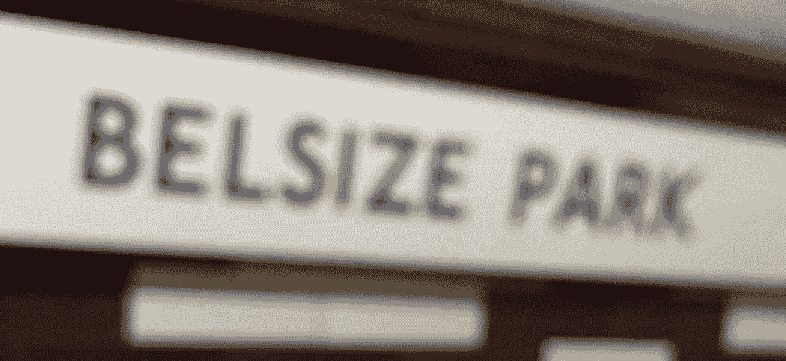
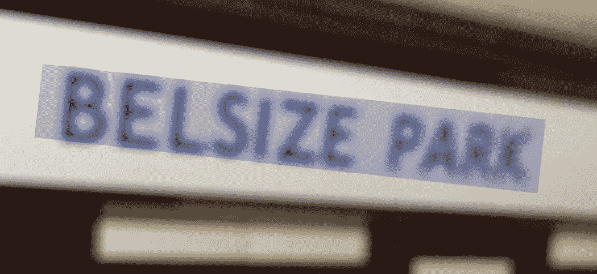

# 苹果照片做 OCR

> 原文：<https://medium.com/nerd-for-tech/apple-photos-does-ocr-bb587b4a69a2?source=collection_archive---------8----------------------->

这个功能似乎在苹果照片中出现过。

找到一张有文字的图片，高亮显示文字，然后复制到剪贴板。

然后突出显示

当鼠标在开始被选中并复制到剪贴板时，该框将出现在文本上。

剪贴板的结果是“贝尔西公园”

它也适用于水平和垂直文本。

*最初发表于*[*【http://eurotechnews.blogspot.com】*](https://eurotechnews.blogspot.com/2022/10/apple-photos-does-ocr.html)*。*