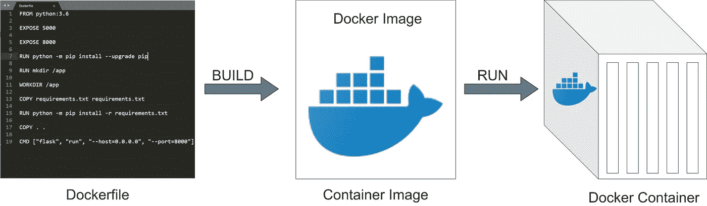

# 使用码头集装箱化—过于简化

> 原文：<https://medium.com/nerd-for-tech/application-containerization-using-docker-oversimplified-4a0b0891ad9?source=collection_archive---------20----------------------->

# 容器

假设您在本地运行一个 spring boot 应用程序，它使用 Java 11、一些外部依赖项和一些环境变量。如果您想在任何其他机器上运行该应用程序，您必须将该应用程序捆绑到一个 runnable JAR 中，在机器上安装 Java 11 并设置环境变量。如果您可以隔离本地系统中的整个运行时环境，并将其复制到您想要的任何地方，会怎么样？

容器就是保存应用程序及其依赖项独立运行时。

很酷不是吗？但是你如何或者从什么地方旋转一个容器呢？

# 集装箱/码头图像

冻结应用程序及其依赖项的快照。该快照在运行时成为容器。本质上，您创建了应用程序的映像，并且可以在任何系统中使用该映像来启动容器。

太棒了，这阐明了是容器映像保存了一切，并用于创建运行时容器来创建应用程序的实例。但是我们如何创造或建立形象呢？

# Dockerfile 文件

在 docker 中，您写下使用 Dockerfile 生成容器映像的步骤或说明。

# 为什么要容器化你的应用？

**可移植性** —一次构建映像，并将其部署在任何基础架构或硬件中。

**一致性** —无论您的应用程序部署在哪个平台上，其性能和行为都保持不变。有多少次，应用程序在开发环境中工作，但在 QA 环境中却不工作？集装箱化可以帮助我们避免跨环境的差异。

**水平扩展** —由于容器化，创建一个新的应用实例来支持水平扩展是无缝的。显然，你需要一个像 Kubernetes 或 Swarm 这样的容器编排来管理自动伸缩。

**基础设施高效** —与虚拟机类型的设置相比，容器化应用的系统要求较低。

> 这个过于简化的系列旨在让您先睹为快，了解重要的软件概念。为了更全面地了解码头工人和集装箱运输，最好查阅一下官方文件。

快乐学习！