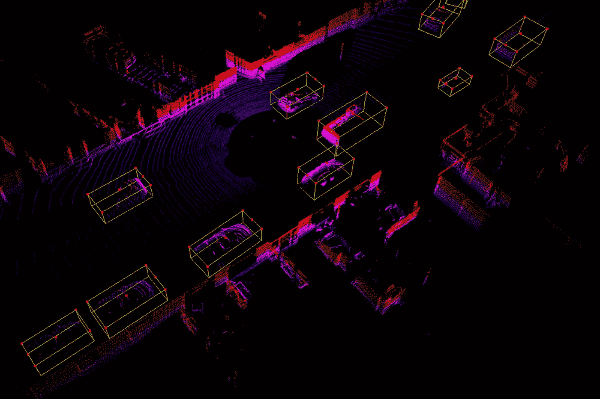

# 3D 点云标注服务如何助推自动驾驶领域？

> 原文：<https://medium.com/nerd-for-tech/application-of-3d-point-cloud-in-the-field-of-automatic-driving-723ec9544a6c?source=collection_archive---------6----------------------->

随着无人驾驶技术的快速发展，无人配送车、无人消毒车等承载该技术的各类自主机器人冲向防疫第一线，构筑起安全无接触的防护屏障。

**更多信息:** [**百度 Apollo 无人驾驶汽车加入抗疫战斗，助力广州市民物资配送和出行**](https://tinyurl.com/tyfat5by)

## 无人驾驶技术的感知系统

在无人驾驶技术中，环境感知系统充当无人驾驶车辆的“眼睛”。它主要通过装载在车辆上的外部传感器获取外界环境信息，并准确、快速地将地理信息和障碍物信息传输给计算机控制系统。该系统可以在没有任何人工干预的情况下安全运行。

无人驾驶餐车至少应该包括传感器、配电柜、搭载 AI 技术的驾驶系统。为了让无人车“看得见”，至关重要的传感器系统需要配备激光雷达、摄像头、鱼眼镜头、雷达、超声波系统等。

**目前，车辆周围环境的三维建模主要通过激光雷达进行，为无人驾驶车辆的驾驶决策提供基础信息。**

## **传感器融合类别**

## 照相机

该相机可以记录 2D 和 3D 图像和视频，是一种纯视觉技术，可用于传达障碍物的颜色和形状，成本较低。

缺点是对自然环境条件要求高。比如晚上的检测结果会比白天的差。

## 激光雷达

激光雷达产生点云，可以用来探测几乎所有的可疑障碍物，即使是在晚上。缺点是成本高，在雾天这样的恶劣天气下不太靠谱。

**更多信息:** [**什么是激光雷达，什么是 3D 点云？**](https://tinyurl.com/w3kav68k)

## 雷达

雷达使用长波无线电波来探测远距离障碍物，几乎可以在任何自然环境中使用。缺点是精度低，不擅长对障碍物进行分类。

# 数据注释服务推动了自动驾驶领域

## 海量高质量的真实道路数据是必不可少的

自动驾驶的主流算法模型主要基于有监督的深度学习。它是一种算法模型，推导出已知变量和因变量之间的函数关系。需要大量的结构化标记数据来训练和调整模型。

在此基础上，要想让自动驾驶汽车变得更加“智能”，形成可在不同垂直落地场景下复制的自动驾驶应用商业模式闭环，模型需要有海量、高质量的真实道路数据支撑。

在自动驾驶领域，数据标注场景通常包括变道超车、通过路口、无红绿灯控制的无保护左右转弯，以及一些复杂的长尾场景，如车辆闯红灯、行人过马路、路边以及违规停放的车辆等。

现在的人工智能也叫数据智能。在这个发展阶段，神经网络的层数越多，需要的标记数据量就越大。

## **基于激光雷达传感器的三维点云图像标注**

三维点云图像标注数据是无人驾驶技术的基础训练数据。3D 点云注记被认为最适合通过激光雷达传感器进行精确探测。

3D 点云图像标注是在由激光雷达传感器收集的 3D 图像中，使用 3D 装箱来标记目标对象。目标包括车辆、行人、交通标志和树木等。

# 结束

将您的数据标注任务外包给[字节桥](https://tinyurl.com/4ckcjf3e)，您可以更便宜、更快速地获得高质量的 ML 训练数据集！

*   无需信用卡的免费试用:您可以快速获得样品结果，检查输出，并直接向我们的项目经理反馈。
*   100%人工验证
*   透明标准定价:[有明确定价](https://www.bytebridge.io/#/?module=price)(含人工成本)

为什么不试一试呢？

## 相关文章:

1 [4 对自动驾驶汽车行业的见解](https://tinyurl.com/yc7c37s4)

我们现在可以购买自动驾驶汽车吗？

3 [三类自动驾驶汽车公司](https://tinyurl.com/zyw8xen6)

4[2021 年自动驾驶对 3D 点云数据需求增长的三大原因](https://tinyurl.com/4t73drh8)