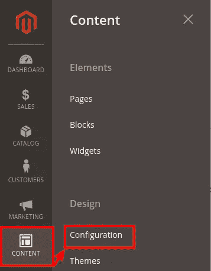
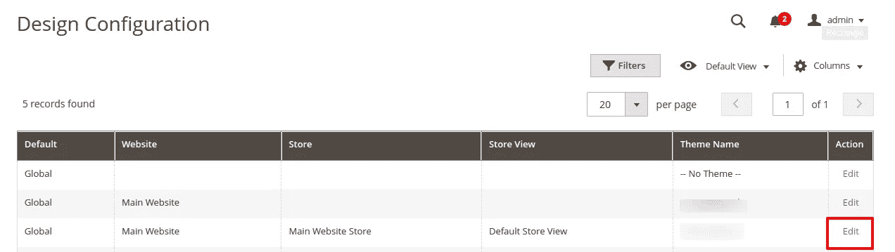
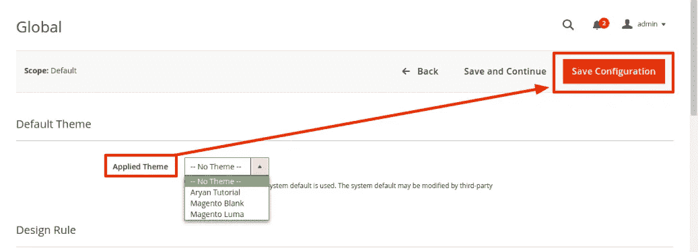
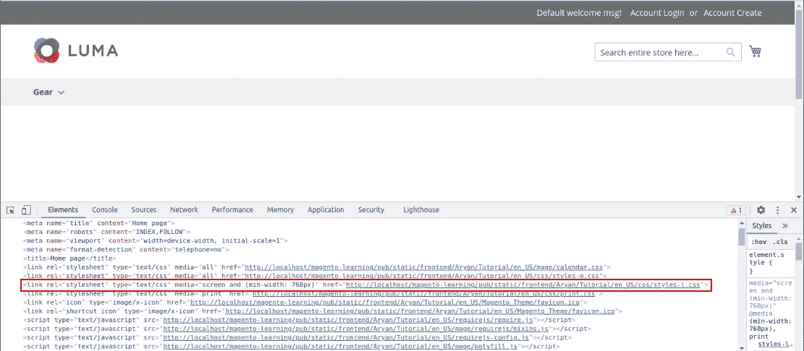
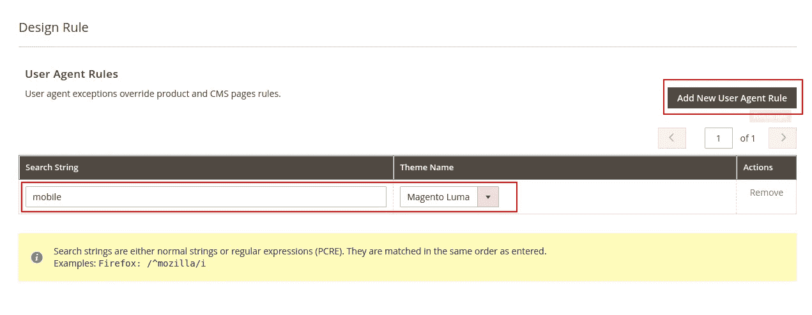
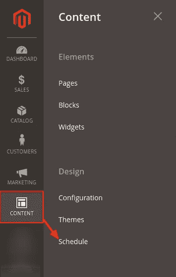
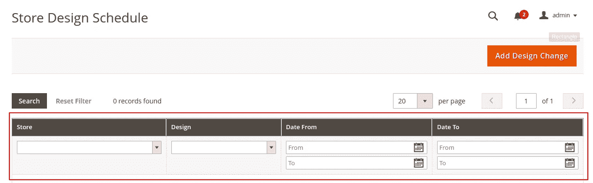

# 在 Magento 2 中应用/更改主题

> 原文：<https://medium.com/nerd-for-tech/apply-change-theme-in-magento-2-f3e1f39144f3?source=collection_archive---------15----------------------->


在这篇文章中，我将解释如何在 Magento 2 中应用这个主题。如果你是第一次看我的文章，建议你看看我之前的文章《Magento 2 中的[主题概念》、《Magento 2](/nerd-for-tech/theme-concept-magento-2-b9a1fafc3590) 中的[布局概述》、《Magento 2](/nerd-for-tech/layout-overview-in-magento-2-9d4739ee4254) 中的[配置主题属性》。](/nerd-for-tech/configure-theme-properties-in-magento-2-cf668d762654)

在之前的文章中，我们已经成功地创建了一个主题。现在，我将一步一步地展示将主题应用到店面的过程。

## 步骤 1:登录 Magento 管理>内容>配置



内容>配置

## 步骤 2:设计配置>点击编辑



设计配置>点击编辑

## 步骤 3:选择主题>保存配置



选择主题>保存配置

## 步骤 4:刷新 Magento 缓存

```
$ php bin/magento c:f
```

现在，我们已经成功地为店面应用了主题。

## 检查你的主题是否适用于店面？



在上图中，你可以看到我们的主题“Aryan_Tutorial”应用在店面上。

## 为用户代理应用不同的主题:

根据要求，有时我们必须为用户代理设置不同的主题。例如，我们将为手机应用“Magento Luma”主题:

***Magento Admin >内容>配置>点击编辑>添加新用户代理规则>保存配置***



*Magento Admin >内容>配置>点击编辑>添加新用户代理规则>保存配置*

完成上述配置后，进行 Magento 缓存刷新:

```
$ php bin/magento c:f
```

# 将临时主题配置应用于商店视图

## 临时主题的目的是什么？

这是为了在特定情况下自动进行设计变更。例如，如果我们想在胡里节之际为三天配置不同的主题。

## 如果安排了设计变更，它会如何影响渲染？

在选定的一天，主题作为主要主题应用于店面。到了最后一天，它自动变成了主旋律。

> **注**:一次只能安排一个设计变更。Magento 不允许一次更改预定的多个设计。

## 步骤 1:管理>内容>日程安排



管理>内容>日程

## 步骤 2:存储设计计划>填写条目>添加设计变更



商店设计计划>填写条目>添加设计变更

您可以在此安排您的更改，在**商店**下选择您需要更改设计的商店，**设计**选择您的主题(预定主题)，**从**开始的日期是设计预定的开始日期，**和日期到是结束日期。**

希望这篇文章能帮助你理解如何在 Magento 2 中应用或改变主题。如果您有任何疑问，请在[**aryansrivastavadesssigner@gmail.com**](mailto:aryansrivastavadesssigner@gmail.com)问我。

如果您想要一个实时会话，请通过上述电子邮件地址发送邮件。

如果你喜欢这篇文章，你可以给我买杯咖啡 [**给我买杯咖啡**](https://www.buymeacoffee.com/aryansrivastava) **。**

## 跟我来:

[LinkedIn](https://www.linkedin.com/in/er-aryan-srivastava-0b9576170/)[Twitter](https://twitter.com/AryanSr11861551)