# 使用 CircleCI 为 Ruby 项目应用持续集成

> 原文：<https://medium.com/nerd-for-tech/apply-continuous-integration-for-ruby-project-by-using-circleci-c65e2ae706ac?source=collection_archive---------2----------------------->

大多数软件开发人员可能都经历过这种情况:参与软件项目的成员越多，当新代码集成到项目中时，出现错误的机会就越大。为了避免这种问题，持续集成的概念应运而生，并在当今软件项目中得到广泛应用。什么是持续集成(CI)？根据来自 [Atlassian 网站](https://www.atlassian.com/continuous-delivery/continuous-integration)的持续集成(CI)的定义，我们可以知道对于软件项目来说，在集成到项目中之前保持新代码的正确性是一个很好的实践。

> 持续集成(CI)是将来自多个参与者的代码变更自动集成到一个软件项目中的实践。这是一个主要的 [DevOps 最佳实践](https://www.atlassian.com/devops/what-is-devops/devops-best-practices)，允许开发人员频繁地将代码变更合并到一个中央存储库中，然后在那里运行构建和测试。自动化工具用于在集成前断言新代码的正确性。

在软件项目中有许多工具可以实现持续集成，例如 Jenkins、TeamCity、Bamboo、Buddy 和 CircleCI...每种工具都有其优点和缺点。本文选择 CircleCI 作为例子，展示如何将持续集成应用到 Ruby 项目中。下面是这篇文章的大纲。有 5 节课介绍 CircleCI 的用法。

```
[**Outline**](#bd21) **．**[**Getting started with CircleCI on your Github repo**](#7676) **．**[**Implement CircleCI in Ruby project**](#1fdc) **．**[**Setup Database in CircleCI**](#7084) **．**[**Apply reusable command with parameters in CircleCI config**](#4e9b) **．**[**Debugging CircleCI error**](#c7f1) **．**[**Reference**](#971a)
```

## Github repo 上的 CircleCI 入门

要开始使用 CircleCI，首先你要注册 GitHub 或者 BitBucket。在本文中，我们使用 Github 来注册。注册并登录后，你可以在项目页面上看到你所有的 GitHub 项目列表。

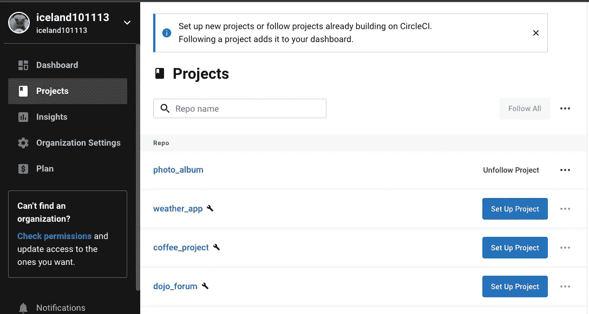

在从你想要应用 CircleCI 的项目中点击设置项目按钮之前，你可以在你的项目的根目录下创建一个`.circleci`文件夹，并在`.circleci`文件夹中创建一个`config.yml`文件。有了这个`.circle/config.yml`，在用 CircleCI 设置项目后，每次有新的变更被推送到 Github repo 时，CircleCI 都会读取`config.yml`并执行`config.yml`中定义的作业

`config.yml`的内容您可以先使用 [CircleCI 配置介绍](https://circleci.com/docs/2.0/config-intro/)测试中的示例配置共享。示例配置如下。我们可以看到在配置中有一个作业`build`，并且在作业环境中使用的 docker 映像也被定义，所以当使用 CicleCI 设置项目时，每次作业运行时都将为`build`作业准备好环境。在配置中，还定义了作业运行时执行的命令。它将执行两个命令:打印`Hello Wolrd!`然后打印`This is the delivery pipeline`

```
# CircleCI config.yml exampleversion: 2.1
jobs:
  build:
    docker:
      - image: alpine:3.15
    steps:
      - run:
          name: The First Step
          command: |
            echo 'Hello World!'
            echo 'This is the delivery pipeline'
```

在提交了`config.yml`并将其推送到 Github 之后，你可以点击设置项目按钮，会出现一个弹出窗口让你选择使用配置文件的方式。我们可以选择最快的一个，然后点击设置项目。

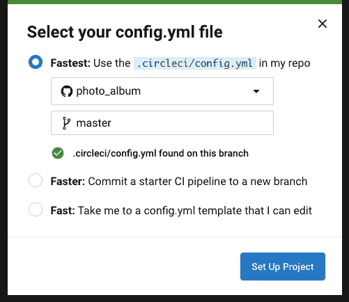

设置项目后，在您的仪表板中会显示一个管道。将显示在`config.yml`中定义的所有作业。如果作业旁边显示绿色勾号，这意味着作业中的所有命令都已成功执行。


如果有红色感叹号，则表示作业失败。


我们可以点击工作来查看更多信息。在我们的示例中，如果我们单击`build`，将显示该作业的所有详细结果。我们可以单击“步骤”,将会出现一个我们在`config.yml`中定义的步骤调用`The First Step`

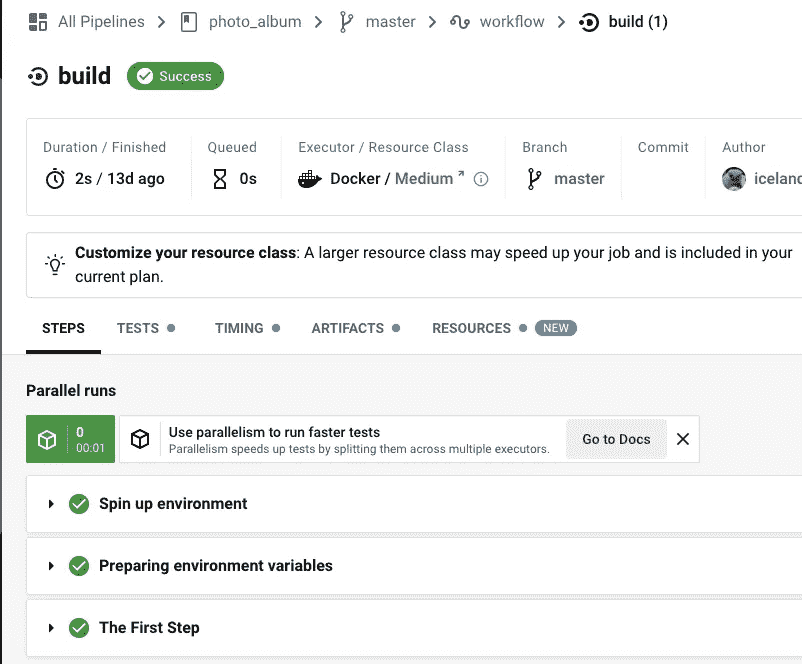

点击`The First Step`你可以看到这两个命令在这一步执行。`Hello World!`和`This is the delivery pipeline`打印在控制台上，所以如果我们要实现另一个命令，只需按照`config.yml`的步骤更新，提交并推送到 Github repo。

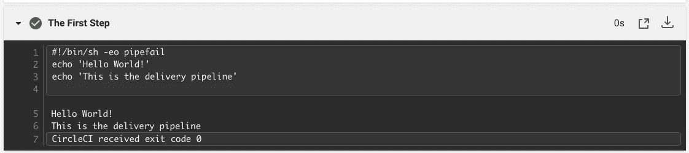

如果我们需要运行多个作业，并且一些作业应该在一些作业完成后运行，那么`workflows`可以在`config.yml`中实现。下面是 [CircleCI 文档](https://circleci.com/docs/2.0/config-intro#part-3-using-different-environments-and-creating-workflows)中的配置示例。在这个例子中，定义了三个作业:Hello-World、Fetch-Code 和 Using-Node。在`workflows`部分，`requires`可以让 CircleCI 知道只有当哪个作业完成时才需要执行该作业。我们可以看到 Fetch-Code 只能执行 Hello-World 完成的第一个任务，而 Using-Node 只能执行 Fetch-Code 完成的任务。

```
# CircleCI config.yml exampleversion: 2.1
jobs:
  # running commands on a basic image
  Hello-World:
    docker:
      - image: cimg/base:2021.04
    steps:
      - run:
          name: Saying Hello
          command: |
            echo 'Hello World!'
            echo 'This is the delivery pipeline'
  # fetching code from the repo
  Fetch-Code:
    docker:
      - image: cimg/base:2021.04
    steps:
      - checkout
      - run:
          name: Getting the Code
          command: |
            ls -al
            echo '^^^Your repo files^^^'
  # running a node container
  Using-Node:
    docker:
      - image: cimg/node:17.2
    steps:
      - run:
          name: Running the Node Container
          command: |
            node -v
workflows:
  Example-Workflow:
    jobs:
      - Hello-World
      - Fetch-Code:
          requires:
            - Hello-World
      - Using-Node:
          requires:
            - Fetch-Code
```

在提交`config.yml`并将其推送到 Github 后，我们可以在 CircleCI 仪表板中看到有一个管道，其中有三个作业是我们在`config.yml`中定义的作业

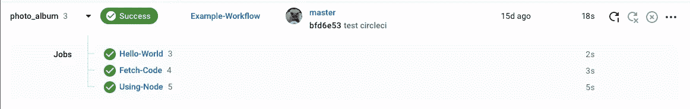

点击成功按钮，出现该工作流的详细信息。它按照我们在`config.yml`中定义的顺序显示任务

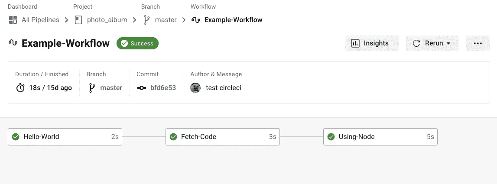

在作业提取代码中，定义了两个步骤。第一个是`checkout`。它在执行时从你的 Github repo 中获取代码，所以这就是为什么第二步可以命令`ls -al`列出 Github repo 的所有内容。

```
# fetching code from the repo
  Fetch-Code:
    docker:
      - image: cimg/base:2021.04
    steps:
      - checkout
      - run:
          name: Getting the Code
          command: |
            ls -al
            echo '^^^Your repo files^^^'
```

点击获取代码查看详情，我们可以看到两个步骤:结帐代码和获取代码。

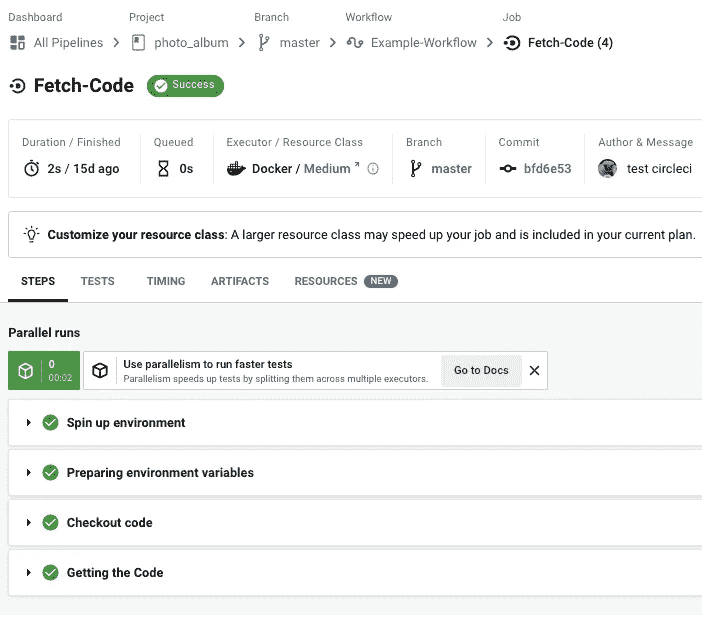

在 Checkout 代码部分，代码已经从你的 git repo 中取出，它在`origin/master`的分支上

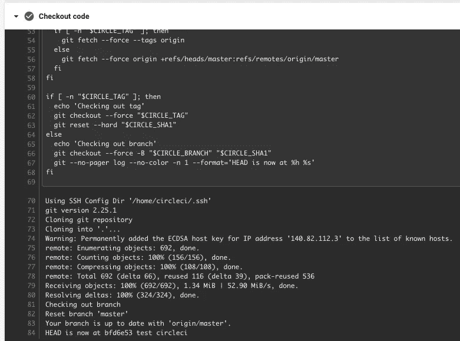

在获取代码部分，CircleCI 执行`ls -al`并列出 repo 第一层中的所有文件和文件夹。

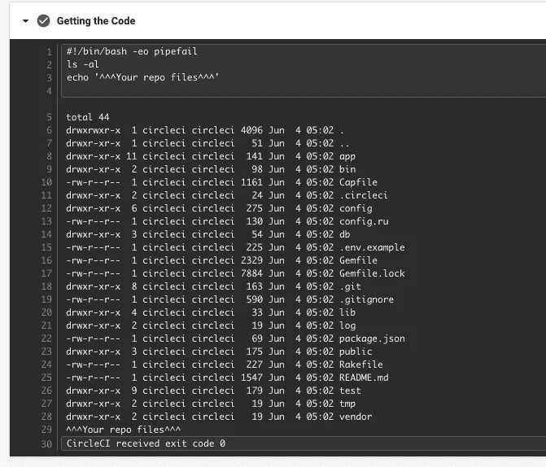

每次我们在项目中进行代码更改并将其推送到 Github repo 时，CircleCI 都会自动运行作业并执行`config.yml`中定义的步骤中的所有命令。在 [CircleCI 文档](https://circleci.com/docs)中有关于如何编写`config.yml`在你的软件项目中实现持续集成的明确说明。有兴趣了解更多信息的人可以查看 [CircleCI 配置介绍](https://circleci.com/docs/2.0/config-intro)，并通过示例来熟悉 CircleCI 如何与 Github repo 一起工作。

```
 [Continue](#1fdc)｜[Back to Outline](#bd2e)
```

## 在 Ruby 项目中实现 CircleCI

要在 Ruby 中实现 CircleCI，我们的目的是在每次有代码变更并推送到 Github repo 时自动运行所有的 RSpec 测试，所以 CircleCI 需要执行 run RSpec。本文中使用的示例 Rails 项目可以在[这里](https://github.com/iceland101113/photo_album)找到。ruby 版本是 2.7.1，数据库使用的是 SQLite。在 CircleCI 中运行 RSpec 之前，应该准备好测试环境，所以在`.circle/config.yml`中将会定义两个作业。第一个用于构建环境，第二个用于运行测试。我们将使用`workflows`来定义作业的顺序和要求。示例配置如下。

```
version: 2.1orbs:
  ruby: circleci/ruby@1.1.0jobs:
  build:
    docker:
      - image: cimg/ruby:2.7-node
    steps:
      - checkout
      - ruby/install-deps
  test:
    docker:
      - image: cimg/ruby:2.7-node
    steps:
      - checkout
      - ruby/install-deps
      # Run rspec
      - ruby/rspec-testworkflows:
  version: 2
  build_and_test:
    jobs:
      - build
      - test:
          requires:
            - build
```

因为我们将在两个作业中安装 ruby，所以我们实现了`orbs`来重用已经在 CircleCI 中定义的 ruby 安装步骤，这样我们就可以使用`ruby/install-deps`调用每个作业中的所有命令来在 CircleCI 中安装 ruby。

关于`orbs`的更多信息可以在 [CircleCI 文档 Orbs 简介](https://circleci.com/docs2/2.0/orb-intro)中找到。下面是 CircleCI 页面中`orbs`的定义。

> orb 是可重用的代码片段，有助于自动化重复的过程，加速项目设置，并使其易于与第三方工具集成。

除了准备`config.yml`之外，`Gemfile`也需要更新，因为 CircleCI 需要`gem 'rspec_junit_formatter'`执行`rspec`。`gem 'rspec_junit_formatter'`需要添加在`Gemfile`的`group :development, :test`中，如下图。

```
group :development, :test do
  ....
  gem 'rspec_junit_formatter'
  ....
end
```

在`config.yml`和`Gemfile`之后，我们可以在 CircleCI dashboard 中看到提交变更并将其推送到 Github repo 之后的管道中有两个作业。

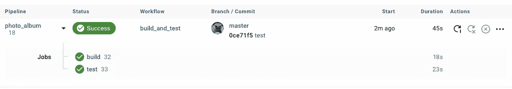

点击`build`作业，我们可以看到在签出代码后有三个步骤:恢复缓存、捆绑包安装、保存缓存，点击`test`作业，也可以在签出代码后找到这三个作业。这三个步骤是执行`ruby/install-deps`时将运行的步骤

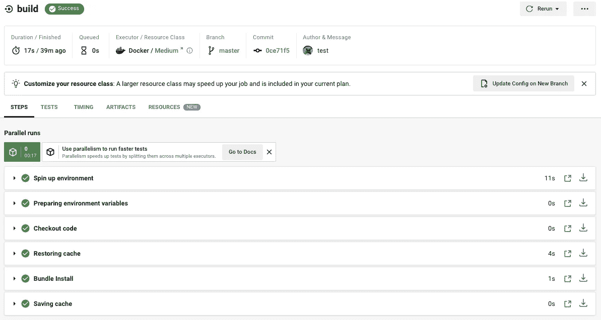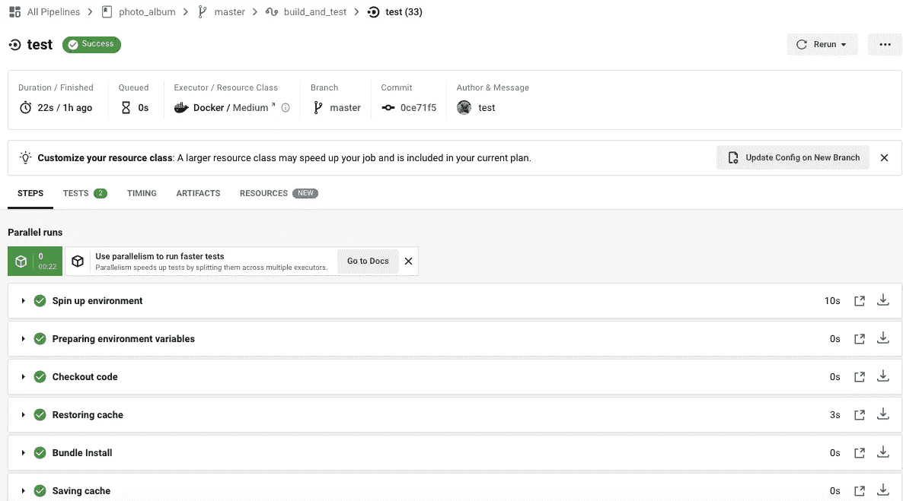

在`test`作业详情页面中，我们可以看到 RSpec 是在保存缓存后执行的。

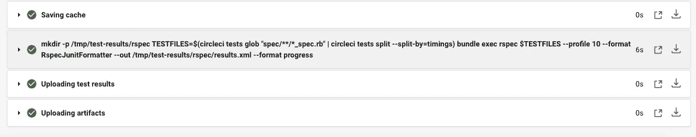

点击这个步骤，我们可以看到所有的 RSpec 测试都已经执行了。因为在这个项目中只有两个测试用例，所以只显示了两个测试结果，但是结果就像在您的本地环境中执行`bundle exec rspec`一样。而且每次现在有代码变更并推送到 Github repo 的时候，都会触发`bundle exec rspec`来检查是否有测试用例失败。

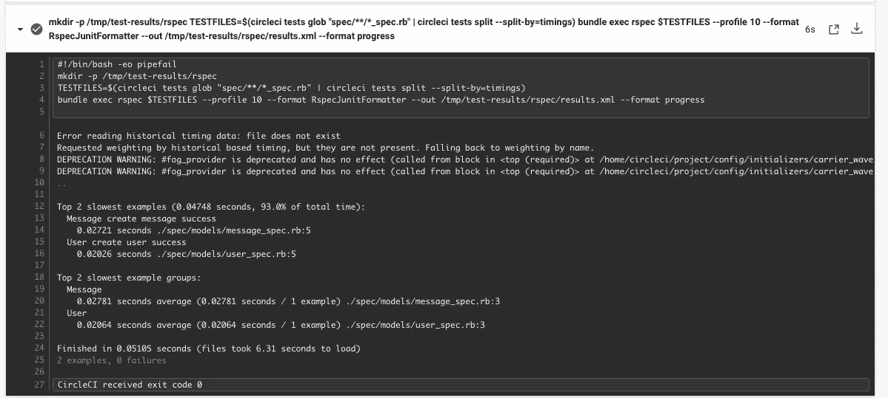

Ruby 项目的更多配置设置可以在 [CircleCI 文档语言指南:Ruby](https://circleci.com/docs2/2.0/language-ruby) 中找到。还有更多例子来展示如何在 Ruby 项目中实现 CircleCI。

```
 [Continue](#7084)｜[Back to Outline](#bd2e)
```

## 在 CircleCI 中设置数据库

如果项目中的数据库不是 SQLite，也可以在 CircleCI 中设置数据库环境。只需要在`config.yml`中定义数据库的 docker 镜像和环境参数。下面是使用 PostgreSQL 数据库的配置示例。在上述步骤中，运行`ruby/install-deps`后，将继续运行数据库设置命令。

```
version: 2.1orbs:
  ruby: circleci/ruby@1.1.0

jobs:
  build:
    docker:
      - image: cimg/ruby:2.7-node
    steps:
      - checkout
      - ruby/install-deps
  test:
    # parallelism: 3
    docker:
      - image: cimg/ruby:2.7-node
      - image: circleci/postgres:9.5-alpine
        environment:
          POSTGRES_USER: circleci-demo-ruby
          POSTGRES_DB: rails_blog_test
          POSTGRES_PASSWORD: ""
    environment:
      BUNDLE_JOBS: "3"
      BUNDLE_RETRY: "3"
      PGHOST: 127.0.0.1
      PGUSER: circleci-demo-ruby
      PGPASSWORD: ""
      RAILS_ENV: test
    steps:
      - checkout
      - ruby/install-deps
      - run:
          name: Wait for DB
          command: dockerize -wait tcp://localhost:5432 -timeout 1m
      - run:
          name: Database setup
          command: bundle exec rails db:schema:load --trace
      # Run rspec in parallel
      - ruby/rspec-testworkflows:
  version: 2
  build_and_test:
    jobs:
      - build
      - test:
          requires:
            - build
```

在示例配置的`test`作业运行结果中，我们可以看到 PostgreSQL 数据库正在使用的 docker 映像，以及设置数据库的两个步骤——等待数据库和数据库设置——已经执行。

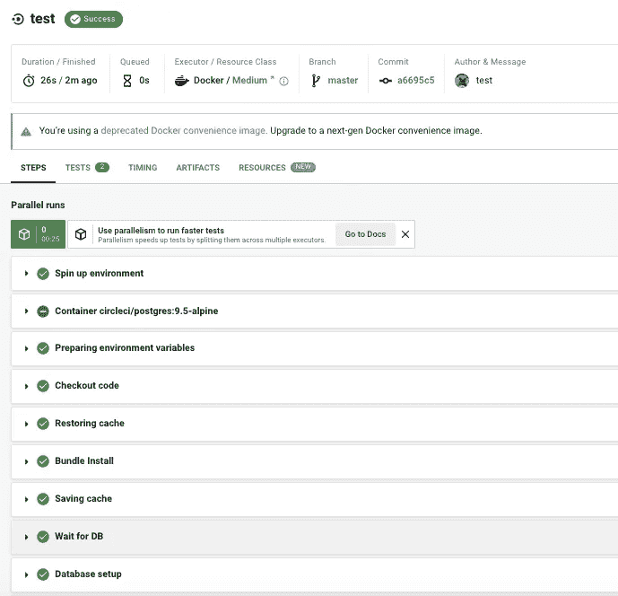

单击这两个步骤，我们可以看到 PostgreSQL 数据库中的表创建日志。

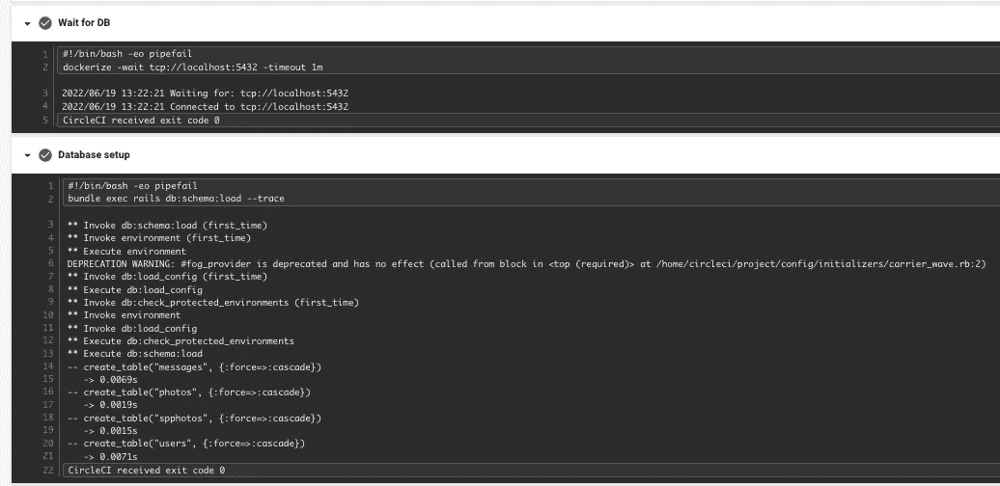

更多数据库配置示例可在 [CircleCI 文档数据库配置示例](https://circleci.com/docs/2.0/postgres-config)中找到。

```
 [Continue](#4e9b)｜[Back to Outline](#bd2e)
```

## 在 CircleCI 配置中应用带参数的可重用命令

如果需要在不同的作业或步骤中运行命令，但必须传递不同的参数，CircleCI 支持我们用参数定义自定义命令。我们可以在运行所有作业之前打印问候词，部分问候词取决于我们在不同作业中传递给参数的内容。示例配置如下。有一个用参数`to`定义的问候命令，参数`to`有默认值`world`，在`build`作业中，问候命令在`to`值为`build`的步骤中。问候命令也显示在`test`作业中，并且`to`值为`test`。

```
version: 2.1orbs:
  ruby: circleci/ruby@1.1.0commands: # a reusable command with parameters
  greeting:
    parameters:
      to:
        default: "world"
        type: string
    steps:
      - run: echo "Hello <<parameters.to>>"
jobs:
  build:
    docker:
      - image: cimg/ruby:2.7-node
    steps:
      - greeting:
          to: "build"
      - checkout
      - ruby/install-deps
  test:
    docker:
      - image: cimg/ruby:2.7-node
    steps:
      - greeting: 
          to: "test"
      - checkout
      - ruby/install-deps
      # Run rspec in parallel
      - ruby/rspec-testworkflows:
  version: 2
  build_and_test:
    jobs:
      - build
      - test:
          requires:
            - build
```

在示例配置的结果中，在`build`和`test`作业中，问候语命令都被执行，它们打印出问候语，以及我们传递给参数`to`的内容

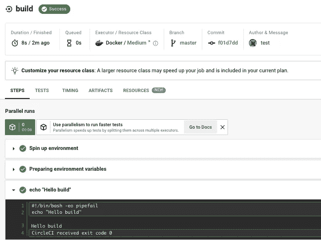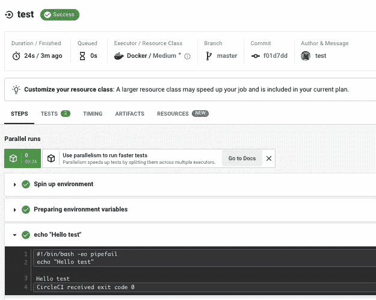

CircleCI 文档中有更多关于可重用配置的细节和例子。该信息可在 [CircleCI 可重用配置参考指南](https://circleci.com/docs/2.0/reusing-config)中找到。

```
 [Continue](#c7f1)｜[Back to Outline](#bd2e)
```

## 调试电路错误

如果作业失败，我们可以单击作业并查看更多信息。大多数时候，这些信息对我们调试来说是足够清楚的。就像下面的捆绑包安装错误一样，它清楚地表明失败是由错误的 gem 版本引起的。

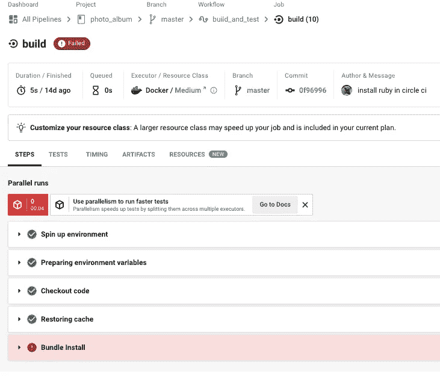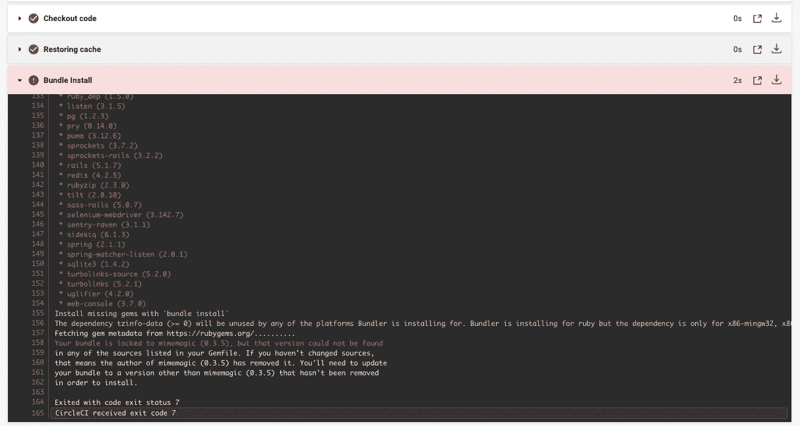

但是有时错误信息可能不够清晰，我们无法知道失败的根本原因，另一种调试方法是使用`Rerun Job with SSH`。

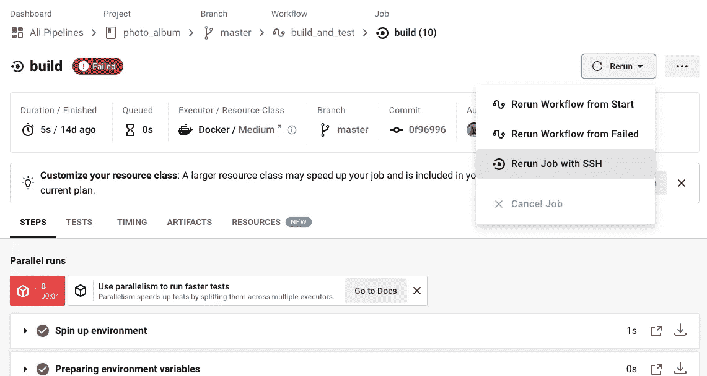

当点击`Rerun Job with SSH`时，CircleCI 将准备一个远程虚拟机，该虚拟机与您执行的失败作业的环境完全相同。我们可以看到，在“等待 SSH 会话”步骤中，为我们提供了一个访问机器的命令。

```
ssh -p 64535 3.95.238.182
```

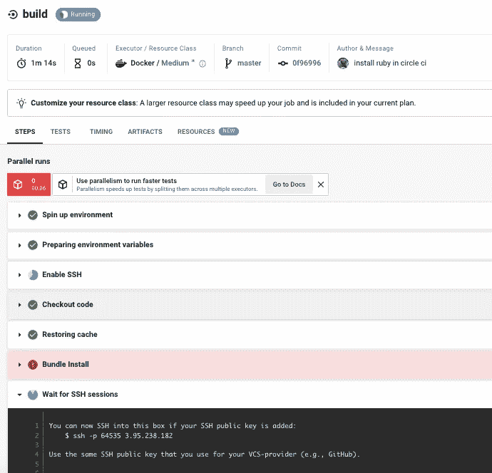

通过在本地控制台中键入命令，您可以成功登录到机器。

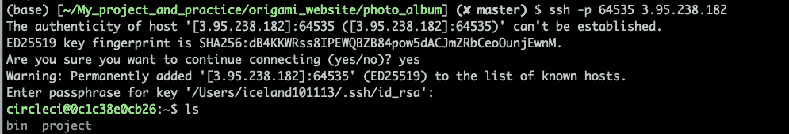

转到项目文件夹，我们可以看到内容与您的 Github 项目完全相同，然后我们可以在 CircleCI 的失败作业中运行该命令以查看更多信息。

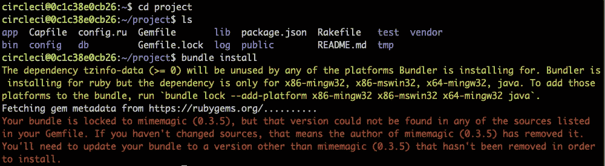

```
 [Back to Outline](#bd21)
```

## 参考

[CircleCI 文档](https://circleci.com/docs)

*   [配置介绍](https://circleci.com/docs/2.0/config-intro)
*   [语言指南:Ruby](https://circleci.com/docs2/2.0/language-ruby)
*   [可重用配置参考指南](https://circleci.com/docs/2.0/reusing-config)
*   [宝珠介绍](https://circleci.com/docs2/2.0/orb-intro)
*   [数据库配置示例](https://circleci.com/docs/2.0/postgres-config)

[什么是持续集成，为什么它很重要？](https://www.atlassian.com/continuous-delivery/continuous-integration)

[如何为 Rails 双引导设置持续集成管道](https://circleci.com/blog/how-to-set-up-a-continuous-integration-pipeline-for-a-rails-dual-boot/)

[使用 CircleCI 持续集成和部署 Rails】](https://pawelurbanek.com/rails-continuous-integration)

[devo PS 的 7 大持续集成工具](https://smartbear.com/blog/top-continuous-integration-tools-for-devops/)