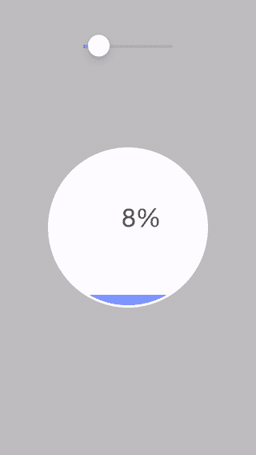
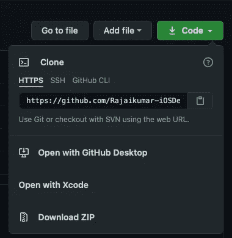
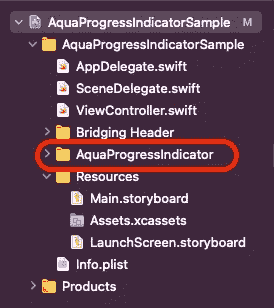
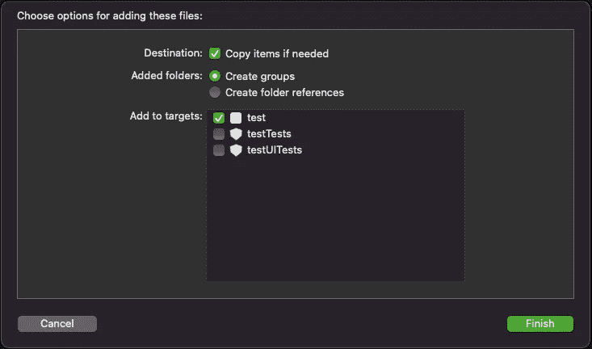
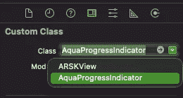
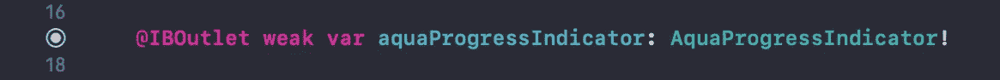

# 🌊浅绿色进度指示器

> 原文：<https://medium.com/nerd-for-tech/aqua-progress-indicator-22af79fb6719?source=collection_archive---------22----------------------->

## iOS 动画

浅绿色进度指示器有助于让用户保持参与，并随时了解您的进度。

# 📺演示



# 📦贮藏室ˌ仓库

[](https://github.com/Rajaikumar-iOSDev/AquaProgressIndicatorSample) [## rajaikumar-IOs dev/AquaProgressIndicatorSample

### 🌊浅绿色进度指示器有助于让用户保持参与，并随时了解您的进度。第一步…

github.com](https://github.com/Rajaikumar-iOSDev/AquaProgressIndicatorSample) 

# 📜安装指南

步骤 1:下载/克隆 AquaProgressIndicatorSample 项目。



步骤 2:从示例项目中拖动 AquaProgressIndicator 文件夹，并将其放到您的项目中。



注意:不要忘记选中“如果需要，复制项目”复选框。



步骤 3:添加一个 Objective C 桥接头文件(如果你没有的话),并在桥接头文件中添加以下内容。

```
#import "DynamicWaterNode.h"
```

# 📃使用指南

步骤 1:转到故事板，从对象库中添加一个 SKView 对象。


步骤 2:将身份检查器中的类名更改为 AquaProgressIndicator。



步骤 3:从故事板为 SKView 创建一个 IBOutlet。



第四步:使用 outlet 调用 addAquaScene()。


步骤 5:使用 outlet 用进度值调用 change water level(to level:CG float)。


# 🥞技术堆栈

Xcode、UIKit 和 SpriteKit。

# 🙏🏽信用

史蒂夫巴尼格伦&阿斯泰米尔 Eleev 又名病毒。

# 👨‍💻作者

Rajai kumar

# 🔖许可证

该项目在麻省理工学院的许可下[可用。](https://github.com/Rajaikumar-iOSDev/AquaProgressIndicatorSample/blob/main/LICENSE)