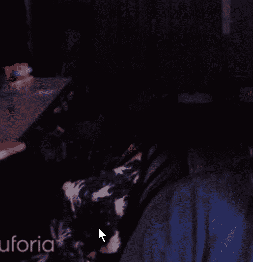
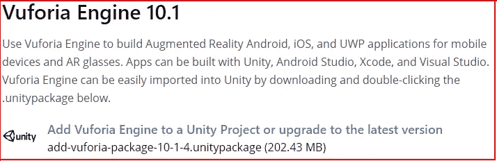
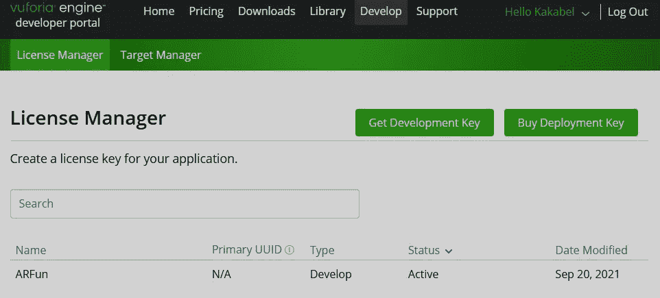
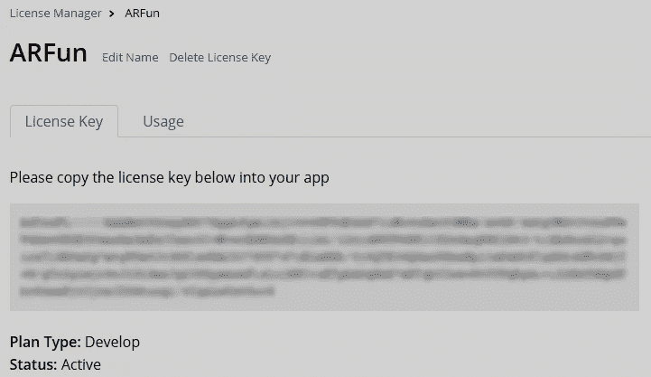
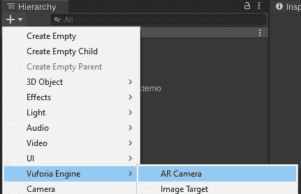
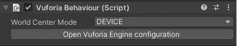
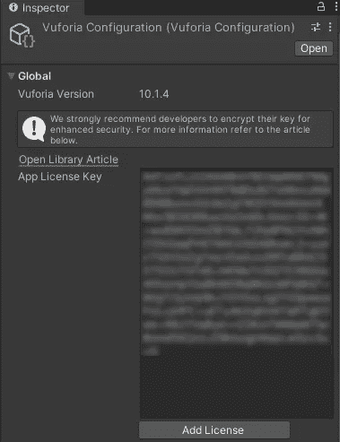
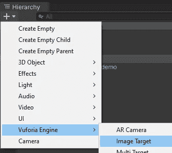
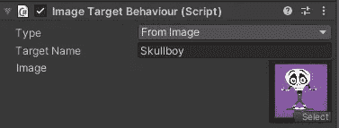
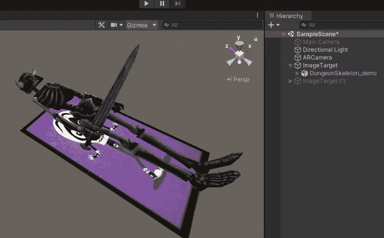

# AR 与 Vuforia 联合

> 原文：<https://medium.com/nerd-for-tech/ar-in-unity-with-vuforia-dcc7f446702f?source=collection_archive---------4----------------------->

**目的:**在 Unity 安装 Vuforia。

很容易将 AR(增强现实)添加到我们的 Unity 项目中！我们将从下载 *Vuforia 引擎* Unity 包并将其放入我们的项目(【https://developer.vuforia.com/downloads/sdk】T4)开始。

接下来我们将创建一个 Vuforia 开发者账户(免费！)，然后转到许可证管理器并创建一个新的许可证([https://developer.vuforia.com/vui/develop/licenses](https://developer.vuforia.com/vui/develop/licenses))。我把我的叫做“ARFun”。

当我们点击许可证时，我们将获得我们的*许可证密钥*。我们一会儿就需要这一长串文本。

回到 Unity 层级，我们将创建一个新的 Vuforia *AR 相机*。我们可以关闭场景中的其他摄像头。

在 AR 摄像机的 *Vuforia 行为*组件中，我们将点击*打开 Vuforia 引擎配置*。

检查器中将会打开 *Vuforia 配置*窗口。我们可以在这里粘贴我们的*许可证密钥*。

回到我们的层级，我们将创建一个新的*图像目标*。

在图像目标的*图像目标行为*组件中，我们将把图像的*类型*改为*，给我们的图像命名，并将我们的图像拖到*图像*框中。*

在层次结构中，我们可以将游戏对象作为子对象附加到图像目标下。在我的例子中，我在图像目标上附加了一个动画骨架。当 AR 相机识别出真实世界中的图像时，它将渲染与真实世界图像相关的附加儿童！

