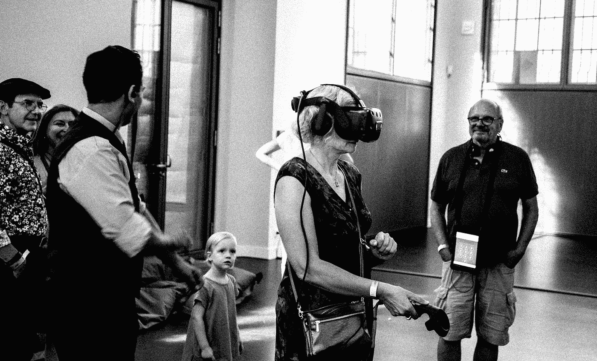

# 数据标注服务如何赋能 AR/VR？

> 原文：<https://medium.com/nerd-for-tech/ar-vr-is-hot-again-8d53ae49c76f?source=collection_archive---------3----------------------->

## **AR/VR 又火了？**

# AR/VR 行业大量融资

从 2020 年第四季度开始，多家 VR 内容和硬件公司完成了大额融资。据统计，仅 2021 年 6 月，全球 VR 领域就发生了 22 起投融资案例，总金额达 2.67 亿美元。这一轮投融资热潮推动了游戏、体育、医疗应用等领域的 VR 产业发展。也推动了 VR 终端产品价格、游戏、内容应用的深入发展。

# 中国的 AR/VR 产业

随着 5G 商用的步伐和生态系统的成熟，AR/VR 将在未来迎来“爆发期”。据 CCID 预测，到 2023 年，中国虚拟现实市场将达到 4300 亿元。不难预见，随着 5G 的不断赋能，VR/AR 应用在多个领域和行业的融合，可以重新定义产品属性，带来更好的应用体验。

在“云旅游”方面，由于疫情防控等因素，出现了 AR/VR 技术加持的“云旅游”。“云中赏樱”和“全景中国”等活动凸显了 VR/AR 技术的进一步成熟，给人在家就能“走遍”全国的新奇体验。

## 教育领域的 AR/VR

在教育领域，人们对 VR/AR 沉浸式教学寄予厚望。依托 5G 和 VR 技术的充分融合，打破了教学的空间和时间界限，打造了线上线下、虚拟与现实的“无边界课堂”，让学生更好地体验理论与实践的融合。如四川电信与当地学校联合推出“5G +智慧校园”，作为推动职业教育发展的具体案例。

## 医疗领域的 AR/VR

在医学领域，医学科学家使用计算机在虚拟空间中模拟人体组织和器官，让学生进行模拟操作，也让学生感受手术刀——切入人体肌肉组织和触摸骨骼，这有助于学生快速掌握手术的要领。在手术前，外科医生不仅可以创建病人身体的虚拟模型，而且可以在虚拟空间中进行手术的预演，这可以大大增加手术的成功率。

## 军事中的 AR/VR

其实除了我们熟悉的领域，比如游戏、教育、医疗，AR/VR 在军事训练中也有广泛的应用。中国首个军事 VR 训练系统“强军”是首个跨平台多人虚拟现实模拟对抗训练系统。目前，国防科技大学提供军事课程的课外培训，如"轻武器射击"和"战术"。

# 数据是起点

[**数据**](https://becominghuman.ai/why-you-should-ditch-your-in-house-training-data-tools-and-avoid-building-your-own-ef78915ee84f) **，算法，处理是 AI 不可或缺的三大要素。而数据是起点。**

我们需要明确的是，对于 AI 公司和整个行业来说，数据标注是实现人工智能的重要一环。标注数据的准确性和效率影响着人工智能算法模型的最终结果。

在这个发展阶段，神经网络的层数越多，需要的标记数据量就越大。如果人工智能训练中使用的数据不够多样化和无偏，可能会出现人工“ **AI 偏差**等问题。

## AR/VR 行业的标签类型

*   [语义理解](https://tinyurl.com/48w576p7)
*   [物体检测](https://tinyurl.com/u7u4me)
*   [物体识别](http://tinyurl.com/1hg9mo1m)
*   [视频注释](http://tinyurl.com/wmu4yfhh)
*   [情感识别](http://tinyurl.com/rbgfnvwk)

# 结束

将你的数据标注任务外包给[字节桥](https://tinyurl.com/bddj6dec)，你可以更便宜更快的获得高质量的 ML 训练数据集！

*   无需信用卡的免费试用:您可以快速获得样品结果，检查输出，并直接向我们的项目经理反馈。
*   100%人工验证
*   透明和标准定价:[有明确的定价](https://www.bytebridge.io/#/?module=price)(包括人工成本)

为什么不试一试呢？

资料来源:https://baijiahao.baidu.com/sid=1709510388683092287&wfr