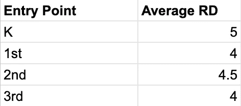
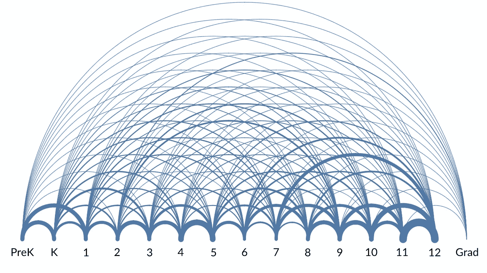
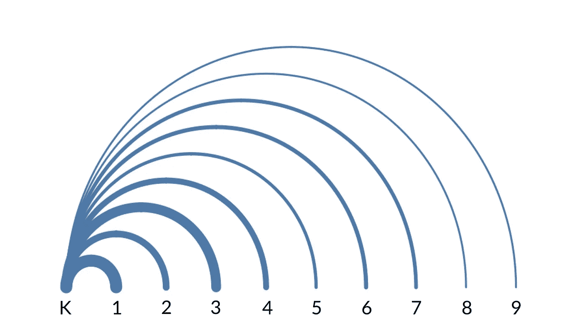
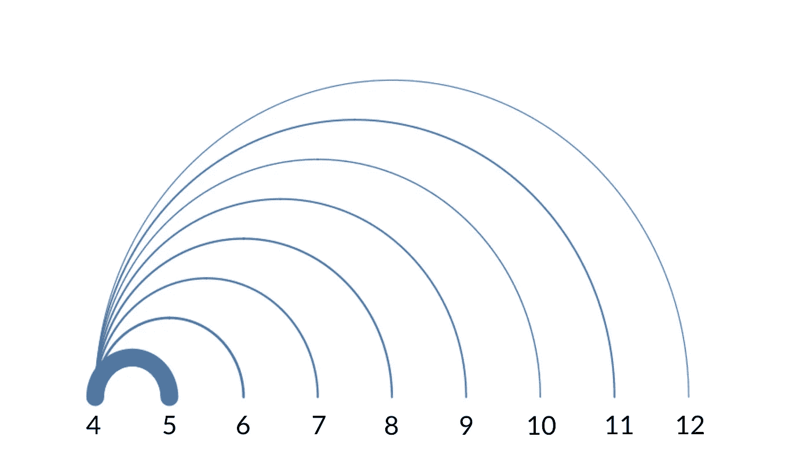
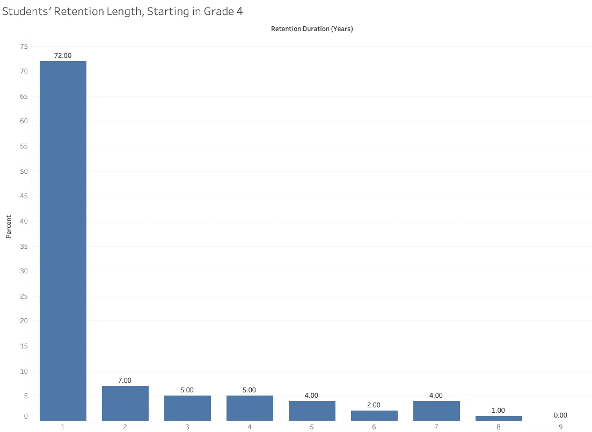
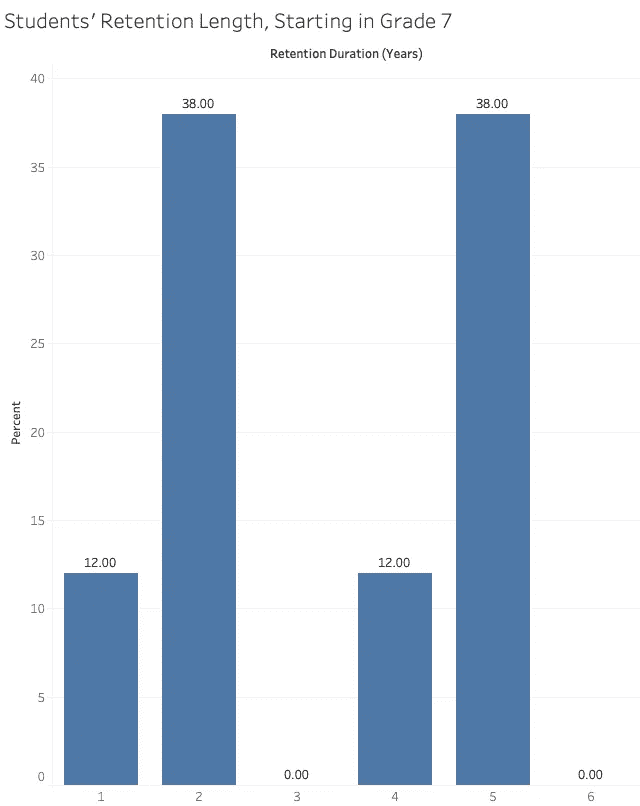

# 学生的留校率会受到学生入学年级的影响吗？

> 原文：<https://medium.com/nerd-for-tech/arc-diagrams-db5f50faad35?source=collection_archive---------1----------------------->

衡量课外项目或任何其他教育活动成功与否的一个重要标准是学生保留率。对于许多非盈利教育机构来说，他们的干预需要数年时间才能见效。如果学生没有被长期留住，改变的空间就太窄了。

利用我自己组织的数据，我很好奇的回答了这个问题:*学生在这个项目中呆的时间是否取决于他们加入的年级？*我的假设是，更早开始会导致更长的保留期，或者我将称之为*保留期* (RD)。

回答这个问题的一个方法是计算给定进入点的平均研发。例如:

相反，我想找点乐子，生成一个弧形图:

图一。一个弧形图表示学生在每个入口点是如何被留住的。图片作者。

有了平均值，我们就能捕捉到数据的整体姿态。但是通过这种方法，我们可以看到微妙的趋势，这种方式在概念上与一条数字线相吻合，就好像学生从左向右跳一样。

我的方法是这样的:

*   **1。将数据从 Airtable 拉入 Python。**
*   **2。清理和重构 Python 中的数据，并将其导出为 CSV 文件。**
*   **3。使用 Tableau，生成所需的可视化效果。**

我借用了两个来源来完成这个镜头:Kaleb Nyquist 的精彩 [Airtable 助手脚本](https://gist.github.com/KalebNyquist/4424fc1ef3dc6bb4fc0b5a7122ada4bc)和 Toan Hoang 的关于弧图的[教程](https://tableau.toanhoang.com/arc-chart-tutorial/)。

**隔离电弧**

即使看着上面的大弧线，你也能看到一些条带比其他的要厚。该厚度对应于该时间段内保留的学生百分比。如果我们分离出幼儿园弧线，我们会得到这个:

图二。幼儿园弧线图。图片作者。

正如我所预测的，你可以看到，随着远离原点，能带变得越来越窄。所以一个学生最有可能只坚持几年，越来越少的人会延长这段时间。

这种下降在四年级更加明显:

图 3。四年级的弧形图。图片作者。

然而，并不是每个孤立的弧都显示出这种模式。五年级有点不可预测:

图 4。五年级的弧形图。图片作者。

七年级是最有趣的:

图 5。七年级的弧形图。显示 0%的弧线已被排除。图片作者。

这告诉我们什么？更准确地说，为什么七年级入学的学生比例更高，研发水平也更高？

这可能是因为七年级的学生比幼儿园的学生有更多的内在动机，从而使他们更容易度过高中的分心。虽然我们没有足够的信息来得出任何结论，但我们可以说这值得更多的关注和分析。

**漂亮与易懂**

弧线绝对很酷。但是它们告诉我们的不仅仅是一个简单的条形图吗？考虑一个条形图，显示与 4 级弧相同的数据(图 3):

图 6。显示从四年级开始的研发的条形图。图片作者。

弧形图直观地传达了某些信息:持续感、距离感和运动感。通过 Tableau 的工具提示，我们可以看到每个弧的百分比(虽然在我的图中看不到)。

但是条形图有其优势，即:

*   我们可以更容易地比较给定起始年级的研发百分比。
*   因为条形图显示的是年份而不是年级，所以比较图表更容易。

圆弧图还有一个弱点。比较这个条形图，它显示了与图 5 相同的数据。

图 7。条形图显示从七年级开始的研发。图片作者。

请注意，2 年和 4 年的百分比是相同的。在相同数据的弧形图中(图 5)，条带的厚度是相同的，但是弧的直径是相当不同的。这可能会给观众一个错误的印象；弧图可能过度代表了数据。

**隐含完整性**

弧形图的最后一个问题是一个实用的问题。对于许多非营利组织来说，他们不能坐等数据成熟。他们需要经常向授权人和委托人报告。他们要讲很多不完整的故事。

在弧形图中，将仍然活跃在项目中的学生包括进来会产生误导。该学生将被表示为一个完整的弧线，就好像他们已经离开了该程序。这种隐含的完整性会扭曲数据，特别是考虑到它可能特别掩盖了 RDs 较长的学生。这有点像通过测量今天活着的每个人的年龄来测量寿命，并假设最老的人的年龄代表上限。如果他们继续下去呢？

条形图并不意味着完整，因此允许当前学生使用。

**最后的想法**

有时候抓住观众的注意力很重要。弧形图很漂亮，可能就是这样。但它们的对称性可能会产生误导:不管底层数据如何，可视化的参数都很难让人觉得不好。在我看来，可视化最重要的部分是让模式变得易于理解。虽然不起眼的条形图可能不是病毒式的，但它似乎是这种情况下最好的。

这个案子怎么样了？似乎不同的切入点有不同的研发细分。长期跟踪，并在不同年龄进行招募试验，可能会改善整体研发，从而增加影响。任何寻求提高保留率的组织都可以从这种分析中受益。