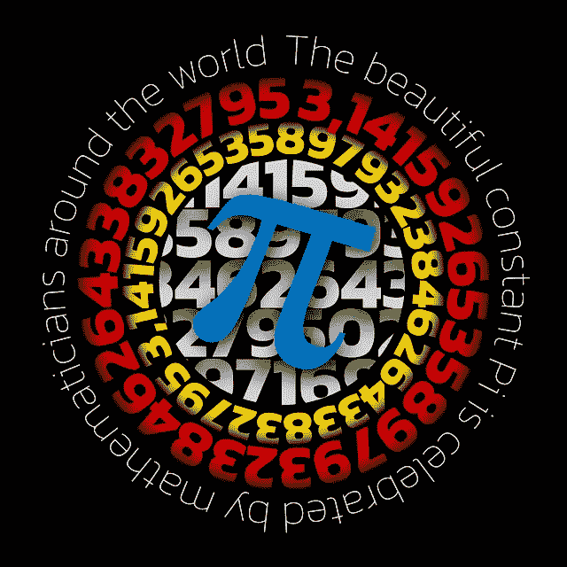
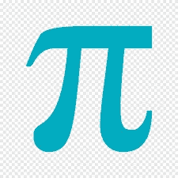

# 阿基米德发现圆周率

> 原文：<https://medium.com/nerd-for-tech/archimedes-discovery-of-pi-8a362eae1611?source=collection_archive---------1----------------------->

# 介绍

希腊数学家阿基米德发现圆周率是人类已知的最大分数。数字π(拼写为“pi”)是一个数学常数，大约等于 3.14159。

它被定义为一个圆的周长与其直径之比，也称为阿基米德常数。

π不能表示为一个普通的分数&它的十进制表示法还没有被超级计算机发现&在 3.14 之后变成了数万亿的数字&永无止境。

包括埃及人和巴比伦人在内的古代文明在实际计算中需要相当精确的π近似值。公元前 250 年，希腊[数学家](https://www.technologiesinindustry4.com/2021/08/orthogonality-in-mathematics.html)，阿基米德创造了一种算法，可以将π精确到 7 位数。

在本文中，我们将讨论圆周率的历史和重要性。还有，描述一下深度学习预测圆周率的位数。

# 描述

阿基米德(公元前 287-212 年)是数学家 T4 和机械工程领域的先驱。他以阐明阿基米德原理而闻名。这就是众所周知的浮力定律。同样，他观察到了许多其他的物理定律。他把自己的观察记录为数学定理。

阿基米德得出一个合乎逻辑的结论:圆的周长与直径之比大于 3 1/7 但小于 3 10/71。这是他在测量圆的工作中的一个很好的估计。这就是我们今天称之为“π”的数学常数。

# 圆周率的历史

*   圆周率(π)已经被认识了将近 4000 年。
*   史前巴比伦人计算圆的面积是用圆周率的平方乘以 3，π= 3。
*   一个巴比伦石碑显示π的值是 3.125，这是一个更接近的近似值。
*   埃及人用一个公式来计算圆的面积，这个公式给出了π的估计值 3.1605。
*   π的第一次计算是由叙拉古的阿基米德完成的。
*   阿基米德利用毕达哥拉斯定理计算圆的面积。
*   用来发现两个正多边形的面积。
*   刻在圆内的多边形和外切圆的多边形。
*   同时，圆的确定面积位于内接多边形和外切多边形的面积之间。
*   多边形的面积为圆的面积提供了上限和下限。
*   阿基米德指出，他没有发现π的值，而只是在这些极限内的一个估计。
*   阿基米德提出π在 3 1/7 和 3 10/71 之间，就像这样。

# 圆周率的重要性

*   π是宇宙中最重要的数字之一。探索人类的旅程——所有时代真正超越文化的努力——计算、不精确和实现这个神秘的数字。
*   这是一个基本概念，似乎存在于数学的所有特征中。
*   圆周率是一个重要的概念，它得益于对普遍真理和一些数学概念的了解。
*   通常，圆周率值用于三角、几何等概念，以及概率、统计和复数等高级概念。
*   圆周率是一个广为人知的数学常数，全世界都在使用。
*   在早期，它被用作某些机密工作的绝密代码。
*   后来用包含 3600 和π的圆来表示圆的 3600。
*   它被称为循环常数。

# 深度学习预测圆周率的位数

*   一个足够大的神经网络可以很容易地模仿产生π数字的几种算法之一。
*   它需要足够大来为变量放置必要的逻辑和内存。
*   不过，这些数字本质上没有什么不可预测的。
*   他们没有一个小故障可计算，用非常短的计算机程序。
*   实际上，没有动机去尝试这个。
*   没有目的去想象从一个学会计算π的数字的神经网络中得到什么深刻的启示。
*   从研究神经网络的易读能力和为短算法训练所需的信息量的角度来看，这可能是令人兴奋的。
*   神经网络不是这种计算的合适算法范例。
*   然而，从[数学](https://www.technologiesinindustry4.com/2021/08/orthogonality-in-mathematics.html)的角度来看，没有人认为这是有意义的或者有价值的。

更多详情请访问:[https://www . technologiesinindustry 4 . com/2022/01/Archimedes-discovery-of-pi . html](https://www.technologiesinindustry4.com/2022/01/archimedes-discovery-of-pi.html)