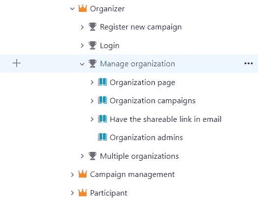
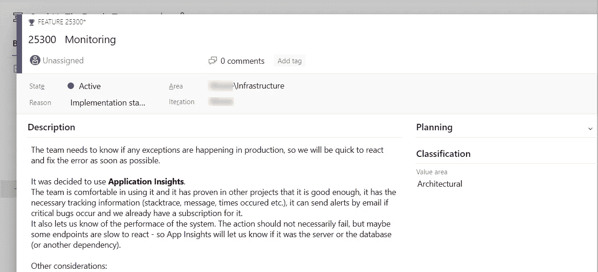
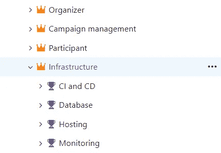

# 使用 Azure DevOps 的架构决策记录(ADR)

> 原文：<https://medium.com/nerd-for-tech/architecture-decision-records-adr-with-azure-devops-3f0c9edeb85b?source=collection_archive---------3----------------------->

## 记录您的架构和技术决策以供进一步参考，并让新团队成员从第一天起就了解最新情况

由[马腾·戴克斯](https://unsplash.com/@maartendeckers?utm_source=medium&utm_medium=referral)在 [Unsplash](https://unsplash.com?utm_source=medium&utm_medium=referral) 上拍摄的照片

ADR 是[讲的](https://ardalis.com/getting-started-with-architecture-decision-records/)和[在其他地方很好地记载了](https://github.com/joelparkerhenderson/architecture_decision_record)，所以我不会花太多时间来谈论它。简而言之，ADR 是存储项目的架构思想和决策以供进一步参考的过程。这种进一步的引用可以是新成员加入团队，现有成员不断地与代码中的模式作斗争，以后遇到类似的问题等等。团队成员应该被决策记录所说服，以了解为什么一些备选方案没有被采纳，以及为什么做出了某些决策。此外，他们应该意识到，实际上没有正确或错误的方法——一个问题可以用多种方法解决，解决它的正确方法是遵循您正在处理的当前项目中的模式。由于代码读得比写得多，当团队成员阅读你的代码时，他们会很熟悉，如果它以类似于项目的其他部分的方式编写，会更容易理解。

## 使用 Azure DevOps 的 ADR

通常我们在 wiki 文档中记录技术决策和模式。当新成员加入团队时，他们会问一些问题，所以我们不想重复，并记录了一些决定。过了一段时间，我遇到了 ADR，我想:哇，这居然有一个名字。显然我不认为我们是唯一有问题的人，我只是很惊讶。所以我又想了想。由于每个决策都被转化为用户故事或任务，我发现它可以被放在 backlog 中，就像我们收集和记录 sprints 的需求一样。Azure DevOps 让你选择用户故事或功能是商业的还是技术的——所以我们将这些功能标记为*技术的*。在特性本身中，我们解释决策和备选方案，用户故事和任务是决策的实际技术执行。

让我们想象一个我们已经用 Azure DevOps 管理的项目。我们已经组织好了 backlog，可能有包含特性的史诗，最后，最细粒度的层次是用户故事。

如何展示有活动、组织者和参与者的项目

现在让我们提出一个架构决策，看看我们如何记录它。假设我们需要一个监控工具。更具体地说，是一个监视生产异常的工具。

一个简单的架构决策记录示例

在记录架构决策时，列出考虑过的其他**备选方案**，以及为什么决策与它们背道而驰，这一点非常重要。这实际上比记录决定本身更重要，就好像你将来回到这份文件，如果条件相同，同样的决定很可能仍然有效。

另外很重要的一点就是设置**的语境**。在本例中，我们忽略了其他选项，不是因为它们不好、更难设置或者在我们的场景中不起作用，而是因为我们已经有了现有的订阅和良好的过去体验。如果这种情况在未来发生变化，我们将再次考虑监测工具。

最后，文档工具应该支持开箱即用的**修订历史**，这样你就可以知道谁做了决定，谁改变了决定，状态等等。

您可以将架构决策记录放在一个单独的 epic 中

## 一如既往地导出最新文档

在 Azure DevOps 中记录您的架构决策的一个非常酷的副作用是可以导出它们。
您可以使用[增强导出](https://marketplace.visualstudio.com/items?itemName=mskold.mskold-enhanced-export)，它可以将任何查询打印成 PDF 文档。然后，必要时，您可以导出 ADR 并分发出去。实际上，我们用它同时向新成员提供项目文档和决策记录，这样新成员从第一天起就能了解最新情况。显然，这样做的先决条件是保持史诗、特性和用户故事的更新。

导出文档的一部分，包含所有史诗和特征