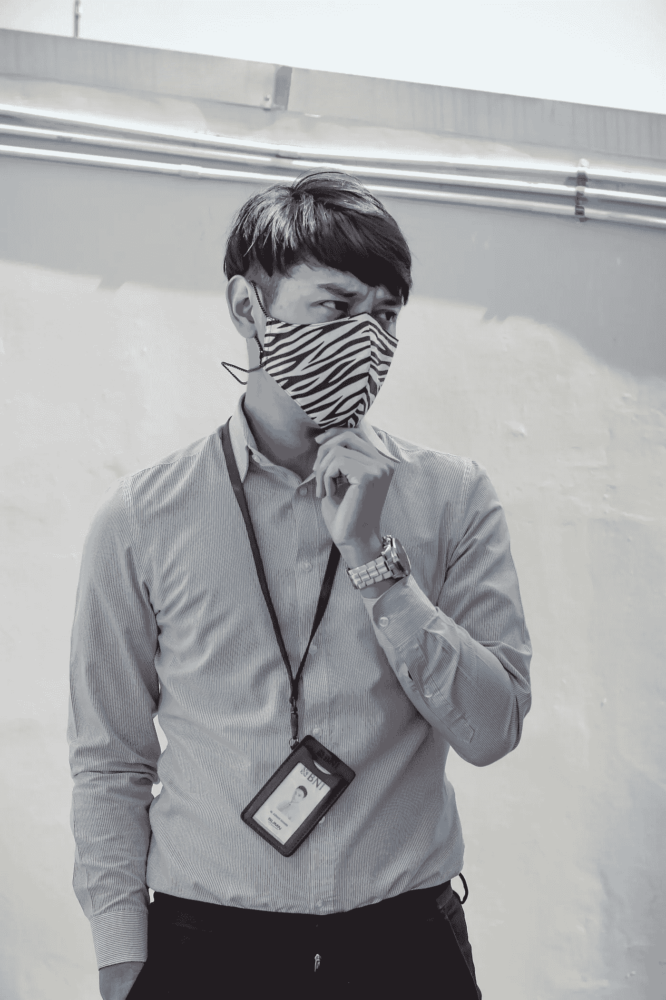

# 混合工作模式是帮助我们驾驭工作新世界的新常态吗？

> 原文：<https://medium.com/nerd-for-tech/are-hybrid-work-models-the-new-normal-to-help-us-navigate-the-brave-new-world-of-work-bad2a1f3e1fe?source=collection_archive---------23----------------------->

由[阿兹哈尔·哈里](https://unsplash.com/@azharkhairi_31?utm_source=unsplash&utm_medium=referral&utm_content=creditCopyText)在 [Unsplash](https://unsplash.com/s/photos/new-normal?utm_source=unsplash&utm_medium=referral&utm_content=creditCopyText) 拍摄的照片

Covid 已经迫使我们在室内和公司采用在家工作的安排。最初被认为是一项短期措施的全球组织现在正在考虑将 WFH 变成永久性的，或者进行某种混合或所谓的“混合工作”，本质上是现场和远程工作的结合。虽然谷歌和 Twitter 等科技公司为员工提供了永久 WFH 的选择，但其他公司正在转向混合模式。

事实上，随着 [WFH 越来越受员工和雇主](https://www.businesstoday.in/current/economy-politics/73-employees-want-flexible-remote-work-options-finds-microsoft-study/story/434641.html)的欢迎，他们现在将它视为现场工作的可行替代方案，并且从纯商业角度来看，由于高科技办公室的维护和保养成本可以降低甚至消除，远程工作突然成为“时尚”。然而，对于那些部分或所有员工在未来的某个时候必须返回办公室的公司，员工在现场和远程工作之间“轮换”的混合模式将成为新常态。

这是 2021 年工作趋势指数[的一部分发现，这是微软帮助组织导航工作世界的年度报告，对 31 个国家的 3 万多名就业工人进行了调查，再加上 LinkedIn 上的数字处理和分析驱动的生产力指标分析，表明 WFH 将继续存在，也许这是新兴的勇敢的新工作世界发生了多大变化的迹象。](https://www.microsoft.com/en-us/worklab/work-trend-index/hybrid-work)

话虽如此，就像这些“[病毒时代](/nerd-for-tech/how-the-viral-times-are-forcing-us-to-struggle-for-existence-and-live-for-the-moment-54644ef1688c)”中的其他事情一样，趋势以优步的速度变化，今天是真的明天就会被揭穿，重要的是从一个不那么“容易激动”的角度来看待混合动力车型，并从更长期的角度来思考。例如，以 F2F 或允许面对面交流来衡量，美国“恢复正常”,很难理解为什么雇主或就此而言，雇员也不想处于“永久的孤独 WFH 状态”。

此外，对同一份报告的调查结果的分析还显示，对于大多数专业人士来说，疫情和 WFH 让他们对任何形式的干扰感到厌倦和警惕，正如一家新闻媒体所说的那样。因此，我们必须再次小心混合工作的发展。事实上，一旦疫情平静下来，我们没有理由怀疑为什么我们仍然会永远“抓住”WFH 不放。

另一方面，“对中断的恐惧”和“乏味的”WFH 可能会使混合工作成为现实，因为现场和远程工作的混合可能只会安抚前者，激励后者。这就是我认为混合工作模式需要所有利益相关方给予更多考虑的原因。由于[朝九晚五的工作日已经结束](https://www.managementstudyguide.com/is-9-to-5-workday-over.htm)，我们需要为这种新常态做好准备，所以混合模式应该被所有利益相关者接受，如果不是的话。

那么，作为专业人士，我们准备好迎接这个勇敢的新世界了吗？在这个新世界里，勇敢的员工和雇主都需要面对一个被“百年一遇的疫情”所震撼的世界的挑战，而我们受技术驱动的自我只能认为是现代医学出现之前发生的事情。更有甚者，它给整个世界留下了创伤，改变了我们对如何生活和工作的看法，并使我们质疑我们对重要事物的假设。

最后，在 Covid 危机的许多分支中，有一个是我们未来的生活和工作方式，混合工作模式很有可能会继续存在，不管它们是否会变得不受欢迎，许多雇主肯定会尝试它们。