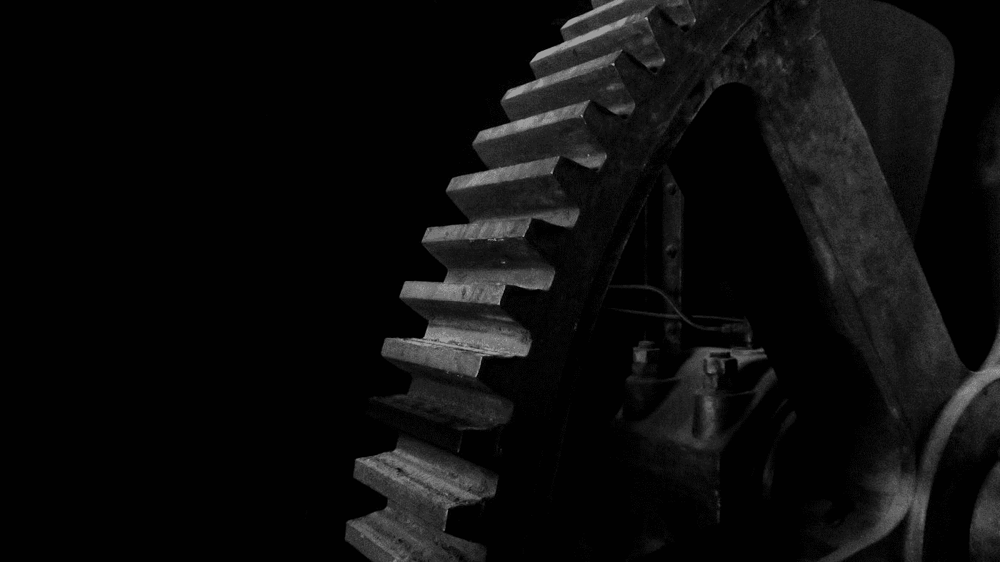
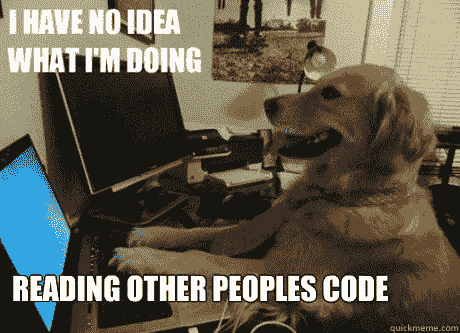
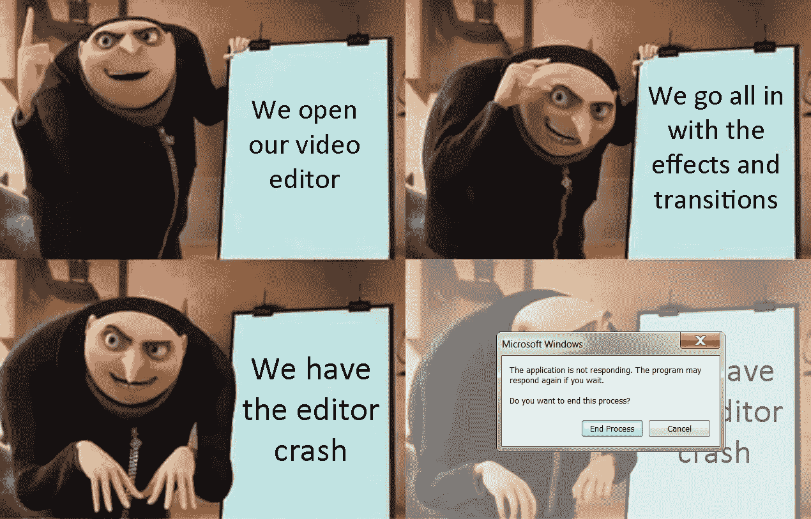

# 机械解决方案比电子解决方案好吗？既肯定又否定

> 原文：<https://medium.com/nerd-for-tech/are-mechanical-solutions-better-than-electronic-ones-yes-and-no-775572cdf310?source=collection_archive---------10----------------------->

威廉·冈克尔在 [Unsplash](https://unsplash.com?utm_source=medium&utm_medium=referral) 上拍摄的照片

## [听听这篇文章](https://start-listening.herokuapp.com/app?url=https://medium.com/nerd-for-tech/are-mechanical-solutions-better-than-electronic-ones-yes-and-no-775572cdf310)

首先，这篇文章不是机械工程和计算机/电子工程之间的战争😛它只是解决工程问题的两种不同方法的现实表现😄

让我们从一个例子开始来了解背景。

> 你可能已经注意到，如果你反向转动曲柄，你的自行车(或者如果你喜欢，自行车)不会向后移动。

你有没有想过这种不寻常的操作方式实际上是如何实现的？在自行车中，解决方案是纯机械的。有一个内部的安排，允许锁定踏板和车轮，而曲柄前进，但允许自由旋转的倒退。想了解更多细节，可以参考[这](https://www.quora.com/Why-doesnt-a-bicycle-move-backwards-when-one-pedals-back)页。

自行车车轮棘爪和棘轮机构

这本来可以用电子方式解决。其中一种方法是在曲柄上安装一个传感器，监测踏板是否反向转动。这种输入可以用来分离对车轮的驱动，就像汽车中离合器的作用一样。根据传感器输入，前进曲柄将接合驱动装置，而后退曲柄将分离驱动装置，从而达到目的。

如果我们看到这些实现，我们可以清楚地看到，机械解决方案非常简单。它是如此简单，以至于任何使用自行车的人都不会注意到它的存在！然而，电子解决方案将需要相当多的部件，从电源开始，到布线、传感器和控制器。在积极使用期间，还需要更多的工作来设置和维护它。

让我们看看这两种方法在产品开发的各个方面有什么根本的不同。

# **易于理解**

来源:[http://www.quickmeme.com/meme/36dji9](http://www.quickmeme.com/meme/36dji9)

如果你必须理解一个由某人创造的机械系统，这本质上可以归结为理解该系统所基于的自然法则。除了自然法则之外，唯一需要理解的是那个人利用它们的程度！

然而，在一个电子系统中，并不存在人人都使用的自然法则。主要是人类的逻辑形成了解决方案，这实质上意味着有无限的可能性，这因人而异。因此，如果你必须理解某人写的代码，你需要知道编程语言，也要理解为什么要使用特定的逻辑或思维过程。

# 易于维护

从上面的例子中可以看出，设计良好的纯机械解决方案只需要定期维护，并且很容易变得坚固耐用。另一方面，电子解决方案需要更多的保护和主动维护，这取决于设计。然而，纯电子系统如软件产品比机械系统更容易维护。

# 渐进的失败

来源:https://line.17qq.com/articles/gifjdbfdz.html

我刚刚使用了一个程序，它会在两分钟内发出崩溃警告！我当然是在开玩笑！

> 由于电子解决方案是基于逻辑的，并且存在于一个抽象的空间中，所以很难知道意大利面何时以及如何自相矛盾并分崩离析。

然而，由于机械解决方案基于相同的自然法则，与电子面条相比，故障情况更容易预测，因为可能性更小。此外，机械故障通常是渐进的，并显示警告，如果你知道识别它们！是的，当鼓风机或发动机发出不同于正常的噪音时😛

# 易于开发、更新和运输

敏捷更多地出现在软件行业，而不是制造业或土木工程行业。电子解决方案可以灵活应对动态变化，并且可以改进。在很大程度上更新现有系统的功能也非常容易。运输这些系统也很容易，尤其是如果它们是完全电子化的。只需要下载一个。

这在机械解决方案的情况下更难做到。他们需要大量的努力来开发原型，制造和运输它们。通常情况下，产品更新相当于召回产品，并对每个产品进行返工。

> 这些是每种方法在为特定问题提供解决方案时各有千秋的一些方式。没有明确的赢家，我们都需要！

感谢阅读！在 [LinkedIn](https://in.linkedin.com/in/vivek-g-india) 上找到我。